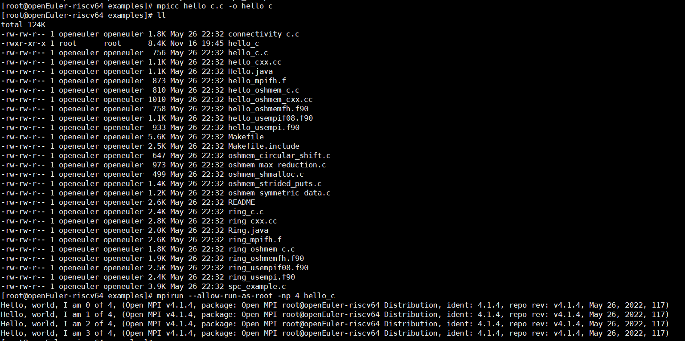
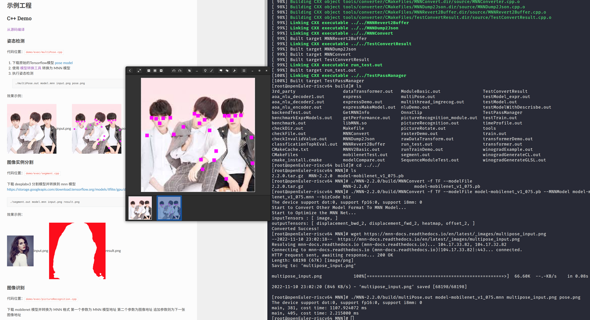

# openEuler RISC-V 开源操作系统进展·2022年11月17日

## 工作方向
openEuler riscv架构的适配已经完成了mainline的4000+个包，Epol的近1000个软件包。接下来可以做的事情有：

1. 升级基础软件的版本，**包含但不限于**以下基础包：

   ```
   Toolchain gcc-12.1.1-3 / glibc-2.36-10
   binutils 2.37-6
   libffi 3.4.2-2
   libmpc 1.2.0-2
   gmp 6.2.1-3
   rust 1.60.0-5 → 1.62.1(√)  → 1.65.0(updating) 
   java-latest-openjdk-18.0.2.9-0  → 19.0.0.36-1(√)  
   llvm/clang 12.0.1-2 → 13.0.1(√) → 14.0.5(√)  → 15.0.3(√) 
   python 3.10.2-4
   perl 5.28.0-435 → 5.34.0(√)
   golang 1.17.3-3
   nodejs 16.14.2-1
   qt5 → qt6
   ```

2. HPC支持

   这里主要是围绕用低性能的RISC-V开发板搭建RISC-V集群，用来实际测试高性能计算领域的相关软件是否已经准备好部署在RISC-V上。主要是用于软件的可安装部署、可运行验证，而非进行性能演示。

   

3. 目前系统镜像站已经提供了超过5000源码包的软件，但是这也仅仅是提供了基础的运行环境和部分应用。已有软件的使用验证bug发现、更多未包含在镜像站中的软件还需大家一同去验证、适配。我们以丰富常用的系统功能为目标适配新的软件，大家可能需要了解：

   - [开发者贡献指南](https://gitee.com/link?target=https%3A%2F%2Fwww.openeuler.org%2Fzh%2Fcommunity%2Fcontribution%2F)
   - [如何新增软件包](https://gitee.com/openeuler/community/blob/master/zh/contributors/create-package.md) ，部分历史成果示例：
     - [https://build.tarsier-infra.com/project/show/Factory:RISC-V:Mozilla](https://gitee.com/link?target=https%3A%2F%2Fbuild.tarsier-infra.com%2Fproject%2Fshow%2FFactory%3ARISC-V%3AMozilla)
     - [https://build.tarsier-infra.com/project/show/Factory:RISC-V:KDE](https://gitee.com/link?target=https%3A%2F%2Fbuild.tarsier-infra.com%2Fproject%2Fshow%2FFactory%3ARISC-V%3AKDE)
   - 对已有的功能进行验证、测试：
     - [验证已发布软件/尝试安装使用新软件](https://gitee.com/samuel_yuan/riscv-openeuler-visionfive/tree/master)，[写软件使用文档](https://gitee.com/link?target=https%3A%2F%2Fgithub.com%2FFIFCC%2Fplct-testing%2Ftree%2Fmain%2F22.03-v1)，[使用并报缺陷](https://gitee.com/openeuler/RISC-V/issues)；

4. 扩展适配范围，将Factory的包进行完善和修复。

   > 在欧拉社区，一个新引入的软件包会先进入Factory，然后进入Epol、稳定后进入mainline；mainline+Epol的包基本是每次系统镜像包含的软件包。目前mainline和epol包的适配成功率都超过97%，接下[Factory](https://gitee.com/link?target=https%3A%2F%2Fbuild.tarsier-infra.com%2Fproject%2Fshow%2FopenEuler%3AFactory)还有超过1000+个软件包仓库为空或者代码存在问题，这部分可以看看；

   


## 主要动态
### 1. ORSP006「准备仓」已就绪
随着 openEuler RISC-V 的发展和成熟，除了有大量的补丁需要在 openEuler 上千个仓库中评审合并之外，也逐渐有了更多的包需要被引入到 src-openEuler 中使用。而目前 openEuler RISC-V 的「中间仓」仅能够从 src-openEuler 中fork出来已有的仓库，对于尚未添加的仓库，需要有一个非个人的组织仓库进行存放和协作。

欢迎SIG伙伴进行review和评论：https://gitee.com/openeuler/RISC-V/pulls/605

准备仓：https://gitee.com/src-oerv


### 2. 关闭 RISC-V 仓库已经解决的缺陷issue

https://gitee.com/openeuler/RISC-V/issues 


### 3. [Factory:RISC-V](https://build.tarsier-infra.com/project/show/Factory:RISC-V) 软件包升级

现状：由于riscv obs独立管理，目前gitee欧拉软件包升级后不会触发obs自动更新obs _service文件到最新版本；因此obs中软件包的引用需要人工升级；

目标：

1. [Factory:RISC-V](https://build.tarsier-infra.com/project/show/Factory:RISC-V) 软件包去重
2. [Factory:RISC-V](https://build.tarsier-infra.com/project/show/Factory:RISC-V) 以及 Factory:RISC-V:XXX 中软件包升级至不低于oe master

进展：

1. [Factory:RISC-V](https://build.tarsier-infra.com/project/show/Factory:RISC-V) 删除[Factory:RISC-V:Base]https://build.tarsier-infra.com/project/show/Factory:RISC-V:Base) 中重复的软件包
2. [Factory:RISC-V](https://build.tarsier-infra.com/project/show/Factory:RISC-V) 软件包版本更新完成


### 4. HPC相关软件推进

- 整理了HPC相关的软件包：https://build.tarsier-infra.com/project/show/home:xijing:hpc 

- 测试与验证：

  - openmpi单机部署与集群部署测试

  


### 5. 验证更多构建成功的软件

https://gitee.com/openeuler/RISC-V/issues/I60GNT?from=project-issue


### 6. 软件包修复、升级；新包：

目前更多是对一些已有软件包的修复、升级；涵盖一些新包的适配：

- [Electron](https://build.tarsier-infra.com/project/show/home:misaka00251:electron) 

  > Electron是一个用HTML CSS和js来构建跨平台桌面应用程序的一个开源库.Electron可以让我们用Html css js技术加Electron开发跨平台可以安装的软件。

-  [Qt6](https://build.tarsier-infra.com/project/show/home:Jingwiw:QT6)

- vlc升级

- mnn编译成功

  

- 补全KDE依赖：https://build.tarsier-infra.com/project/show/home:misaka00251:KDE

- txtlive合规审阅工作

- [llvm15](https://build.tarsier-infra.com/project/show/home:zhoujc:llvm15)、[rust12](https://build.tarsier-infra.com/project/show/home:zhoujc:rust162)升级完成，当前正在升级[compiler-rt](https://build.tarsier-infra.com/package/show/home:zhoujc:llvm13/compiler-rt)、[clang15、rust15](https://build.tarsier-infra.com/project/show/home:zhoujc:llvm15)等；

- aria2：https://build.tarsier-infra.com/package/show/home:Jingwiw:riscv/aria2

- [Test mysql for openeuler on visionfive](https://gitee.com/samuel_yuan/riscv-openeuler-visionfive/blob/master/chapter3-Test-openeuler-software-on-visionFive/Test-mysql-for-openeuler-on-visionfive.md)

- [Test iperf3 for openeuler on visionfive](https://gitee.com/samuel_yuan/riscv-openeuler-visionfive/blob/master/chapter3-Test-openeuler-software-on-visionFive/Test-iperf3-for-openeuler-on-visionfive.md)

- 新增172个PR：

| 用户名         | 组织名           | 仓库名                               | 标题                                                      | 发起时间                  | 更新时间                  | 状态   | SIG                  | 请求链接                                                     |
| -------------- | ---------------- | ------------------------------------ | --------------------------------------------------------- | ------------------------- | ------------------------- | ------ | -------------------- | ------------------------------------------------------------ |
| HKGY           | src-openeuler    | whois                                | v5.5.14                                                   | 2022-11-03 15:12:40+08:00 | 2022-11-03 15:18:53+08:00 | open   | sig/sig-epol         | https://gitee.com/src-openeuler/whois/pulls/4                |
| HKGY           | src-openeuler    | dump                                 | Update URL and fix changelog                              | 2022-11-03 18:05:30+08:00 | 2022-11-11 16:52:01+08:00 | open   | sig/Application      | https://gitee.com/src-openeuler/dump/pulls/14                |
| HKGY           | src-openeuler    | xfce4-cpugraph-plugin                | Update URLs to HTTPS                                      | 2022-11-03 18:15:52+08:00 | 2022-11-07 10:57:06+08:00 | merged | sig/xfce             | https://gitee.com/src-openeuler/xfce4-cpugraph-plugin/pulls/11 |
| HKGY           | src-openeuler    | xfburn                               | Update URLs                                               | 2022-11-03 18:43:10+08:00 | 2022-11-09 18:16:22+08:00 | merged | sig/xfce             | https://gitee.com/src-openeuler/xfburn/pulls/3               |
| HKGY           | src-openeuler    | wireguard-tools                      | Upgrade URLs                                              | 2022-11-03 19:18:46+08:00 | 2022-11-11 15:07:06+08:00 | merged | sig/Networking       | https://gitee.com/src-openeuler/wireguard-tools/pulls/6      |
| HKGY           | src-openeuler    | libxfce4ui                           | Upgrade to v4.17.8                                        | 2022-11-03 23:26:46+08:00 | 2022-11-16 15:39:32+08:00 | open   | sig/xfce             | https://gitee.com/src-openeuler/libxfce4ui/pulls/6           |
| HKGY           | src-openeuler    | libxfce4util                         | Upgrade to v4.17.3                                        | 2022-11-03 23:41:54+08:00 | 2022-11-16 15:53:54+08:00 | open   | sig/xfce             | https://gitee.com/src-openeuler/libxfce4util/pulls/4         |
| HKGY           | src-openeuler    | python-utils                         | Upgrade to v3.4.5                                         | 2022-11-04 00:23:25+08:00 | 2022-11-08 09:35:28+08:00 | merged | sig/sig-python-modul | https://gitee.com/src-openeuler/python-utils/pulls/7         |
| HKGY           | src-openeuler    | intel-cmt-cat                        | Upgrade to v4.4.1                                         | 2022-11-04 09:16:09+08:00 | 2022-11-04 09:19:13+08:00 | open   | sig/Programming-lang | https://gitee.com/src-openeuler/intel-cmt-cat/pulls/8        |
| HKGY           | src-openeuler    | hyfetch                              | Package Init                                              | 2022-11-04 11:28:05+08:00 | 2022-11-04 15:41:11+08:00 | open   | sig/dev-utils        | https://gitee.com/src-openeuler/hyfetch/pulls/10             |
| HKGY           | src-openeuler    | gnome-shell-extension-caffeine       | Upgrade to v42                                            | 2022-11-04 12:31:24+08:00 | 2022-11-04 12:34:46+08:00 | open   | sig/GNOME            | https://gitee.com/src-openeuler/gnome-shell-extension-caffeine/pulls/4 |
| HKGY           | src-openeuler    | lua-posix                            | Upgrade to v35.1                                          | 2022-11-04 15:34:18+08:00 | 2022-11-04 15:38:01+08:00 | open   | sig/Programming-lang | https://gitee.com/src-openeuler/lua-posix/pulls/4            |
| HKGY           | src-openeuler    | libstatgrab                          | Upgrade URLs and License                                  | 2022-11-04 16:21:17+08:00 | 2022-11-04 16:29:01+08:00 | open   | sig/sig-UKUI         | https://gitee.com/src-openeuler/libstatgrab/pulls/12         |
| HKGY           | src-openeuler    | libmediainfo                         | Upgrade to v22.09                                         | 2022-11-04 17:36:14+08:00 | 2022-11-04 17:43:14+08:00 | open   | sig/Desktop          | https://gitee.com/src-openeuler/libmediainfo/pulls/2         |
| HKGY           | src-openeuler    | python-libtmux                       | Upgrade to v0.5.10                                        | 2022-11-06 21:52:56+08:00 | 2022-11-08 09:22:34+08:00 | merged | sig/sig-python-modul | https://gitee.com/src-openeuler/python-libtmux/pulls/3       |
| HKGY           | src-openeuler    | python-copr                          | Upgrade to v1.123                                         | 2022-11-06 23:06:26+08:00 | 2022-11-08 09:22:13+08:00 | merged | sig/sig-python-modul | https://gitee.com/src-openeuler/python-copr/pulls/7          |
| HKGY           | src-openeuler    | python-cryptography-vectors          | Upgrade to v38.0.3                                        | 2022-11-06 23:26:46+08:00 | 2022-11-06 23:32:19+08:00 | open   | sig/Programming-lang | https://gitee.com/src-openeuler/python-cryptography-vectors/pulls/17 |
| HKGY           | src-openeuler    | python-imagesize                     | Upgrade to v1.4.1                                         | 2022-11-06 23:39:41+08:00 | 2022-11-06 23:44:06+08:00 | open   | sig/Programming-lang | https://gitee.com/src-openeuler/python-imagesize/pulls/15    |
| HKGY           | src-openeuler    | python-os-testr                      | Upgrade to v3.0.0                                         | 2022-11-07 09:53:05+08:00 | 2022-11-07 09:54:38+08:00 | open   | sig/sig-openstack    | https://gitee.com/src-openeuler/python-os-testr/pulls/15     |
| HKGY           | src-openeuler    | python-muranoclient                  | Upgrade to v2.5.0                                         | 2022-11-07 10:08:23+08:00 | 2022-11-07 10:09:59+08:00 | open   | sig/sig-openstack    | https://gitee.com/src-openeuler/python-muranoclient/pulls/6  |
| HKGY           | src-openeuler    | python-ntc-templates                 | Upgrade to v3.1.0                                         | 2022-11-07 10:14:25+08:00 | 2022-11-07 14:10:46+08:00 | merged | sig/sig-openstack    | https://gitee.com/src-openeuler/python-ntc-templates/pulls/3 |
| HKGY           | src-openeuler    | python-nodeenv                       | Upgrade to v1.7.0                                         | 2022-11-07 10:23:38+08:00 | 2022-11-07 14:10:22+08:00 | merged | sig/sig-openstack    | https://gitee.com/src-openeuler/python-nodeenv/pulls/5       |
| HKGY           | src-openeuler    | python-os-traits                     | Upgrade to v2.9.0                                         | 2022-11-07 10:32:26+08:00 | 2022-11-07 14:09:47+08:00 | merged | sig/sig-openstack    | https://gitee.com/src-openeuler/python-os-traits/pulls/14    |
| HKGY           | src-openeuler    | perl-App-FatPacker                   | Fixed URLs and .spec config                               | 2022-11-07 18:01:53+08:00 | 2022-11-08 09:06:17+08:00 | merged | sig/sig-perl-modules | https://gitee.com/src-openeuler/perl-App-FatPacker/pulls/3   |
| HKGY           | src-openeuler    | python-pytest-subtests               | Upgrade to v0.9.0                                         | 2022-11-07 19:57:15+08:00 | 2022-11-08 08:59:22+08:00 | merged | sig/sig-python-modul | https://gitee.com/src-openeuler/python-pytest-subtests/pulls/6 |
| HKGY           | src-openeuler    | nodejs-xtend                         | Upgrade to v4.0.2                                         | 2022-11-07 20:09:12+08:00 | 2022-11-07 20:12:57+08:00 | open   | sig/sig-nodejs       | https://gitee.com/src-openeuler/nodejs-xtend/pulls/3         |
| HKGY           | src-openeuler    | perl-Alien-Libxml2                   | Upgrade to v0.19                                          | 2022-11-07 21:27:56+08:00 | 2022-11-07 21:29:17+08:00 | open   | sig/sig-perl-modules | https://gitee.com/src-openeuler/perl-Alien-Libxml2/pulls/6   |
| HKGY           | src-openeuler    | python-netmiko                       | Upgrade to v4.1.1                                         | 2022-11-07 21:53:49+08:00 | 2022-11-08 10:53:30+08:00 | merged | sig/sig-openstack    | https://gitee.com/src-openeuler/python-netmiko/pulls/12      |
| HKGY           | src-openeuler    | spatial4j                            | Upgrade to v0.8                                           | 2022-11-08 01:21:17+08:00 | 2022-11-08 01:29:27+08:00 | open   | sig/sig-Java         | https://gitee.com/src-openeuler/spatial4j/pulls/3            |
| HKGY           | src-openeuler    | python-cssselect                     | Upgrade to v1.2.0                                         | 2022-11-08 01:44:06+08:00 | 2022-11-08 11:50:49+08:00 | open   | sig/sig-python-modul | https://gitee.com/src-openeuler/python-cssselect/pulls/12    |
| HKGY           | src-openeuler    | make                                 | Upgrade to v4.4                                           | 2022-11-08 11:55:17+08:00 | 2022-11-11 11:40:56+08:00 | open   | sig/Base-service     | https://gitee.com/src-openeuler/make/pulls/21                |
| HKGY           | src-openeuler    | python-cairocffi                     | Upgrade to v1.4.0                                         | 2022-11-08 13:06:59+08:00 | 2022-11-08 19:16:45+08:00 | merged | sig/sig-python-modul | https://gitee.com/src-openeuler/python-cairocffi/pulls/9     |
| HKGY           | src-openeuler    | libsoup                              | Upgrade to v3.2.2                                         | 2022-11-08 14:08:04+08:00 | 2022-11-15 14:41:18+08:00 | open   | sig/Desktop          | https://gitee.com/src-openeuler/libsoup/pulls/28             |
| HKGY           | src-openeuler    | gnome-online-accounts                | Upgrade to v3.46                                          | 2022-11-08 14:17:36+08:00 | 2022-11-08 14:19:11+08:00 | open   | sig/GNOME            | https://gitee.com/src-openeuler/gnome-online-accounts/pulls/14 |
| HKGY           | src-openeuler    | pylint                               | Upgrade to 2.14.4                                         | 2022-11-08 14:24:57+08:00 | 2022-11-08 14:26:44+08:00 | open   | sig/Application      | https://gitee.com/src-openeuler/pylint/pulls/20              |
| HKGY           | src-openeuler    | xdg-desktop-portal                   | Upgrade to v1.15.0                                        | 2022-11-08 14:39:15+08:00 | 2022-11-08 14:45:55+08:00 | open   | sig/Desktop          | https://gitee.com/src-openeuler/xdg-desktop-portal/pulls/9   |
| HKGY           | src-openeuler    | xdg-desktop-portal-gnome             | Upgrade to v43.1                                          | 2022-11-08 14:51:30+08:00 | 2022-11-08 14:53:00+08:00 | open   | sig/GNOME            | https://gitee.com/src-openeuler/xdg-desktop-portal-gnome/pulls/4 |
| HKGY           | src-openeuler    | ilmbase                              | Upgrade to v2.2.1                                         | 2022-11-08 15:28:26+08:00 | 2022-11-08 15:33:25+08:00 | open   | sig/Programming-lang | https://gitee.com/src-openeuler/ilmbase/pulls/4              |
| HKGY           | src-openeuler    | initial-setup                        | Upgrade to v0.3.95                                        | 2022-11-08 15:37:46+08:00 | 2022-11-08 15:42:47+08:00 | open   | sig/System-tool      | https://gitee.com/src-openeuler/initial-setup/pulls/22       |
| HKGY           | src-openeuler    | R-AUC                                | Upgrade to v0.3.2                                         | 2022-11-08 15:51:12+08:00 | 2022-11-14 12:09:52+08:00 | merged | sig/sig-RISC-V       | https://gitee.com/src-openeuler/R-AUC/pulls/3                |
| HKGY           | src-openeuler    | jackson-jaxrs-providers              | Upgrade to v2.11.4                                        | 2022-11-08 16:59:32+08:00 | 2022-11-08 17:01:03+08:00 | open   | sig/sig-Java         | https://gitee.com/src-openeuler/jackson-jaxrs-providers/pulls/2 |
| HKGY           | src-openeuler    | java-uuid-generator                  | Upgrade to v3.1.5                                         | 2022-11-08 19:33:03+08:00 | 2022-11-08 19:39:20+08:00 | open   | sig/sig-Java         | https://gitee.com/src-openeuler/java-uuid-generator/pulls/14 |
| HKGY           | src-openeuler    | yecht                                | Upgrade to v1.1                                           | 2022-11-09 13:47:57+08:00 | 2022-11-09 13:54:46+08:00 | open   | sig/sig-Java         | https://gitee.com/src-openeuler/yecht/pulls/2                |
| HKGY           | src-openeuler    | zinc                                 | Upgrade to v0.3.15                                        | 2022-11-09 14:37:00+08:00 | 2022-11-09 14:38:50+08:00 | open   | sig/sig-Java         | https://gitee.com/src-openeuler/zinc/pulls/5                 |
| HKGY           | src-openeuler    | zbar                                 | Upgrade to v0.23                                          | 2022-11-09 15:27:59+08:00 | 2022-11-09 16:21:13+08:00 | open   | sig/Application      | https://gitee.com/src-openeuler/zbar/pulls/7                 |
| HKGY           | src-openeuler    | yelp-xsl                             | Upgrade to v42.1                                          | 2022-11-09 16:22:22+08:00 | 2022-11-09 16:25:16+08:00 | open   | sig/Desktop          | https://gitee.com/src-openeuler/yelp-xsl/pulls/12            |
| HKGY           | src-openeuler    | xxhash                               | Upgrade to v0.8.1                                         | 2022-11-09 16:35:37+08:00 | 2022-11-09 16:41:04+08:00 | open   | sig/dev-utils        | https://gitee.com/src-openeuler/xxhash/pulls/8               |
| HKGY           | src-openeuler    | xz-java                              | Upgrade to v1.9                                           | 2022-11-09 16:48:43+08:00 | 2022-11-09 16:52:31+08:00 | open   | sig/Application      | https://gitee.com/src-openeuler/xz-java/pulls/4              |
| HKGY           | src-openeuler    | xmvn                                 | Upgrade to v4.0.0                                         | 2022-11-09 17:01:01+08:00 | 2022-11-09 17:02:55+08:00 | open   | sig/sig-Java         | https://gitee.com/src-openeuler/xmvn/pulls/8                 |
| HKGY           | src-openeuler    | linkchecker                          | Upgrade to v10.1.0                                        | 2022-11-09 17:12:45+08:00 | 2022-11-14 13:31:31+08:00 | open   | sig/Application      | https://gitee.com/src-openeuler/linkchecker/pulls/4          |
| HKGY           | src-openeuler    | qt5-qtcharts                         | Upgrade to v5.15.7                                        | 2022-11-09 17:24:30+08:00 | 2022-11-09 17:26:28+08:00 | open   | sig/sig-UKUI         | https://gitee.com/src-openeuler/qt5-qtcharts/pulls/10        |
| HKGY           | src-openeuler    | qt5-qtbase                           | Upgrade to v5.15.7                                        | 2022-11-14 13:54:55+08:00 | 2022-11-14 14:42:42+08:00 | open   | sig/Programming-lang | https://gitee.com/src-openeuler/qt5-qtbase/pulls/44          |
| HKGY           | src-openeuler    | qt5-qtdeclarative                    | Upgrade to v5.15.7                                        | 2022-11-14 14:49:21+08:00 | 2022-11-14 14:52:57+08:00 | open   | sig/Programming-lang | https://gitee.com/src-openeuler/qt5-qtdeclarative/pulls/18   |
| HKGY           | src-openeuler    | xvattr                               | Upgrade to v1.3-46                                        | 2022-11-14 14:59:27+08:00 | 2022-11-14 15:05:01+08:00 | open   | sig/Desktop          | https://gitee.com/src-openeuler/xvattr/pulls/4               |
| HKGY           | src-openeuler    | opusfile                             | Upgrade to v0.12                                          | 2022-11-14 15:10:40+08:00 | 2022-11-14 15:16:14+08:00 | open   | sig/Others           | https://gitee.com/src-openeuler/opusfile/pulls/16            |
| HKGY           | src-openeuler    | openhpi                              | Add some patches                                          | 2022-11-14 15:33:32+08:00 | 2022-11-14 15:55:16+08:00 | open   | sig/System-tool      | https://gitee.com/src-openeuler/openhpi/pulls/21             |
| HKGY           | src-openeuler    | python-scons                         | Upgrade to v4.4.0                                         | 2022-11-14 16:13:52+08:00 | 2022-11-14 16:16:21+08:00 | open   | sig/Programming-lang | https://gitee.com/src-openeuler/python-scons/pulls/22        |
| HKGY           | src-openeuler    | python-sanction                      | Upgrade to v0.4.1                                         | 2022-11-14 16:21:08+08:00 | 2022-11-14 16:24:35+08:00 | open   | sig/sig-python-modul | https://gitee.com/src-openeuler/python-sanction/pulls/3      |
| HKGY           | src-openeuler    | python-stuf                          | Package Init                                              | 2022-11-14 16:28:52+08:00 | 2022-11-15 12:55:17+08:00 | open   | sig/sig-python-modul | https://gitee.com/src-openeuler/python-stuf/pulls/3          |
| HKGY           | src-openeuler    | lv2                                  | Upgrade to v1.18.8                                        | 2022-11-14 16:47:49+08:00 | 2022-11-14 16:56:05+08:00 | open   | sig/sig-epol         | https://gitee.com/src-openeuler/lv2/pulls/4                  |
| HKGY           | src-openeuler    | execstack                            | Upgrade .spec                                             | 2022-11-14 17:01:17+08:00 | 2022-11-14 17:06:23+08:00 | open   | sig/sig-Ha           | https://gitee.com/src-openeuler/execstack/pulls/11           |
| HKGY           | src-openeuler    | python-pyspf                         | Upgrade .spec and patch                                   | 2022-11-14 17:11:53+08:00 | 2022-11-15 12:39:51+08:00 | open   | sig/sig-python-modul | https://gitee.com/src-openeuler/python-pyspf/pulls/4         |
| HKGY           | src-openeuler    | emacs                                | Upgrade to v28.1                                          | 2022-11-14 17:20:28+08:00 | 2022-11-14 17:30:13+08:00 | open   | sig/Desktop          | https://gitee.com/src-openeuler/emacs/pulls/54               |
| HKGY           | src-openeuler    | tesseract                            | Upgrade to v5.2.0                                         | 2022-11-14 17:30:51+08:00 | 2022-11-14 17:32:45+08:00 | open   | sig/Application      | https://gitee.com/src-openeuler/tesseract/pulls/3            |
| HKGY           | src-openeuler    | joni                                 | Upgrade to v2.1.43                                        | 2022-11-14 17:36:32+08:00 | 2022-11-14 17:41:32+08:00 | open   | sig/dev-utils        | https://gitee.com/src-openeuler/joni/pulls/6                 |
| HKGY           | src-openeuler    | linuxptp                             | Upgrade to v3.1.1                                         | 2022-11-14 17:44:25+08:00 | 2022-11-14 17:50:59+08:00 | open   | sig/Application      | https://gitee.com/src-openeuler/linuxptp/pulls/17            |
| HKGY           | src-openeuler    | libyaml                              | Upgrade .spec and Remove patch                            | 2022-11-14 17:55:55+08:00 | 2022-11-14 18:01:32+08:00 | open   | sig/Base-service     | https://gitee.com/src-openeuler/libyaml/pulls/23             |
| HKGY           | src-openeuler    | libvpx                               | Upgrade to v1.12.0                                        | 2022-11-14 18:05:35+08:00 | 2022-11-14 18:14:40+08:00 | open   | sig/Application      | https://gitee.com/src-openeuler/libvpx/pulls/4               |
| HKGY           | src-openeuler    | libwpg                               | Upgrade .spec                                             | 2022-11-14 18:18:18+08:00 | 2022-11-14 18:25:08+08:00 | open   | sig/dev-utils        | https://gitee.com/src-openeuler/libwpg/pulls/2               |
| HKGY           | src-openeuler    | nmap                                 | Upgrade to v7.93                                          | 2022-11-14 18:39:27+08:00 | 2022-11-14 19:16:42+08:00 | open   | sig/Networking       | https://gitee.com/src-openeuler/nmap/pulls/20                |
| HKGY           | src-openeuler    | perl-Devel-Hexdump                   | Upgrade .spec                                             | 2022-11-14 19:21:22+08:00 | 2022-11-15 09:21:49+08:00 | open   | sig/sig-perl-modules | https://gitee.com/src-openeuler/perl-Devel-Hexdump/pulls/3   |
| HKGY           | src-openeuler    | colordiff                            | Upgrade to v1.0.20                                        | 2022-11-14 19:34:58+08:00 | 2022-11-14 19:40:01+08:00 | open   | sig/dev-utils        | https://gitee.com/src-openeuler/colordiff/pulls/5            |
| HKGY           | src-openeuler    | ioping                               | Package Init                                              | 2022-11-14 19:52:47+08:00 | 2022-11-14 19:55:38+08:00 | open   | sig/Application      | https://gitee.com/src-openeuler/ioping/pulls/3               |
| HKGY           | src-openeuler    | acme-tiny                            | Package Init                                              | 2022-11-14 19:59:49+08:00 | 2022-11-14 20:03:57+08:00 | open   | sig/Application      | https://gitee.com/src-openeuler/acme-tiny/pulls/3            |
| HKGY           | src-openeuler    | siege                                | Upgrade to v4.1.5                                         | 2022-11-14 20:20:18+08:00 | 2022-11-14 20:28:06+08:00 | open   | sig/sig-epol         | https://gitee.com/src-openeuler/siege/pulls/2                |
| HKGY           | src-openeuler    | perl-DBM-Deep                        | Upgrade License                                           | 2022-11-14 20:32:09+08:00 | 2022-11-15 12:22:16+08:00 | open   | sig/sig-perl-modules | https://gitee.com/src-openeuler/perl-DBM-Deep/pulls/2        |
| HKGY           | src-openeuler    | libfm                                | Upgrade to v1.3.2                                         | 2022-11-14 20:37:10+08:00 | 2022-11-15 12:38:11+08:00 | open   | sig/xfce             | https://gitee.com/src-openeuler/libfm/pulls/3                |
| HKGY           | src-openeuler    | tcp_wrappers                         | Upgrade .spec                                             | 2022-11-14 20:53:29+08:00 | 2022-11-16 11:47:35+08:00 | open   | sig/Networking       | https://gitee.com/src-openeuler/tcp_wrappers/pulls/4         |
| HKGY           | src-openeuler    | tang                                 | Upgrade to v11                                            | 2022-11-14 21:04:07+08:00 | 2022-11-14 21:12:43+08:00 | open   | sig/System-tool      | https://gitee.com/src-openeuler/tang/pulls/3                 |
| HKGY           | src-openeuler    | sysstat                              | Upgrade to v12.7.1                                        | 2022-11-14 21:21:38+08:00 | 2022-11-16 10:36:35+08:00 | open   | sig/Base-service     | https://gitee.com/src-openeuler/sysstat/pulls/23             |
| HKGY           | src-openeuler    | t1utils                              | Upgrade to v1.42                                          | 2022-11-14 21:43:10+08:00 | 2022-11-14 21:50:52+08:00 | open   | sig/Application      | https://gitee.com/src-openeuler/t1utils/pulls/4              |
| HKGY           | src-openeuler    | sysprof                              | Upgrade to v3.46.0                                        | 2022-11-14 22:05:49+08:00 | 2022-11-14 22:07:29+08:00 | open   | sig/Desktop          | https://gitee.com/src-openeuler/sysprof/pulls/9              |
| HKGY           | src-openeuler    | perl-PkgConfig-LibPkgConf            | Upgrade .spec                                             | 2022-11-14 22:11:45+08:00 | 2022-11-15 12:28:35+08:00 | open   | sig/sig-perl-modules | https://gitee.com/src-openeuler/perl-PkgConfig-LibPkgConf/pulls/2 |
| HKGY           | src-openeuler    | perl-Module-Build-Using-PkgConfig    | Package Init                                              | 2022-11-14 22:25:40+08:00 | 2022-11-14 22:36:26+08:00 | open   | sig/sig-perl-modules | https://gitee.com/src-openeuler/perl-Module-Build-Using-PkgConfig/pulls/2 |
| HKGY           | src-openeuler    | system-config-printer                | Upgrade to v1.5.18                                        | 2022-11-15 00:11:43+08:00 | 2022-11-15 00:16:31+08:00 | open   | sig/System-tool      | https://gitee.com/src-openeuler/system-config-printer/pulls/12 |
| HKGY           | src-openeuler    | gnome-calculator                     | Upgrade to v42.2                                          | 2022-11-15 00:52:23+08:00 | 2022-11-15 01:04:21+08:00 | open   |                      | https://gitee.com/src-openeuler/gnome-calculator/pulls/14    |
| HKGY           | src-openeuler    | cln                                  | Upgrade to v1.3.6                                         | 2022-11-15 01:07:55+08:00 | 2022-11-15 01:13:51+08:00 | open   | sig/sig-KDE          | https://gitee.com/src-openeuler/cln/pulls/2                  |
| HKGY           | src-openeuler    | python-bitstring                     | Upgrade to v3.1.9                                         | 2022-11-15 01:18:57+08:00 | 2022-11-15 09:20:01+08:00 | merged | sig/sig-python-modul | https://gitee.com/src-openeuler/python-bitstring/pulls/3     |
| HKGY           | src-openeuler    | hdf                                  | Upgrade to v4.2.15                                        | 2022-11-15 01:27:04+08:00 | 2022-11-15 01:32:02+08:00 | open   | sig/Application      | https://gitee.com/src-openeuler/hdf/pulls/7                  |
| HKGY           | src-openeuler    | highlight                            | Upgrade to v4.2                                           | 2022-11-15 01:33:55+08:00 | 2022-11-15 01:35:28+08:00 | open   | sig/oVirt            | https://gitee.com/src-openeuler/highlight/pulls/15           |
| HKGY           | src-openeuler    | pdfbox                               | Upgrade to v2.0.27                                        | 2022-11-15 01:43:40+08:00 | 2022-11-15 02:40:21+08:00 | open   | sig/sig-Java         | https://gitee.com/src-openeuler/pdfbox/pulls/30              |
| HKGY           | src-openeuler    | gnutls                               | Upgrade to v3.7.8                                         | 2022-11-15 01:58:16+08:00 | 2022-11-15 02:23:58+08:00 | open   | sig/sig-security-fac | https://gitee.com/src-openeuler/gnutls/pulls/67              |
| HKGY           | src-openeuler    | calcite                              | Upgrade to v1.31.0                                        | 2022-11-15 12:56:02+08:00 | 2022-11-15 13:23:29+08:00 | open   | sig/bigdata          | https://gitee.com/src-openeuler/calcite/pulls/3              |
| HKGY           | src-openeuler    | gnome-shell-extension-customize-ibus | Upgrade to v82                                            | 2022-11-15 13:30:49+08:00 | 2022-11-15 13:35:54+08:00 | open   | sig/GNOME            | https://gitee.com/src-openeuler/gnome-shell-extension-customize-ibus/pulls/2 |
| HKGY           | src-openeuler    | gnome-shell-extension-dash-to-dock   | Upgrade to v74                                            | 2022-11-15 13:42:31+08:00 | 2022-11-15 13:54:20+08:00 | open   | sig/GNOME            | https://gitee.com/src-openeuler/gnome-shell-extension-dash-to-dock/pulls/3 |
| HKGY           | src-openeuler    | python-horovod                       | Upgrade to v0.26.1                                        | 2022-11-15 14:01:04+08:00 | 2022-11-15 14:04:44+08:00 | open   | sig/ai               | https://gitee.com/src-openeuler/python-horovod/pulls/3       |
| HKGY           | src-openeuler    | gpac                                 | Package Init                                              | 2022-11-15 14:11:07+08:00 | 2022-11-15 14:24:36+08:00 | open   | sig/sig-epol         | https://gitee.com/src-openeuler/gpac/pulls/2                 |
| HKGY           | src-openeuler    | engrampa                             | Upgrade to v1.26.0                                        | 2022-11-15 15:02:42+08:00 | 2022-11-15 15:04:27+08:00 | open   | sig/sig-UKUI         | https://gitee.com/src-openeuler/engrampa/pulls/4             |
| HKGY           | src-openeuler    | fcitx-qt5                            | Upgrade to v1.2.6                                         | 2022-11-15 15:07:09+08:00 | 2022-11-15 15:12:29+08:00 | open   | sig/Desktop          | https://gitee.com/src-openeuler/fcitx-qt5/pulls/3            |
| HKGY           | src-openeuler    | Xaw3d                                | Upgrade to v1.6.4                                         | 2022-11-15 15:14:11+08:00 | 2022-11-15 15:18:04+08:00 | open   | sig/Desktop          | https://gitee.com/src-openeuler/Xaw3d/pulls/2                |
| HKGY           | src-openeuler    | NetworkManager-libreswan             | Upgrade to v1.2.16                                        | 2022-11-15 15:21:09+08:00 | 2022-11-15 15:37:42+08:00 | open   | sig/System-tool      | https://gitee.com/src-openeuler/NetworkManager-libreswan/pulls/5 |
| jchzhou        | src-openeuler    | kf5-kcalendarcore                    | Init package                                              | 2022-11-15 14:02:26+08:00 | 2022-11-15 14:18:52+08:00 | open   | sig/sig-KDE          | https://gitee.com/src-openeuler/kf5-kcalendarcore/pulls/1    |
| jchzhou        | src-openeuler    | cmake                                | Add cmake_build, cmake_install and ctest macros           | 2022-11-15 15:22:08+08:00 | 2022-11-15 17:04:07+08:00 | open   | sig/Programming-lang | https://gitee.com/src-openeuler/cmake/pulls/48               |
| laokz          | openeuler-risc-v | etcd                                 | 修复etcd服务启动错误                                      | 2022-11-14 20:56:52+08:00 | 2022-11-14 20:56:59+08:00 | open   |                      | https://gitee.com/openeuler-risc-v/etcd/pulls/2              |
| misaka00251    | src-openeuler    | texlive-split-e                      | Solve conflict with texlive-latex-base-dev & build issues | 2022-11-03 15:35:05+08:00 | 2022-11-10 09:48:40+08:00 | merged | sig/Application      | https://gitee.com/src-openeuler/texlive-split-e/pulls/7      |
| misaka00251    | src-openeuler    | texlive-split-x                      | Fix typo error                                            | 2022-11-03 16:09:47+08:00 | 2022-11-03 16:46:11+08:00 | merged | sig/Application      | https://gitee.com/src-openeuler/texlive-split-x/pulls/3      |
| misaka00251    | src-openeuler    | texlive-split-y                      | Fix Requires error of texlive-unravel                     | 2022-11-03 17:45:53+08:00 | 2022-11-03 18:08:28+08:00 | merged | sig/Application      | https://gitee.com/src-openeuler/texlive-split-y/pulls/6      |
| misaka00251    | src-openeuler    | texlive-split-n                      | Fix installation of texlive-collection-latexextra         | 2022-11-04 10:42:28+08:00 | 2022-11-04 10:54:22+08:00 | merged | sig/Application      | https://gitee.com/src-openeuler/texlive-split-n/pulls/5      |
| misaka00251    | src-openeuler    | texlive-split-h                      | Fix installation of texlive-collection-latexextra         | 2022-11-04 15:46:45+08:00 | 2022-11-04 16:24:51+08:00 | merged | sig/Application      | https://gitee.com/src-openeuler/texlive-split-h/pulls/4      |
| misaka00251    | src-openeuler    | texlive-split-a                      | Fix packaging of texlive-acro                             | 2022-11-04 15:49:31+08:00 | 2022-11-04 16:25:36+08:00 | merged | sig/Application      | https://gitee.com/src-openeuler/texlive-split-a/pulls/4      |
| misaka00251    | src-openeuler    | signon-plugin-oauth2                 | Init package                                              | 2022-11-08 17:41:21+08:00 | 2022-11-08 21:01:01+08:00 | merged | sig/sig-KDE          | https://gitee.com/src-openeuler/signon-plugin-oauth2/pulls/1 |
| misaka00251    | src-openeuler    | texlive-split-l                      | Fix conflict for providers of tex-iftex                   | 2022-11-09 15:15:33+08:00 | 2022-11-09 15:39:23+08:00 | merged | sig/Application      | https://gitee.com/src-openeuler/texlive-split-l/pulls/3      |
| misaka00251    | src-openeuler    | kscreenlocker                        | Upgrade to 5.25.5                                         | 2022-11-10 23:33:20+08:00 | 2022-11-14 11:32:48+08:00 | merged | sig/sig-KDE          | https://gitee.com/src-openeuler/kscreenlocker/pulls/10       |
| misaka00251    | src-openeuler    | texlive-base                         | Fix no texlive-updmap-map package                         | 2022-11-13 20:32:56+08:00 | 2022-11-14 10:06:26+08:00 | merged | sig/Application      | https://gitee.com/src-openeuler/texlive-base/pulls/30        |
| misaka00251    | src-openeuler    | kf5-syndication                      | Init package                                              | 2022-11-15 00:32:31+08:00 | 2022-11-15 11:58:04+08:00 | merged | sig/sig-KDE          | https://gitee.com/src-openeuler/kf5-syndication/pulls/1      |
| misaka00251    | src-openeuler    | plasma-milou                         | Init package                                              | 2022-11-15 00:36:39+08:00 | 2022-11-15 11:59:35+08:00 | merged | sig/sig-KDE          | https://gitee.com/src-openeuler/plasma-milou/pulls/1         |
| misaka00251    | src-openeuler    | plasma-nm                            | Init package                                              | 2022-11-15 00:39:52+08:00 | 2022-11-16 11:21:48+08:00 | open   | sig/sig-KDE          | https://gitee.com/src-openeuler/plasma-nm/pulls/1            |
| ptr_0f_invalid | src-openeuler    | python-mne-bids                      | update python-mne-bids.yaml .                             | 2022-11-11 23:30:50+08:00 | 2022-11-11 23:35:30+08:00 | open   | sig/sig-python-modul | https://gitee.com/src-openeuler/python-mne-bids/pulls/3      |
| ptr_0f_invalid | src-openeuler    | python-ddt                           | 【轻量级 PR】：add python-ddt.yaml.                       | 2022-11-11 23:37:48+08:00 | 2022-11-15 09:48:11+08:00 | open   | sig/sig-python-modul | https://gitee.com/src-openeuler/python-ddt/pulls/12          |
| ptr_0f_invalid | src-openeuler    | python-dpkt                          | 【轻量级 PR】：add python-dpkt.yaml.                      | 2022-11-11 23:39:52+08:00 | 2022-11-15 09:49:15+08:00 | open   | sig/sig-python-modul | https://gitee.com/src-openeuler/python-dpkt/pulls/4          |
| ptr_0f_invalid | src-openeuler    | python-mnemonic                      | 【轻量级 PR】：add python-mnemonic.yaml.                  | 2022-11-11 23:45:33+08:00 | 2022-11-15 09:50:01+08:00 | open   | sig/sig-python-modul | https://gitee.com/src-openeuler/python-mnemonic/pulls/5      |
| ptr_0f_invalid | src-openeuler    | python-pyTelegramBotAPI              | 【轻量级 PR】：add python-pyTelegramBotAPI.yaml.          | 2022-11-11 23:46:51+08:00 | 2022-11-15 09:33:14+08:00 | open   | sig/sig-python-modul | https://gitee.com/src-openeuler/python-pyTelegramBotAPI/pulls/4 |
| ptr_0f_invalid | src-openeuler    | python-geomet                        | 【轻量级 PR】：add python-geomet.yaml.                    | 2022-11-11 23:47:56+08:00 | 2022-11-15 09:32:25+08:00 | open   | sig/sig-python-modul | https://gitee.com/src-openeuler/python-geomet/pulls/9        |
| ptr_0f_invalid | src-openeuler    | python-hole                          | 【轻量级 PR】：add python-hole.yaml.                      | 2022-11-11 23:49:41+08:00 | 2022-11-15 09:33:15+08:00 | open   | sig/sig-python-modul | https://gitee.com/src-openeuler/python-hole/pulls/4          |
| ptr_0f_invalid | src-openeuler    | python-outcome                       | 【轻量级 PR】：add python-outcome.yaml.                   | 2022-11-11 23:51:05+08:00 | 2022-11-15 09:31:21+08:00 | open   | sig/sig-python-modul | https://gitee.com/src-openeuler/python-outcome/pulls/4       |
| ptr_0f_invalid | src-openeuler    | gala-spider                          | 【轻量级 PR】：add gala-spider.yaml.                      | 2022-11-16 17:39:45+08:00 | 2022-11-16 17:44:30+08:00 | open   | sig/sig-ops          | https://gitee.com/src-openeuler/gala-spider/pulls/7          |
| ptr_0f_invalid | src-openeuler    | gala-anteater                        | 【轻量级 PR】：add gala-anteater.yaml.                    | 2022-11-16 17:40:09+08:00 | 2022-11-16 17:44:45+08:00 | open   | sig/sig-ops          | https://gitee.com/src-openeuler/gala-anteater/pulls/5        |
| ptr_0f_invalid | src-openeuler    | gala-gopher                          | 【轻量级 PR】：add gala-gopher.yaml.                      | 2022-11-16 17:42:31+08:00 | 2022-11-16 17:50:57+08:00 | open   | sig/sig-ops          | https://gitee.com/src-openeuler/gala-gopher/pulls/10         |
| ptr_0f_invalid | src-openeuler    | tinyproxy                            | 【轻量级 PR】：add tinyproxy.yaml.                        | 2022-11-16 17:47:17+08:00 | 2022-11-16 17:53:09+08:00 | open   | sig/Networking       | https://gitee.com/src-openeuler/tinyproxy/pulls/2            |
| ptr_0f_invalid | src-openeuler    | python-jsonmodels                    | 【轻量级 PR】：add python-jsonmodels.yaml.                | 2022-11-16 17:47:32+08:00 | 2022-11-16 17:51:56+08:00 | open   | sig/sig-python-modul | https://gitee.com/src-openeuler/python-jsonmodels/pulls/5    |
| ptr_0f_invalid | src-openeuler    | python-icalendar                     | 【轻量级 PR】：add python-icalendar.yaml.                 | 2022-11-16 17:47:44+08:00 | 2022-11-16 17:53:01+08:00 | open   | sig/sig-python-modul | https://gitee.com/src-openeuler/python-icalendar/pulls/6     |
| ptr_0f_invalid | src-openeuler    | python-aiofiles                      | 【轻量级 PR】：add python-aiofiles.yaml.                  | 2022-11-16 17:47:55+08:00 | 2022-11-16 17:53:13+08:00 | open   | sig/sig-python-modul | https://gitee.com/src-openeuler/python-aiofiles/pulls/5      |
| ptr_0f_invalid | src-openeuler    | geronimo-jms                         | 【轻量级 PR】：add geronimo-jms.yaml.                     | 2022-11-16 17:48:07+08:00 | 2022-11-16 17:56:31+08:00 | open   | sig/sig-Java         | https://gitee.com/src-openeuler/geronimo-jms/pulls/5         |
| ptr_0f_invalid | src-openeuler    | dpu-utilities                        | 【轻量级 PR】：add dpu-utilities.yaml.                    | 2022-11-16 17:48:19+08:00 | 2022-11-16 17:55:06+08:00 | open   | sig/sig-DPU          | https://gitee.com/src-openeuler/dpu-utilities/pulls/13       |
| ptr_0f_invalid | src-openeuler    | jcodings                             | 【轻量级 PR】：add jcodings.yaml.                         | 2022-11-16 17:48:39+08:00 | 2022-11-16 17:56:49+08:00 | open   | sig/sig-Java         | https://gitee.com/src-openeuler/jcodings/pulls/6             |
| ptr_0f_invalid | src-openeuler    | ipwatchd                             | 【轻量级 PR】：add ipwatchd.yaml.                         | 2022-11-16 17:49:03+08:00 | 2022-11-16 17:53:58+08:00 | open   | sig/dev-utils        | https://gitee.com/src-openeuler/ipwatchd/pulls/6             |
| ptr_0f_invalid | src-openeuler    | minimap2                             | 【轻量级 PR】：add minimap2.yaml.                         | 2022-11-16 17:49:19+08:00 | 2022-11-16 17:53:21+08:00 | open   | sig/dev-utils        | https://gitee.com/src-openeuler/minimap2/pulls/10            |
| ptr_0f_invalid | src-openeuler    | python-progressbar2                  | 【轻量级 PR】：add python-progressbar2.yaml.              | 2022-11-16 17:49:47+08:00 | 2022-11-16 17:53:39+08:00 | open   | sig/sig-python-modul | https://gitee.com/src-openeuler/python-progressbar2/pulls/5  |
| ptr_0f_invalid | src-openeuler    | python-asgiref                       | 【轻量级 PR】：add python-asgiref.yaml.                   | 2022-11-16 17:50:21+08:00 | 2022-11-16 17:55:05+08:00 | open   | sig/sig-python-modul | https://gitee.com/src-openeuler/python-asgiref/pulls/8       |
| ptr_0f_invalid | src-openeuler    | python-typed-ast                     | 【轻量级 PR】：add python-typed-ast.yaml.                 | 2022-11-16 17:50:44+08:00 | 2022-11-16 22:25:42+08:00 | merged | sig/sig-openstack    | https://gitee.com/src-openeuler/python-typed-ast/pulls/6     |
| ptr_0f_invalid | src-openeuler    | jetty-test-policy                    | 【轻量级 PR】：add jetty-test-policy.yaml.                | 2022-11-16 17:51:15+08:00 | 2022-11-16 17:59:51+08:00 | open   | sig/sig-Java         | https://gitee.com/src-openeuler/jetty-test-policy/pulls/4    |
| ptr_0f_invalid | src-openeuler    | aws-sdk-java                         | 【轻量级 PR】：add aws-sdk-java.yaml.                     | 2022-11-16 17:51:35+08:00 | 2022-11-16 18:18:11+08:00 | open   | sig/sig-Java         | https://gitee.com/src-openeuler/aws-sdk-java/pulls/4         |
| ptr_0f_invalid | src-openeuler    | python-pysnmp                        | 【轻量级 PR】：add python-pysnmp.yaml.                    | 2022-11-16 17:52:08+08:00 | 2022-11-16 17:56:19+08:00 | open   | sig/sig-python-modul | https://gitee.com/src-openeuler/python-pysnmp/pulls/6        |
| ptr_0f_invalid | src-openeuler    | oec-hardware                         | 【轻量级 PR】：add oec-hardware.yaml.                     | 2022-11-16 17:52:21+08:00 | 2022-11-16 17:57:57+08:00 | open   | sig/sig-Compatibilit | https://gitee.com/src-openeuler/oec-hardware/pulls/139       |
| ptr_0f_invalid | src-openeuler    | infinispan                           | 【轻量级 PR】：add infinispan.yaml.                       | 2022-11-16 17:52:33+08:00 | 2022-11-16 18:10:16+08:00 | open   | sig/sig-Java         | https://gitee.com/src-openeuler/infinispan/pulls/33          |
| ptr_0f_invalid | src-openeuler    | protostream                          | 【轻量级 PR】：add protostream.yaml.                      | 2022-11-16 17:52:46+08:00 | 2022-11-16 18:02:35+08:00 | open   | sig/sig-Java         | https://gitee.com/src-openeuler/protostream/pulls/8          |
| ptr_0f_invalid | src-openeuler    | multiverse                           | 【轻量级 PR】：add multiverse.yaml.                       | 2022-11-16 17:53:03+08:00 | 2022-11-16 18:03:23+08:00 | open   | sig/sig-Java         | https://gitee.com/src-openeuler/multiverse/pulls/3           |
| ptr_0f_invalid | src-openeuler    | bean-validation-api                  | 【轻量级 PR】：add bean-validation-api.yaml.              | 2022-11-16 17:53:20+08:00 | 2022-11-16 18:02:43+08:00 | open   | sig/sig-Java         | https://gitee.com/src-openeuler/bean-validation-api/pulls/4  |
| ptr_0f_invalid | src-openeuler    | hibernate                            | 【轻量级 PR】：add hibernate.yaml.                        | 2022-11-16 17:53:34+08:00 | 2022-11-16 18:11:53+08:00 | open   | sig/sig-Java         | https://gitee.com/src-openeuler/hibernate/pulls/22           |
| ptr_0f_invalid | src-openeuler    | python-dotenv                        | 【轻量级 PR】：add python-dotenv.yaml.                    | 2022-11-16 17:53:46+08:00 | 2022-11-16 17:57:47+08:00 | open   | sig/sig-python-modul | https://gitee.com/src-openeuler/python-dotenv/pulls/3        |
| ptr_0f_invalid | src-openeuler    | python-portalocker                   | 【轻量级 PR】：add python-portalocker.yaml.               | 2022-11-16 17:53:59+08:00 | 2022-11-16 18:01:20+08:00 | open   | sig/sig-python-modul | https://gitee.com/src-openeuler/python-portalocker/pulls/14  |
| ptr_0f_invalid | src-openeuler    | python-pyvmomi                       | 【轻量级 PR】：add python-pyvmomi.yaml.                   | 2022-11-16 17:54:15+08:00 | 2022-11-16 18:01:05+08:00 | open   | sig/sig-python-modul | https://gitee.com/src-openeuler/python-pyvmomi/pulls/9       |
| ptr_0f_invalid | src-openeuler    | python-isodate                       | 【轻量级 PR】：add python-isodate.yaml.                   | 2022-11-16 17:54:42+08:00 | 2022-11-16 18:01:28+08:00 | open   | sig/sig-python-modul | https://gitee.com/src-openeuler/python-isodate/pulls/7       |
| ptr_0f_invalid | src-openeuler    | stalld                               | 【轻量级 PR】：add stalld.yaml.                           | 2022-11-16 17:55:04+08:00 | 2022-11-16 18:02:33+08:00 | open   | sig/sig-CloudNative  | https://gitee.com/src-openeuler/stalld/pulls/8               |
| ptr_0f_invalid | src-openeuler    | libslirp                             | 【轻量级 PR】：add libslirp.yaml.                         | 2022-11-16 17:55:15+08:00 | 2022-11-16 18:03:34+08:00 | open   | sig/sig-CloudNative  | https://gitee.com/src-openeuler/libslirp/pulls/7             |
| ptr_0f_invalid | src-openeuler    | rhino                                | 【轻量级 PR】：add rhino.yaml.                            | 2022-11-16 17:55:27+08:00 | 2022-11-16 18:06:25+08:00 | open   | sig/sig-Java         | https://gitee.com/src-openeuler/rhino/pulls/3                |
| ptr_0f_invalid | src-openeuler    | log4j12                              | 【轻量级 PR】：add log4j12.yaml.                          | 2022-11-16 17:55:42+08:00 | 2022-11-16 18:09:01+08:00 | open   | sig/Application      | https://gitee.com/src-openeuler/log4j12/pulls/14             |
| ptr_0f_invalid | src-openeuler    | python-fastavro                      | 【轻量级 PR】：add python-fastavro.yaml.                  | 2022-11-16 17:55:57+08:00 | 2022-11-16 18:02:27+08:00 | open   | sig/sig-python-modul | https://gitee.com/src-openeuler/python-fastavro/pulls/17     |
| ptr_0f_invalid | src-openeuler    | python-zipstream                     | 【轻量级 PR】：add python-zipstream.yaml.                 | 2022-11-16 17:56:11+08:00 | 2022-11-16 18:04:03+08:00 | open   | sig/sig-python-modul | https://gitee.com/src-openeuler/python-zipstream/pulls/5     |
| ptr_0f_invalid | src-openeuler    | gcc-for-openEuler                    | 【轻量级 PR】：add gcc-for-openEuler.yaml.                | 2022-11-16 17:56:23+08:00 | 2022-11-16 19:18:14+08:00 | open   | sig/Compiler         | https://gitee.com/src-openeuler/gcc-for-openEuler/pulls/6    |
| ptr_0f_invalid | src-openeuler    | python-shortuuid                     | 【轻量级 PR】：add python-shortuuid.yaml.                 | 2022-11-16 17:56:39+08:00 | 2022-11-16 18:03:55+08:00 | open   | sig/sig-python-modul | https://gitee.com/src-openeuler/python-shortuuid/pulls/6     |
| ptr_0f_invalid | src-openeuler    | python-phonenumbers                  | 【轻量级 PR】：add python-phonenumbers.yaml.              | 2022-11-16 17:56:51+08:00 | 2022-11-16 18:05:19+08:00 | open   | sig/sig-python-modul | https://gitee.com/src-openeuler/python-phonenumbers/pulls/4  |
| ptr_0f_invalid | src-openeuler    | python-liquidctl                     | 【轻量级 PR】：add python-liquidctl.yaml.                 | 2022-11-16 17:57:04+08:00 | 2022-11-16 18:05:19+08:00 | open   | sig/sig-python-modul | https://gitee.com/src-openeuler/python-liquidctl/pulls/4     |
| ptr_0f_invalid | src-openeuler    | python-pytest-datafiles              | 【轻量级 PR】：add python-pytest-datafiles.yaml.          | 2022-11-16 17:57:17+08:00 | 2022-11-16 18:05:00+08:00 | open   | sig/sig-python-modul | https://gitee.com/src-openeuler/python-pytest-datafiles/pulls/3 |
| ptr_0f_invalid | src-openeuler    | python-netmiko                       | 【轻量级 PR】：add python-netmiko.yaml.                   | 2022-11-16 17:57:30+08:00 | 2022-11-16 22:25:00+08:00 | merged | sig/sig-openstack    | https://gitee.com/src-openeuler/python-netmiko/pulls/13      |
| ptr_0f_invalid | src-openeuler    | python-amqp                          | 【轻量级 PR】：add python-amqp.yaml.                      | 2022-11-16 17:57:45+08:00 | 2022-11-16 18:05:56+08:00 | open   | sig/sig-python-modul | https://gitee.com/src-openeuler/python-amqp/pulls/19         |
| ptr_0f_invalid | src-openeuler    | python-confuse                       | 【轻量级 PR】：add python-confuse.yaml.                   | 2022-11-16 17:58:02+08:00 | 2022-11-16 18:06:07+08:00 | open   | sig/sig-python-modul | https://gitee.com/src-openeuler/python-confuse/pulls/4       |
| ptr_0f_invalid | src-openeuler    | python-pathlib2                      | 【轻量级 PR】：add python-pathlib2.yaml.                  | 2022-11-16 17:58:16+08:00 | 2022-11-16 18:06:13+08:00 | open   | sig/sig-python-modul | https://gitee.com/src-openeuler/python-pathlib2/pulls/3      |
| ptr_0f_invalid | src-openeuler    | python-django-debreach               | 【轻量级 PR】：add python-django-debreach.yaml.           | 2022-11-16 17:58:27+08:00 | 2022-11-16 18:06:44+08:00 | open   | sig/sig-python-modul | https://gitee.com/src-openeuler/python-django-debreach/pulls/5 |
| ptr_0f_invalid | src-openeuler    | python-django-contrib-comments       | 【轻量级 PR】：add python-django-contrib-comments.yaml.   | 2022-11-16 17:58:39+08:00 | 2022-11-16 18:05:45+08:00 | open   | sig/sig-python-modul | https://gitee.com/src-openeuler/python-django-contrib-comments/pulls/6 |
| ptr_0f_invalid | src-openeuler    | python-pylast                        | 【轻量级 PR】：add python-pylast.yaml.                    | 2022-11-16 17:58:51+08:00 | 2022-11-16 18:07:25+08:00 | open   | sig/sig-python-modul | https://gitee.com/src-openeuler/python-pylast/pulls/5        |
| ptr_0f_invalid | src-openeuler    | python-fsspec                        | 【轻量级 PR】：add python-fsspec.yaml.                    | 2022-11-16 17:59:05+08:00 | 2022-11-16 18:06:20+08:00 | open   | sig/sig-python-modul | https://gitee.com/src-openeuler/python-fsspec/pulls/4        |
| HKGY           | src-openeuler    | dcmtk                                | Package Init                                              | 2022-11-15 14:36:13+08:00 | 2022-11-15 14:42:36+08:00 | closed | sig/sig-epol         | https://gitee.com/src-openeuler/dcmtk/pulls/3                |
| HKGY           | src-openeuler    | gnuplot                              | Upgrade to v5.4.5                                         | 2022-11-15 02:42:46+08:00 | 2022-11-15 02:59:45+08:00 | closed | sig/Application      | https://gitee.com/src-openeuler/gnuplot/pulls/3              |
| HKGY           | src-openeuler    | python-networkx                      | Upgrade to v2.8.7                                         | 2022-11-15 00:32:29+08:00 | 2022-11-15 00:36:08+08:00 | closed | sig/A-Tune           | https://gitee.com/src-openeuler/python-networkx/pulls/14     |
| HKGY           | src-openeuler    | python-pip                           | Upgrade to v22.2.2                                        | 2022-11-15 00:24:22+08:00 | 2022-11-15 00:31:00+08:00 | closed | sig/Base-service     | https://gitee.com/src-openeuler/python-pip/pulls/130         |
| HKGY           | src-openeuler    | perl-Date-Simple                     | Upgrade .spec                                             | 2022-11-14 20:08:49+08:00 | 2022-11-14 23:53:17+08:00 | closed | sig/sig-perl-modules | https://gitee.com/src-openeuler/perl-Date-Simple/pulls/3     |
| HKGY           | src-openeuler    | perl-Time-Interval                   | Upgrade .spec                                             | 2022-11-14 19:44:19+08:00 | 2022-11-14 23:51:05+08:00 | closed | sig/sig-perl-modules | https://gitee.com/src-openeuler/perl-Time-Interval/pulls/4   |
| HKGY           | src-openeuler    | python-envisage                      | Upgrade to v6.1.0                                         | 2022-11-14 16:36:49+08:00 | 2022-11-14 16:42:15+08:00 | closed | sig/sig-python-modul | https://gitee.com/src-openeuler/python-envisage/pulls/3      |
| HKGY           | src-openeuler    | cmake                                | Upgrade to v3.25.0                                        | 2022-11-14 16:07:06+08:00 | 2022-11-14 16:10:22+08:00 | closed | sig/Programming-lang | https://gitee.com/src-openeuler/cmake/pulls/47               |
| HKGY           | src-openeuler    | opensc                               | Upgrade to v0.22.0-2                                      | 2022-11-14 15:20:21+08:00 | 2022-11-14 15:31:32+08:00 | closed | sig/Base-service     | https://gitee.com/src-openeuler/opensc/pulls/46              |
| HKGY           | src-openeuler    | jdependency                          | Upgrade to v2.8.0                                         | 2022-11-08 16:43:04+08:00 | 2022-11-08 16:52:42+08:00 | closed | sig/sig-Java         | https://gitee.com/src-openeuler/jdependency/pulls/2          |
| HKGY           | src-openeuler    | less                                 | Upgrade to v608                                           | 2022-11-08 16:20:34+08:00 | 2022-11-08 16:22:43+08:00 | closed | sig/Base-service     | https://gitee.com/src-openeuler/less/pulls/36                |
| HKGY           | src-openeuler    | startdde                             | Upgrade to v5.9.32                                        | 2022-11-08 15:14:05+08:00 | 2022-11-09 17:34:32+08:00 | closed | sig/sig-DDE          | https://gitee.com/src-openeuler/startdde/pulls/19            |
| HKGY           | src-openeuler    | python-cssselect                     | Upgrade to v1.2.0                                         | 2022-11-08 01:36:46+08:00 | 2022-11-08 01:42:39+08:00 | closed | sig/sig-python-modul | https://gitee.com/src-openeuler/python-cssselect/pulls/11    |
| HKGY           | src-openeuler    | socat                                | Upgrade to v1.7.4.4                                       | 2022-11-07 22:45:19+08:00 | 2022-11-07 22:49:52+08:00 | closed | sig/Application      | https://gitee.com/src-openeuler/socat/pulls/5                |
| HKGY           | src-openeuler    | make                                 | Upgrade to v4.4                                           | 2022-11-07 22:36:41+08:00 | 2022-11-07 22:38:47+08:00 | closed | sig/Base-service     | https://gitee.com/src-openeuler/make/pulls/20                |
| HKGY           | src-openeuler    | glog                                 | Upgrade to v0.6.0                                         | 2022-11-07 10:01:58+08:00 | 2022-11-08 13:33:41+08:00 | closed | sig/Application      | https://gitee.com/src-openeuler/glog/pulls/3                 |
| HKGY           | src-openeuler    | python-netmiko                       | Upgrade to v4.1.2                                         | 2022-11-07 09:36:20+08:00 | 2022-11-07 21:44:59+08:00 | closed | sig/sig-openstack    | https://gitee.com/src-openeuler/python-netmiko/pulls/11      |
| HKGY           | src-openeuler    | python-cairocffi                     | Upgrade to v1.4.0                                         | 2022-11-06 22:53:18+08:00 | 2022-11-08 13:03:32+08:00 | closed | sig/sig-python-modul | https://gitee.com/src-openeuler/python-cairocffi/pulls/8     |
| HKGY           | src-openeuler    | twolame                              | Upgrade to v0.4.0                                         | 2022-11-06 22:26:53+08:00 | 2022-11-06 22:33:05+08:00 | closed | sig/Others           | https://gitee.com/src-openeuler/twolame/pulls/6              |
| HKGY           | src-openeuler    | make                                 | Test                                                      | 2022-11-05 15:12:55+08:00 | 2022-11-08 11:52:03+08:00 | closed | sig/Base-service     | https://gitee.com/src-openeuler/make/pulls/19                |
| HKGY           | src-openeuler    | socat                                | Upgrade to v1.7.4.4                                       | 2022-11-05 14:32:31+08:00 | 2022-11-07 22:41:33+08:00 | closed | sig/Application      | https://gitee.com/src-openeuler/socat/pulls/4                |
| HKGY           | src-openeuler    | weld-api                             | v5.0.SP3                                                  | 2022-11-05 13:54:12+08:00 | 2022-11-08 13:41:03+08:00 | closed | sig/sig-Java         | https://gitee.com/src-openeuler/weld-api/pulls/2             |
| HKGY           | src-openeuler    | libsoup                              | Upgrade to v3.2.2 with patch                              | 2022-11-04 14:41:16+08:00 | 2022-11-08 13:44:39+08:00 | closed | sig/Desktop          | https://gitee.com/src-openeuler/libsoup/pulls/25             |
| HKGY           | src-openeuler    | libsoup                              | Upgrade to v3.2.2                                         | 2022-11-04 14:31:55+08:00 | 2022-11-08 13:42:58+08:00 | closed | sig/Desktop          | https://gitee.com/src-openeuler/libsoup/pulls/24             |
| HKGY           | src-openeuler    | gnome-online-accounts                | Just Test                                                 | 2022-11-04 13:56:01+08:00 | 2022-11-08 14:10:04+08:00 | closed | sig/GNOME            | https://gitee.com/src-openeuler/gnome-online-accounts/pulls/13 |
| HKGY           | src-openeuler    | gnome-shell                          | Just Test                                                 | 2022-11-04 13:36:06+08:00 | 2022-11-04 13:38:40+08:00 | closed | sig/Desktop          | https://gitee.com/src-openeuler/gnome-shell/pulls/40         |
| HKGY           | src-openeuler    | pylint                               | Upgrade to v2.14.5                                        | 2022-11-04 10:01:06+08:00 | 2022-11-08 14:21:21+08:00 | closed | sig/Application      | https://gitee.com/src-openeuler/pylint/pulls/19              |
| HKGY           | src-openeuler    | speexdsp                             | Upgrade to v1.2.1                                         | 2022-11-04 08:53:50+08:00 | 2022-11-08 14:28:00+08:00 | closed | sig/Base-service     | https://gitee.com/src-openeuler/speexdsp/pulls/15            |
| HKGY           | src-openeuler    | xdg-desktop-portal                   | Upgrade to v1.15.0                                        | 2022-11-03 22:52:34+08:00 | 2022-11-08 14:29:56+08:00 | closed | sig/Desktop          | https://gitee.com/src-openeuler/xdg-desktop-portal/pulls/7   |
| HKGY           | src-openeuler    | xdg-desktop-portal-gnome             | v43.1                                                     | 2022-11-03 22:41:09+08:00 | 2022-11-08 14:48:43+08:00 | closed | sig/GNOME            | https://gitee.com/src-openeuler/xdg-desktop-portal-gnome/pulls/3 |
| HKGY           | src-openeuler    | startdde                             | v5.9.60                                                   | 2022-11-03 22:29:23+08:00 | 2022-11-08 14:55:27+08:00 | closed | sig/sig-DDE          | https://gitee.com/src-openeuler/startdde/pulls/16            |
| HKGY           | src-openeuler    | hyfetch                              | Package Init                                              | 2022-11-03 21:52:22+08:00 | 2022-11-03 23:08:50+08:00 | closed | sig/dev-utils        | https://gitee.com/src-openeuler/hyfetch/pulls/7              |
| HKGY           | src-openeuler    | xfce4-appfinder                      | v4.17.1                                                   | 2022-11-03 17:46:55+08:00 | 2022-11-08 18:04:13+08:00 | closed | sig/xfce             | https://gitee.com/src-openeuler/xfce4-appfinder/pulls/10     |
| HKGY           | src-openeuler    | ilmbase                              | v2.2.1                                                    | 2022-11-03 17:12:31+08:00 | 2022-11-08 15:22:59+08:00 | closed | sig/Programming-lang | https://gitee.com/src-openeuler/ilmbase/pulls/3              |
| HKGY           | src-openeuler    | initial-setup                        | v0.3.95                                                   | 2022-11-03 16:47:01+08:00 | 2022-11-08 15:34:51+08:00 | closed | sig/System-tool      | https://gitee.com/src-openeuler/initial-setup/pulls/21       |
| HKGY           | src-openeuler    | intel-cmt-cat                        | v4.4.1                                                    | 2022-11-03 15:41:49+08:00 | 2022-11-04 09:10:10+08:00 | closed | sig/Programming-lang | https://gitee.com/src-openeuler/intel-cmt-cat/pulls/7        |
| HKGY           | src-openeuler    | dump                                 | Upgrade URLs                                              | 2022-11-03 14:45:01+08:00 | 2022-11-03 17:55:13+08:00 | closed | sig/Application      | https://gitee.com/src-openeuler/dump/pulls/13                |
| HKGY           | src-openeuler    | maven-reporting-exec                 | v1.6.0                                                    | 2022-11-03 14:06:33+08:00 | 2022-11-08 15:45:52+08:00 | closed | sig/sig-Java         | https://gitee.com/src-openeuler/maven-reporting-exec/pulls/6 |
| laokz          | src-openeuler    | etcd                                 | 修复etcd服务启动错误                                      | 2022-11-10 11:10:09+08:00 | 2022-11-10 11:17:32+08:00 | closed | sig/sig-CloudNative  | https://gitee.com/src-openeuler/etcd/pulls/35                |
