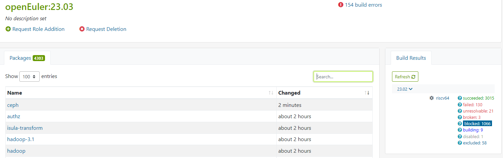
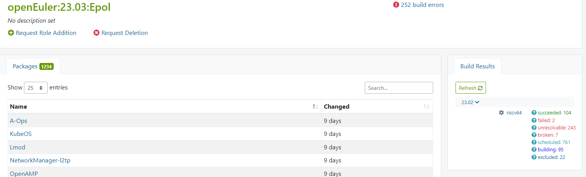

# openEuler RISC-V 开源操作系统进展·2023年02月23日

## 进展与动态

### 1. openEuler RISC-V 成功适配 VisionFive 2 单板计算机 @jchzhou
- 镜像地址：https://mirror.iscas.ac.cn/openeuler-sig-riscv/openEuler-RISC-V/testing/visionfive2_20230209/

- 文章：[openEuler RISC-V 成功适配 VisionFive 2 单板计算机](https://mp.weixin.qq.com/s/g1xyBUrEcTvvrvpE8L7m3w)

- 存在的问题：

  - GPU 上游支持尚不完善，HDMI 输出与系统图形化界面暂不可用。—>下载gpu驱动[补丁](https://gitee.com/link?target=https%3A%2F%2Fgithub.com%2Fhexdump0815%2Flinux-starfive-visionfive2-kernel%2Ftree%2Fmain%2Fmisc.vf2%2Fpatches)后，HDMI点亮了，也可显示xfce桌面了 [验证文档：Setup openeuler on visionfive2 for the third time](https://gitee.com/samuel_yuan/riscv-openeuler-visionfive/blob/master/chapter1-Build-openeuler-on-visionfive/Setup-openeuler-on-visionfive2-for-the-third-time.md) @samuel_yuan 
  - 目前只支持从 microSD 卡启动，eMMC 与 SSD 等启动方式亟待后续改进。

  

### 2. openEuler 23.03 for RISC-V 创新版启动

- 完成obs构建工程创建：

  - https://build.tarsier-infra.com/project/show/openEuler:23.03    4303

  - https://build.tarsier-infra.com/project/show/openEuler:23.03:Epol 1234

- 创新版release leader轮岗，misaka00251作为23.03的release leader

- 【WIP】第一轮批量构建和软件包修复

  - 目标：完成23.03发版同时，对照master分支构建的状态，对中间仓需要回合到src-openeuler master的repo和pr进行管理，完成中间仓代码回合，尽可能关闭/暂停中间仓仓库。
  - 进展：(数据采集时间2023-02-22 19:09)

  

  

### 3.PR

- 中间仓PR回合到src-openeuler master（7个pr）：

  - [mpich:Fix build on riscv64](https://gitee.com/src-openeuler/mpich/pulls/27)   @misaka00251	merged
  - [lxc:fix RISC-V build errors](https://gitee.com/src-openeuler/lxc/pulls/430)   @misaka00251

  - [java-service-wrapper:Fix riscv64 support](https://gitee.com/src-openeuler/java-service-wrapper/pulls/4)   @misaka00251

  - [opencv:Fix tests failed on riscv64 & Add option to build DNN](https://gitee.com/src-openeuler/opencv/pulls/27)   @misaka00251

  - [node_exporter:增加riscv架构支持](https://gitee.com/src-openeuler/node_exporter/pulls/11)   @laokz

  - [oneDNN:将riscv64加入支持的架构](https://gitee.com/src-openeuler/oneDNN/pulls/16 )   @laokz

  - [isomd5sum:增加riscv支持并使能%check](https://gitee.com/src-openeuler/isomd5sum/pulls/10)   @laokz

- 22.03分支代码修复
  - [libffi:修复riscv架构上测试错误](https://gitee.com/src-openeuler/libffi/pulls/57)   @laokz

- roll软件包升级

  - [lldb:Upgrade to 15.0.7](https://gitee.com/openeuler-risc-v/lldb/pulls/3)   @jchzhou	merged

  - [qemu:升级到7.2.0](https://gitee.com/openeuler-risc-v/qemu/pulls/2)   @laokz
  - [x264:升级 master 分支， 修复构建错误](https://gitee.com/src-openeuler/x264/pulls/3)   @Jingwiw

### 4. other

- RISC-V sig邮件列表已申请下来，欢迎大家订阅：riscv@openeuler.org 

  订阅入口：https://mailweb.openeuler.org/postorius/lists/riscv.openeuler.org/  （可在[openEuler官网邮件列表](https://www.openeuler.org/zh/community/mailing-list/)处查询订阅）

- 将NutShell-systemd/NutShell-riscv-glibc/NutShell-riscv-pk/NutShell-Kernel移动到sig-recycle：

  - issue:https://gitee.com/openeuler/community/issues/I6F83K?from=project-issue
  
  - pr:https://gitee.com/openeuler/community/pulls/4454
  
  
