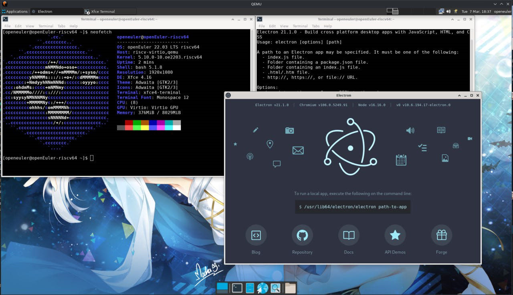
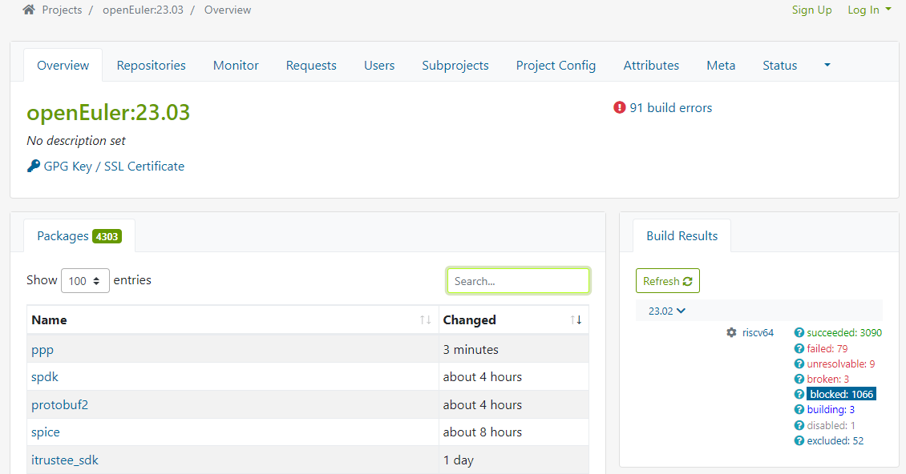
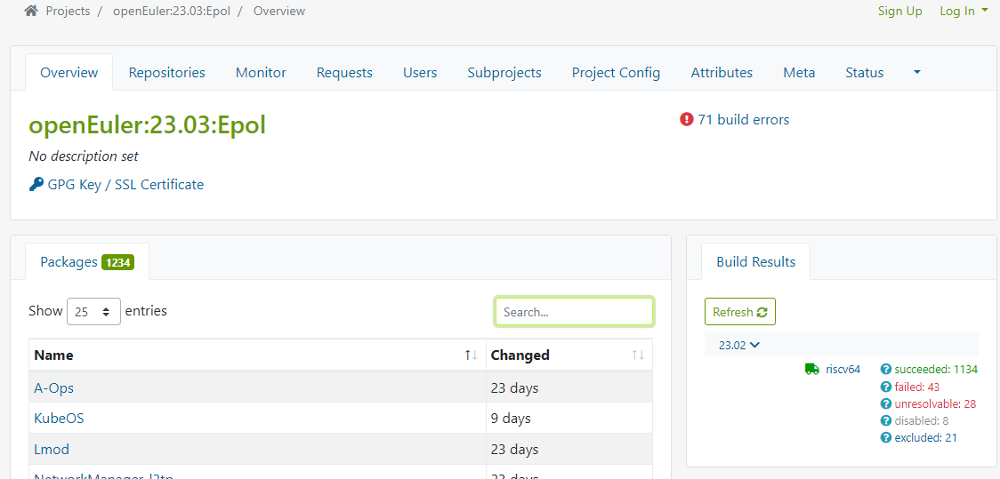

# openEuler RISC-V 开源操作系统进展·2023年03月09日


## 进展与动态

### 1. openEuler for VisionFive 2 镜像更新 @jchzhou
- 镜像地址：https://mirror.iscas.ac.cn/openeuler-sig-riscv/openEuler-RISC-V/testing/visionfive2_20230209/

- 文章：[openEuler RISC-V 成功适配 VisionFive 2 单板计算机](https://mp.weixin.qq.com/s/g1xyBUrEcTvvrvpE8L7m3w)

- 新镜像地址：https://mirror.iscas.ac.cn/openeuler-sig-riscv/openEuler-RISC-V/preview/openEuler-22.03-V2-riscv64/Visionfive2

- 说明文档：https://mirror.iscas.ac.cn/openeuler-sig-riscv/openEuler-RISC-V/preview/openEuler-22.03-V2-riscv64/Visionfive2/README.txt

  ```
  # openEuler RISC-V 22.03-V2 for Starfive VisionFive 2
  
  ## What works at the moment?
  - Base system, booting from microSD card
  - Xfce desktop
  - Ethernet (tested on early-bird 1.3b board)
  - m.2 port + SSD
  - HDMI port (tested with a 1920x1080 monitor)
  - 3.5mm headphone jack
  - First-boot script (auto partition-expanding on sdcard, etc.)
  
  ## What doesn't work currently?
  - Imagination GPU (no open-source driver available yet)
  - Booting from eMMC, m.2 SSDs (waiting for upstream effort from vendor)
  - WiFi6 Dongle bundled on kickstarter
  
  ## Untested
  - m.2 port + other PCIe devices (GPU, WiFi card, etc.)
  - eMMC
  - I2C ports
  - I2S ports
  ```


### 2. Electron 运行成功。测试小队准备纳入测试列表进行更加全面的测试（测试文档、测试用例，乃至测试自动化工作）。

- https://build.tarsier-infra.com/project/show/home:misaka00251:electron




### 3. Luajit尝鲜版在openEuler riscv上运行成功。@Jingwiw

- https://build.tarsier-infra.com/package/show/home:Jingwiw:Porting/luajit 
- zero支持，ffi还未测试，暂无jit（期待4月的完整版），计划作为23.09的特性合入


### 4. PR 23个

- 中间仓：

  - [openmpi:Upgrade OpenMPI to 4.1.5 and check RISC-V support.](https://gitee.com/openeuler-risc-v/openmpi/pulls/5)    @arielheleneto

  - [llvm-mlir:Upgrade to 15.0.7](https://gitee.com/openeuler-risc-v/llvm-mlir/pulls/1)    @jchzhou

  - [cadvisor:Fix build on riscv64](https://gitee.com/openeuler-risc-v/cadvisor/pulls/1)    @misaka00251

  - [dde-daemon:Merge upstream & Update vendor.tar.gz to build on RISC-V](https://gitee.com/openeuler-risc-v/dde-daemon/pulls/3)    @misaka00251

  - [KubeOS:Merge upstream & Fix riscv64 support](https://gitee.com/openeuler-risc-v/KubeOS/pulls/2)    @misaka00251

  - [dde-api:Rebase upstream & Update vendor.tar.gz to build on RISC-V](https://gitee.com/openeuler-risc-v/dde-api/pulls/3)    @misaka00251

- src-openeuler
  - [x265:x265 添加 RISCV 架构支持](https://gitee.com/src-openeuler/x265/pulls/11)    @Jingwiw
  - [meson:update to 1.0.1](https://gitee.com/src-openeuler/meson/pulls/27)    @Jingwiw
  - [ppp:[sync]手工同步：修正0017补丁代码](https://gitee.com/src-openeuler/ppp/pulls/26)    @laokz
  - [isomd5sum:[sync]手工同步PR#10](https://gitee.com/src-openeuler/isomd5sum/pulls/12)    @laokz
  - [libgovirt:调整-Wcast-align指针强制转换参数](https://gitee.com/src-openeuler/libgovirt/pulls/18)    @laokz
  - [qemu:增加riscv64宿主机构建支持](https://gitee.com/src-openeuler/qemu/pulls/723)    @laokz
  - [leveldb:修改-mtune参数](https://gitee.com/src-openeuler/leveldb/pulls/10)    @laokz
  - [systemd:Exclude riscv64 unsupported files](https://gitee.com/src-openeuler/systemd/pulls/378)    @misaka00251
  - [biometric-authentication:Fix riscv64 build error](https://gitee.com/src-openeuler/biometric-authentication/pulls/17)    @misaka00251
  - [qt:Add riscv64 support](https://gitee.com/src-openeuler/qt/pulls/44)    @misaka00251
  - [python-oslo.vmware:Fix test failed](https://gitee.com/src-openeuler/python-oslo.vmware/pulls/29)    @misaka00251
  - [python-os-vif:Fix test failed](https://gitee.com/src-openeuler/python-os-vif/pulls/18)    @misaka00251
  - [python-os-win:Fix test failed](https://gitee.com/src-openeuler/python-os-win/pulls/23)    @misaka00251
  - [eggo:Fix riscv64 support](https://gitee.com/src-openeuler/eggo/pulls/56)    @misaka00251
  - [mysql:Import patch from Ubuntu to fix build on riscv64](https://gitee.com/src-openeuler/mysql/pulls/93)    @misaka00251
  - [fwupd:Fix build on riscv64](https://gitee.com/src-openeuler/fwupd/pulls/48)    @misaka00251
  - [gnu-efi:Upgrade to 3.0.15 & Enable build on riscv64](https://gitee.com/src-openeuler/gnu-efi/pulls/20)    @misaka00251


### 5. openEuler 23.03 for RISC-V 创新版  @misaka00251

   - 完成obs构建工程创建：

     - https://build.tarsier-infra.com/project/show/openEuler:23.03    4303

     - https://build.tarsier-infra.com/project/show/openEuler:23.03:Epol 1234

   - 创新版release leader轮岗，misaka00251作为23.03的release leader

   - 【WIP】第一轮批量构建和软件包修复

     - 目标：完成23.03发版同时，对照master分支构建的状态，对中间仓需要回合到src-openeuler master的repo和pr进行管理，完成中间仓代码回合，尽可能关闭/暂停中间仓仓库。

     - 进展：(数据采集时间2023-03-08 18:40)

       

       
