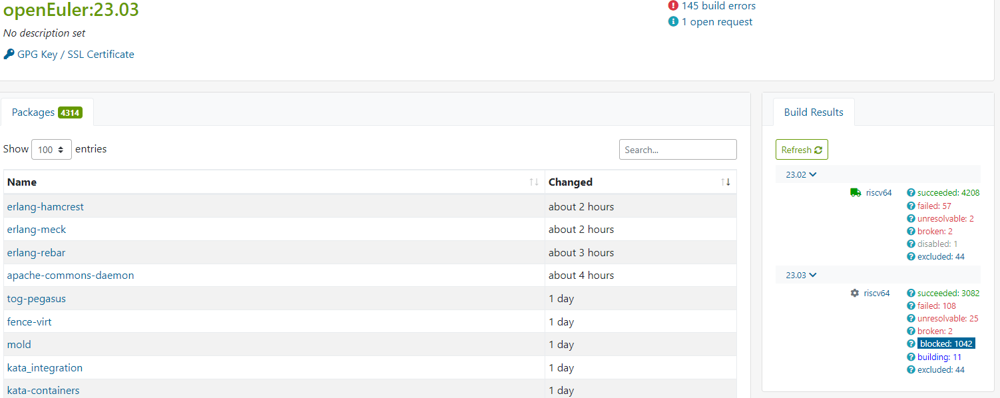
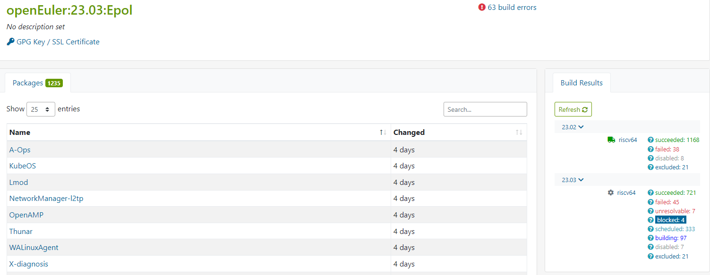
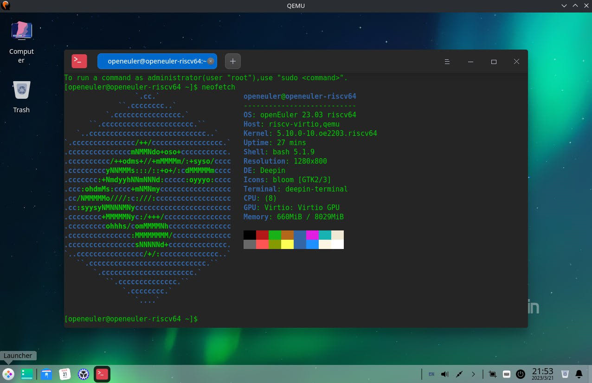
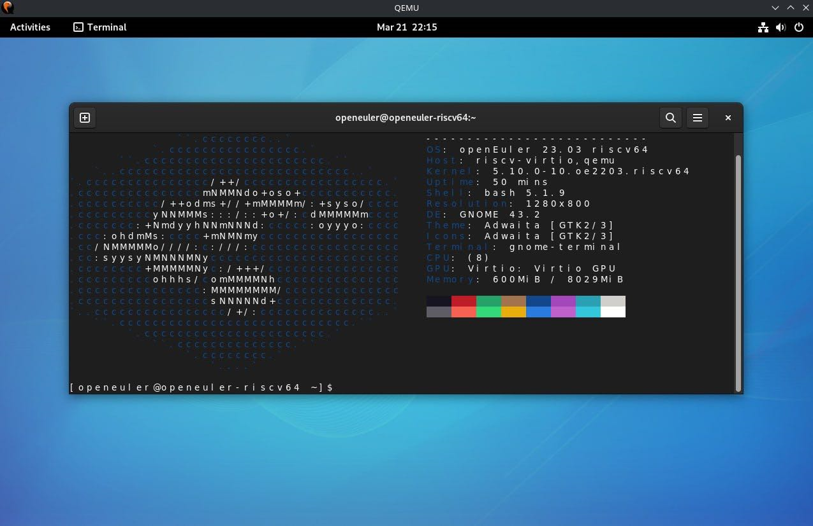
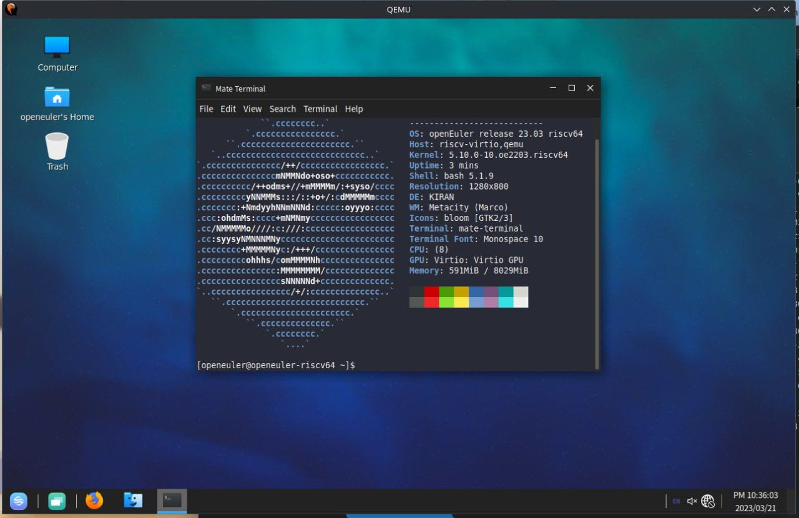
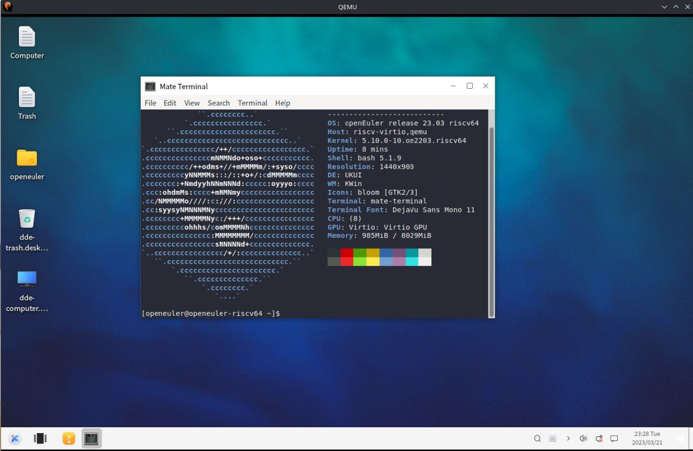
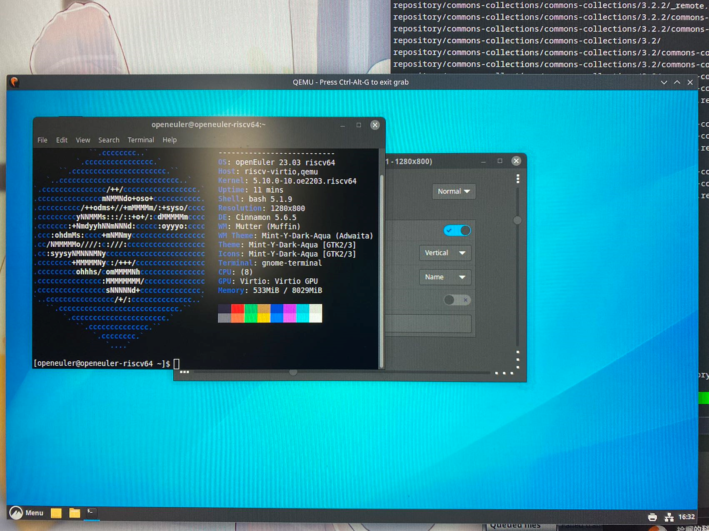

# openEuler RISC-V 开源操作系统进展·2023年03月23日

## 进展与动态

### 1. openEuler 23.03 for RISC-V 创新版  

   - 完成obs构建工程创建：

     - https://build.tarsier-infra.com/project/show/openEuler:23.03    4303

     - https://build.tarsier-infra.com/project/show/openEuler:23.03:Epol 1234

   - 创新版release leader轮岗，misaka00251作为23.03的release leader

   - 目标

     完成23.03发版同时，对照master分支构建的状态，对中间仓需要回合到src-openeuler master的repo和pr进行管理，完成中间仓代码回合，尽可能关闭/暂停中间仓仓库。

   - 进展：(数据采集时间2023-03-22 19:57)

     - 第一轮批量构建和软件包修复完成：可输出镜像
     
     - 第二轮自构建(Use for Build Flag 为Enable)进行中：可输出镜像
     
     - 可测镜像：https://mirror.iscas.ac.cn/openeuler-sig-riscv/openEuler-RISC-V/testing/20230322/v0.1/
     
          
     
     
     
     

- 测试计划：https://docs.qq.com/sheet/DSm93aWhQVUlpT0VJ  

  - xfce

  - DDE

    

  - gnome

    

  - kiran

    

  - ukui

    
    
  - cinnamon
  
    

### 2. PR 23个

中间仓：

- [openresty:升级到最新release 并初步支持 riscv64](https://gitee.com/openeuler-risc-v/openresty/pulls/1)   @Jingwiw
- [risc-v-kernel:清理spec增加配置](https://gitee.com/openeuler-risc-v/risc-v-kernel/pulls/15)   @laokz
- [lwip:修复riscv64上的构建](https://gitee.com/openeuler-risc-v/lwip/pulls/2)   @laokz
- [pytorch:rebase中间仓补丁](https://gitee.com/openeuler-risc-v/pytorch/pulls/2)   @laokz
- [qemu:增加user模式模拟器](https://gitee.com/openeuler-risc-v/qemu/pulls/3)   @laokz

src-openeuler

- [openmpi:Upgrade OpenMPI to 4.1.5](https://gitee.com/src-openeuler/openmpi/pulls/32)   @arielheleneto
- [mozjs102:升级并添加 riscv64 架构的 JIT 支持](https://gitee.com/src-openeuler/mozjs102/pulls/2)   @Jingwiw
- [openssl:修复riscv64上的构建](https://gitee.com/src-openeuler/openssl/pulls/206)   @laokz
- [libepoxy:riscv: 将"GLIBC_2.27"加入test/dlwrap.c](https://gitee.com/src-openeuler/libepoxy/pulls/21)   @laokz
- [libvirt:增加riscv构建支持](https://gitee.com/src-openeuler/libvirt/pulls/214)   @laokz
- [libaio:删除补丁2的架构隔离宏](https://gitee.com/src-openeuler/libaio/pulls/57)   @laokz
- [isomd5sum:[手工sync] PR-10: 增加riscv支持并使能%check](https://gitee.com/src-openeuler/isomd5sum/pulls/14)   @laokz
- [isula-build:riscv64去除-static-pie](https://gitee.com/src-openeuler/isula-build/pulls/282)   @laokz
- [jnr-ffi:修复riscv64上的有关构建测试错误](https://gitee.com/src-openeuler/jnr-ffi/pulls/3)   @laokz
- [jffi:应用上游补丁修复riscv64上的有关构建测试错误](https://gitee.com/src-openeuler/jffi/pulls/7)   @laokz
- [apache-commons-daemon:Fix build failed on openEuler RISC-V](https://gitee.com/src-openeuler/apache-commons-daemon/pulls/3)   @misaka00251
- [gazelle:[WIP] Fix deprecated ETH_LINK macros](https://gitee.com/src-openeuler/gazelle/pulls/329)   @misaka00251
- [fence-virt:Enable build on riscv64](https://gitee.com/src-openeuler/fence-virt/pulls/21)   @misaka00251
- [obs-server:Fix build on riscv64](https://gitee.com/src-openeuler/obs-server/pulls/122)   @misaka00251
- [color-filesystem:Add riscv64 support for color filesystem](https://gitee.com/src-openeuler/color-filesystem/pulls/22)   @misaka00251
- [obs-bundled-gems:Fix build on riscv64](https://gitee.com/src-openeuler/obs-bundled-gems/pulls/54)   @misaka00251
- [gn:Add risc-v and loongarch support](https://gitee.com/src-openeuler/gn/pulls/4)   @misaka00251

