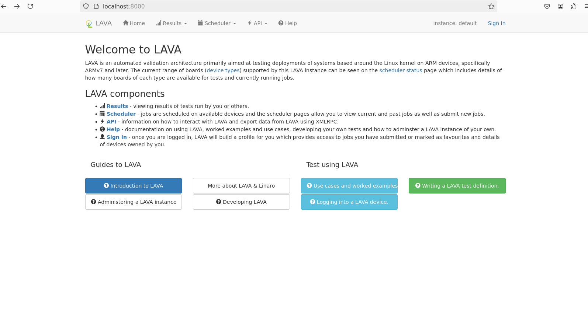

# 部署 LAVA LAB

## 直接部署 （本文档不推荐）

### 1. 系统要求

确保你的 Ubuntu 系统满足以下要求：

- Ubuntu 20.04 或更高版本
- Python 3.6+
- PostgreSQL
- RabbitMQ
- Git

### 2. 安装依赖

首先，更新系统并安装必要的依赖项：

```bash
sudo apt update
sudo apt upgrade
sudo apt install -y python3 python3-pip python3-dev postgresql postgresql-contrib rabbitmq-server git
```

### 3. 创建 LAVA 数据库

创建一个用于 LAVA 的 PostgreSQL 数据库和用户：

```bash
sudo -u postgres psql
CREATE DATABASE lava;
CREATE USER lava WITH PASSWORD 'your_password';
GRANT ALL PRIVILEGES ON DATABASE lava TO lava;
```

### 4. 克隆 LAVA 源代码

使用 Git 克隆 LAVA 的源码：

```bash
git clone https://github.com/lava-lab/lava.git
cd lava
```

### 5. 安装 Python 依赖

在 LAVA 目录中，使用 pip 安装所需的 Python 依赖：

```bash
pip3 install -r requirements.txt
```

### 6. 配置 LAVA

复制示例配置文件并进行编辑：

```bash
cp lava/settings.py.example lava/settings.py
```

根据需要编辑`lava/settings.py`，特别是数据库连接部分，确保填写正确的数据库名称和用户信息。

### 7. 迁移数据库

执行数据库迁移以创建相应的表：

```bash
python3 manage.py migrate
```

### 8. 启动服务

使用以下命令启动 LAVA 服务：

```bash
python3 manage.py runserver 0.0.0.0:8000
```

### 9. 访问 LAVA

在浏览器中访问 `http://你的服务器IP:8000`，你应该可以看到LAVA的界面。

### 10. 配置 RabbitMQ

确保 RabbitMQ 正在运行，并且可以通过以下命令查看状态：

```bash
sudo systemctl status rabbitmq-server
```

你可以使用 RabbitMQ 管理界面进行进一步配置，默认情况下，管理界面可以通过`http://localhost:15672`访问。


**可以看到比较繁琐，所以lava提供了也可以通过 docker compose 来快速的构建开发环境，接下来我们着重于这方面** 


## 使用 docker 部署

### 1.安装 docker 环境

由于使用 docker compose 部署 LAVA ，所以需要安装 docker 和 docker compose , 安装方法可以参照 [Ubuntu | Docker Docs](https://docs.docker.com/engine/install/ubuntu/)

由于我使用的是 WSL 2 这里我本人遇到的问题有

```shell
sudo curl -fsSL https://download.docker.com/linux/ubuntu/gpg -o /etc/apt/keyrings/docker.asc 
```

无法正常获取资源，所以我使用windows获取资源再传到我的 WSL2 对应位置中

如果在安装过程中出现了无法获取docker镜像的情况，可以考虑为机器上代理

如果无法正常拉取镜像，有可能是我们连接官网的速度太慢，建议可以为 docker 也配置镜像源（或者说可能存在 daemon.json 不存在的问题 https://www.converts.cn/article/7097541.html）

方法为

```shell
vim /etc/docker/daemon.json
```

```shell
{
    "registry-mirrors": [
        "https://dockerhub.icu",                      //疑似不行了 
        "https://docker.chenby.cn",
        "https://docker.1panel.live",
        "https://docker.aWSL9527.cn",
        "https://docker.anyhub.us.kg",
        "https://dhub.kubesre.xyz"
    ]
}
```

这里的几个源 本人用着没什么问题，不过也存在有些镜像源会对拉取次数少的镜像有限制的情况，如果是自己配置过镜像源的同学可以留意下这一点。

还有记得换源后重启 docker

```shell	
sudo systemctl restart docker
```

-----

**将当前用户添加到docker组内（可选）**

为了方便不用 sudo 执行 docker 命令，可以将当前用户添加到docker组内

```
sudo groupadd docker    //添加docker用户组
sudo usermod -a -G docker $(whoami)    //将当前用户添加到docker组内
sudo systemctl restart docker     //重启docker service
```

执行完以上命令，退出当前终端操作界面再次进入，就可以不用 sudo 执行 docker 命令了

-----

### 2.获取 LAVA 源码

用 docker compose 部署LAVA, 从 https://github.com/kernelci/lava-docker 获取源码

建议 fork 下来因为还要对源码进行一些更改

```shell
git clone https://github.com/kernelci/lava-docker.git
cd lava-docker
```

如果是第一次使用 lava-docker 的同学，我还是想要更完备的讲解下项目大概的内容，如果有需要的话可以查看 [lava-docker细节解释](./lava-docker细节解释.md)

直接进入主题

### 3.修改配置

#### 修改 lavalab-gen.py

- 修改 master 对应149行内容

  ```python
          dockcomp = {}
          dockcomp["version"] = "2.4"
          dockcomp["services"] = {}
          dockcomposeymlpath = "output/%s/docker-compose.yml" % host
          dockcomp["services"][name] = {}
          dockcomp["services"][name]["hostname"] = name
          dockcomp["services"][name]["ports"] = [ listen_address + ":" + str(webinterface_port) + ":80"]
          dockcomp["services"][name]["volumes"] = [ "/home/feifei/ospp/2024ospp-large-files/ubuntu/boot:/boot", "/home/feifei/ospp/2024ospp-large-files/ubuntu/modules:/lib/modules" ,"/home/feifei/ospp/2024ospp/device-type/LicheePi4A_4.jinja2:/usr/share/lava-server/device-types/LicheePi4A_4.jinja2" ] #映射一些组件和 lichepi4a 的 device-type
          dockcomp["services"][name]["build"] = {}
          dockcomp["services"][name]["build"]["context"] = name
          if "build_args" in master:
              dockcomp["services"][name]["build"]["args"] = master['build_args']
              dockcomp["services"][name]["restart"] = "always" #添加开机自动运行参数
  ```

- 修改 slave 对应458行内容

  ```python
          dockcomp["services"][name] = {}
          dockcomp["services"][name]["hostname"] = name
          dockcomp["services"][name]["dns_search"] = ""
          dockcomp["services"][name]["ports"] = []
          dockcomp["services"][name]["volumes"] = [ "/home/feifei/ospp/2024ospp-large-files/ubuntu/boot:/boot", "/home/feifei/ospp/2024ospp-large-files/ubuntu/modules:/lib/modules",
          "/home/feifei/ospp/2024ospp-large-files:/home/2024ospp-large-files" ] #映射一些组件 这里包括启动需要的rooft 等文件，如果后续 job 中没有使用inline的资源便不用映射
          dockcomp["services"][name]["environment"] = {}
          dockcomp["services"][name]["build"] = {}
          dockcomp["services"][name]["build"]["context"] = name
          if "build_args" in slave:
              dockcomp["services"][name]["build"]["args"] = slave['build_args']
              dockcomp["services"][name]["restart"] = "always" #tip
  ```

#### 创建 board.yaml

```yaml
---
masters:
  - name: master
    host: local
    webinterface_port: 8000
    allowed_hosts: ['*']    
    users:
      - name: admin
        token: adminlavatoken
        password: v
        superuser: true
        staff: true
    tokens:
      - username: admin
        token: dfjdfkfkdjfkdsjfslforci
        description: no description
slaves:
  - name: lab-slave-1
    host: local
    remote_master: master
    remote_user: admin
    dispatcher_ip: 192.168.0.158 #这里不能用本地环回地址 因为与后续 bootloader 相关
    use_tftp: True
    use_nfs: True
    host_healthcheck: false

boards:
  - name: qemu-test
    type: qemu
    slave: lab-slave-1
  - name: Lpi4A
    type: LicheePi4A_4
    slave: lab-slave-1
    connection_command: telnet 192.168.137.1 20000   //20000是ser2net配置的串口/dev/ttyUSB1对应的端口 也就是对应的 licheepi4a
    #pdu_generic:    ////远程控制电源的命令 这里是只用串口的
      #(echo "OFF"; sleep 1; echo "ON") | telnet 192.168.1.100 20001
      #(echo "ON") | telnet 192.168.1.100 20001
      #(echo "OFF") | telnet 192.168.1.100 20001
    uart:
      idvendor: 0x0403
      idproduct: 0x6010
      devpath: "1"
```

配置完毕

### 4.创建 docker 容器

```shell
./lavalab-gen.py //生成部署需要的文件, 存放在 output/local/目录下
cd output/local
docker compose build //生成 lava master 和 slave 的 docker image
docker compose up -d //运行 lava master 和 slave docker 容器
```

### 5.使用 lava web

可以使用 firefox edge chrome 等浏览器

如果你想我一样是 WSL 2 又不想做 端口映射的话 可以简单粗暴的在 WSL 2 里下载 firefox 使用，不过我这里会有一些细小的bug，不太影响使用，比如 lava 以及 Jenkins 提供的一些 预选项 无法用鼠标点击 需要使用就键盘选择。

在命令行执行以下命令进入浏览器
```shell
firefox &
```

在浏览器中输入 http://127.0.0.1:8000 进入 lava web 界面，8000是 boards.yaml 中设置的 webinterface_port 

点击右上角的 **Sign in** 进行 admin 的登陆，在 **board.yaml** 否则无法提交 job

至此 LAVA LAB 的基本环境已经搭建完毕

### 6.安装qemu

```shell
sudo apt install qemu-system-misc
```

