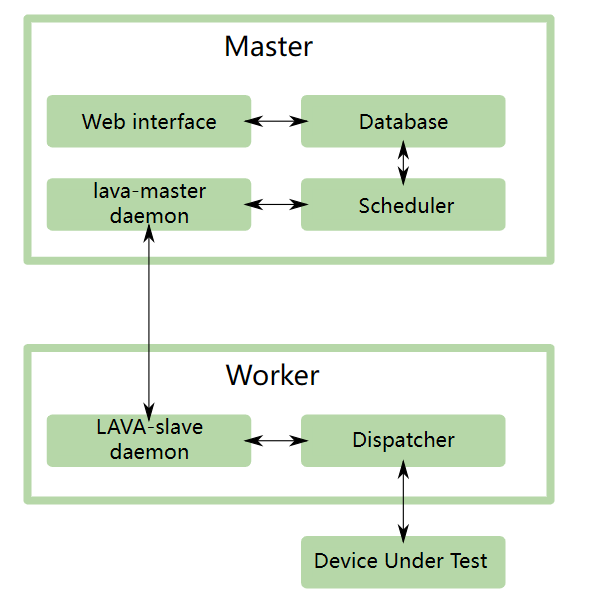
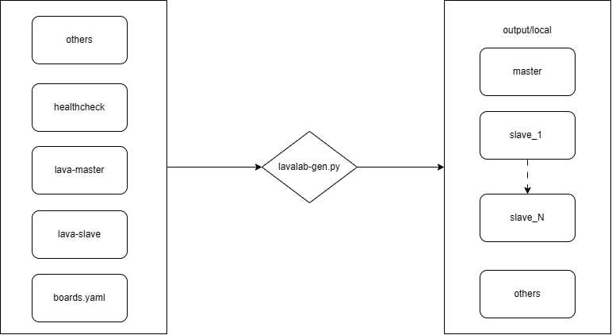
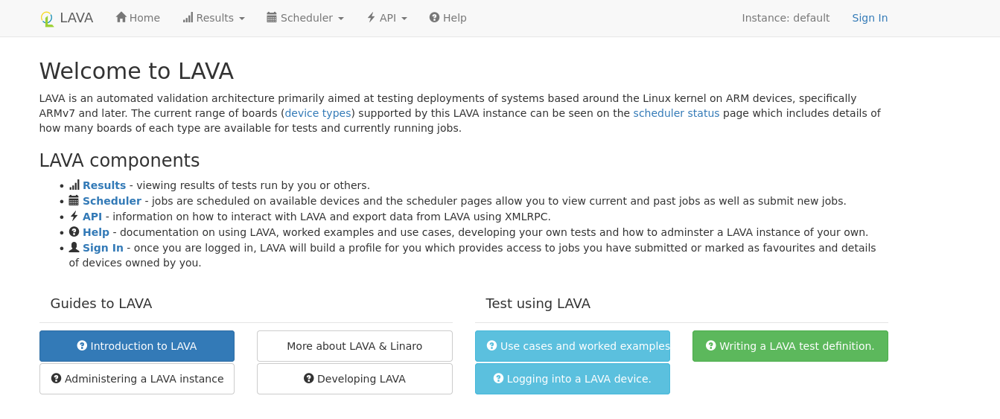
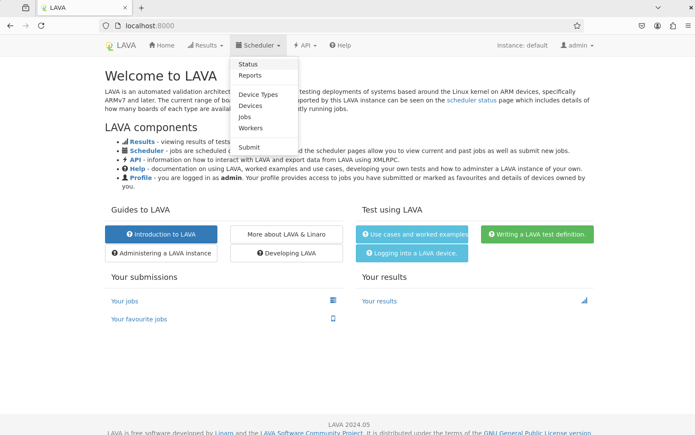
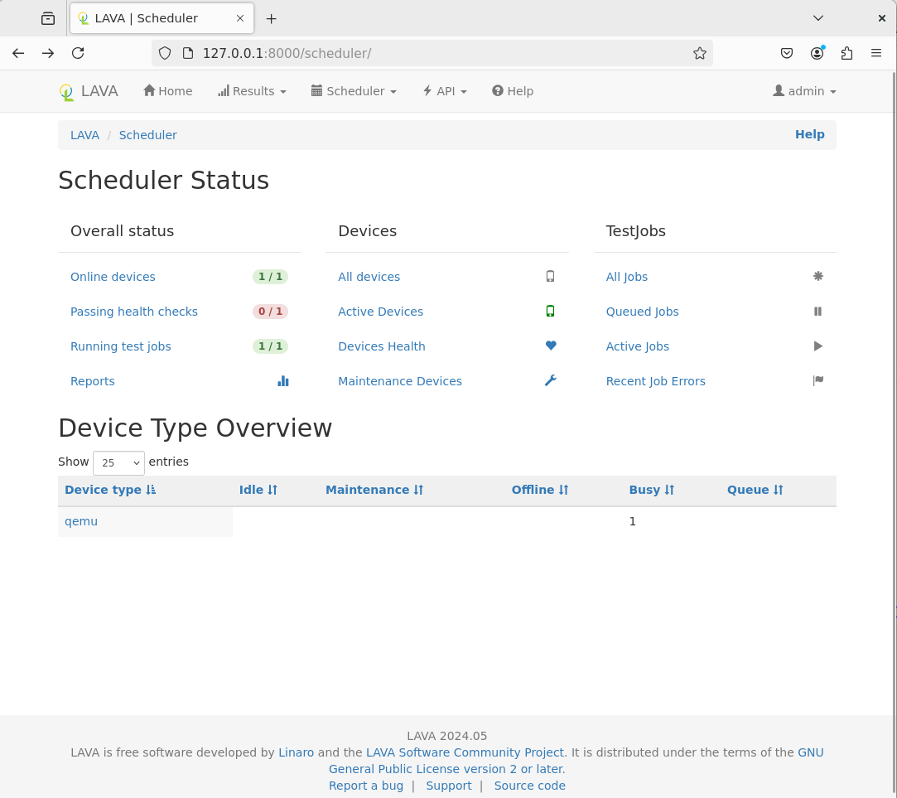
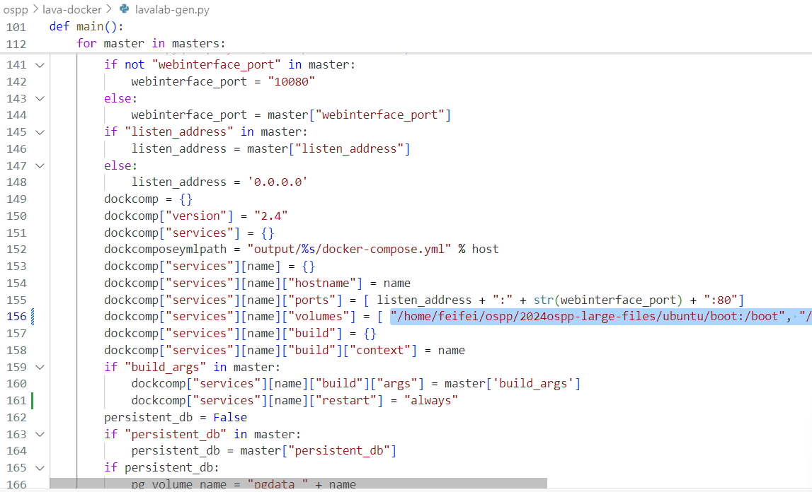
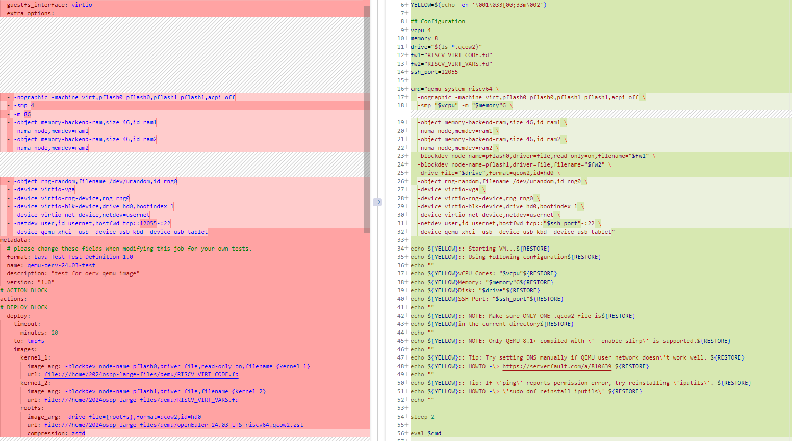

## 总体介绍

首先可以参考官方文档 [LAVA 简介 — LAVA 2024.05 文档 (lavasoftware.org)](https://docs.lavasoftware.org/lava/index.html#)

可能会有点难以理解



可以参考官方文档的这张图

通俗点说就是 LAVA 是一种测试框架，用来管理被测试设备，使用者需要根据这个测试框架的规则来开发测试套和测试用例，测试用例需要使用者根据自己的需求更改。

由 **master** 提供 web 界面 以及各种交互的接口，存储测试定义，测试结果等，**slave** 与被测试的设备直接连接，来控制被测试的机器。

大家可以在 [Index — LAVA 2024.05 documentation (lavasoftware.org)](https://docs.lavasoftware.org/lava/genindex.html)  找到很多信息，但是资料有些过多，并且有些已经很久没更新了，再加上其中提供的一些 url 已经失效了，可能会产生一些障碍

回到项目本身，由于我们使用 lava-docker ，本质上是在当前的机器上创建了 docker 容器，如何创建详见下文。

##  lava-docker 基础介绍

### 解释源码以及运作方式

源码链接 https://github.com/kernelci/lava-docker.git



使用 lavalab-gen.py 生成 master 以及 slave 的基础镜像

**源码由以下部分组成**

1. boards.yaml

   - 根据自己的需要 编写 boards.yaml （原项目下存在一些 example）

   - 根据需要修改 lavalab-gen.py
2. healthcheck 

   - 存储的是 healthcheck 的定义 由于 healthcheck 需要拉取 github 上的源码，由于国内的网络问题，可能需要为生成的 docker 像配置代理等 比较麻烦，可以在这里提前将 healthcheck 拉取的源码 替换为本地路径 /或是本地地址你 fork 到 gitee 上的克隆镜像仓库地址
3. lava-master 和 lava-slave
   - lava-master 和 lava-slave 分别用来创建 lava-master 和 lava-slave 容器镜像
   - 里面除了包含 Dockerfile 还有一些文件夹，用来存储一些基于自己需求的配置，应该是为了使项目不杂乱，比如把需要的一些组件放在这里，在修改 lavalab-gen.py 时指向这里，比较方便资源的管理。
4. others

   - 并非不重要，只是在当前项目中没修改的部分 ，可以自行阅读源码
     - dhcpd：用来为网络中的设备分配 IP
     - boards.yaml.example 或 board-ci.yaml 作为 boards.yaml 的例子

将一切修改完毕 就可以运行 lavalab-gen.py 此时会出现 **local/output** 文件夹

**output 文件夹由以下部分组成**

1. master 文件夹 (由 boards.yaml 中的设置的内容决定文件夹名称 )

   - 直接 copy  根目录中 lava-master 里面的内容
   - 根据 boards.yaml 中的内容生成的一些 user 或 token 信息
2. lab-slave-1 文件夹 (由 boards.yaml 中的设置的内容决定文件夹名称 )

   - 直接 copy  根目录中 lava-master 里面的内容
   - 根据 boards.yaml 中的内容生成的 一或多个 slave 容器 
3. deploy.sh 

   - 用于管理和配置系统 Udev 规则以及启动 Docker 容器的 Shell 脚本
4. docker-compose.yml

   - 根据 boards.yaml 中的内容生成，配置 容器的端口等设置，将主机文件映射到 docker 容器内部

### 运行

配置好 board.yaml 就可以顺利的 使用 docker 搭建 lava 了

```shell
./lavalab-gen.py //生成部署需要的文件, 存放在 output/local/目录下
cd output/local
docker compose build //生成 lava master 和 slave 的 docker image
docker compose up -d //运行 lava master 和 slave docker 容器
```

正常的话不做任何修改也是可以跑起来的，只需要编写好 board.yaml 这里给出一个简单例子

```yaml
---
masters:
  - name: master  
    host: local
    webinterface_port: 8000 //web端口
    allowed_hosts: ['*']    
    users:
      - name: admin
        token: adminlavatoken //token 与 kernel ci 或是 Jenkins 交互都要使用 
        password: v
        superuser: true
        staff: true
    tokens:
      - username: admin
        token: dfjdfkfkdjfkdsjfslforci
        description: no description
slaves:
  - name: lab-slave-1
    host: local
    remote_master: master
    remote_user: admin
    dispatcher_ip: 127.0.0.1
    use_tftp: True
    use_nfs: True
    host_healthcheck: false
boards:
  - name: qemu-test
    type: qemu
    slave: lab-slave-1
```

在浏览器中输入 http://127.0.0.1:8000 进入 lava web 界面，8000是 boards.yaml 中设置的 webinterface_port 

lava web 端可以干很多事情（其实和使用 lava service 的子命令类似）

提交 device-type ，job 更改 设备状态等



( lava 界面)

由于此时的 **board.yaml** 中只配置了 一个 slave 和 board 

```yaml
slaves:
  - name: lab-slave-1
    host: local
    remote_master: master
    remote_user: admin
    dispatcher_ip: 127.0.0.1
    use_tftp: True
    use_nfs: True
    host_healthcheck: false
boards:
  - name: qemu-test
    type: qemu
    slave: lab-slave-1
```



查看 Status



## 处理问题

此时的 online devices 应该是一个，而且由于 qemu 类型会自己执行 healthcheck ，所以目前应该有一个 running test job 便是 healthcheck

### healthcheck

上文也提到过，由于网络问题，有可能你的 healthcheck 过不去，过不去便会一直执行，导致无法处理其他job，所以要先解决 **healthcheck** 的问题

解决方案：

1. 为 qemu对应的 slave 容器 配置代理等，直接解决网络问题
2. 把 定义中的 https://github.com/BayLibre/lava-healthchecks-binary.git 替换为国内的镜像仓库

和我一样使用 WSL 2 的同学解决这些问题可能还会遇到一些报错，最后定位到是因为，WSL 2 中的 Ubuntu 是 Windows 特化版本的 Ubuntu ，虽然其内核版本满足了 healthcheck 的版本要求，但是其中的 引导目录`/boot`以及 模块目录`/lib/modules` 和 lava 的适配都有问题，我这里采用了最简单的方法，便是把 ubuntu-22.04  x86 对应的目录直接 copy 到 WSL 2 中，并在构建 docker 容器时 指向对应的目录，即 **修改 lavalab-gen.py** 



这里便是将 提供的 boot 映射为 master 的 boot ，modules 自然也是同理 ，这里陪着的是 master ，slave 在文件462行左右，配置方法都是一样的。

master 不这样更改也可以 因为 master 不需要做一些测试 ，目前使用起来没出现问题。

解决这些问题后，之后 WSL2 和实体机的体感应该是一致的

## 编写 job

这里给出一个 qemu 的 example

```yaml
# Your first LAVA JOB definition for an riscv_64 QEMU
device_type: qemu
job_name: qemu-oerv-24.03-smoke-test
timeouts:
  job:
    minutes: 30
  action:
    minutes: 20
  connection:
    minutes: 5
priority: medium
visibility: public
# context allows specific values to be overridden or included
context:
  # tell the qemu template which architecture is being tested
  # the template uses that to ensure that qemu-system-riscv64 is executed.
  arch: riscv64
  machine: virt
  guestfs_interface: virtio
  extra_options: 
  - -nographic -machine virt,pflash0=pflash0,pflash1=pflash1,acpi=off
  - -smp 4 
  - -m 8G
  - -object memory-backend-ram,size=4G,id=ram1
  - -numa node,memdev=ram1
  - -object memory-backend-ram,size=4G,id=ram2
  - -numa node,memdev=ram2
  - -object rng-random,filename=/dev/urandom,id=rng0
  - -device virtio-vga
  - -device virtio-rng-device,rng=rng0
  - -device virtio-blk-device,drive=hd0,bootindex=1
  - -device virtio-net-device,netdev=usernet
  - -netdev user,id=usernet,hostfwd=tcp::12055-:22
  - -device qemu-xhci -usb -device usb-kbd -device usb-tablet
metadata:
  # please change these fields when modifying this job for your own tests.
  format: Lava-Test Test Definition 1.0
  name: qemu-oerv-24.03-test
  description: "test for oerv qemu image"
  version: "1.0"
# ACTION_BLOCK
actions:
# DEPLOY_BLOCK
- deploy:
    timeout:
      minutes: 20
    to: tmpfs
    images:
      kernel_1:
        image_arg: -blockdev node-name=pflash0,driver=file,read-only=on,filename={kernel_1}
        url: file:///home/2024ospp-large-files/qemu/RISCV_VIRT_CODE.fd
      kernel_2:
        image_arg: -blockdev node-name=pflash1,driver=file,filename={kernel_2}
        url: file:///home/2024ospp-large-files/qemu/RISCV_VIRT_VARS.fd
      rootfs:
        image_arg: -drive file={rootfs},format=qcow2,id=hd0
        url: file:///home/2024ospp-large-files/qemu/openEuler-24.03-LTS-riscv64.qcow2.zst
        compression: zstd
# BOOT_BLOCK
- boot:
    timeout:
      minutes: 20
    method: qemu
    media: tmpfs
    prompts: ["root@openeuler-riscv64"]
    auto_login:
      login_prompt: "localhost login:"
      username: root
      password_prompt: "Password:"
      password: openEuler12#$
# TEST_BLOCK
- test:
    timeout:
      minutes: 10
    definitions:
    - repository: https://git.linaro.org/lava-team/lava-functional-tests.git
      from: git
      path: lava-test-shell/smoke-tests-basic.yaml
      name: smoke-tests
```

这里使用的镜像是 官方仓库的镜像 [openEuler下载](https://www.openeuler.org/zh/download)

值得注意的是 openEuler 不同版本 或是不同来源的 镜像 启动脚本可能不太相同，需要根据需要修改 job 的内容

根据你的 device 来处理 **TEST_BLOCK** 以上的内容

这里以 openEuler 24.03 做演示

这里用 yaml 启动部分的内容和官方提供的 start.vm 脚本做下对比

### DEPLOY_BLOCK



左侧为 job ，右侧为 start_vm 脚本

字体有些小 但应该能看出来 实际上就是把启动脚本需要的参数 用 lava 需要的格式做出来

简单来说就是 不需要引用外部文件的 不需要动 放在 context 下`当然一些 define 如 $ssh_port 可以直接替换为 其对应的值或文本`， 需要处理的 比如 start_vm 中需要 引入 openEuler-24.03-LTS-riscv64.qcow2.zst 这个 rootfs 

则需要把对应语句移入 - deploy 的 image 下

编写大概是这样

```yaml
images:
	roofts: #变量名对应下一句中的内容
	image_arg: -drive file={rootfs},format=qcow2,id=hd0 #对应上一句中的 roofts 
        url: file:///home/2024ospp-large-files/qemu/openEuler-24.03-LTS-riscv64.qcow2.zst #可以是本地资源，也可以是网络资源
        compression: zstd #提供的是什么格式的 rootfs
```

注意注意缩进 `file={rootfs}`中间不能有空格

### BOOT_BLOCK

```yaml	
# BOOT_BLOCK
- boot:
    timeout:
      minutes: 20
    method: qemu
    media: tmpfs
    prompts: ["root@openeuler-riscv64"]
    auto_login:
      login_prompt: "localhost login:"
      username: root
      password_prompt: "Password:"
      password: openEuler12#$
```

这里需要到实际的机器中查看其提供的信息，欧拉各版本的启动提示词并不相同 

比如 24.03 LTS 是 `locolhost login:` 而 23.09 则是 `openeuler-riscv64 login:`

我这里尝试过 字符串匹配 常出现bug，暂时就不统一了 有的区别只有 `e` 的大小写

这里是最重要的环节之一，可能会遇到非常多你意想不到的问题，之后我可能会更新

最后便是处理

### TEST_BLOCK

```yaml
# TEST_BLOCK
- test:
    timeout:
      minutes: 10
    definitions:
    - repository: https://git.linaro.org/lava-team/lava-functional-tests.git
      from: git
      path: lava-test-shell/smoke-tests-basic.yaml
      name: smoke-tests
```

这里便是测试的相关内容，比如这个执行一个 smoke-test 来源则是 git 当然来源也可以是本地等，此时已经进入测试机环境了，你也可以直接编写测试脚本在这里运行。

## 测试的方法

我说的可能不清楚 可以查看 [Submit a job - LAVA](https://lava.readthedocs.io/en/latest/user/basic-tutorials/submit/)
### 1.首先是自己编写

可以查看 [Glossary of terms — LAVA 2024.05 documentation (lavasoftware.org)](https://docs.lavasoftware.org/lava/glossary.html#term-job-definition)

```yaml

# TEST_BLOCK
- test:
    timeout:
      minutes: 600
    definitions:
    - repository:
        metadata:
          format: Lava-Test Test Definition 1.0
          name: kselftest-ptrace-test
        run:
          steps:
            - yum install -y git make gcc flex bison clang
            - df -h
            - cd /root
            - git clone https://gitee.com/feifei-fertilizer/riscv-kernel.git
            - cd riscv-kerner.git
            - git checkout OLK-6.6
            - make defconfig
            - make -C tools/testing/selftests
            - make -C tools/testing/selftests TARGETS=clone3 run_tests
      from: inline
      name: kselftest-inline
      path: inline/kselftest.yaml
```

这是一个基于内核源码的 **kselftest**

可以看到

### 2.基于test-definitions

可以通过 clone [Linaro/test-definitions: Test definitions work with and without LAVA (github.com)](https://github.com/Linaro/test-definitions) 来直接使用其准备好的测试

根据描述官方文档描述 [test-definitions/docs/index.md 在 master ·Linaro/测试定义 (github.com)](https://github.com/Linaro/test-definitions/blob/master/docs/index.md)

**测试套件可以在有和没有 [LAVA](http://lavasoftware.org/) 的情况下工作。以下两个 支持自动测试集。**

- **`automated/linux/`**
- **`automated/android/`**

我需要做的 ltp test 正位于 **`automated/linux/`** 中

```yaml
- test:
    timeout:
      minutes: 600
    definitions:
    - repository: https://github.com/Linaro/test-definitions.git
      from: git
      path: automated/linux/ltp/ltp.yaml
      parameters:
        TST_CMDFILES: syscalls
        SKIPFILE: skipfile-lkft.yaml
        BOARD: qemu
        BRANCH: master
        ENVIRONMENT: production
        TIMEOUT_MULTIPLIER: '30'
        ROOT_PASSWD: openEuler12#$
        BUILD_FROM_TAR: true
        LTP_VERSION: 20240524
        LTP_TMPDIR: /scratch
      name: ltp-syscalls-tests
```

当然只要拉取 github 上面的代码总要先解决网络问题

-----

ps：如果你使用串口连接硬件设备进行测试 还需要更改 docker-compose.yml 中的内容，我决定放在自定义设备那章节中


到这里我便演示了如何起一个最简单的测例，当然这比起真正的测试还有很多路要走.

