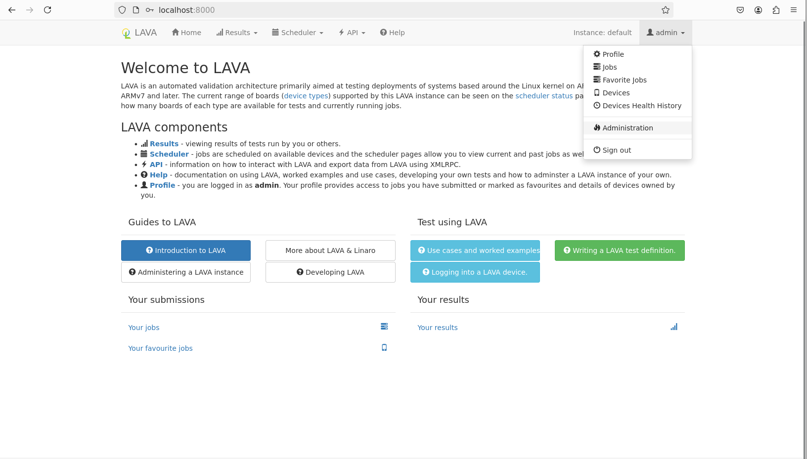
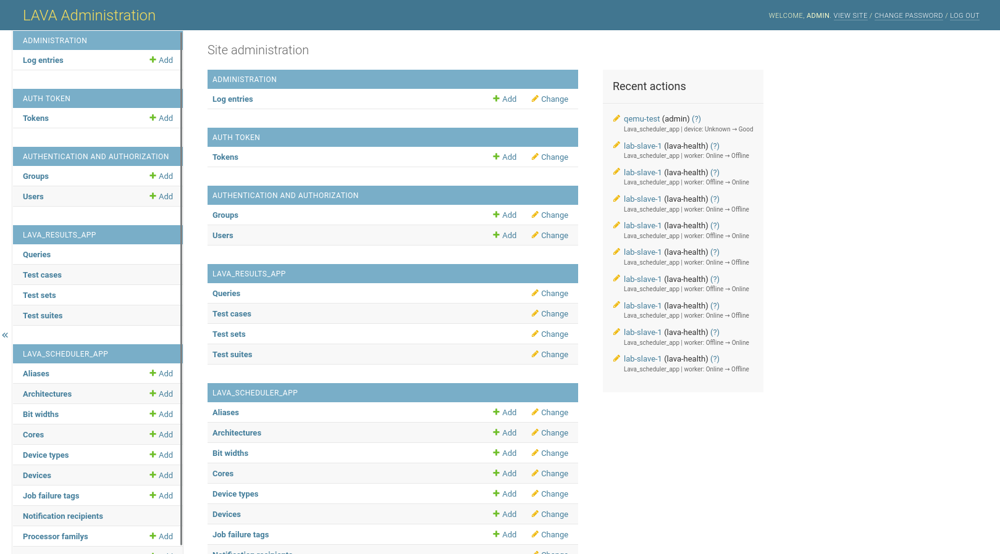
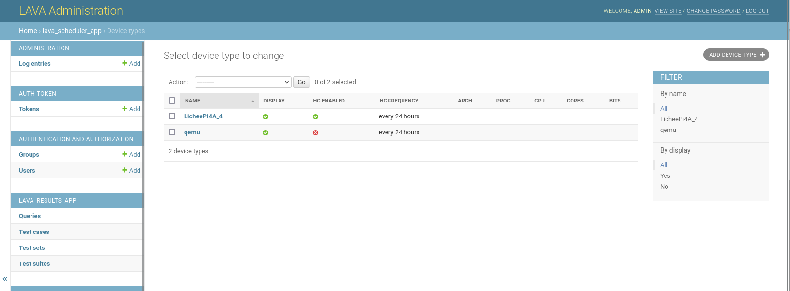
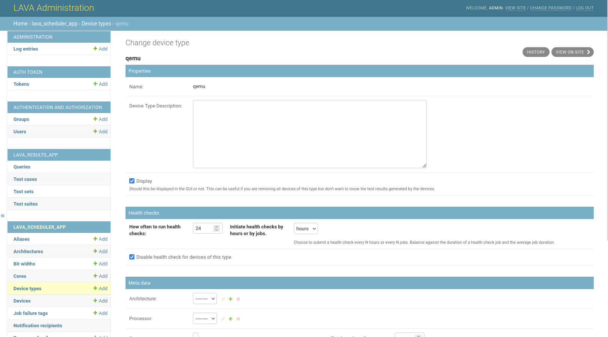
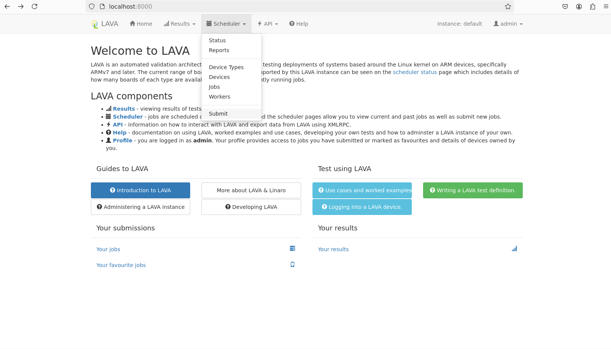

做完了前面的工作

如果你需要短时间测试你的 job 以及 测试用例 ，频繁的 healthcheck 会占用你的机器

## 修改 healthcheck 触发条件（可选）

可以修改 healthcheck 的触发时间，可以 disable healthcheck



点击 **device-type**



这里可以看到设备的 healthcheck 状态 我这里已经把 qemu 的 自动触发关闭了



选择 **Disable health check for devices of this type**




## 提交 job 及触发



回到主页直接点击 **Submit** 就会出现一个提交界面，提交你的 job 定义就好啦

查看 job 结果等这里都不再赘述了

在 [lava-docker细节解释 ](./lava-docker细节解释.md)中我解释了一个 基于 openEuler riscv 24.03 LTS 的 smoke 测试，可以参考下


## 处理 healthcheck 的网络问题

由于 healthcheck 的源码位于 github 上，在拉取时可能会遇到网络问题，这里我给出一种解决方案

可以在 构建 lava 容器前修改源码中 healthcheck 的 **Dockerfile**

位于源码根目录的 healthcheck 文件夹下

```dockerfile
FROM bitnami/minideb:bullseye

RUN apt-get update && apt-get -y install git
RUN git clone https://github.com/BayLibre/lava-healthchecks-binary.git #将这一行换成国内的镜像仓库即可

FROM nginx:mainline-alpine

COPY port.conf /etc/nginx/conf.d/

COPY --from=0 /lava-healthchecks-binary/mainline /usr/share/nginx/html/mainline/
COPY --from=0 lava-healthchecks-binary/images /usr/share/nginx/html/images/
COPY --from=0 lava-healthchecks-binary/next /usr/share/nginx/html/next/
COPY --from=0 lava-healthchecks-binary/stable /usr/share/nginx/html/stable/
```

也可以为你的 docker 容器配置代理

