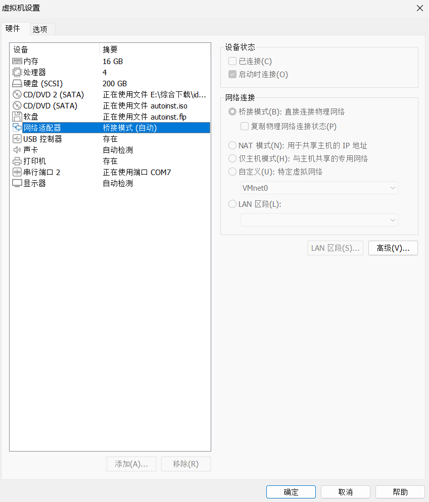

**注 ：这里是非常基础的主机环境搭建环节，相信大部分看到这里的同学都是会的，但是为了做到完整，我会在这里写上如何进行完整的环境搭建，如果你已经完成了可以跳过.不过如果你使用的是虚拟机环境，这里可能仍有一些你需要注意的地方**

# 主机环境

## 实体机

推荐

使用 Ubuntu 22.04 ，不过众所周知 ，ubuntu官方源的软件版本较低，可能需要从源码拉下来安装。

## 虚拟机

不太推荐，因为涉及到设备连接等问题，虚拟机的虚拟串口都是基于软件实现的，不知道哪个环节出问题就要排查好久。

但本人因为身边只有这些设备不得已使用虚拟机

### WSL 2

可以查看 windows 的官方文档 [安装 WSL | Microsoft Learn](https://learn.microsoft.com/zh-cn/windows/WSL/install)

也可以自己网络搜索各种博客等，嫌麻烦甚至可以直接去 Microsoft Store 直接下现成的

### VMware

直接去 Ubuntu 官网下载 [Download Ubuntu Desktop | Ubuntu](https://ubuntu.com/download/desktop) 不过我下的时候提示资源失效，但是相信国人最擅长处理的就是资源失效以及网络问题了。


### 解决虚拟机与外界的连接问题

由于后期 uboot tftp 需要开发板可以 ping 到部署 lava-slave 的机器，在该文档的情况下即主机 ip ，所以这个 ip 至少应该是局域网可 ping 的

虚拟机要注意的最大问题是，默认没有独立的外部可 ping 的 ip，可能是跟随主机 ip 或是只能由主机访问的 ip 。

这里给出解决方案

#### WSL 2
WSL 这里给出的解决方案是使用 hyper-v ，家庭版的 windows 系统默认并没有这个功能，可以通过网上的一些教程来获取该功能 [Windows10/11家庭版开启Hyper-V虚拟机功能详解——保姆教程及闭坑指南](https://zhuanlan.zhihu.com/p/667571538)  ,然后通过桥接获得我们期望的效果 [WSL2子系统如何设置桥接和静态ip（保姆级教程）](https://blog.csdn.net/m0_73779708/article/details/140301364)

#### VMware

VMware 则是在虚拟机配置中将网络适配器切换至桥接模式，当然如果你用 VMware 连接开发板也需要打开串行端口和 USB 控制器





#  配置软件源

参考清华镜像[ubuntu | 镜像站使用帮助 | 清华大学开源软件镜像站 | Tsinghua Open Source Mirror](https://mirrors.tuna.tsinghua.edu.cn/help/ubuntu/)

或是中科大，淘宝镜像源等


由于我后期重新搭建了环节搭建环境出现了软件源的问题 这里给出我的配置

```list
# See http://help.ubuntu.com/community/UpgradeNotes for how to upgrade to
# newer versions of the distribution.
deb http://archive.ubuntu.com/ubuntu/ jammy main restricted
# deb-src http://archive.ubuntu.com/ubuntu/ jammy main restricted

## Major bug fix updates produced after the final release of the
## distribution.
deb http://archive.ubuntu.com/ubuntu/ jammy-updates main restricted
# deb-src http://archive.ubuntu.com/ubuntu/ jammy-updates main restricted

## N.B. software from this repository is ENTIRELY UNSUPPORTED by the Ubuntu
## team. Also, please note that software in universe WILL NOT receive any
## review or updates from the Ubuntu security team.
deb http://archive.ubuntu.com/ubuntu/ jammy universe
# deb-src http://archive.ubuntu.com/ubuntu/ jammy universe
deb http://archive.ubuntu.com/ubuntu/ jammy-updates universe
# deb-src http://archive.ubuntu.com/ubuntu/ jammy-updates universe

## N.B. software from this repository is ENTIRELY UNSUPPORTED by the Ubuntu
## team, and may not be under a free licence. Please satisfy yourself as to
## your rights to use the software. Also, please note that software in
## multiverse WILL NOT receive any review or updates from the Ubuntu
## security team.
deb http://archive.ubuntu.com/ubuntu/ jammy multiverse
# deb-src http://archive.ubuntu.com/ubuntu/ jammy multiverse
deb http://archive.ubuntu.com/ubuntu/ jammy-updates multiverse
# deb-src http://archive.ubuntu.com/ubuntu/ jammy-updates multiverse

## N.B. software from this repository may not have been tested as
## extensively as that contained in the main release, although it includes
## newer versions of some applications which may provide useful features.
## Also, please note that software in backports WILL NOT receive any review
## or updates from the Ubuntu security team.
deb http://archive.ubuntu.com/ubuntu/ jammy-backports main restricted universe multiverse
# deb-src http://archive.ubuntu.com/ubuntu/ jammy-backports main restricted universe multiverse

deb http://security.ubuntu.com/ubuntu/ jammy-security main restricted
# deb-src http://security.ubuntu.com/ubuntu/ jammy-security main restricted
deb http://security.ubuntu.com/ubuntu/ jammy-security universe
# deb-src http://security.ubuntu.com/ubuntu/ jammy-security universe
deb http://security.ubuntu.com/ubuntu/ jammy-security multiverse
# deb-src http://security.ubuntu.com/ubuntu/ jammy-security multiverse
```

