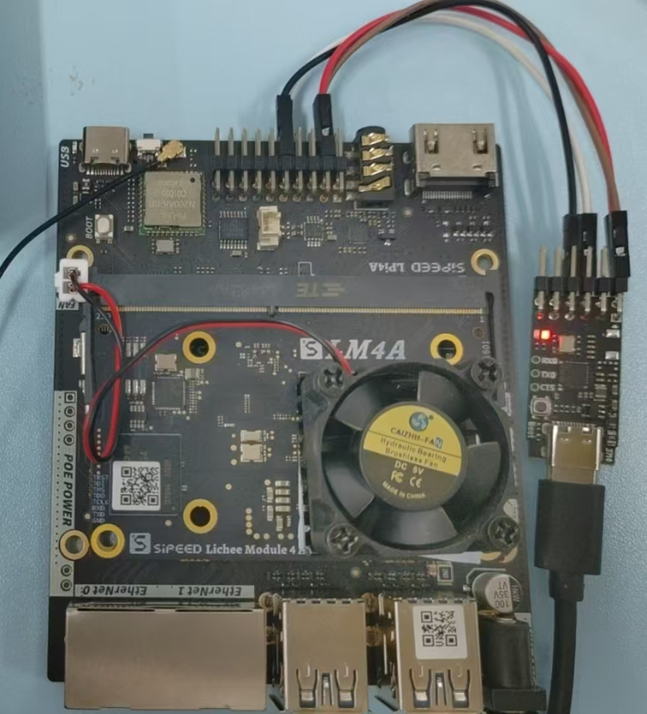
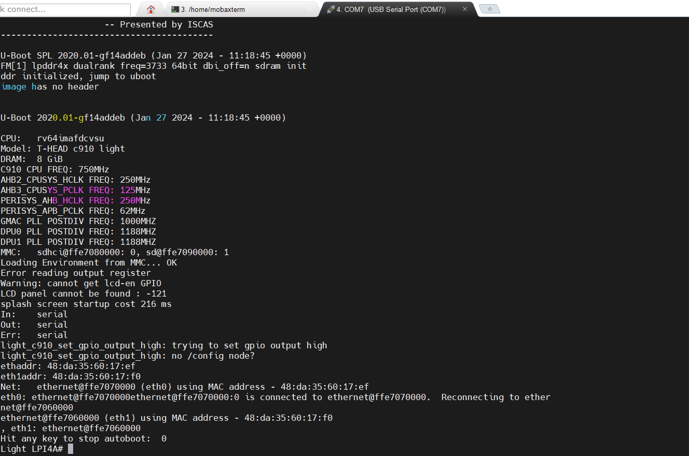

可以先按照之前的做法什么都不操作，**device-type** 存储在 master 中

### 确定源码中是否存在

```shell
feifei@localhost:~$ docker ps -a
CONTAINER ID   IMAGE               COMMAND                  CREATED      STATUS          PORTS
                                                                  NAMES
314838a8259e   local-lab-slave-1   "/root/entrypoint.sh…"   7 days ago   Up 37 minutes   0.0.0.0:80->80/tcp, :::80->80/tcp, 127.0.0.1:69->69/udp, 0.0.0.0:61950-62000->61950-62000/tcp, :::61950-62000->61950-62000/tcp   local-lab-slave-1-1
53eeb4fc811e   local-master        "/root/entrypoint.sh…"   7 days ago   Up 16 hours     3079/tcp, 5500/tcp, 5555-5556/tcp, 8000-8001/tcp, 0.0.0.0:8000->80/tcp                                                           local-master-1
```

然后进入 master 也就是 CONTAINER ID 为 **53eeb4fc811e** 的机器

```shell
feifei@localhost:~$ docker exec -it 53eeb4fc811e /bin/bash
root@master:/#
```

可以到 https://github.com/Linaro/lava/tree/master/etc/dispatcher-config/device-types 查看

如果你嫌麻烦，我在这里列出

```shell
root@master:/# ls usr/share/lava-server/device-types/
aaeon-UPN-EHLX4RE-A10-0864.jinja2
acer-R721T-grunt.jinja2
acer-cb317-1h-c3z6-dedede.jinja2
acer-cbv514-1h-34uz-brya.jinja2
acer-chromebox-cxi4-puff.jinja2
acer-chromebox-cxi5-brask.jinja2
acer-cp514-2h-1130g7-volteer.jinja2
acer-cp514-2h-1160g7-volteer.jinja2
acer-cp514-3wh-r0qs-guybrush.jinja2
acer-n20q11-r856ltn-p1s2-nissa.jinja2
adb-nuc.jinja2
alpine-db.jinja2
am335x-sancloud-bbe.jinja2
am437x-idk-evm.jinja2
am57xx-beagle-x15.jinja2
am6.jinja2
apq8016-sbc-uboot.jinja2
ar9331-dpt-module.jinja2
arduino-nano-33-ble.jinja2
arduino101.jinja2
armada-370-db.jinja2
armada-370-rd.jinja2
armada-3720-db.jinja2
armada-3720-espressobin.jinja2
armada-375-db.jinja2
armada-385-db-ap.jinja2
armada-388-clearfog-pro.jinja2
armada-388-clearfog.jinja2
armada-388-gp.jinja2
armada-398-db.jinja2
armada-7040-db.jinja2
armada-8040-db.jinja2
armada-xp-db.jinja2
armada-xp-gp.jinja2
armada-xp-linksys-mamba.jinja2
armada-xp-openblocks-ax3-4.jinja2
arndale.jinja2
asus-C433TA-AJ0005-rammus.jinja2
asus-C436FA-Flip-hatch.jinja2
asus-C523NA-A20057-coral.jinja2
asus-CM1400CXA-dalboz.jinja2
asus-cx9400-volteer.jinja2
at91-sama5d2_xplained.jinja2
at91-sama5d4_xplained.jinja2
at91rm9200ek.jinja2
at91sam9261ek.jinja2
at91sam9g20ek.jinja2
at91sam9m10g45ek.jinja2
at91sam9x25ek.jinja2
at91sam9x35ek.jinja2
ava.jinja2
avenger96.jinja2
avh.jinja2
b-u585i-iot02a.jinja2
b2120h410.jinja2
b2260.jinja2
base-barebox.jinja2
base-depthcharge.jinja2
base-edk2.jinja2
base-fastboot.jinja2
base-grub.jinja2
base-uboot.jinja2
base.jinja2
bcm2711-rpi-4-b.jinja2
bcm2835-rpi-b-rev2.jinja2
bcm2836-rpi-2-b.jinja2
bcm2837-rpi-3-b-32.jinja2
bcm2837-rpi-3-b.jinja2
beagle-xm.jinja2
beaglebone-black-barebox.jinja2
beaglebone-black.jinja2
cc13x2-launchpad.jinja2
cc3220SF.jinja2
cubietruck.jinja2
cy8ckit-064s0s2-4343w.jinja2
d02.jinja2
d03.jinja2
d2500cc.jinja2
da850-lcdk.jinja2
de0-nano-soc.jinja2
dell-latitude-3445-7520c-skyrim.jinja2
dell-latitude-5300-8145U-arcada.jinja2
dell-latitude-5400-4305U-sarien.jinja2
dell-latitude-5400-8665U-sarien.jinja2
disco-l475-iot1.jinja2
docker.jinja2
dove-cubox.jinja2
dra7-evm.jinja2
dragonboard-410c.jinja2
dragonboard-820c.jinja2
dragonboard-845c.jinja2
e850-96.jinja2
exynos4-5-common.jinja2
exynos5420-common.jinja2
frdm-k64f.jinja2
frdm-kw41z.jinja2
fsl-ls-common.jinja2
fsl-ls1012a-rdb.jinja2
fsl-ls1028a-rdb.jinja2
fsl-ls1043a-rdb.jinja2
fsl-ls1046a-frwy.jinja2
fsl-ls1046a-rdb.jinja2
fsl-ls1088a-rdb.jinja2
fsl-ls2088a-rdb.jinja2
fsl-lx2160a-rdb.jinja2
fsl-lx2162a-qds.jinja2
fsl-s32v234sbc.jinja2
fvp.jinja2
gemini-ssi1328.jinja2
hi6220-hikey-bl.jinja2
hi6220-hikey-r2.jinja2
hi6220-hikey.jinja2
hi960-hikey.jinja2
hifive-unleashed-a00.jinja2
hifive-unmatched-a00.jinja2
highbank.jinja2
hip07-d05.jinja2
hp-11A-G6-EE-grunt.jinja2
hp-14-db0003na-grunt.jinja2
hp-14b-na0052xx-zork.jinja2
hp-x360-12b-ca0010nr-n4020-octopus.jinja2
hp-x360-12b-ca0500na-n4000-octopus.jinja2
hp-x360-14-G1-sona.jinja2
hp-x360-14a-cb0001xx-zork.jinja2
hsdk.jinja2
i945gsex-qs.jinja2
ifc6410.jinja2
imx23-olinuxino.jinja2
imx27-phytec-phycard-s-rdk.jinja2
imx28-duckbill.jinja2
imx53-qsrb.jinja2
imx6dl-riotboard.jinja2
imx6dl-sabreauto.jinja2
imx6dl-sabresd.jinja2
imx6dl-udoo.jinja2
imx6q-nitrogen6x.jinja2
imx6q-sabreauto.jinja2
imx6q-sabrelite.jinja2
imx6q-sabresd.jinja2
imx6q-udoo.jinja2
imx6q-var-dt6customboard.jinja2
imx6qdl-common.jinja2
imx6qp-sabreauto.jinja2
imx6qp-sabresd.jinja2
imx6qp-wandboard-revd1.jinja2
imx6sl-evk.jinja2
imx6sll-evk.jinja2
imx6sx-sdb.jinja2
imx6ul-14x14-evk.jinja2
imx6ul-pico-hobbit.jinja2
imx6ull-14x14-evk.jinja2
imx6ull-evk.jinja2
imx6ulz-14x14-evk.jinja2
imx6ulz-lite-evk.jinja2
imx6us7d-common.jinja2
imx7d-sdb.jinja2
imx7s-warp.jinja2
imx7u-common.jinja2
imx7ulp-evk.jinja2
imx8dx-mek.jinja2
imx8dxl-ddr3l-evk.jinja2
imx8dxl-evk.jinja2
imx8dxl-phantom-mek.jinja2
imx8m-common.jinja2
imx8mm-ddr4-evk.jinja2
imx8mm-evk.jinja2
imx8mm-innocomm-wb15-evk.jinja2
imx8mn-ddr3l-ab2.jinja2
imx8mn-ddr3l-evk.jinja2
imx8mn-ddr4-evk.jinja2
imx8mn-evk.jinja2
imx8mp-ab2.jinja2
imx8mp-ddr4-evk.jinja2
imx8mp-evk.jinja2
imx8mp-verdin-nonwifi-dahlia.jinja2
imx8mq-evk.jinja2
imx8mq-wevk.jinja2
imx8mq-zii-ultra-zest.jinja2
imx8q-common.jinja2
imx8qm-mek.jinja2
imx8qxp-mek.jinja2
imx8u-common.jinja2
imx8ulp-9x9-evk.jinja2
imx8ulp-evk.jinja2
imx9-common.jinja2
imx91-11x11-evk.jinja2
imx91p-11x11-evk.jinja2
imx91p-9x9-qsb.jinja2
imx93-11x11-evk-pmic-pf0900.jinja2
imx93-11x11-evk.jinja2
imx93-14x14-evk.jinja2
imx93-9x9-qsb.jinja2
imx95-19x19-evk.jinja2
intel-ixp42x-welltech-epbx100.jinja2
jetson-tk1.jinja2
jh7100-beaglev-starlight.jinja2
jh7100-starfive-visionfive-v1.jinja2
jh7100-visionfive.jinja2
juno-uboot.jinja2
juno-uefi.jinja2
juno.jinja2
k3-am625-sk.jinja2
kirkwood-db-88f6282.jinja2
kirkwood-openblocks_a7.jinja2
kontron-bl-imx8mm.jinja2
kontron-kbox-a-230-ls.jinja2
kontron-kswitch-d10-mmt-6g-2gs.jinja2
kontron-kswitch-d10-mmt-8g.jinja2
kontron-kswitch-d10-mmt-common.jinja2
kontron-pitx-imx8m.jinja2
kontron-sl28-common.jinja2
kontron-sl28-var3-ads2.jinja2
kv260.jinja2
kvm.jinja2
lava-slave-docker.jinja2
lenovo-TPad-C13-Yoga-zork.jinja2
lenovo-hr330a-7x33cto1ww-emag.jinja2
lpcxpresso55s69.jinja2
ls1021a-twr.jinja2
lxc.jinja2
mediatek-8173.jinja2
meson-axg-s400.jinja2
meson-g12-common.jinja2
meson-g12a-sei510.jinja2
meson-g12a-u200.jinja2
meson-g12a-x96-max.jinja2
meson-g12b-a311d-khadas-vim3.jinja2
meson-g12b-a311d-libretech-cc.jinja2
meson-g12b-odroid-n2.jinja2
meson-gx-common.jinja2
meson-gxbb-nanopi-k2.jinja2
meson-gxbb-p200.jinja2
meson-gxl-s805x-libretech-ac.jinja2
meson-gxl-s805x-p241.jinja2
meson-gxl-s905d-p230.jinja2
meson-gxl-s905x-khadas-vim.jinja2
meson-gxl-s905x-libretech-cc.jinja2
meson-gxl-s905x-p212.jinja2
meson-gxm-khadas-vim2.jinja2
meson-gxm-q200.jinja2
meson-sm1-khadas-vim3l.jinja2
meson-sm1-odroid-c4.jinja2
meson-sm1-s905d3-libretech-cc.jinja2
meson-sm1-sei610.jinja2
meson8b-ec100.jinja2
meson8b-odroidc1.jinja2
mimxrt1050_evk.jinja2
minnowboard-common.jinja2
minnowboard-max-E3825.jinja2
minnowboard-turbot-E3826.jinja2
moonshot-m400.jinja2
morello.jinja2
mps.jinja2
mt8173-elm-hana.jinja2
mt8183-kukui-jacuzzi-juniper-sku16.jinja2
mt8186-corsola-steelix-sku131072.jinja2
mt8192-asurada-rev1.jinja2
mt8192-asurada-spherion-r0.jinja2
mt8195-cherry-tomato-r2.jinja2
mt8195-cherry-tomato-r3.jinja2
musca-a.jinja2
musca-b.jinja2
musca-s.jinja2
musca.jinja2
mustang-grub-efi.jinja2
mustang-uefi.jinja2
mustang.jinja2
n1sdp.jinja2
nexus10.jinja2
nexus4.jinja2
nexus5x.jinja2
nexus9.jinja2
nrf52-nitrogen.jinja2
nucleo-l476rg.jinja2
nxp-ls2088.jinja2
odroid-n2.jinja2
odroid-x2.jinja2
odroid-xu3.jinja2
orion5x-rd88f5182-nas.jinja2
overdrive.jinja2
ox820-cloudengines-pogoplug-series-3.jinja2
panda.jinja2
pc-k10n78.jinja2
peach-pi.jinja2
pixel.jinja2
poplar.jinja2
qcom-qdf2400.jinja2
qcs404-evb-1k.jinja2
qcs404-evb-4k.jinja2
qemu-aarch64.jinja2
qemu.jinja2
qrb4210-rb2.jinja2
qrb5165-rb5.jinja2
r8a7742-iwg21d-q7.jinja2
r8a7743-iwg20d-q7.jinja2
r8a7744-iwg20d-q7.jinja2
r8a7745-iwg22d-sodimm.jinja2
r8a77470-iwg23s-sbc.jinja2
r8a774a1-hihope-rzg2m-ex.jinja2
r8a774b1-hihope-rzg2n-ex.jinja2
r8a774c0-ek874.jinja2
r8a774e1-hihope-rzg2h-ex.jinja2
r8a7791-porter.jinja2
r8a7795-h3ulcb-kf.jinja2
r8a7795-salvator-x.jinja2
r8a77950-ulcb.jinja2
r8a7796-m3ulcb-kf.jinja2
r8a7796-m3ulcb.jinja2
r8a779m1-ulcb.jinja2
rcar-gen3-common.jinja2
rk3288-miqi.jinja2
rk3288-rock2-square.jinja2
rk3288-veyron-jaq.jinja2
rk3328-rock64.jinja2
rk3399-gru-kevin.jinja2
rk3399-khadas-edge-v.jinja2
rk3399-puma-haikou.jinja2
rk3399-roc-pc.jinja2
rk3399-rock-pi-4b.jinja2
rk3588-rock-5b.jinja2
rpi-common.jinja2
rzg1-common.jinja2
rzg2-common.jinja2
rzn1d.jinja2
s32v234-evb.jinja2
sama53d.jinja2
sama5d34ek.jinja2
sama5d36ek.jinja2
sc7180-trogdor-kingoftown.jinja2
sc7180-trogdor-lazor-limozeen.jinja2
sdm845-mtp.jinja2
seco-b68.jinja2
seco-c61.jinja2
sharkl2.jinja2
sm8150-mtp.jinja2
sm8250-mtp.jinja2
sm8350-hdk.jinja2
sm8350-mtp.jinja2
sm8550-hdk.jinja2
snow.jinja2
soca9.jinja2
socfpga-cyclone5-socrates.jinja2
ssh.jinja2
stm32-carbon.jinja2
stm32l562e-dk.jinja2
stm32mp157a-dhcor-avenger96.jinja2
stm32mp157c-dk2.jinja2
stm32mp157c-lxa-mc1.jinja2
stm32mp157c-lxa-tac-gen1.jinja2
stm32mp15x-eval.jinja2
sun4i-a10-olinuxino-lime.jinja2
sun50i-a64-bananapi-m64.jinja2
sun50i-a64-pine64-plus.jinja2
sun50i-h5-libretech-all-h3-cc.jinja2
sun50i-h5-nanopi-neo-plus2.jinja2
sun50i-h6-orangepi-3.jinja2
sun50i-h6-orangepi-one-plus.jinja2
sun50i-h6-pine-h64-model-b.jinja2
sun50i-h6-pine-h64.jinja2
sun5i-a13-olinuxino-micro.jinja2
sun5i-gr8-chip-pro.jinja2
sun5i-r8-chip.jinja2
sun6i-a31-app4-evb1.jinja2
sun7i-a20-cubieboard2.jinja2
sun7i-a20-olinuxino-lime2.jinja2
sun7i-a20-olinuxino-micro.jinja2
sun8i-a23-evb.jinja2
sun8i-a33-olinuxino.jinja2
sun8i-a33-sinlinx-sina33.jinja2
sun8i-a83t-allwinner-h8homlet-v2.jinja2
sun8i-a83t-bananapi-m3.jinja2
sun8i-h2-plus-bananapi-m2-zero.jinja2
sun8i-h2-plus-libretech-all-h3-cc.jinja2
sun8i-h2-plus-orangepi-r1.jinja2
sun8i-h2-plus-orangepi-zero.jinja2
sun8i-h3-bananapi-m2-plus.jinja2
sun8i-h3-libretech-all-h3-cc.jinja2
sun8i-h3-orangepi-pc.jinja2
sun8i-r40-bananapi-m2-ultra.jinja2
sun9i-a80-cubieboard4.jinja2
sunxi-common.jinja2
synquacer-acpi.jinja2
synquacer-dtb.jinja2
synquacer-uboot.jinja2
synquacer.jinja2
tc2.jinja2
tegra124-common.jinja2
tegra124-nyan-big.jinja2
thunderx.jinja2
upsquare.jinja2
vexpress.jinja2
x15-bl.jinja2
x15.jinja2
x86-atom330.jinja2
x86-celeron.jinja2
x86-pentium4.jinja2
x86-x5-z8350.jinja2
x86.jinja2
xilinx-zcu102.jinja2
root@master:/#
```

如果这里也没有你想要的 device-type 别急 可以查看 [Adding new device types — LAVA 2024.05 documentation (linaro.org)](https://validation.linaro.org/static/docs/v2/device-integration.html) 里面提供了

### 在其他地方获取，如 gitlab 或正在运行的 lavalab

-----

**Find a similar existing device type**

There are a number of places to check for similar types of device which are already supported in LAVA V2.

1. https://master.lavasoftware.org/scheduler/                                        失效
2. https://staging.validation.linaro.org/scheduler/
3. https://validation.linaro.org/scheduler/
4. https://lng.validation.linaro.org/scheduler/                                          失效
5. https://gitlab.com/lava/lava/tree/master/lava_scheduler_app/tests/device-types                     可能是转移到其他目录了 我没找到

Check for:

- similar bootloader
- similar deployment type
- similar deployment or boot process
- similar sequence of boot steps

-----

如果都没有的话，很遗憾可能你需要自己编写了

比如我手上的 Licheepi4a

进入正题吧

## 从零编写 device-type

**并不严谨的教学**

这里给出 我编写的 Licheepi4a 

```jinja2







      










"tftpboot {KERNEL_ADDR} {KERNEL}",
"tftpboot {RAMDISK_ADDR} {RAMDISK}",
"tftpboot {DTB_ADDR} {DTB}"
```

这是一个 Jinja2 模板，用于生成与 U-Boot 相关的配置文件，特别是为 RISC-V 架构设计的。以下是各部分的详细解释：

### 模板结构

1. **扩展基模板**：
   ```jinja
   
   ```
   - 该行表示当前模板从 `base-uboot.jinja2` 继承,根据你当前的开发板以及操作系统要求定，我这里是 uboot

2. **设置变量**：
   ```jinja
   
   
   
   ```
   - `uboot_mkimage_arch`：设置 U-Boot 构建的架构为 `riscv`。
   - `console_device`：设置控制台设备，默认为 `ttyS0`，如果未传递其他值。
   - `baud_rate`：设置波特率，默认为 `115200`。

3. **设置内存地址**：

   ```jinja
     
         
     
   ```

   - `booti_kernel_addr`：内核的加载地址。
   - `booti_dtb_addr`：设备树 Blob (DTB) 的加载地址。
   - `booti_ramdisk_addr`：初始 RAM 磁盘的加载地址。

   该如何获取内核加载地址呢，一是可以阅读开发板的官方文档，很遗憾，我在 Licheepi4a 的官方文档 [Lichee Pi 4A - Sipeed Wiki](https://wiki.sipeed.com/hardware/zh/lichee/th1520/lp4a.html) 翻找了很久没找到，但不代表一定没提供

   所以我采用先将 openEuler 24.03 LTS 安装到 licheepi4a 上, 在 boot 进行过程中查看

   那么首先要做的就是将 24.03 烧录进入 icheepi4a ，可以查看 openEuler 的官方文档 [RISC-V-LicheePi4A (openeuler.org)](https://docs.openeuler.org/zh/docs/24.03_LTS/docs/Installation/RISC-V-LicheePi4A.html) 下载地址在这里 [openEuler下载 | openEuler ISO镜像 | openEuler社区官网](https://www.openeuler.org/zh/download/?version=openEuler 24.03 LTS)

   

   ps : 1.实际上不需要网线 2.注意要区分与 licheepi4a 官方的镜像烧录方式，虽然那个是烧录 debian 的，但是和 openeuler的方式略有不同

   

   烧录完成就可以进行串口连接了，不知道可不可以直接用 type -c 接口进行串口连接，在网络上没检索到相关的信息，这里使用的是

   官方的 plus调试器

   [Sipeed LicheePi 4A Risc-V TH1520 Linux SBC 开发板 荔枝派-淘宝网 (taobao.com)](https://item.taobao.com/item.htm?id=715508771884&sku_properties=-3%3A-3)  ps：非广告

   

   然后将 plus调试器连接到主机上

   这里会引入一个问题就是 WSL 2 需要和 windows 共享 usb 接口，下文再说

   串口连接 我在 windows 上使用的是 **MobaXterm** ,只是使用的话可以参考 [嵌入式工程师都在用的全能终端神器—MobaXterm - 知乎 (zhihu.com)](https://zhuanlan.zhihu.com/p/452450152)

   按下 RST 重启机器 在引导阶段 在 MobaXterm 串口终端中按下任意键 我按的空格，你应该按什么都行 。

   

   此时输入 h 可以看到一些帮助

   我们这里输入 printenv

   ```shell
   Light LPI4A# printenv
   aon_ram_addr=0xffffef8000
   arch=riscv
   audio_ram_addr=0x32000000
   baudrate=115200
   board=light-c910
   board#=LP
   board_name=light-c910
   boot_conf_addr_r=0xc0000000
   boot_conf_file=/extlinux/extlinux.conf
   bootcmd=run bootcmd_load; bootslave; sysboot mmc ${mmcdev}:${mmcbootpart} any $boot_conf_addr_r $boot_conf_file;
   bootcmd_load=run findpart;run load_aon;run load_c906_audio; load mmc ${mmcdev}:${mmcbootpart} $opensbi_addr fw_dynamic.bin
   bootdelay=2
   cpu=c9xx
   dtb_addr=0x03800000
   eth1addr=48:da:35:60:17:f0
   ethaddr=48:da:35:60:17:ef
   fdt_addr_r=0x03800000
   fdt_high=0xffffffffffffffff
   fdtcontroladdr=ffba7840
   fdtfile=thead/th1520-lichee-pi-4a.dtb
   finduuid=part uuid mmc ${mmcdev}:${mmcpart} uuid
   fwaddr=0x10000000
   gpt_partition=gpt write mmc ${mmcdev} $partitions
   kdump_buf=180M
   kernel_addr_r=0x00200000
   load_aon=load mmc ${mmcdev}:${mmcbootpart} $fwaddr light_aon_fpga.bin;cp.b $fwaddr $aon_ram_addr $filesize
   load_c906_audio=load mmc ${mmcdev}:${mmcbootpart} $fwaddr light_c906_audio.bin;cp.b $fwaddr $audio_ram_addr $filesize
   mmcbootpart=2
   mmcdev=0
   opensbi_addr=0x0
   partitions=name=table,size=2031KB;name=boot,size=500MiB,type=boot;name=root,size=-,type=linux,uuid=${uuid_rootfsA}
   pxefile_addr_r=0x00600000
   ramdisk_addr_r=0x06000000
   scriptaddr=0x00500000
   splashimage=0x30000000
   splashpos=m,m
   str_ram_addr=0xffe0000000
   uuid_rootfsA=80a5a8e9-c744-491a-93c1-4f4194fd690a
   vendor=thead
   
   Environment size: 1375/131068 bytes
   ```

   就可以获取你要的信息啦

4. **设置高地址限制**：

   ```jinja
   
   
   ```

   - `uboot_initrd_high` 和 `uboot_fdt_high`：设置初始 RAM 磁盘和设备树的高地址限制为最大值，表示允许使用的最高地址。

5. **设置 lava 输入字符的间隔**：

   ```jinja2
   
   ```

   - `boot_character_delay`：设置 lava 输入字符的时间，主要是为了模拟人类键盘输入，电脑输入过快可能会造成字符倒置等情况

6. **设置 shudown 提示词**：

   ```jinja2
   
   ```

   - `shutdown_message`：设置成你的机器的提示词 默认是  ‘ The system is going down for reboot NOW’，lpi4a 不太一致，

     实际上 lpi4a reboot时 甚至都不输出类似信息。

7. **设置引导提示词**：

   ```jinja2
   
   ```

   - `bootloader_prompt`：lpi4a 是 'Light LPI4A#‘ ，跟随你的被测试硬件

**TFTP 命令**

```jinja
"tftpboot {KERNEL_ADDR} {KERNEL}",
"tftpboot {RAMDISK_ADDR} {RAMDISK}",
"tftpboot {DTB_ADDR} {DTB}"
```
- 这些行定义了使用 TFTP 协议从服务器加载内核、RAM 磁盘和设备树的命令：
  - `tftpboot {KERNEL_ADDR} {KERNEL}`：从 TFTP 服务器下载内核到指定的加载地址。
  - `tftpboot {RAMDISK_ADDR} {RAMDISK}`：下载初始 RAM 磁盘映像。
  - `tftpboot {DTB_ADDR} {DTB}`：下载设备树 Blob。

然后就是

## 配置 **board.yaml**

也就是这里

```yaml
boards:
  - name: qemu-test
    type: qemu
    slave: lab-slave-1
  - name: Lpi4A
    type: LicheePi4A_4
    slave: lab-slave-1
    connection_command: telnet 192.168.137.1 20000 #这里应该修改为当前的ip
    pdu_generic:    ////远程控制电源的命令
    
      #(echo "OFF"; sleep 1; echo "ON") | telnet 192.168.1.100 20001 使用串口
      #(echo "ON") | telnet 192.168.1.100 20001
      #(echo "OFF") | telnet 192.168.1.100 20001
	mosquitto_pub -h 192.168.0.158 -t "device/power" -m "RESET"
	mosquitto_pub -h 192.168.0.158 -t "device/power" -m "ON"
	mosquitto_pub -h 192.168.0.158 -t "device/power" -m "OFF"
    uart:
      idvendor: 0x0403
      idproduct: 0x6010
      devpath: "1"
```


ps: 测试时 我发现我的连接不上了，排查一大圈 发现是因为 WSL 2 默认情况下 ip 会随着 机器开关机而改变 导致 telnet 设置出现了问题

既然说到 telnet 那么就顺便讲下如何配置

## 配置串口

实际上你用什么串口工具连接设备都行 , 这里写下我的做法

### 1.安装NFS server

```shell
sudo apt install nfs-kernel-server
vim /etc/exports    //配置NFS共享目录
/var/lib/lava/dispatcher/tmp *(rw,no_root_squash,no_all_squash,async,no_subtree_check)
sudo service nfs-kernel-server restart   //配置完成后重启NFS server
```

### 2 安装ser2net

安装 ser2net 为了部署主机通过 telnet 可以连接到测试设备

```shell
sudo apt install ser2net
sudo vim /etc/ser2net.yaml     //配置串口信息
```

```shell
# Find detailed documentation in ser2net.yaml(5)
# A fully featured configuration file is in
# /usr/share/doc/ser2net/examples/ser2net.yaml.gz
#
# If you find your configuration more useful than this very simple
# one, please submit it as a bugreport

define: &banner \r\nser2net port \p device \d [\B] (Debian GNU/Linux)\r\n\r\n

connection: &con0827
    accepter: tcp,20000
    enable: on
    options:
      banner: *banner
      kickolduser: true
      telnet-brk-on-sync: true
    connector: serialdev,
              /dev/ttyUSB1,
              115200n81,local
connection: &con0828
    accepter: tcp,20001
    enable: on
    options:
      banner: *banner
      kickolduser: true
      telnet-brk-on-sync: true
    connector: serialdev,
              /dev/ttyUSB2,
              9600n81,local
```

```shell
sudo service ser2net restart     //重启ser2net service
```

此时就可以用 

```shell
telnet 192.168.137.1 20000 或 telnet localhost 20000 等方式 访问/dev/ttyUSB1 即 licheepi4a
```

如果你和我一样使用的是  2 这里就需要共享 windows 的 usb 接口，我的做法是这样

使用 USBIPD-WIN ，可以参考 微软的官方档案 [连接 USB 设备 | Microsoft Learn  ](https://learn.microsoft.com/zh-cn/windows//connect-usb) 这里就不在赘述了

既然谈到这里了就顺便解决下开发板的网络问题吧

如果你有路由器当然可以直接连接到到板子上 ，如果你像我一样**寒酸**，只有一台主机和无线网络的话 可以参考 [开发板上网（保姆级教程）_开发板联网-CSDN博客](https://blog.csdn.net/weixin_56862703/article/details/132412188) ，来配置网关使用，让板子使用主机的网络。

## 编写 job

解决了 device-type 的问题还需要解决 job 的问题，最重要的便是如何获取适合 licheepi4a 的 roofts 文件。以及dtb文件

这里给出一个 licheepi4a smoke-test 定义

```yaml
device_type: LicheePi4A_4
job_name: licheepi-smoke-test
context:
  boot_character_delay: 1000
  extra_nfsroot_args: ",nolock,nfsvers=3"
timeouts:
  job:
    minutes: 301
  action:
   minutes: 300
  actions:
    power-off:
      seconds: 30
priority: medium
visibility: public
metadata:
  # please change these fields when modifying this job for your own tests.
# ACTION_BLOCK
actions:
- deploy:
    timeout:
      minutes: 20
    to: tftp
    kernel:
      url: file:///home/2024ospp-large-files/Image
      type: image
    dtb:
      url: file:///home/2024ospp-large-files/licheepi4a/thead/th1520-lichee-pi-4a.dtb
    nfsrootfs:
      url: file:///home/2024ospp-large-files/openeuler-rootfs.tar.gz
      compression: gz
- boot:
    timeout:
      minutes: 3
    method: qemu
    media: tmpfs
    prompts: ["root@openeuler-riscv64"]
    auto_login:
      login_prompt: "localhost login:"
      username: root
      password_prompt: "Password:"
      password: openEuler12#$
      # TEST_BLOCK
- test:
    timeout:
      minutes: 10
    definitions:
    - repository: https://git.linaro.org/lava-team/lava-functional-tests.git
      from: git
      path: lava-test-shell/smoke-tests-basic.yaml
      name: smoke-tests
```

参考 [lava-docker细节解释 ](./lava-docker细节解释.md) 中 如何编写 ACTION_BLOCK

[NJU Mirror](https://mirrors.nju.edu.cn/openeuler/openEuler-24.03-LTS/embedded_img/riscv64/lpi4a/) 是 openEuler 提供的 Licheepi4a 资源仓库 ，其他镜像仓库也类似

这里的重点在于，嵌入式设备并没有 qemu 所谓的 启动脚本 也没有 image 等资源 需要我们自己构建

### 获取 Image 和 dtbs

构建的方法

```shell
git clone https://gitee.com/feifei-fertilizer/riscv-kernel.git
cd riscv-kerner.git
git checkout OLK-6.6
```

由于我们只需要 Image 和 dtbs文件

```shell
make ARCH=riscv CROSS_COMPILE=riscv64-linux-gnu-  openeuler_defconfig
make ARCH=riscv CROSS_COMPILE=riscv64-linux-gnu- -j1 Image dtbs WERROR=n
```

tips：这里不需要使用 arch/riscv/configs 下的 th1520_defconfig 根据 riscv-kernel 的提交记录 ，已经和 defconfig 合并 ，这里直接使用 openeuler_deconfig 即可，这里 使用 -j1 是为了方便排查错误。

```shell
feifei@localhost:~/oerv24.03-LTS$ ls ~/riscv-kernel/arch/riscv/configs/
32-bit.config  defconfig             nommu_k210_sdcard_defconfig  openeuler_defconfig  sg2042_defconfig
64-bit.config  nommu_k210_defconfig  nommu_virt_defconfig         rv32_defconfig       th1520_defconfig
```

完成之后便会在 output 中获得构建的内容

这里我想提一下 可能是我自己环境的问题，构建我花了很长时间，也用了很多工具链，首先是在 ubuntu 22.03 上，直接使用官方仓库下载的 riscv64-linux-gnu-gcc 应该是 gcc 11,出现了一些问题 之后 我又安装了比较新的版本 也试过源码，无果。最后是在 manjaro 上才构建成功的 ，所以我这里提供我的信息 ，如果构建不成功 也许可以参考

```shell
riscv64-linux-gnu-gcc --version                   
riscv64-linux-gnu-gcc (GCC) 14.1.0
Copyright (C) 2024 Free Software Foundation, Inc.
This is free software; see the source for copying conditions.  There is NO
warranty; not even for MERCHANTABILITY or FITNESS FOR A PARTICULAR PURPOSE.
```

### 获取 roofts

roofts 文件，可以在 [Nginx Directory (iscas.ac.cn)](https://mirror.iscas.ac.cn/openeuler-sig-riscv/openEuler-RISC-V/testing/2403LTS-test/v1/) 获取，也可以自己手动构建

由于 默认的 reboot 适配有问题 https://lists.lavasoftware.org/archives/list/lava-users@lists.lavasoftware.org/thread/CH3U475AGESVN4LYBUA4YVRFUTHOZ2LD/

## 修改 docker-compose.yml

你需要先了解 docker-compose 中的内容如何生成 ， [lava-docker细节解释](./lava-docker细节解释.md) 里有简单的描述

看下我的

```yml
services:
  lab-slave-1:
    build:
      context: lab-slave-1
    dns_search: ''
    device:
      - /dev/Lpi4A:/dev/Lpi4A #默认是这样的
    environment:
      LAVA_DISPATCHER_IP: 192.168.0.158
      LAVA_MASTER: master
    hostname: lab-slave-1
    ports:
    - 192.168.0.158:69:69/udp
    - 61950-62000:61950-62000
    - 80:80
    volumes:
    - /home/feifei/ospp/2024ospp-large-files/ubuntu/boot:/boot
    - /home/feifei/ospp/2024ospp-large-files/ubuntu/modules:/lib/modules
    - /home/feifei/ospp/2024ospp-large-files:/home/2024ospp-large-files
    - /var/lib/lava/dispatcher/tmp:/var/lib/lava/dispatcher/tmp
  master:
    build:
      context: master
    hostname: master
    ports:
    - 0.0.0.0:8000:80
    volumes:
    - /home/feifei/ospp/2024ospp-large-files/ubuntu/boot:/boot
    - /home/feifei/ospp/2024ospp-large-files/ubuntu/modules:/lib/modules
    - /home/feifei/ospp/2024ospp/device-type/Lpi4A.jinja2:/usr/share/lava-server/device-types/Lpi4A.jinja2
    - /home/feifei/ospp/2024ospp/device-type/LicheePi4A_4.jinja2:/usr/share/lava-server/device-types/LicheePi4A_4.jinja2
version: '2.4'

```

`dev/Lpi4A:/dev/Lpi4A` 应修改为 `/dev/ttyUSB1:/dev/Lpi4A` 其中  `ttyUSB1` 指的是串口连接的设备号
