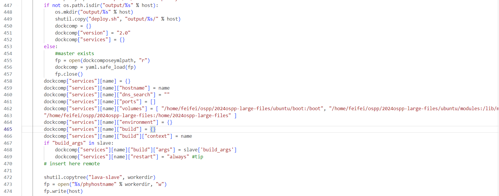

## job 模板

这里有几点建议

一，要查看官方文档，从那里可以了解到一些 job 如何编写

二，查看源码，这里包括 device-type 的源码，要查看你想编写的 板子的 device-type 以及 它是由哪些扩展来的， 大部分都是 uboot ，而 uboot 又是由 base 扩展而来。可以通过了解这些来查看你的 job 可以填写那些参数

三，可以直接去查看他人已有的 job ，很多启动命令是不常用，甚至连官网的文档都没提到的，比如 soft_reboot

四，尝试直接运行你的 job ，lava 会给出一些提示 （不符合语法的话，是过不了 lava 的检测的 ），可以按照提示来 我认为比较重要的部分是从 提供 Image 根文件系统等资源，到 boot 启动这个部分， 在之前的章节也有过介绍。你可以观察 lava 的运作方式 ( lava 运行会输出较为完整的 log ) ，来按需修改你的 job 。最后达成你的目的

-----

官网建议大家从 qemu 入手,这里给出官网的最基础的 job 模板 以及一些字段的解释

```yaml
# Your first LAVA JOB definition for an x86_64 QEMU
device_type: qemu
#一个标签，必须与要向其提交此作业的实例上声明的设备类型匹配。每种设备类型都可以有一个或多个可用设备。在本例中为 qemu
job_name: QEMU pipeline, first job 
#此作业的自由文本名称。此名称在服务器端表中使用允许使用任何有效的 YAML 字符串，因此逗号、大写和空格都可以
timeouts:
  job:
    minutes: 15
  action:
    minutes: 5
  connection:
    minutes: 2
# 在 LAVA 测试作业中可能会出现一系列问题，因此测试编写者需要指示作业的某些部分应该花费多长时间
priority: medium
#支持 [0， 100] 中的任何整数。还提供三个快捷键：high（100）、medium（50）和low（0）。调度程序在对队列进行排序时会考虑作业优先级
visibility: public
#支持 public、personal 和 group 的值，控制允许查看作业和作业生成的结果的人员。这包括结果是否可用于查询和图表

# context allows specific values to be overridden or included
context:
  # tell the qemu template which architecture is being tested
  # the template uses that to ensure that qemu-system-x86_64 is executed.
  arch: amd64
#并非所有测试作业都会使用作业上下文，它可以覆盖某些服务器端设备配置模板。在这种情况下，arch： amd64 将模板设置为在启动仿真时使用 qemu-system-x86_64 可执行文件
metadata:
  # please change these fields when modifying this job for your own tests.
  docs-source: first-job
  docs-filename: qemu-pipeline-first-job.yaml
#一旦测试作业成为自动提交或 CI循环的一部分，就需要使用元数据来标识每个提交，提供有关与上次测试作业相比发生的确切变化的信息，以及有关其他用户如何修改测试作业构件以扩展或调试结果的信息
# ACTION_BLOCK
actions:
# DEPLOY_BLOCK
- deploy:
#下载启动设备所需的文件，并准备要在测试操作中运行的文件叠加层
    timeout:
      minutes: 5
    to: tmpfs
    images:
      rootfs:
        image_arg: -drive format=raw,file={rootfs}
        url: https://images.validation.linaro.org/kvm/standard/stretch-2.img.gz
        compression: gz
#deploy 支持本地和网络资源多种格式 也可以选择
# BOOT_BLOCK
- boot:
#指定启动设备的方法和提示符，这些提示将指示设备是否被视为已正确启动
    timeout:
      minutes: 2
    method: qemu
    media: tmpfs
    prompts: ["root@debian:"]
    auto_login:
      login_prompt: "login:"
      username: root

# TEST_BLOCK
- test:
    timeout:
      minutes: 5
    definitions:
    - repository: http://git.linaro.org/lava-team/lava-functional-tests.git
      from: git
      path: lava-test-shell/smoke-tests-basic.yaml
      name: smoke-tests
    - repository: https://git.linaro.org/lava-team/lava-functional-tests.git
      from: git
      path: lava-test-shell/single-node/singlenode03.yaml
      name: singlenode-advanced
```

deploy 可以用的文件有网络资源和本地资源

网络资源：输入其网络资源的 url 即可

本地资源，首先要将其映射到 lava slave 容器中，在 [lava-docker细节解释 ](./lava-docker细节解释.md) 中有提到过如何映射 （ 修改 lavalab-gen.py ）



第 462 行的内容则是 映射主机的文件到 docker 容器，这里我将主机的 `/home/feifei/ospp/2024ospp-large-files` 映射为容器的 `/home/2024ospp-large-files` 

所以 lava job 在编写时就要写容器内部的路径 如下面这样

```yaml
- deploy:
    timeout:
      minutes: 20
    to: tmpfs
    images:
      kernel:
        image_arg: -kernel {kernel}
        url: file:///home/2024ospp-large-files/Image
      rootfs:
        image_arg: -drive file={rootfs},format=raw,id=hd0
        url: file:///home/2024ospp-large-files/openeuler-rootfs.img
```

一些实际可能遇到的问题在 [lava-docker细节解释 ](./lava-docker细节解释.md) 和 [未提供的设备类型-自定义设备类型-Licheepi 4a](./未提供的设备类型-自定义设备类型-Lip4a.md) 中有涉及过一部分

deploy 和 boot 的 参数很多

boot 更详细内容可以查看 [Boot Action Reference — LAVA 2024.09 documentation (lavasoftware.org)](https://docs.lavasoftware.org/lava/actions-boot.html#index-13)

deploy 可以查看[部署操作参考 — LAVA 2024.09 文档 --- Deploy Action Reference — LAVA 2024.09 documentation (lavasoftware.org)](https://docs.lavasoftware.org/lava/actions-deploy.html#index-3)

### 可选与必选字段

#### 必选字段

1. **device_type**:
2. **job_name**:
3. **timeouts**:
4. **actions**:

5. **at least one action block**:

#### 可选字段

1. **priority**:
2. **visibility**:
3. **context**:
4. **metadata**:
5. **timeout** (在各个块中):

   - 可以选择在每个 `deploy`、`boot` 和 `test` 块中定义超时
6. **images** (在 `deploy` 块中):
- 测试已经配置好的设备时
7. **prompts** (在 `boot` 块中):
8. **auto_login** (在 `boot` 块中):
9. **definitions** (在 `test` 块中):

## 获取测试用例的两种方式

### 1.首先是自己编写

可以查看 [Glossary of terms — LAVA 2024.05 documentation (lavasoftware.org)](https://docs.lavasoftware.org/lava/glossary.html#term-job-definition)

```yaml
# TEST_BLOCK
- test:
    timeout:
      minutes: 600
    definitions:
    - repository:
        metadata:
          format: Lava-Test Test Definition 1.0
        run:
          steps:
            - yum install -y git make gcc flex bison clang
            - df -h
            - cd /root
            - git clone https://gitee.com/feifei-fertilizer/riscv-kernel.git
            - cd riscv-kerner.git
            - git checkout OLK-6.6
            - make defconfig
            - make -C tools/testing/selftests
            - make -C tools/testing/selftests TARGETS=clone3 run_tests
      from: inline                                       #表示在当前主机上
      name: kselftest-inline
      path: inline/kselftest.yaml                   
```

这是一个基于内核源码的 **kselftest**

from 字段写成 inline

然后填入一些描述 definitions， name 等

steps 字段 填入你需要的命令即可

这其实与你直接在机器上 敲命令没什么区别，重要的当然就是你要确保你自己在机器上可以跑通

可以注意下的是 name 与 path 字段最好相关 比如这里 name 和 path 都是 kselftest 

### 2.基于test-definitions

可以通过 clone [Linaro/test-definitions: Test definitions work with and without LAVA (github.com)](https://github.com/Linaro/test-definitions) 来直接使用其准备好的测试

根据描述官方文档描述 [test-definitions/docs/index.md 在 master ·Linaro/测试定义 (github.com)](https://github.com/Linaro/test-definitions/blob/master/docs/index.md)

这里给出 ltp.yaml的内容 https://github.com/Linaro/test-definitions/blob/master/automated/linux/ltp/ltp.yaml

```yaml
metadata:
    name: ltp
    format: "Lava-Test Test Definition 1.0"
    description: "Run LTP test suite on Ubuntu"
    maintainer:
        - milosz.wasilewski@linaro.org
        - fathi.boudra@linaro.org
    os:
        - ubuntu
    scope:
        - functional
    devices:
        - all
params:
    TST_CMDFILES: syscalls,mm,math,timers,fcntl-locktests,ipc,fsx,fs,hugetlb,io,nptl,pty,containers,fs_bind,filecaps,admin_tools,connectors

    # SKIPFILE can be a filename from dir ./automated/linux/ltp/, an http URL,
    # or a skipgen style yaml file.
    # Examples:
    #   SKIPFILE: "skipfile-lsk-juno" # is a known file present in
    #                                 # dir ./automated/linux/ltp/
    #   SKIPFILE: "http://people.linaro.org/~naresh.kamboju/skipfile"
    #   SKIPFILE: "skipfile-lkft.yaml" # yaml file that will be parsed with
    #                                  # skipgen. Must use "yaml" extention.
    # NOTE: busybox wget may not work with https link so prefer to use http
    SKIPFILE: ""

    # BOARD, BRANCH, and ENVIRONMENT may be specified and may be used when
    # generating a skipfile using a yaml skipfile and skipgen.
    BOARD: ""
    BRANCH: ""
    LTP_TMPDIR: "/ltp-tmp"
    LTP_INSTALL_PATH: "/opt/ltp"
    ENVIRONMENT: ""

    SKIP_INSTALL: false
    # Slow machines need more timeout Default is 5min and multiply * TIMEOUT_MULTIPLIER
    TIMEOUT_MULTIPLIER: 3
    # root's password. Needed by ltp/su01.
    ROOT_PASSWD: root

    # New kirk runner (https://github.com/linux-test-project/kirk.git)
    # Needs to be installed onto the rootfs.
    # Set RUNNER to full path to kik or to kirk if its in the PATH.
    RUNNER: ""

    # If the following parameter is set, then the LTP suite is
    # cloned and used unconditionally. In particular, the version
    # of the suite is set to the commit pointed to by the
    # parameter. A simple choice for the value of the parameter
    # is, e.g., HEAD.  If, instead, the parameter is
    # not set, then the suite present in TEST_DIR is used.
    # LTP version
    LTP_VERSION: ""

    # If next parameter is set, then the LTP suite is cloned
    # from the URL in TEST_GIT_URL. Otherwise it is cloned from the
    # standard repository for the suite. Note that cloning is done
    # only if LTP_VERSION is not empty
    TEST_GIT_URL: ""

    # If next parameter is set, then the LTP suite is cloned to or
    # looked for in TEST_DIR. Otherwise it is cloned to $(pwd)/ltp
    TEST_DIR: ""

    # BUILD_FROM_TAR, if you want to download and build LTP from
    # a released tarball, set BUILD_FROM_TAR to 'true'. You have to
    # specify the LTP_VERSION to a release e.g., 20180926.
    BUILD_FROM_TAR: "false"

    # Number of shards that will be done, default 1 which is the same as no sharding.
    SHARD_NUMBER: 1

    # Which bucket to run, default '1' which is the same as no sharding, run it as LTP upstream decides.
    SHARD_INDEX: 1
run:
    steps:
        - cd ./automated/linux/ltp/
        - ./ltp.sh -T "${TST_CMDFILES}" -s "${SKIP_INSTALL}" -v "${LTP_VERSION}" -M "${TIMEOUT_MULTIPLIER}" -R "${ROOT_PASSWD}" -r "${RUNNER}" -b "${BOARD}" -d "${LTP_TMPDIR}" -g "${BRANCH}" -e "${ENVIRONMENT}" -i "${LTP_INSTALL_PATH}" -S "${SKIPFILE}" -p "${TEST_DIR}" -u "${TEST_GIT_URL}" -t "${BUILD_FROM_TAR}" -n "${SHARD_NUMBER}" -c "${SHARD_INDEX}"
        - ../../utils/send-to-lava.sh ./output/result.txt
```

看下有哪些部分组成

1. 元数据部分

- metadata

  : 描述测试用例的基本信息。

  - **name**: 测试用例的名称，`ltp`。
  - **format**: 指定测试定义的格式版本，这里是 "Lava-Test Test Definition 1.0"。
  - 等

2. 参数部分

- params

  : 定义测试用例的参数，以下是主要参数的说明：

  - **TST_CMDFILES**: 指定要运行的 LTP 测试命令文件列表。
  - **SKIPFILE**: 可选的跳过文件，可以是本地文件、HTTP URL 或 YAML 文件，用于指定应跳过的测试
  - **等**

3. 运行步骤

run 字段

- **steps**: 定义测试执行的步骤，包含以下内容：
  1. `cd ./automated/linux/ltp/`: 切换到 LTP 测试的目录。
  2. `./ltp.sh ...`: 运行 `ltp.sh` 脚本，传入多个参数以配置测试运行。
  3. `../../utils/send-to-lava.sh ./output/result.txt`: 调用一个脚本，将测试结果发送到 Lava 服务器，结果存储在 `./output/result.txt` 文件中。

我们在 job 中调用 可以按照以下格式来

```yaml
- test:
    timeout:
      minutes: 600
    definitions:
    - repository: https://github.com/Linaro/test-definitions.git
      from: git
      path: automated/linux/ltp/ltp.yaml
      parameters:
        TST_CMDFILES: syscalls
        SKIPFILE: skipfile-lkft.yaml
        BOARD: qemu
        BRANCH: master
        ENVIRONMENT: production
        TIMEOUT_MULTIPLIER: '30'
        ROOT_PASSWD: openEuler12#$
        BUILD_FROM_TAR: true
        LTP_VERSION: 20240524
        LTP_TMPDIR: /scratch
      name: ltp-syscalls-tests
```

repository:  制定了地址

from：表示来源是 git

parameters 表示提供的参数 参数都有哪些，对应 automated/linux/ltp/ltp.yaml 文件中的预留的 params

按需填写你的信息即可 ，脚本会自动化的把这些参数提供给 test-definitions 中对应的 sh 脚本，来替你执行 shell 命令

可以对照着 inline 的测试用例查看

## 测试用例

通过观察 test-definitions 提供的 测试用例,

大致的模板是这样的

```yaml
metadata:
    name: <测试用例名称>
    format: "Lava-Test Test Definition 1.0"  # 或其他格式
    description: "<测试用例描述>"
    maintainer:
        - <维护者邮箱>
    os:
        - <支持的操作系统>
    scope:
        - <测试范围>
    devices:
        - <支持的设备或设备类型>

params:
    <参数名>: <默认值或说明>
    ...
    
run:
    steps:
        - <要执行的命令或脚本>
        - <后续步骤>
        ...
```
LAVA 测试定义包括 Metadata，params，run 三个不可缺少的字段 ，其中 Metadata 中有可选字段和必选字段

- 必选

  format

  name

  description

  version : "1.0"  如果文件不受版本控制（即不在 git 存储库中），则还必须在元数据中指定文件的**版本** 

- 可选

  maintainer

  os

  scope

  devices


steps 可以直接 使用命令,也可以像 ltp.yaml 一样 放在 sh 脚本中

对于跑起来一个测试重要的是 完善 params 字段 和 run 字段 ，但对于后期的交互和维护来说 其他的字段也是必不可少的

详细可以查看 [编写 Lava-Test 测试定义 1.0 — LAVA 2024.09 文档 --- Writing a Lava-Test Test Definition 1.0 — LAVA 2024.09 documentation](https://docs.lavasoftware.org/lava/writing-tests.html#test-definition-yaml)

## 一些提示

lava会实时检查 device-type 和 job 的状态 ，这些不符合语法 的时候无法正常进行测试，很长一段时间我都以为更新 device-type 需要重启 lava 服务，浪费了很长时间，后来发现不需要，大家在线修改即可。

我在整个项目过程中困扰我最多的并不是项目本身，而是我个人工作设备所带来的问题，真的很不推荐大家使用虚拟环境来做 lava 相关的工作。

了解 uboot 相关知识可能可以给你带来一些帮助，建议在工作前可以细致的了解下 启动流程相关知识。