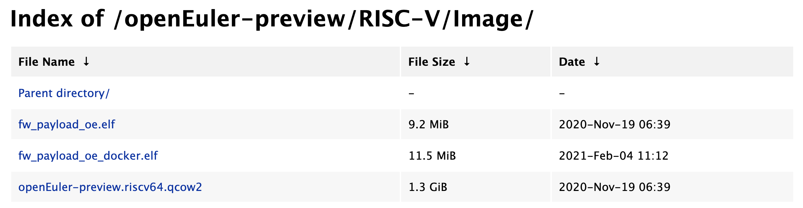

# 通过 QEMU 仿真 RISC-V 环境并启动 OpenEuler RISC-V 系统

## 安装 `qemu-riscv64`
> 参考文档：[https://wiki.qemu.org/Documentation/Platforms/RISCV](https://wiki.qemu.org/Documentation/Platforms/RISCV)


以 Ubuntu 为例，查看软件源上是否有qemu-rv64的二进制安装包：
```
$ sudo apt update
$ sudo apt-cache search all | grep qemu
oem-qemu-meta - Meta package for QEMU
qemu - fast processor emulator, dummy package
qemu-system - QEMU full system emulation binaries
aqemu - QEMU 和 KVM 的 Qt5 前端
grub-firmware-qemu - GRUB firmware image for QEMU
nova-compute-qemu - OpenStack Compute - compute node (QEmu)
qemu-guest-agent - Guest-side qemu-system agent
qemu-system-x86-xen - QEMU full system emulation binaries (x86)
qemu-user - QEMU user mode emulation binaries
qemu-user-binfmt - QEMU user mode binfmt registration for qemu-user
qemu-user-static - QEMU user mode emulation binaries (static version)
qemubuilder - pbuilder using QEMU as backend
```

一般来说，常见 GNU/Linux 发行版软件源中都提供了包含 `qemu-system-riscv64` 的软件包，如果软件源中并未收录 `QEMU`，则可以自行下载源码包手动构建安装：

> 源码包下载：[https://download.qemu.org/](https://download.qemu.org/)


### I. 下载 QEMU 源代码并构建


`$ sudo apt install build-essential`
安装必要的构建工具

`$ wget https://download.qemu.org/qemu-<latest>.tar.xz`
 下载最新 QEMU 源码包，**请将 `<latest>` 替换为目前最新的 QEMU 版本**

`$ tar xvJf qemu-<latest>.tar.xz`
解压刚刚下载的源码包

`$ cd qemu-<latest>`


`./configure --target-list=riscv64-softmmu,riscv64-linux-user --prefix=/home/xx/program/riscv64-qemu`
`riscv-64-linux-user`为用户模式，可以运行基于 RISC-V 指令集编译的程序文件, `softmmu`为镜像模拟器，可以运行基于 RISC-V 指令集编译的linux镜像，为了测试方便，可以两个都安装

`$ make`
`$ make install`
如果 `--prefix` 指定的目录位于根目录下，则需要在 `./configure` 前加入 `sudo`


### II. 配置环境变量

`$ vim ~/.bashrc`
在文末添加：
````
export QEMU_HOME=/home/xx/program/riscv64-qemu
export PATH=$QEMU_HOME/bin:$PATH
````
**注意一定要将 `QEMU_HOME` 路径替换为 `--prefix` 定义的路径**

`$ source ~/.bashrc`
`$ echo $PATH`


### III. 验证安装是否正确

`$ qemu-system-riscv64 --version`

如出现类似如下输出表示 QEMU 工作正常
````
QEMU emulator version 5.0.0
Copyright (c) 2003-2020 Fabrice Bellard and the QEMU Project developers
````


## 下载 openEuler RISC-V 系统镜像
恭喜你已经成功编译安装了最新版的 QEMU，接下来我们需要下载 openEuler RISC-V 的系统镜像。

由于我们的目标是运行最新版的 openEuler RISC-V OS，我们采用最新的发行版 21.03：

下载地址：[https://repo.openeuler.org/openEuler-preview/RISC-V/Image/](https://repo.openeuler.org/openEuler-preview/RISC-V/Image/)


其中的两个文件是启动 openEuler RISC-V 移植版所必需的：
* **fw_payload_oe.elf/fw_payload_oe_docker.elf**
利用 openSBI 将 kernel-5.5 的 image 作为 payload 所制作的用于 QEMU 启动的 image。这两个文件选择一个就可以，前者不支持 Docker，后者支持。

* **openEuler-preview.riscv64.qcow2**
openEuler RISC-V 移植版的 rootfs 镜像。


## 通过QEMU启动一个openEuler RISC-V

在上一步下载的文件所在的目录下执行：

```
$ qemu-system-riscv64 \
  -nographic -machine virt \
  -smp 8 -m 4G \
  -kernel fw_payload_oe_docker.elf \
  -drive file=openEuler-preview.riscv64.qcow2,format=qcow2,id=hd0 \
  -object rng-random,filename=/dev/urandom,id=rng0 \
  -device virtio-rng-device,rng=rng0 \
  -device virtio-blk-device,drive=hd0 \
  -device virtio-net-device,netdev=usernet \
  -netdev user,id=usernet,hostfwd=tcp::12055-:22 \
  -append 'root=/dev/vda1 rw console=ttyS0 systemd.default_timeout_start_sec=600 selinux=0 highres=off mem=4096M earlycon' \
  -bios none
````
注意 `-smp` 选项为CPU核数，`-m` 为虚拟机内存大小 请根据宿主机配置酌情修改。注意修改 `-m` 请同步修改 `-append` 中的 `mem=` 参数。

启动命令可做成 Shell 脚本，其中 `fw_payload_oe_docker.elf` 与 `openEuler-preview.riscv64.qcow2` 需修改为实际下载的文件名， 并注意相对和绝对路径，如做成启动脚本则可与脚本放在同一目录下。

这里以主机端口转发的方式实现网络功能。为 SSH 转发的 12055 端口也可改为自己需要的端口号

QEMU 版本 >= 5.2 请加入 `-bios none` 选项

## 欢迎使用

- 登录用户：`root`
- 默认密码：`openEuler12#$`

建议在登录成功之后立即修改 root 用户密码


登陆成功之后，可以看到如下的信息：
```
openEuler-RISCV-rare login: root
Password:
Last login: Tue Sep  3 14:07:05 from 172.18.12.1


Welcome to 5.5.19

System information as of time: 	Tue Sep  3 09:32:35 UTC 2019

System load: 	0.15
Processes: 	107
Memory used: 	2.7%
Swap used: 	0.0%
Usage On: 	11%
Users online: 	1


[root@openEuler-RISCV-rare ~]#
```

建议在 Host Linux 上通过 ssh 登录到运行于 QEMU 模拟器中的 openEuler OS（直接使用，可能会出现vim键盘输入异常）：

```
$ ssh -p 12055 root@localhost
```

## [可选] 准备 QEMU x86_64 环境

当需要查看对比openEuler主线软件包情况时，可安装对应的QEMU虚拟机。这里以x86_64、主线版本2109为例说明准备方法。

获取预制的映像文件：
```
$ wget https://mirror.iscas.ac.cn/openeuler/openEuler-21.09/virtual_machine_img/x86_64/openEuler-21.09-x86_64.qcow2.xz
$ xz -d openEuler-21.09-x86_64.qcow2.xz
$ wget https://mirror.iscas.ac.cn/openeuler/openEuler-21.09/OS/x86_64/images/pxeboot/initrd.img
$ wget https://mirror.iscas.ac.cn/openeuler/openEuler-21.09/OS/x86_64/images/pxeboot/vmlinuz
```

运行：
```
$ qemu-system-x86_64 \
  -nographic -smp 8 -m 4G \
  -kernel vmlinuz \
  -initrd initrd.img \
  -hda openEuler-21.09-x86_64.qcow2 \
  -nic user,model=e1000 \
  -append 'root=/dev/sda2 rw console=ttyS0 systemd.default_timeout_start_sec=600 selinux=0 highres=off mem=4096M earlycon'
```

root口令与上面相同。虚拟机的网络、时间(除时区)、软件源等已设置好，开机即可用。
