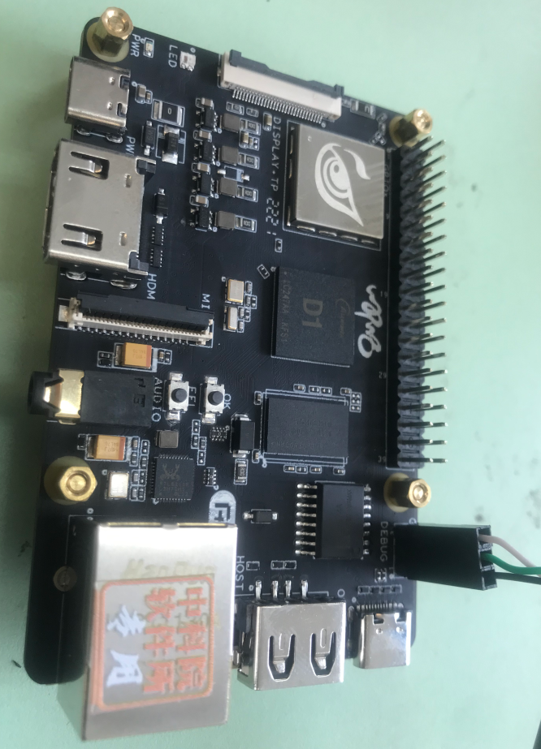

## 使用D1开发板安装openEuler-22.03-V1

注：
1. root用户密码`openEuler12#$`
2. openeuler用户密码`openEuler12#$`,默认用户，可使用Eclipse

### 1. 准备硬件

1）D1开发板：由D1获取得到开发板。

2）64G micro-sd卡及读卡器：SanDisk TF/MicroSD卡，容量64GB，速度U1，带读卡器。

3）Usb转uart串口通信模块：丢石头 PL2303，3.3/5V电平输出，type A接口，10PIN散头杜邦线。

4）电源适配器及type-c线。

5）连接D1开发板的3-Pin DEBUG端和Usb转uart串口通信模块。

照片：



### 2. 准备系统镜像

D1的系统镜像下载连接地址如下：https://mirror.iscas.ac.cn/openeuler-sig-riscv/openEuler-RISC-V/preview/openEuler-22.03-V1-riscv64/D1/

考虑到要安装验证Firefox浏览器，我们可以下载openEuler-22.03-V1-riscv64-d1-xfce.img.tar.zst，连接如下： https://mirror.iscas.ac.cn/openeuler-sig-riscv/openEuler-RISC-V/preview/openEuler-22.03-V1-riscv64/D1/openEuler-22.03-V1-riscv64-d1-xfce.img.tar.zst

其他文件均无需下载。

```bash
wget https://mirror.iscas.ac.cn/openeuler-sig-riscv/openEuler-RISC-V/preview/openEuler-22.03-V1-riscv64/D1/openEuler-22.03-V1-riscv64-d1-xfce.img.tar.zst
```

### 3. 刷写镜像

以下步骤适用于Ubuntu20.04，如适用Windows操作系统，解压请下载[zstd](./zstd-v1.4.4-win32.zip)`zstd.exe -d ./openEuler-22.03-V1-riscv64-d1-xfce.img.tar.zst`，之后将.img.tar解压为.img文件，刷写请下载[win32diskimager](./win32diskimager-1.0.0-install.exe)

1. 解压镜像文件

```bash
sudo apt install zstd -y
tar -I zstdmt -xvf ./openEuler-22.03-V1-riscv64-d1-xfce.img.tar.zst
```

2. 镜像刷写

将64G micro-sd卡装入读卡器后，插入笔记本电脑。笔记本电脑通常带一个硬盘，所以sd卡对应设备是/dev/sdb

```bash
sudo dd if=./openEuler-22.03-V1-riscv64-d1-xfce.img of=/dev/sdb bs=1M iflag=fullblock oflag=direct conv=fsync status=progress
```

### 4. 安装串口调试软件

1）将Usb转uart串口通信模块连接到电脑usb口。

2）检查设备管理器中的COM端口，例如COM4。


3）使用Xmodem安装固件。

安装teraterm，https://mobaxterm.mobatek.net/download.html

    选择菜单setup->Serial port setup
    Speed设置为115200
    Data设置为8bit
    Paritv设置为none
    Stoo bits设置为1bit
    Flowcontrol设置为none


### 5. 启动D1

