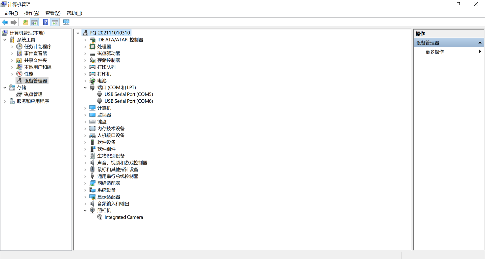
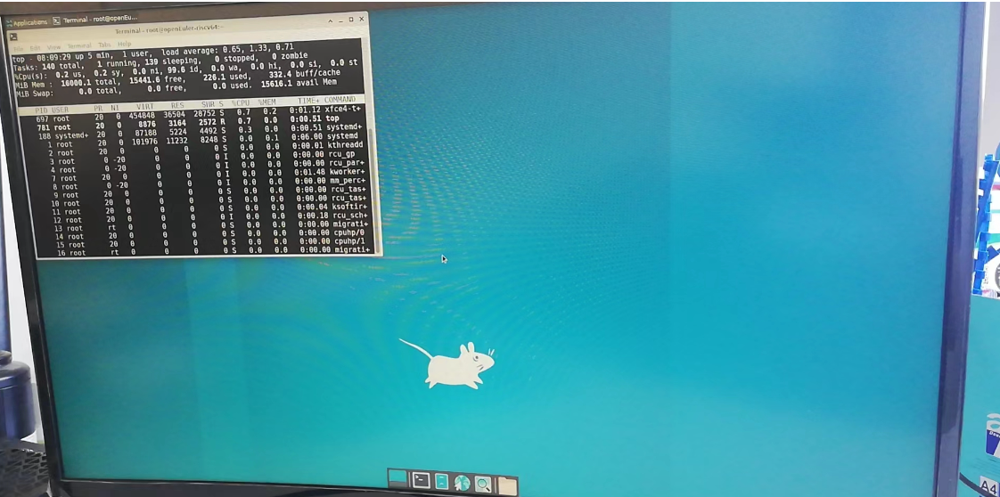

## 使用Unmatched开发板安装openEuler-22.03-V1

使用SSD替代micro-sd作为启动存储介质可显著提高系统性能，步骤参考[从NVMe驱动器启动openEuler RISC-V](./ssd.md)

注：
1. root用户密码`openEuler12#$`
2. openeuler用户密码`openEuler12#$`,默认用户，可使用Eclipse

### 1. 准备硬件

1）Unmatched开发板：由Unmatched获取得到开发板。

2）64G micro-sd卡及读卡器：SanDisk TF/MicroSD卡，容量64GB，速度U1，带读卡器。

3）MicroUSB线。

4）电源适配器。

5）连接Unmatched开发板的MicroUSB接口到计算机USB接口。

如下图：


### 2. 准备系统镜像

Unmatched的系统镜像下载连接地址如下： https://mirror.iscas.ac.cn/openeuler-sig-riscv/openEuler-RISC-V/preview/openEuler-22.03-V1-riscv64/Unmatched/

考虑到要安装验证Firefox浏览器，我们可以下载openEuler-22.03-V1-riscv64-unmatched-xfce.img.tar.zst，连接如下：https://mirror.iscas.ac.cn/openeuler-sig-riscv/openEuler-RISC-V/preview/openEuler-22.03-V1-riscv64/Unmatched/openEuler-22.03-V1-riscv64-unmatched-xfce.img.tar.zst

其他文件均无需下载。

```bash
wget https://mirror.iscas.ac.cn/openeuler-sig-riscv/openEuler-RISC-V/preview/openEuler-22.03-V1-riscv64/Unmatched/openEuler-22.03-V1-riscv64-unmatched-xfce.img.tar.zst
```

### 3. 刷写镜像

以下步骤适用于Ubuntu20.04/22.04，如适用Windows操作系统，解压请下载[zstd](./zstd-v1.4.4-win32.zip)`zstd.exe -d ./openEuler-22.03-V1-riscv64-unmatched-xfce.img.tar.zst`，之后将.img.tar解压为.img文件，刷写请下载[win32diskimager](./win32diskimager-1.0.0-install.exe)

1. 解压镜像文件

```bash
sudo apt install zstd -y
tar -I zstdmt -xvf ./openEuler-22.03-V1-riscv64-unmatched-xfce.img.tar.zst
```

2. 镜像刷写

将64G micro-sd卡装入读卡器后，插入笔记本电脑。笔记本电脑通常带一个硬盘，所以sd卡对应设备是/dev/sdb

```bash
sudo dd if=./openEuler-22.03-V1-riscv64-unmatched-xfce.img of=/dev/sdb bs=1M iflag=fullblock oflag=direct conv=fsync status=progress
```

### 4. 安装串口调试软件

1）将MicroUSB接线连接到电脑USB口。

2）检查设备管理器中的COM端口，会添加2个COM端口，选择最后一个，如这里COM6。



3）使用Xmodem安装固件。

安装teraterm，https://mobaxterm.mobatek.net/download.html

    选择菜单setup->Serial port setup
    Speed设置为115200
    Data设置为8bit
    Paritv设置为none
    Stoo bits设置为1bit
    Flowcontrol设置为none


### 5. 启动Unmatched

将64G micro-sd卡装入Unmatched sd卡槽，连接tpye-c电源启动，用户名：`root`，密码：`openEuler12#$`

```
U-Boot SPL 2021.07-dirty (Dec 09 2021 - 13:57:38 +0800)
Trying to boot from MMC1


U-Boot 2021.07-dirty (Dec 09 2021 - 13:57:38 +0800)

CPU:   rv64imafdc
Model: SiFive HiFive Unmatched A00
DRAM:  16 GiB
MMC:   spi@10050000:mmc@0: 0
Loading Environment from nowhere... OK
EEPROM: SiFive PCB EEPROM format v1
Product ID: 0002 (HiFive Unmatched)
PCB revision: 3
BOM revision: B
BOM variant: 0
Serial number: SF105SZ212200757
Ethernet MAC address: 70:b3:d5:92:f9:c6
CRC: b4ce16dc
In:    serial@10010000
Out:   serial@10010000
Err:   serial@10010000
Model: SiFive HiFive Unmatched A00
Net:   eth0: ethernet@10090000
Hit any key to stop autoboot:  0
PCIE-0: Link up (Gen1-x8, Bus0)

Device 0: unknown device
starting USB...
Bus xhci_pci: Register 4000840 NbrPorts 4
Starting the controller
USB XHCI 1.00
scanning bus xhci_pci for devices... 5 USB Device(s) found
       scanning usb for storage devices... 0 Storage Device(s) found

Device 0: unknown device
switch to partitions #0, OK
mmc0 is current device
Scanning mmc 0:3...
Found /boot/extlinux/extlinux.conf
Retrieving file: /boot/extlinux/extlinux.conf
399 bytes read in 6 ms (64.5 KiB/s)
1:      Linux openEuler-riscv
Retrieving file: /boot/Image
21457920 bytes read in 18130 ms (1.1 MiB/s)
append: earlyprintk rw root=/dev/mmcblk0p3 rootfstype=ext4 rootwait console=ttySIF0,115200 LANG=en_US.UTF-8 earlycon
Retrieving file: /boot/hifive-unmatched-a00.dtb
10931 bytes read in 15 ms (710.9 KiB/s)
Moving Image from 0x84000000 to 0x80200000, end=816de000
## Flattened Device Tree blob at 88000000
   Booting using the fdt blob at 0x88000000
   Using Device Tree in place at 0000000088000000, end 0000000088005ab2

Starting kernel ...

[    0.000000] Linux version 5.13.19 (abuild@oerv-obs-worker-08) (gcc_old (GCC) 10.3.1, GNU ld (GNU Binutils) 2.37) #1 SMP Thu Jun 9 07:00:51 UTC 2022
[    0.000000] OF: fdt: Ignoring memory range 0x80000000 - 0x80200000
[    0.000000] Machine model: SiFive HiFive Unmatched A00
......
[  OK  ] Started OpenSSH server daemon.
[  OK  ] Reached target Multi-User System.
[  OK  ] Reached target Graphical Interface.
         Starting Record Runlevel Change in UTMP...
[  OK  ] Finished Record Runlevel Change in UTMP.

openEuler 22.03 LTS
Kernel 5.13.19 on an riscv64

openEuler-riscv64 login:
openEuler 22.03 LTS
Kernel 5.13.19 on an riscv64

openEuler-riscv64 login: 
```



**无线网络配置**

```
nmtui
```