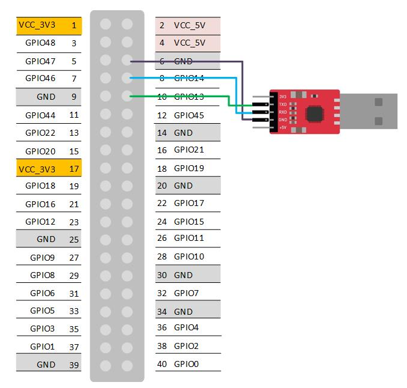
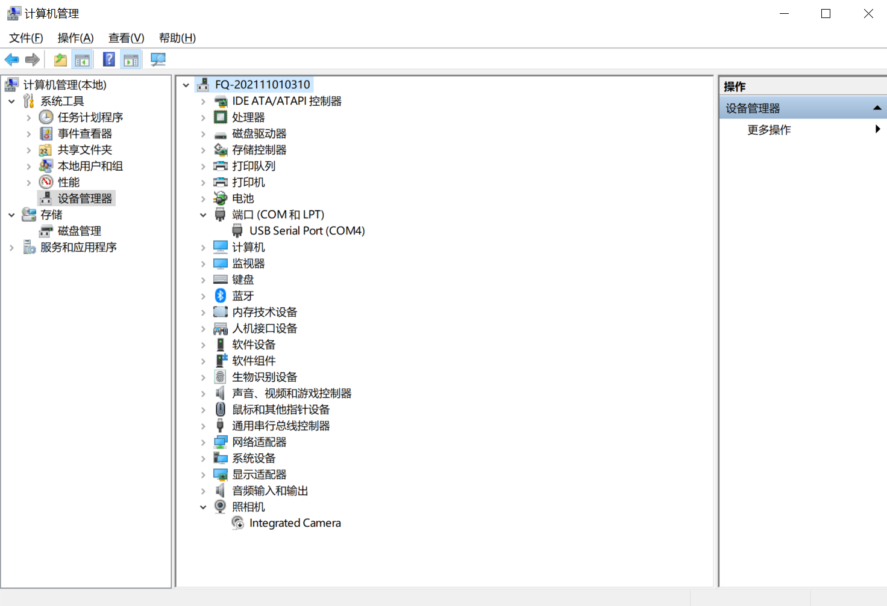
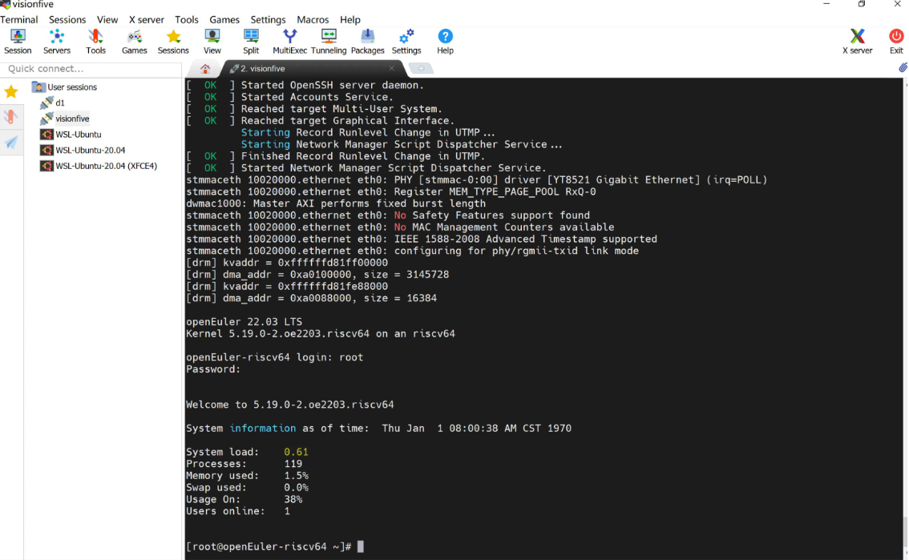
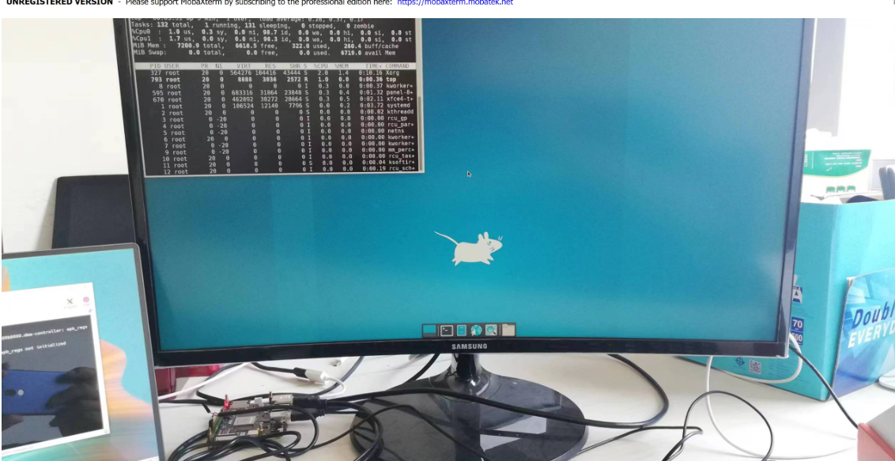

## 使用VisionFive开发板安装openEuler-22.03-V1

注：

1. root用户密码`openEuler12#$`
2. openeuler用户密码`openEuler12#$`,默认用户，可使用Eclipse

### 1. 准备硬件

1）visionfive开发板：由starfive获取得到开发板。

2）64G micro-sd卡及读卡器：SanDisk TF/MicroSD卡，容量64GB，速度U1，带读卡器。

3）Usb转uart串口通信模块：丢石头 PL2303，3.3/5V电平输出，type A接口，10PIN散头杜邦线。

4）电源适配器及type-c线。

5）连接visionfive开发板的40-Pin GPIO端和Usb转uart串口通信模块。

- GND连接6 GND
- RXD连接8 GPIO14(UART TX)
- TXD连接10 GPIO13(UART RX)

如下图：



照片：


### 2. 准备系统镜像

Visionfive的系统镜像下载连接地址如下： https://mirror.iscas.ac.cn/openeuler-sig-riscv/openEuler-RISC-V/preview/openEuler-22.03-V1-riscv64/Visionfive/

考虑到要安装验证Firefox浏览器，我们可以下载openEuler-22.03-V1-riscv64-visionfive-xfce.img.tar.zst，连接如下： https://mirror.iscas.ac.cn/openeuler-sig-riscv/openEuler-RISC-V/preview/openEuler-22.03-V1-riscv64/Visionfive/openEuler-22.03-V1-riscv64-visionfive-xfce.img.tar.zst 

其他文件均无需下载。

```bash
wget https://mirror.iscas.ac.cn/openeuler-sig-riscv/openEuler-RISC-V/preview/openEuler-22.03-V1-riscv64/Visionfive/openEuler-22.03-V1-riscv64-visionfive-xfce.img.tar.zst 
```

### 3. 刷写镜像

以下步骤适用于Ubuntu20.04，如适用Windows操作系统，解压请下载[zstd](./zstd-v1.4.4-win32.zip)`zstd.exe -d ./openEuler-22.03-V1-riscv64-visionfive-xfce.img.tar.zst，之后将.img.tar解压为.img文件，刷写请下载[win32diskimager](./win32diskimager-1.0.0-install.exe)

1. 解压镜像文件

```bash
sudo apt install zstd -y
tar -I zstdmt -xvf ./openEuler-22.03-V1-riscv64-visionfive-xfce.img.tar.zst 
```

2. 镜像刷写

将64G micro-sd卡装入读卡器后，插入笔记本电脑。笔记本电脑通常带一个硬盘，所以sd卡对应设备是/dev/sdb

```bash
sudo dd if=./openEuler-22.03-V1-riscv64-visionfive-xfce.img of=/dev/sdb bs=1M iflag=fullblock oflag=direct conv=fsync status=progress
```

### 4. 安装串口调试软件

1）将Usb转uart串口通信模块连接到电脑usb口。

2）检查设备管理器中的COM端口，例如COM4。



3）使用Xmodem安装固件。

安装teraterm，https://mobaxterm.mobatek.net/download.html

    选择菜单setup->Serial port setup
    Speed设置为115200
    Data设置为8bit
    Paritv设置为none
    Stoo bits设置为1bit
    Flowcontrol设置为none


### 5. 启动Visionfive

将64G micro-sd卡装入Visionfive sd卡槽，连接tpye-c电源启动，用户名：`root`，密码：`openEuler12#$`

```
bootloader version:211102-0b86f96
ddr 0x00000000, 1M test
ddr 0x00100000, 2M test
DDR clk 2133M,Version: 211102-d086aee                                                                                    0 crc flash: 5595e732, crc ddr: 5595e732
crc check PASSED

bootloader.

OpenSBI v1.0
   ____                    _____ ____ _____
  / __ \                  / ____|  _ \_   _|
 | |  | |_ __   ___ _ __ | (___ | |_) || |
 | |  | | '_ \ / _ \ '_ \ \___ \|  _ < | |
 | |__| | |_) |  __/ | | |____) | |_) || |_
  \____/| .__/ \___|_| |_|_____/|____/_____|
        | |
        |_|

Platform Name             : StarFive VisionFive V1
Platform Features         : medeleg
Platform HART Count       : 2
Platform IPI Device       : aclint-mswi
Platform Timer Device     : aclint-mtimer @ 6250000Hz
Platform Console Device   : uart8250
Platform HSM Device       : ---
Platform Reboot Device    : ---
Platform Shutdown Device  : ---
Firmware Base             : 0x80000000
Firmware Size             : 296 KB
Runtime SBI Version       : 0.3

Domain0 Name              : root
Domain0 Boot HART         : 1
Domain0 HARTs             : 0*,1*
Domain0 Region00          : 0x0000000002000000-0x000000000200ffff (I)
Domain0 Region01          : 0x0000000080000000-0x000000008007ffff ()
Domain0 Region02          : 0x0000000000000000-0xffffffffffffffff (R,W,X)
Domain0 Next Address      : 0x0000000080200000
Domain0 Next Arg1         : 0x0000000082200000
Domain0 Next Mode         : S-mode
Domain0 SysReset          : yes

Boot HART ID              : 1
Boot HART Domain          : root
Boot HART ISA             : rv64imafdcsux
Boot HART Features        : scounteren,mcounteren
Boot HART PMP Count       : 16
Boot HART PMP Granularity : 4096
Boot HART PMP Address Bits: 36
Boot HART MHPM Count      : 2
Boot HART MIDELEG         : 0x0000000000000222
Boot HART MEDELEG         : 0x000000000000b109


U-Boot 2022.01-rc4-VisionFive-g0c08d335c5 (Dec 30 2021 - 08:30:15 +0800)StarFive

CPU:   rv64imafdc
Model: StarFive VisionFive V1
DRAM:  8 GiB
MMC:   mmc@10000000: 0, mmc@10010000: 1
Loading Environment from SPIFlash... cadence_spi spi@11860000: Can't get reset: -524
SF: Detected gd25lq128 with page size 256 Bytes, erase size 4 KiB, total 16 MiB
......
......
[  OK  ] Reached target Graphical Interface.
         Starting Record Runlevel Change in UTMP...
[  OK  ] Finished Record Runlevel Change in UTMP.

openEuler 22.03 LTS
Kernel 5.13.19 on an riscv64

openEuler-riscv64 login:
openEuler 22.03 LTS
Kernel 5.13.19 on an riscv64

openEuler-riscv64 login: 
```






**无线网络配置**

```
nmtui
```

### 6. 参考资料

<https://rvspace.org/en/Product/VisionFive/Technical_Documents/VisionFive_Software_Technical_Reference_Manual>

<https://wiki.rvspace.org/en/Product/VisionFive/Technical_Documents/VisionFive_Single_Board_Computer_Quick_Start_Guide>
