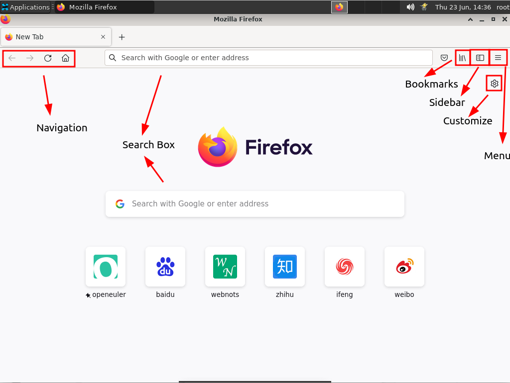
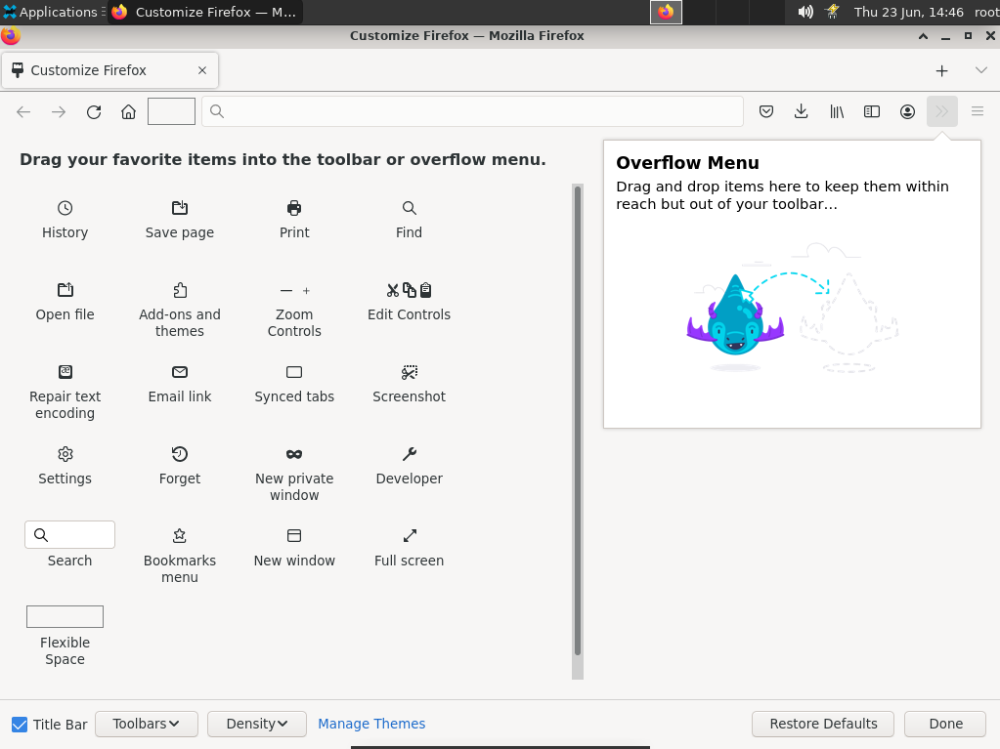
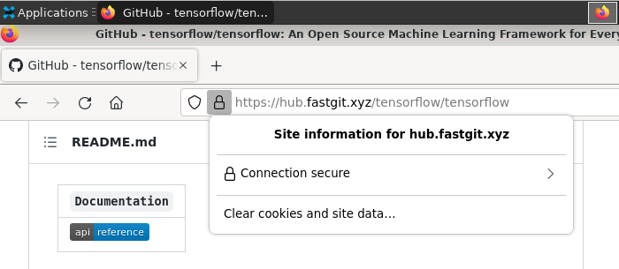
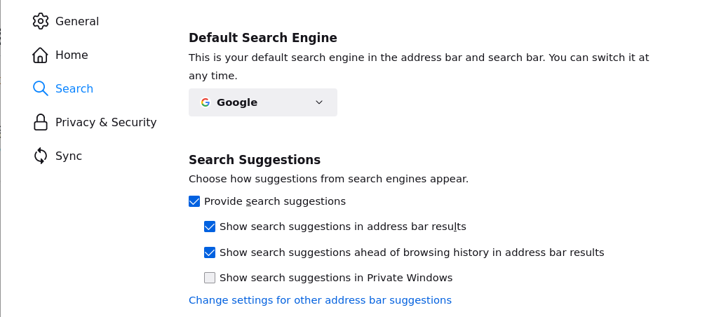
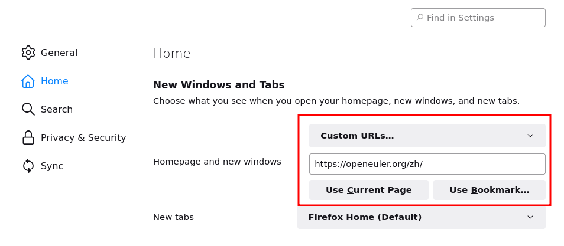
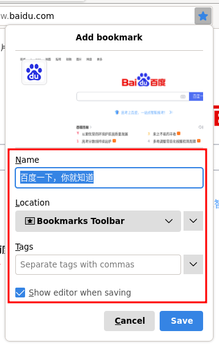
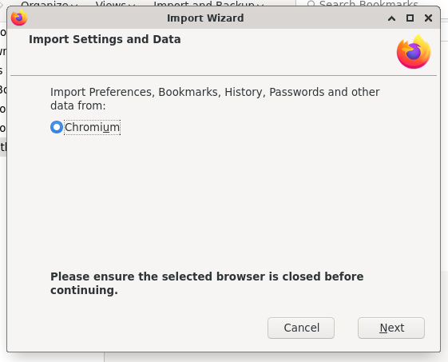
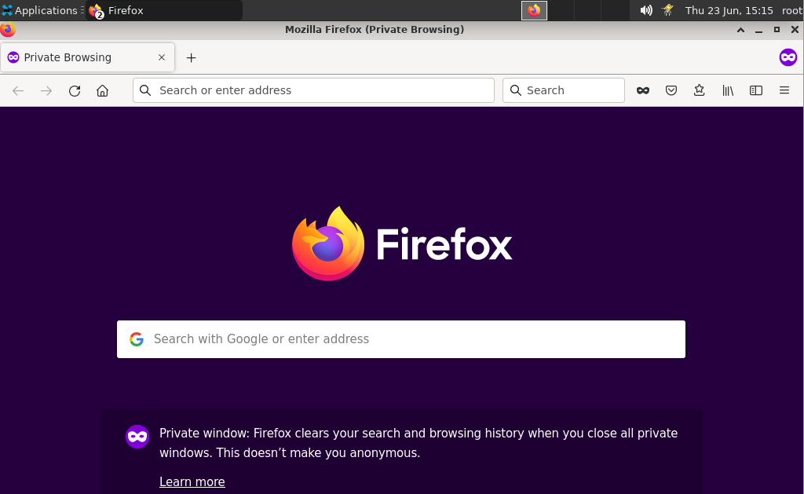
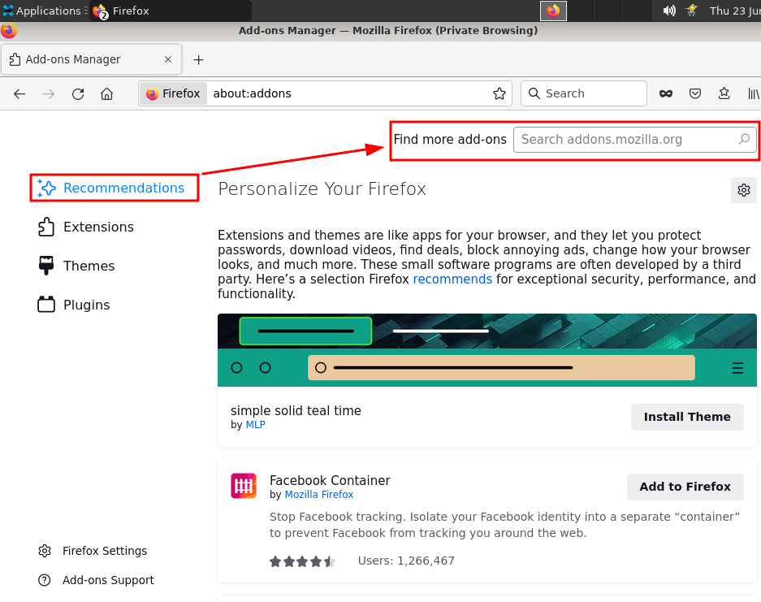
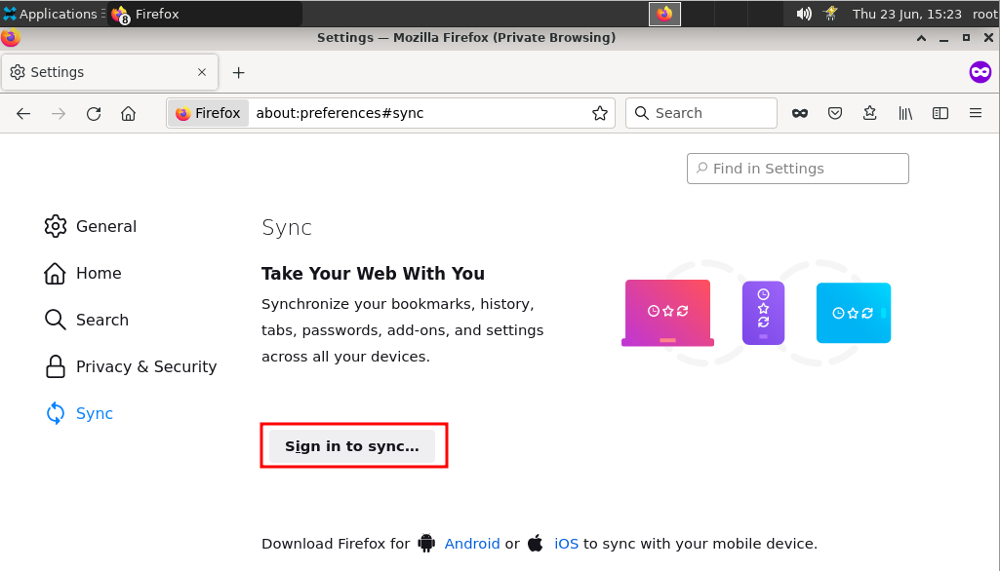

# Firefox使用说明

## 1. 概述

Firefox 是一个免费和开源的浏览器，全世界 10% 的人使用 Firefox 作为他们的主要浏览器。Mozilla 是 Firefox 浏览器的开发商，主要提供专注于开放网络的产品。Firefox是谷歌 Chrome 浏览器的替代品。

## 2. 基本特点

与任何其他浏览器类似，您也可以在 Firefox 中执行以下操作。您可以使用浏览器右上角的汉堡菜单图标或使用顶部菜单栏访问选项。

1.在选项卡、窗口或私人窗口中打开网页。默认情况下，Firefox 将保存您的所有[浏览历史记录以加快您的活动。但是，您可以使用隐私模式通知 Firefox 不要保存您的任何浏览历史记录。
2.您可以为网页添加书签以便快速访问。
3.使用“历史”菜单查看历史浏览详情。在“工具 > 下载”菜单下查看下载历史记录。
4.内置密码管理器可保存登录密码，您可以使用主密码保护所有密码。
5.直接从浏览器截取屏幕截图并将其下载或存储在 Firefox 服务器上 14 天。
6.出色的内容拦截功能可保护您的隐私。
7.Firefox 还提供开发者工具来检查网站元素和性能。
8.您可以使用来自第三方开发者的附加组件来增强浏览器的功能。

## 3. 火狐布局

当您打开新标签页时，Firefox 可能会在新标签页上向您显示热门网站、历史记录和片段。但是，您可以在“about:preferences#home”页面下禁用所有这些烦人的东西。

Firefox Quantum 浏览器布局

1.您可以使用地址栏左侧的导航图标导航到前面、后面、刷新或快速转到主页。
2.使用地址栏使用默认搜索引擎进行搜索或使用页面上显示的搜索框进行搜索。
3.使用汉堡菜单查看书签、侧边栏和访问菜单项。
4.使用右上角显示的齿轮图标转到主页的自定义部分。

## 4. 自定义火狐界面

Firefox 允许您自定义用户界面。这可以帮助您根据自己的方便拖动和重新排列工具。转到“查看 > 工具栏 > 自定义...”选项以检查所有可用的图标。或者，转到“汉堡菜单>自定义”以转到自定义页面。

自定义 Firefox 布局

只需将图标拖放到可用位置，即可方便您使用浏览器。

## 5. 使用 Firefox 地址栏

Firefox 有两个用于搜索和获取结果的选项——地址栏和搜索框。您可以使用地址栏搜索普通查询和打开网页。默认情况下，Firefox 使用 Google 搜索引擎并使用 Google 搜索查询。

当您打开网页时，地址栏会显示多个选项。

Firefox 地址栏选项

地址栏右侧显示多个图标：

1.单击向下箭头以检查历史记录并使用不同的搜索引擎进行搜索。
2.查看阅读器视图以禁用页面上的所有广告。
3.点击三点图标收藏或分享网页链接。
4.Pocket 按钮允许您将网页链接保存到社交共享平台 Pocket。您需要有一个单独的 Pocket 帐户才能将网页保存到 Pocket。
5.单击星形图标为网页添加书签。

地址栏将在网站地址左侧显示挂锁图标，其中包含网站的连接详细信息。单击挂锁图标并控制网站的行为，例如阻止 cookie。

火狐网站设置

## 6. 使用火狐搜索

除了地址栏，Firefox 还提供了一个额外的搜索框。您可以在自定义部分的地址栏旁边添加搜索框。

火狐搜索框

您也可以在搜索框中输入关键字并使用可用的搜索引擎之一来获取结果。要更改默认搜索引擎，请执行以下操作：

1.单击放大镜并选择“更改搜索设置”选项。
2.找到“默认搜索引擎”部分，然后单击下拉菜单以选择默认搜索引擎。

更改 Firefox 中的默认搜索引擎

3.您可以通过点击页面底部的“查找更多搜索引擎”链接来添加搜索引擎。
4.选择任何首选的搜索工具，然后单击带有“+添加到 Firefox”文本的蓝色按钮。

## 7. 设置新标签页和主页

单击浏览器右上角的齿轮图标或转到“about:preferences#home” URL。在这里您可以设置您想在新标签页、主页和新窗口中看到的内容。

## 8. 设置主页的自定义URL

当您启动浏览器时，Firefox 会打开一个主页。默认情况下，Firefox 的主页设置为“Firefox 主页”，显示热门和推荐网站。按照以下说明更改主页：

1.打开一个新选项卡，然后在选项卡内的右上角查找小齿轮图标。
2.寻找应该显示“Firefox Home（默认）”的“主页和新窗口”选项。
3.单击下拉菜单并选择“自定义 URL...”选项。
4.输入或粘贴您的首选 URL。您可以选择当前页面并将多个页面设置为您的主页。
5.关闭选项卡。

在 Firefox 中更改主页

每当您单击地址栏旁边的“主页”图标或启动浏览器时，都会打开自定义页面。

## 9. 收藏收藏页面

在浏览网页时，您最终会遇到想要定期访问的网页。使用书签，您可以快速重新访问网页。以下是执行此操作的步骤：

1.打开您喜欢的网页
2.在地址栏右侧查找“星”图标并单击它。
3.将出现一个小窗口，更改书签名称、文件夹和标签。

Firefox 中的书签页面

1.点击“完成”，星形图标将变为蓝色，表示该网页已被收藏。

## 10. 打开书签页面

打开书签页面非常容易。

1.检查右侧的工具栏并查找由斜线表示的图标，如 library。
2.图标的标题是“查看历史记录、保存的书签等”。
3.单击它并选择“书签”选项。
4.将出现一个下拉菜单，显示您所有的书签页面。

在 Firefox 中查看书签页面

## 11. 从其他浏览器导入数据

您需要做的第一件事就是从其他浏览器（如 Chrome、Edge、Internet Explorer 或 Safari）导入您的浏览数据。

1.转到 Firefox 浏览器上的“书签 > 显示所有书签”菜单。
2.将打开一个名为“库”的新窗口。
3.单击看起来像开始的“导入和备份书签”按钮。

在 Firefox 中导入书签

1.选择“从另一个浏览器导入数据”选项。您将看到一个“导入向导”，其中包含您计算机上安装的浏览器列表。

选择要导入的浏览器

1.选择要从中导入书签的浏览器，然后单击“继续”按钮。
2.您将看到用于选择要导入哪些数据的选项，例如 Cookie、浏览历史记录、保存的密码和书签。
3.选择“书签”选项并将所有现有书签导入 Firefox。

Firefox 导入向导

## 12. 以私密模式浏览

有时，您不希望将任何浏览信息存储在计算机上。如果您使用公共计算机或借用计算机，这对您的隐私很重要。

1.单击右上角显示三个水平线的汉堡菜单。
2.选择“新建私人窗口”选项。
3.或者，您可以在 Windows 中按“Ctrl + Shift + P”，在 macOS 中按“Command + Shift + P”打开私密模式。

Firefox 中的隐私浏览

使用私人窗口时，Firefox 不会在历史记录中记录您的浏览活动。关闭私人窗口以返回正常的 Firefox 窗口。

## 13. 安装附加组件          

Firefox 提供两种类型的附加组件目录来增强浏览器的功能。您可以找到扩展和主题来更改浏览器的行为。请按照以下步骤在浏览器上安装附加组件。

1.在地址栏中输入“about:addons”，然后按 Enter。
2.“扩展”和“主题”部分将显示浏览器上所有已安装的项目。您可以禁用或删除您不想要的任何项目。
3.在“获取附加组件”部分底部查找“查找更多附加组件”按钮，然后单击它。

在 Firefox 中查找附加组件

1.将打开一个新页面，显示流行的扩展和主题。
2.在“查找加载项”字段中输入您想要的任何关键字，然后按 Enter 开始搜索。

在 Firefox 中查找并安装附加组件

1.选择您想要的任何扩展，然后单击蓝色的“+ 添加到 Firefox”按钮

同样，您也可以为您的 Firefox 浏览器选择和安装主题。

## 14.同步浏览活动

您可以在“工具 > 登录以同步...”菜单下注册 Firefox 帐户。浏览时创建一个新帐户并登录 Firefox。

创建火狐账号

这将帮助您在使用同一 Firefox 帐户登录的所有设备上同步您的浏览活动。

