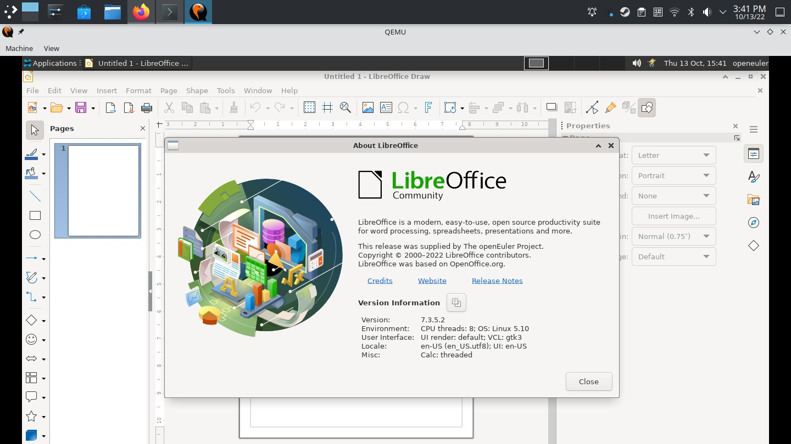

# LibreOffice Draw使用说明

LibreOffice Draw（又称Draw）是一个向量绘图软体，它是LibreOffice办公软体套装的一部份。它的特色在于多样的「接头」形状，可以用在多种不同的线条上，方便建筑绘图，以及流程图上，与Microsoft Visio以及CorelDRAW等向量绘图软体功能类似，LibreOffice Draw也有若干桌上排版（DTP）软体（如Microsoft Publisher以及Adobe InDesign）的特性，因此亦可以用来进行简单的印刷品排版编辑与设计。

## 1.菜单栏

以下是对所有 LibreOffice Draw 菜单、子菜单和对话框的说明。

### 1.1.1 文件

这个菜单包含使用绘图文档的常规命令。比如打开、关闭和打印。如果要关闭 LibreOffice Draw，只需点击「退出」。

### 1.1.2编辑

此菜单中的命令用于编辑 Draw 文档 (例如复制和粘贴)。

### 1.1.3 视图

设置绘图文档的显示属性。

### 1.1.4 插入

此菜单允许您将元素 (例如图形和辅助线) 插入到 Draw 文档中。

### 1.1.5 格式

包含用于格式化文档布局和内容的命令。

### 1.1.6 页

此菜单提供绘图页管理和导航命令。

### 1.1.7 形状

此菜单提供形状对象管理。

### 1.1.8 工具

此菜单提供用于 LibreOffice Draw 的工具以及语言设置和系统设置的快捷方式。

### 1.1.9 窗口

包含用于操作和显示文档窗口的命令。

### 1.1.10 「帮助」菜单

「帮助」菜单用于启动和控制 LibreOffice 的帮助系统。

### 1.2.1 设置界面

## 2.基本用法

### 2.1 编辑和组合对象

#### 2.1.1 复制对象

您可以创建一个对象的复制件或多个副件。这些副件可以是相同的，也可以是大小、颜色、方向和位置不同的。

如果您需要绘制一堆圆形，可采用复制件功能进行绘制，绘制的基础是最下面的一个圆形：

1、使用「椭圆」工具绘制一个实心的蓝色椭圆。

2、选择椭圆并选择「编辑 - 创建副本」。

3、输入 12，作为「副本数量」。

4、在「宽度」和「高度」的放大选项处输入负值，图形就会从下往上逐渐变小。

5、要定义图形的颜色转换，请在「开始和「结束」框中选择不同的颜色。开始」颜色被应用到正在复制的对象。

6、点击「确定」以创建复制件。

#### 2.1.2 旋转对象

您可以使某个对象围绕默认的旋转点 (中心点) 或您指定的旋转点进行旋转。

选择要旋转的对象。在 LibreOffice Draw的转换工具栏或 LibreOffice Impress 的绘图栏上，单击旋转图标。

移动指针到角上的控点，指针会变为旋转符号。用鼠标拖拉控点即可旋转此对象。

按住 Shift 键可以将旋转角度限制为 15 度的倍数。

右键单击对象以打开上下文菜单。选择位置和大小 - 旋转以输入准确的旋转值。

要修改旋转点，请将对象中心的小圆圈拖动到新的位置。

要使对象水平或垂直变形，请拖动某一个边的控点。

### 2.2 编辑颜色和纹理

#### 2.2.1 替换颜色

使用「色彩替换器」工具可以替换位图中的颜色。

一次最多可以替换 4 种颜色。

您也可以使用「透明」选项来替换图像区域中的透明色。

同样，也可以使用「色彩替换器」将图像中的一种颜色替换为透明色。

- 借助色彩替换器来替换颜色的方法：

请确保您使用的图像是一个位图 (例如 BMP、GIF、JPG 和 TIF) 或元文件格式 (例如 WMF)。

1、选择「工具 - 色彩替换器」。

2、点击色彩替换器图标，然后将鼠标指针移到图像中要替换的颜色上方。该颜色将显示在色彩替换器图标旁边的框中。

3、点击图像中的颜色。该颜色将显示在第一个「源颜色」框中，且该颜色旁边的选择框被选中。

4、在「替换为」框中选择新的颜色。

5、如果想要在对话框打开时替换其他颜色，请选择下一行中的「源颜色」前面的选择框，并重复步骤 3 至步骤 5。

6、点击「替换」。

#### 2.2.2 用于图形艺术字的艺术字

您可以使用 Fontwork 创建图形文本艺术对象。

**创建艺术字对象**

1、如果你看不到「绘图工具栏」或「艺术字工具栏」，选择「视图 - 工具栏」来启用该工具栏。

2、在「绘图」工具栏或「艺术字」工具栏上，点击「艺术字库」图标。图标

3、在「艺术字库」对话框中，选择艺术字样式，然后点击「确定」。

艺术字对象插入到文档中。艺术字对象是自定义形状。使用 3D 设置工具栏，您可以随时将视图从 2D 切换到 3D 并切换回来。

4、双击对象可进入文本编辑模式。

5、用自己的文字替换默认的艺术字文字。

6、按 Esc 键可退出文本编辑模式。

**编辑艺术字对象**

1、单击字体对象。如果 Fontwork 对象已插入背景中，请在单击时按住Ctrl键。

将显示艺术字工具栏。如果看不到「艺术字」工具栏，可选择「视图 - 工具栏 - 艺术字」。

2、点击「艺术字」工具栏上的图标。

可以使用以下图标:

- 艺术字库 - 添加其他艺术字对象

- 艺术字形状 - 编辑形状

- 艺术字字母高度相同 - 修改字符高度

- 艺术字对齐方式 - 对齐文本

- 艺术字字符间距 - 修改字符间距与字距微调

**编辑其他艺术字特性**

1、单击字体对象。如果 Fontwork 对象已插入背景中，请在单击时按住Ctrl键。

2、从「绘图对象属性」工具栏中选择属性。您可以修改线条宽度、线条颜色、填充颜色、填充样式以及其他一些属性。

### 2.3 编辑文字

### 2.3.1 添加文本

在绘图或演示文稿中可添加多种文字类型:

- 文本框中的文字

- 修改字符大小以适应文本框大小的文字

- 通过双击对象添加到任一绘图对象的文字

- 从 Writer 文档复制的文字

- 从一个文本或 HTML 文档插入的文字

**添加文本框**

1、单击文本图标并将鼠标指针移动到要输入文本框的位置。

2、在文档中，拖动文本框使其符合所需的大小。

3、在文本框中输入或粘贴文字。

双击文字可编辑它或格式化文字属性 (例如字体大小或字体颜色)。点击文字对象的边框可编辑该对象的属性，例如边框颜色或者使其排列在其他对象之前或之后。

**文字和框对齐**

1、按照以上步骤所述创建文本框。

2、选中文字对象，然后选择「格式 - 文字」。将打开「文字」对话框。

3、在「文本」选项卡页面上，清除「适应文字高度」复选框，然后选中「适应框架大小」复选框。点击「确定」。

4、现在，您可以调整文本框的大小来改变文本字符的大小和形状。

**绑定到图形的文字**

双击任一图形，均可在图形中添加文字。

要确定文字的位置，请使用「格式 - 文字」中的设置。

1、例如，单击标注图标旁边的箭头图标以打开标注工具栏。

2、选择一个标注，然后将鼠标指针移到该标注的起始位置。

3、拖动以绘制图例。

4、输入文字。

**复制文字**

1、在 Writer 文档中选择文字。

2、将文字复制到剪贴板上 (编辑 - 复制)。

3、在要粘贴文字的页面或幻灯片上点击鼠标。

4、使用「编辑 - 粘贴」或「编辑 - 选择性粘贴」粘贴文字。

使用「选择性粘贴」时，您可以选择要粘贴的文本格式。根据格式的不同，您可以复制不同的文本属性。

**导入文字**

1、在要导入文字的页面或幻灯片上点击鼠标。

2、选择「插入 - 文件」。

3、选择一个文本文件 (*.txt) 或 HTML 文件，然后点击「插入」。将打开「插入文字」对话框。点击「确定」以插入文本。

### 2.4 其它

#### 2.4.1 插入图片

1、选择「插入 - 图像」。

2、定位您需要插入的图像。若需要将该图像作为链接插入，请选择「链接复选框。要想在插入之前预览该图像，请选择预览」

3、点击「打开」以插入该图片。
