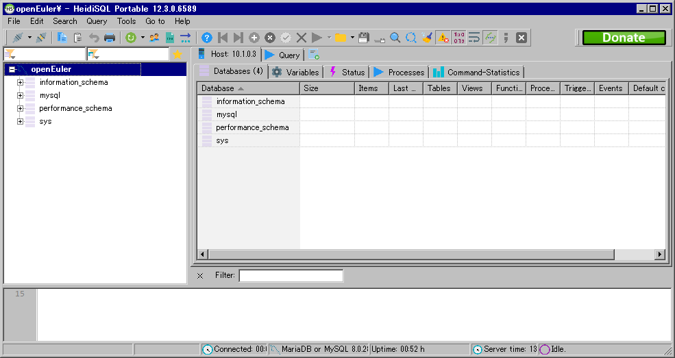

# MySQL 使用说明

**安装 MySQL**

执行以下指令。

```
# dnf install mysql-server
```

> 安装过程中，有些包可能会已经以依赖的形式被安装了，没关系直接跳过。

提示 `Complete!` 即安装完成。

**运行 MySQL**

执行以下指令，使 MySQL 服务启动。

```
# systemctl start mysqld
```

MySQL 服务器存储了各种数据库，包含用于存储服务器数据的数据库，以及由用户创建的数据库。

| MySQL 服务器     |
|------------------|
| 服务器数据数据库 |
| 用户数据库 甲    |
| 用户数据库 乙    |
| 用户数据库 丙    |

每个数据库由记录了数据的表格组成。

| 用户数据库 甲 |
|---------------|
| 表格 I        |
| 表格 II       |
| 表格 III      |

每个表格由字段、记录和数据组成。

| 表格 I | 字段 A | 字段 B | 字段 C |
|--------|--------|--------|--------|
| 记录 1 | 数据   | 数据   | 数据   |
| 记录 2 | 数据   | 数据   | 数据   |
| 记录 3 | 数据   | 数据   | 数据   |

## 1. 服务器的基本操作

### 1.1 登入 MySQL

初次安装 MySQL 服务后 MySQL 的默认用户名为 `root`，密码为空。

1. 在终端执行以下命令，以 `root` 身份登入 MySQL；

```
> mysql -u root -p
```

2. 输入用户密码（默认为空）。

### 1.2 修改用户密码

在 MySQL 中执行以下命令，修改 `root` 用户的密码为 `OpenEuler12#$`。

```
mysql> ALTER USER 'root'@'localhost' IDENTIFIED BY 'OpenEuler12#$';
```

**注意，MySQL 的命令需有 `;` 作结尾。**

### 1.3 登出 MySQL

在 MySQL 中执行以下命令登出 MySQL。

```
mysql> exit
```

或

```
mysql> quit
```

### 1.4 查看运行状态

在 MySQL 中执行以下命令，查看当前 MySQL 服务器的运行状态。

```
mysql> status;
```

## 2. 数据库的基本操作

### 2.1 列出所有数据库

在 MySQL 中执行以下命令，列出所有已有数据库的名称。

```
mysql> SHOW DATABASES;
```

### 2.2 创建数据库

在 MySQL 中执行以下命令，创建一个名为 `test_db` 的数据库。

```
mysql> CREATE DATABASE test_db;
```

### 2.3 删除数据库

在 MySQL 中执行以下命令，删除数据库 `test_db`。

**以下的一些测试用例会用到 `test_db` 数据库。**

```
mysql> DROP DATABASE test_db;
```

### 2.4 打开 / 切换数据库

在 MySQL 中执行以下命令，打开 / 切换到数据库 `test_db`。

```
mysql> USE test_db;
```

## 3. 表格的基本操作

**以下关于表格的测试用例在数据库 `test_db` 中进行。**

### 3.1 创建表格

在 MySQL 中执行以下命令，在数据库 `test_db` 中创建一个名为 `users` 的表格。其中包括 `id` 和 `name` 两项字段。

```
mysql> CREATE TABLE users (id int, name varchar(255));
```

### 3.2 列出所有表格

在 MySQL 中执行以下命令，列出当前数据库里的所有表格。

```
mysql> SHOW TABLES;
```

### 3.3 查看表格结构

在 MySQL 中执行以下命令，查看表格 `users` 的结构。

```
mysql> DESC users;
```

### 3.4 以 SQL 语句形式查看表格结构

在 MySQL 中执行以下命令，以 SQL 语句形式查看表格 `users` 的结构。

```
mysql> SHOW CREATE TABLE users;
```

### 3.5 重命名表格

在 MySQL 中执行以下命令，将表格 `users` 重命名为 `users_bak`。

**以下的一些测试用例会用到 `users` 表格。**

```
mysql> ALTER TABLE users RENAME TO users_bak;
```

### 3.6 更改表格字符集

在 MySQL 中执行以下命令，将表格 `users` 的字符集更改为 `gb2312`。

```
mysql> ALTER TABLE users CHARACTER SET gb2312;
```

### 3.7 更改表格校对规则

在 MySQL 中执行以下命令，将表格 `users` 的校对规则更改为 `gb2312_chinese_ci`。

```
mysql> ALTER TABLE users DEFAULT COLLATE gb2312_chinese_ci;
```

### 3.8 删除表格

在 MySQL 中执行以下命令，删除表格 `users`。

**以下的一些测试用例会用到 `users` 表格。**

```
mysql> DROP TABLE users;
```

## 4. 记录的基本操作

### 4.1 添加记录

在 MySQL 中执行以下命令，在表格 `users` 中插入多条用户记录。

```
mysql> INSERT INTO users VALUES (0, 'Kathy'), (1, 'Tracy'), (2, 'Susan');
```

### 4.2 列出表格的所有记录

在 MySQL 中执行以下命令，列出表格 `users` 里的所有记录。

```
mysql> SELECT * FROM users;
```

### 4.3 搜索特定记录

在 MySQL 中执行以下命令，在表格 `users` 中搜索 `id` 为 `1` 的用户的记录。

```
mysql> SELECT * FROM users WHERE id = 1;
```

### 4.4 删除记录

在 MySQL 中执行以下命令，在表格 `users` 中删除 `id` 为 `2` 的用户的记录。

```
mysql> DELETE FROM users WHERE id = 2;
```

## 5. 字段的基本操作

### 5.1 添加 `TEXT` 数据类型的字段

在 MySQL 中执行以下命令，在表格 `users` 中添加 `TEXT` 数据类型的字段 `ch_name`。

```
mysql> ALTER TABLE users ADD COLUMN ch_name TEXT NULL;
```

### 5.2 添加 `DATETIME` 数据类型的字段

在 MySQL 中执行以下命令，在表格 `users` 中添加 `DATETIME` 数据类型的字段 `birth`。

```
mysql> ALTER TABLE users ADD COLUMN birth DATETIME NULL;
```

### 5.3 添加字段并设为第一个字段

在 MySQL 中执行以下命令，在表格 `users` 添加字段 `id` 并设为第一个字段。

```
mysql> ALTER TABLE users ADD id INT FIRST;
```

### 5.4 添加字段到两个已有字段之间

在 MySQL 中执行以下命令，在表格 `users` 的字段 `birth` 后添加字段 `tel`。

```
mysql> ALTER TABLE users ADD tel varchar(255) AFTER birth;
```

### 5.5 更改字段名称

在 MySQL 中执行以下命令，将字段 `ch_name` 的名称更改为 `chinese_name`。

```
mysql> ALTER TABLE users CHANGE ch_name chinese_name TEXT;
```

### 5.6 更改字段数据类型

在 MySQL 中执行以下命令，将字段 `birth` 的数据类型更改为 `text`。

```
mysql> ALTER TABLE users MODIFY birth text;
```

### 5.7 删除字段

在 MySQL 中执行以下命令，在表格 `users` 中删除名为 `birth` 的字段。

**以下的一些测试用例会用到 `birth` 字段。**

```
mysql> ALTER TABLE users DROP birth;
```

## 6. 视图的基本操作

### 6.1 创建视图

在 MySQL 中执行以下命令，以表格 `users` 的内容为基础，创建名为 `user_list` 的视图。

```
mysql> CREATE VIEW user_list AS SELECT * FROM users;
```

### 6.2 查看视图结构

在 MySQL 中执行以下命令，查看视图 `user_list` 的结构。

```
mysql> DESC user_list;
```

### 6.3 以 SQL 语句形式查看视图结构

在 MySQL 中执行以下命令，以 SQL 语句形式查看视图 `user_list` 的结构。

```
mysql> SHOW CREATE VIEW user_list;
```

### 6.4 列出视图的所有记录

在 MySQL 中执行以下命令，列出视图 `user_list` 里的所有记录。

```
mysql> SELECT * FROM user_list;
```

### 6.5 更改视图所列出的内容

在 MySQL 中执行以下命令，将视图 `user_list` 所列出的内容，更改为仅包含表格 `users` 的 `id` 字段。

```
mysql> ALTER VIEW user_list AS SELECT id FROM users;
```

### 6.6 通过视图修改相应原始表格的记录

在 MySQL 中执行以下命令，将视图 `user_list` 中字段 `id` 为 `1` 的记录，其相应的字段 `birth` 的值更改为 `1995-01-01`。

```
mysql> UPDATE user_list SET birth=1995-01-01 WHERE id=1;
```

### 6.7 删除视图

在 MySQL 中执行以下命令，删除视图 `user_list`。

```
mysql> ALTER TABLE users DROP birth;
```

## 7. 数据库的备份与还原

### 7.1 备份表格

1. 在终端执行以下命令，以 `root` 身份备份数据库 `test_db` 中的表格 `users`；

```
> mysqldump -u root -p test_db users > .\users.sql
```

2. 输入用户密码。

### 7.2 备份多个数据库

1. 在终端执行以下命令，以 `root` 身份备份数据库 `mysql` 和 `test_db`。

```
> mysqldump -u root -p --databases mysql test_db > .\db.sql
```

2. 输入用户密码。

### 7.3 备份所有数据库

1. 在终端执行以下命令，以 `root` 身份备份服务器中所有的数据库。

```
> mysqldump -u root -p --all-databases > .\all_db.sql
```

2. 输入用户密码。

### 7.4 还原数据库

1. 在终端执行以下命令，以 `root` 身份还原数据库 `test_db`。

```
> mysql -u root -p test_db < .\db.sql
```

2. 输入用户密码。

### 7.5 还原所有数据库

1. 在终端执行以下命令，以 `root` 身份还原所有数据库至服务器中。

```
> mysql -u root -p < .\all_db.sql
```

2. 输入用户密码。

## 8. 远程登入与操作

### 8.1 允许 MySQL 用户 `root` 远程登入

1. 关闭 QEMU 虚拟机；

2. 更改虚拟机配置文件 `preview_start_vm.sh`，添加 `3306` 端口转发，修改网络配置一行如下；

```
-netdev user,id=usernet,hostfwd=tcp::"$ssh_port"-:22,hostfwd=tcp::3306-:3306
```

3. 启动 OpenEuler QEMU 虚拟机；

4. 在终端执行以下命令；

```
# mysql_secure_installation
```

5. 接下来将进入配置向导，其将询问若干个问题，按照提示摁下 Enter 键选择 No；

6. **当其询问 `Disallow root login remotely?` 时，摁下 Enter 键选择 No**；

7. 在终端执行以下命令，以 `root` 身份登入 MySQL；

```
> mysql -u root -p
```

8. 输入用户密码；

9. 在 MySQL 中执行以下命令；

```
mysql> GRANT ALL PRIVILEGES ON *.* TO 'root'@'localhost';

mysql> UPDATE mysql.user SET host='%' WHERE user='root';
```

10. 在 MySQL 中执行以下命令登出 MySQL;

```
mysql> exit
```

11. 在终端执行以下命令，重新启动 MySQL 服务；

```
# sudo systemctl restart mysqld
```

12. 通过第三方客户端等方式（如 “HeidiSQL”）尝试远程登入。

    

    
