# Thunderbird使用说明

## 1. 概述

Mozilla Thunderbird是由Mozilla Foundation开发的免费开源跨平台电子邮件客户端、个人信息管理器、新闻客户端、RSS和聊天客户端。

## 2. 基本特点

Thunderbird是一个电子邮件、新闻组、新闻提要和聊天 ( XMPP / IRC ) 客户端，具有个人信息管理器(PIM) 功能。

1. 消息管理

Thunderbird 管理多个电子邮件、新闻组和新闻提要帐户，并支持帐户内的多个身份。快速搜索、保存的搜索文件夹（“虚拟文件夹”）、高级邮件过滤、邮件分组和标签等功能有助于管理和查找邮件。在基于Linux的系统上，Thunderbird 为特定系统的新电子邮件通知提供基本支持，并且可以使用附加组件扩展高级通知支持。

2. 垃圾过滤

Thunderbird 包含一个垃圾邮件过滤器，一个基于所包含地址簿的白名单，并且还可以通过基于服务器的过滤器来分类。

3. 扩展和主题

扩展允许通过附加组件网站安装XPInstall模块（称为“XPI”或“zippy”安装）来添加功能，该附加组件还具有更新扩展功能的更新功能。

Thunderbird 支持多种主题来改变其整体外观。这些CSS和图像文件包可以通过 Mozilla Add-ons 的插件网站下载。

4. 标准支持

Thunderbird 遵循电子邮件的行业标准：

- 流行音乐。基本的电子邮件检索协议。
- 地图。除了添加自己的扩展和 Google 和 Apple 的事实上的标准之外，Thunderbird 在 IMAP 中实现了许多功能。
- LDAP地址。
- S/MIME：内置支持使用集中式证书颁发机构提供的 X.509 密钥进行电子邮件加密和签名。
- OpenPGP ：内置支持电子邮件加密和签名。
- 支持Atom和RSS。
- 聊天支持IRC和XMPP协议。
- 新闻使用NNTP并支持 NNTPS。

5. 支持的文件格式

Thunderbird 使用插件提供邮箱格式支持，支持的邮箱格式为：

- mbox  – Unix 邮箱格式（一个文件包含许多电子邮件）
- maildir  – 称为 maildir-lite（每封电子邮件一个文件）。

6. 大文件链接

Thunderbird 集成了对自动链接大文件的支持，而不是将它们直接附加到邮件消息中。

7. HTML 格式化和代码插入

Thunderbird 提供了一个所见即所得的编辑器，用于编写 HTML 格式的消息（默认）。传送格式自动检测功能将以纯文本形式发送未格式化的消息（由用户首选项控制）。格式菜单中提供了某些特殊格式，例如下标、上标和删除线。插入 > HTML 菜单提供了编辑消息的HTML源代码的能力。基本支持 HTML 模板消息，这些消息存储在每个帐户的专用模板文件夹中。

8. 限制和已知问题

与任何软件一样，所代表的文件和对象的数量和大小可能存在限制。例如，POP3文件夹受到文件系统设计限制，例如不支持大文件的文件系统上的最大文件大小，以及可能存在的长文件名限制等问题。

9. 国际化和本地化

Thunderbird 已被翻译成超过 65 种语言，Thunderbird 还不支持SMTPUTF8 (RFC 6531) 或电子邮件地址国际化。

10. 安全

Thunderbird 提供安全功能，例如与IMAP和SMTP服务器的TLS/SSL连接。它还通过OpenPGP（使用公钥和私钥）或S/MIME（使用证书）通过数字签名和消息加密为安全电子邮件提供内置支持。这些安全功能中的任何一个都可以通过安装附加扩展来利用智能卡。

可以通过扩展添加其他安全功能。OpenPGP支持需要Enigmail扩展。

可选的安全保护还包括禁用在消息中加载远程图像、仅启用特定媒体类型（清理程序）和禁用JavaScript。

## 3. 电子邮件

### 3.1 设置电子邮件

在 Thunderbird 上添加和配置您的电子邮件帐户

#### 3.1.1 手动账户配置

当您配置电子邮件帐户时，Thunderbird 通常能够自动完成大部分配置。（有关更多信息，请参阅自动帐户配置。）但是，如果您的电子邮件提供商未在 Thunderbird 的自动配置数据库中列出，或者您有非标准的电子邮件配置，您将需要手动配置您的帐户。此页面将向您显示发送和接收电子邮件所需的基本设置。

如果您自动创建的帐户被分配给 IMAP 而不是 POP 服务器，请参阅常见问题解答将 IMAP 更改为 POP 一文。

要手动配置帐户，您将需要由您的电子邮件提供商提供的以下详细信息。

- 接收邮件服务器和端口（例如，“pop.example.com”和端口 110 或“imap.example.com”和端口 143）
- 外发邮件服务器和端口（例如，“smtp.example.com”和端口 25）
- 与服务器连接的安全设置（例如，“STARTTLS”或“SSL/TLS”以及是否使用安全身份验证）

首先，打开帐户设置：在 Thunderbird 菜单栏中，单击工具菜单并选择帐户设置，或单击应用程序菜单按钮并从子菜单中新的外汇菜单选择选项和帐户设置。每个已配置的电子邮件或新闻组帐户都列在“帐户设置”对话框的左侧。这些帐户对应于“所有文件夹”列表中显示的顶级文件夹。

在左窗格的底部，单击“帐户操作”按钮并选择“添加邮件帐户...”。

输入您的电子邮件帐户详细信息，然后按继续。Thunderbird 将尝试根据您的电子邮件地址的域部分（即“@”符号后面的部分）来确定您的帐户设置。然后按手动配置并编辑服务器名称、端口和 IMAP/POP 以手动设置帐户。单击重新测试以测试您的手动设置；应该有一个快速响应，表明设置是有效的。如果没有，请按停止按钮中止查找，然后编辑服务器名称、端口和 IMAP/POP 并再次单击重新测试。（或者，您可以允许查找收集默认帐户详细信息，然后稍后手动更改设置。）

##### 配置传出服务器

多个电子邮件帐户可以使用同一个传出 SMTP 服务器。因此，SMTP 服务器是与电子邮件帐户分开创建的。在“帐户设置”对话框的左侧窗格中，从列表底部选择传出服务器 (SMTP) 。列表中有一个条目是在您输入帐户详细信息时创建的。编辑该条目或添加新条目。

作为另一个示例，Gmail 帐户配置如下：

- 服务器名称：smtp.gmail.com
- 端口：587
- 使用名称和密码：选中
- 用户名：您的 gmail 用户 ID，不带“@gmail.com”扩展名（例如，如果您的电子邮件地址是 brian@gmail.com，那么您的用户名是“brian”）。如果您使用的是 Google Apps for Domains，请使用您的完整地址（例如，“billsmith@yourdomain.com”）。
- 连接安全：STARTTLS

保存有关新发送服务器的信息后，从列表中选择您的新电子邮件帐户。在传出服务器 (SMTP)字段中，从下拉列表中选择 SMTP 服务器。当您输入帐户详细信息时，页面上的其他项目会自动创建 - 根据需要进行更改和扩展。

单击新帐户下的服务器设置选项。确保以下字段中的条目与您的电子邮件提供商提供给您的设置相对应：

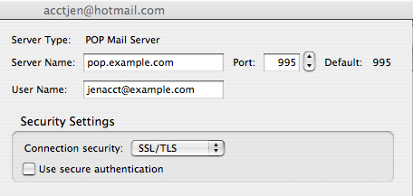

保存这些更改后，您应该能够发送和接收电子邮件了。

#### 3.1.2 Gmail的配置

要将 Thunderbird 配置为使用 Gmail，首先在您的 Gmail 帐户上启用 IMAP。请参阅Gmail 的说明以获取帮助。（默认情况下，IMAP 在新的 Gmail 帐户上启用。）

接下来，选择文件 > 新建 > 现有邮件帐户...。将显示“邮件帐户设置”对话框。在您提供帐户信息（真实姓名、电子邮件地址和密码）后，Thunderbird 将自动配置您的 Gmail 连接。点击完毕，如果出现提示，请使用您的 Google 帐户登录，仅此而已！Thunderbird 将下载您现有的邮件，您的 Gmail 将可供使用。

1. Gmail 的特殊性

- 归档消息

为了与 Gmail 的行为保持一致，Thunderbird 将您的邮件存档在“所有邮件”文件夹中，而不是像其他帐户那样存档在“存档”文件夹中（如存档邮件文章中所述）

- 订阅文件夹和同步消息

了解 Gmail 标签和 Thunderbird 文件夹

Gmail 使用 IMAP 的特殊实现。在此实施中，Gmail 标签成为 Thunderbird 文件夹。当您在 Gmail 中为邮件应用标签时，Thunderbird 会创建一个与标签同名的文件夹并将邮件存储在该文件夹中。同样，如果您将邮件移动到 Thunderbird 中的文件夹，Gmail 将创建一个带有文件夹名称的标签并将其分配给邮件。

在下面显示的示例中，与“ [Gmail] ”文件夹处于同一级别的文件夹（“g+”、“个人”、“收据”、“旅行”和“工作”）对应于 Gmail 标签。

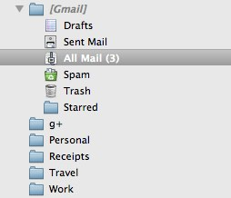

“ [Gmail] ”文件夹还有一组特殊的子文件夹：

    - 所有邮件：包含您 Gmail 帐户中的所有邮件，包括已发送和存档的邮件。您在收件箱中看到的任何邮件也将出现在[Gmail]/所有邮件文件夹中。
    - 草稿：包含草稿消息。
    - 已发送邮件：包含已发送的消息。
    - 垃圾邮件：包含被标记为垃圾邮件的邮件（由 Gmail 或 Thunderbird 标记）。
    - 已加星标：包含已加星标的邮件（通过 Gmail 或 Thunderbird）。
    - 垃圾箱：包含已删除的邮件。
    - 重要：包含 Gmail 标记为“重要”的邮件。（有关此 Gmail 功能的更多详细信息，请参阅优先收件箱概述。）

- 订阅或取消订阅文件夹（标签）

您可以配置要在 Thunderbird 中显示的 Gmail 文件夹。默认情况下会显示所有 Gmail 文件夹，如上所述。要配置文件夹显示，请右键单击帐户名称并选择订阅。

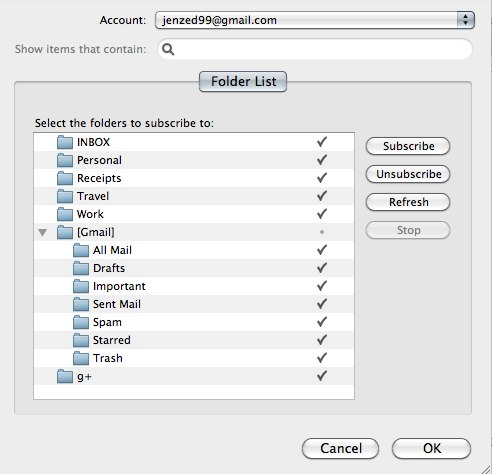

取消选中您不想在 Thunderbird 中显示的任何文件夹。邮件仍将通过“所有邮件”文件夹下载并可用。它们也将包含在搜索结果中。但是，不会显示 Gmail 标签（Thunderbird 文件夹）。

- 同步文件夹（标签）

如果您想在 Thunderbird 中查看所有 Gmail 标签和邮件，但希望避免将所有邮件下载到您的系统，您可能需要调整同步设置。这允许您定义应同步的文件夹。如果不同步文件夹，Thunderbird 中仍会显示邮件头，但只有点击邮件头时才会下载邮件内容。

要更改下载消息的方式，请为帐户和单个文件夹设置同步选项。（工具 > 帐户设置...）有关详细信息，请参阅IMAP 同步。

- 有用的附加组件

如果您想在 Thunderbird 和 Gmail 之间同步您的联系人，您应该尝试使用Google 联系人或gContactSync插件。

如果您想在 Lightning 和 Google 日历之间同步您的日历，您应该阅读将 Lightning 与 Google 日历一起使用。

平面文件夹树有助于在与其他文件夹相同的级别显示 [Gmail] IMAP 文件夹的所有子文件夹。

Gmail 按钮可让您更轻松地将邮件移至“垃圾邮件”和“垃圾邮件”文件夹。测试版还显示每封邮件的所有 Gmail 标签。

#### 3.1.3 自动帐户配置

使用 Thunderbird 设置新帐户很容易。您需要做的就是提供您的电子邮件提供商的用户名和密码以及您的电子邮件地址。Thunderbird 通过在包含所有主要互联网服务提供商 (ISP) 的连接信息的数据库中查找您的电子邮件提供商来确定连接详细信息（例如端口、服务器名称、安全协议等）。在确定您的帐户提供者（在您的电子邮件地址中的“@”符号后指定）后，Thunderbird 通常可以提供帐户详细信息。

    您的计算机必须连接到 Internet，Thunderbird 才能自动创建您的帐户。

安装后第一次打开 Thunderbird 时，系统会提示您创建配置文件。（在此阶段关闭任何建议设置电子邮件服务的窗口并继续）。接下来，您将被要求在下面显示的对话框中提供有关您的电子邮件帐户的详细信息。添加新电子邮件帐户时也会显示该对话框（使用File > New > Existing Mail Account...或通过Account Settings）。添加新帐户的另一种方法是单击现有帐户名称（显示的电子邮件地址）。在“帐户”标题下有两个选项：“查看此帐户的设置”和“设置帐户”。在“设置帐户”下，单击“电子邮件”

当你点击继续，Thunderbird 将查找电子邮件提供商并尝试确定服务器设置。

在上述情况下，提供者数据已用于填写帐户详细信息并配置所提供的服务：

- 接收邮件：imap.gmx.net 上的 IMAP，使用安全套接字层 (SSL)
- 外发邮件：mail.gmx.net 上的 SMTP，使用 SSL

您可以选择 IMAP 或 POP 作为您的传入邮件协议。IMAP 和 POP 是检索电子邮件的标准协议。IMAP 是一种更现代的协议，允许您同时在邮件服务器和本地计算机上存储消息。POP 协议只允许本地存储消息。电子邮件提供商可以通过 IMAP 或 POP 协议提供访问，也可以同时支持这两种协议。（要更好地了解这两种协议的技术细节，请参阅术语表，包括帐户类型和IMAP 同步。）

要完成帐户设置：

- 创建账户：单击此按钮创建一个新帐户。
- 取消：中止帐户的自动设置。
- 手动设置...：手动配置帐户。Thunderbird 将使用显示的详细信息创建一个新帐户，然后打开“帐户设置”对话框，以便您进行进一步更改。（请参阅手动帐户配置以获取帮助。）

创建帐户后，Thunderbird 将显示新帐户：

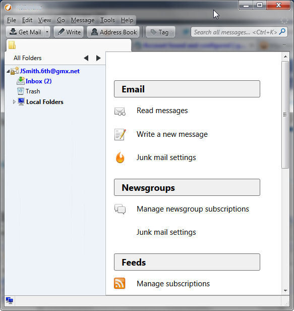

如果您的帐号无法被 Thunderbird 自动配置，您必须手动配置。这是通过从工具菜单访问的帐户设置对话框完成的。您的电子邮件帐户提供商可以提供有关连接信息的详细信息。（这些信息可能可以从他们的网站获得。）请参阅手动帐户配置文章以获取完整说明。如果您需要将传入服务器从 IMAP更改为 POP，请参阅常见问题解答将 IMAP更改为 POP。

#### 3.1.4 将 IMAP 更改为 POP

从 Thunderbird 3 开始，新的自动帐户配置向导可以帮助您配置与电子邮件提供商的连接，但前提是您的提供商在 Mozilla 的 Internet 服务提供商数据库中或被 Thunderbird 认可。虽然包括了大多数大型提供商，但许多较小的提供商尚未包含在帐户配置数据库中。

如果您的邮件服务器同时支持 IMAP 和 POP，Thunderbird 将默认使用 IMAP。还支持 POP，但必须使用以下说明手动配置：

本文档将向您展示如何为 POP 访问（而不是 IMAP）配置新帐户。无法转换现有的 IMAP 帐户。删除说明在本文末尾。

1. 选择工具 > 帐户设置... > 帐户操作 > 添加邮件帐户。

2. 输入您的用户名（与您的邮件提供商核实；这是您的完整电子邮件地址）和密码，然后单击继续。

3. Thunderbird 将尝试使用 IMAP 自动配置您的帐户设置。单击停止。

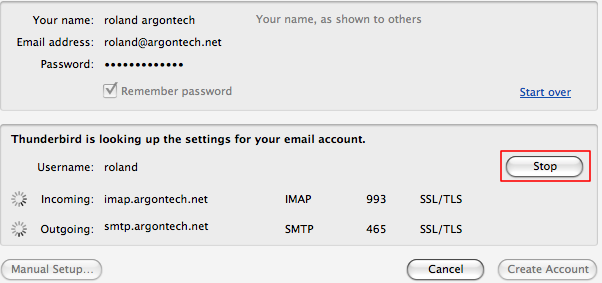

4. 输入您的帐户详细信息，如下所示：

- 用户名：输入您的完整电子邮件地址（或您的电子邮件提供商推荐的任何内容，通常是您的完整电子邮件地址，尽管有时只是“@”之前的部分）。
- 传入：输入您的传入电子邮件提供商的服务器（通常是“ mail.yourmailprovider.com ”或“ pop.yourmailprovider.com ”，例如“ mail.argontech.net ”）。
- 传出：输入您的传出邮件提供商的服务器（通常是“ mail.domainname.com ”或“ smtp.domainname.com ”）。
- 从接收邮件服务器名称右侧的下拉列表中选择“POP”（屏幕截图中标记为“Incoming:”的行）。这很重要，因为如果选择了 IMAP，您以后将无法将其更改为 POP！
- 传入端口号：这取决于电子邮件提供商。
- 传出端口号：这取决于电子邮件提供商。
- 传入安全性：这取决于电子邮件提供商。
- 传出安全性：这取决于电子邮件提供商。

5. 输入这些设置后，单击手动设置

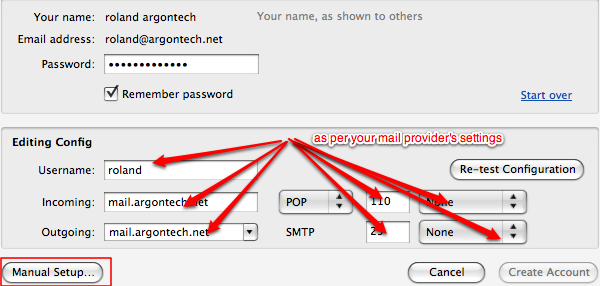

您可能会收到一条错误消息，指出 SMTP 帐户已存在。清除消息。

6. 单击“取消”退出“帐户设置”对话框。重新打开帐户设置页面，您将看到您的新帐户已创建。另请检查您的发送服务器 (SMTP) 是否适用于该帐户（在屏幕截图的底部）。

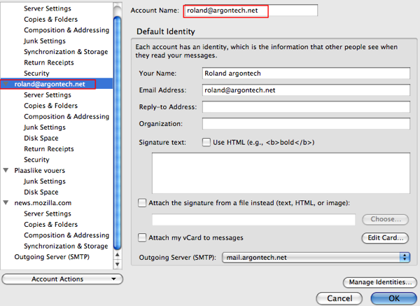

检查您的传入和传出邮件是否正常工作。
如果一切正常（即您可以发送和接收电子邮件并查看旧电子邮件；请注意，某些电子邮件提供商可能不会让您访问您的所有电子邮件或所有电子邮件文件夹；请咨询您的邮件提供商）并且您不小心创建了一个IMAP 帐户，然后按如下方式删除意外创建的 IMAP 帐户：打开工具 > 帐户设置...，使用 IMAP 服务器设置选择意外创建的 IMAP 帐户，然后从帐户下方的下拉列表中选择帐户操作 > 删除帐户列表在左侧。

有关帐户连接信息的更多信息，请参阅手动帐户配置。

#### 3.1.5 手动账户配置

当您配置电子邮件帐户时，Thunderbird 通常能够自动完成大部分配置。（有关更多信息，请参阅自动帐户配置。）但是，如果您的电子邮件提供商未在 Thunderbird 的自动配置数据库中列出，或者您有非标准的电子邮件配置，您将需要手动配置您的帐户。此页面将向您显示发送和接收电子邮件所需的基本设置。

如果您自动创建的帐户被分配给 IMAP 而不是 POP 服务器，请参阅常见问题解答将 IMAP 更改为 POP 一文。

要手动配置帐户，您将需要由您的电子邮件提供商提供的以下详细信息。

- 接收邮件服务器和端口（例如，“pop.example.com”和端口 110 或“imap.example.com”和端口 143）
- 外发邮件服务器和端口（例如，“smtp.example.com”和端口 25）
- 与服务器连接的安全设置（例如，“STARTTLS”或“SSL/TLS”以及是否使用安全身份验证）

首先，打开帐户设置：在 Thunderbird 菜单栏中，单击工具菜单并选择帐户设置，或单击应用程序菜单按钮并从子菜单中新的外汇菜单选择选项和帐户设置。每个已配置的电子邮件或新闻组帐户都列在“帐户设置”对话框的左侧。这些帐户对应于“所有文件夹”列表中显示的顶级文件夹。

在左窗格的底部，单击“帐户操作”按钮并选择“添加邮件帐户...”。

输入您的电子邮件帐户详细信息，然后按继续。Thunderbird 将尝试根据您的电子邮件地址的域部分（即“@”符号后面的部分）来确定您的帐户设置。然后按手动配置并编辑服务器名称、端口和 IMAP/POP 以手动设置帐户。单击重新测试以测试您的手动设置；应该有一个快速响应，表明设置是有效的。如果没有，请按停止按钮中止查找，然后编辑服务器名称、端口和 IMAP/POP 并再次单击重新测试。（或者，您可以允许查找收集默认帐户详细信息，然后稍后手动更改设置。）

- 配置传出服务器

多个电子邮件帐户可以使用同一个传出 SMTP 服务器。因此，SMTP 服务器是与电子邮件帐户分开创建的。在“帐户设置”对话框的左侧窗格中，从列表底部选择传出服务器 (SMTP) 。结果列表中可能有一个条目是在您输入帐户详细信息时创建的。编辑该条目或添加新条目。

作为另一个示例，Gmail 帐户配置如下：

- 服务器名称：smtp.gmail.com
- 端口：587
- 使用名称和密码：选中
- 用户名：您的 gmail 用户 ID，不带“@gmail.com”扩展名（例如，如果您的电子邮件地址是 brian@gmail.com，那么您的用户名是“brian”）。如果您使用的是 Google Apps for Domains，请使用您的完整地址（例如，“billsmith@yourdomain.com”）。
- 连接安全：STARTTLS

保存有关新发送服务器的信息后，从列表中选择您的新电子邮件帐户。在传出服务器 (SMTP)字段中，从下拉列表中选择 SMTP 服务器。当您输入帐户详细信息时，页面上的其他项目会自动创建 - 根据需要进行更改和扩展。

单击新帐户下的服务器设置选项。确保以下字段中的条目与您的电子邮件提供商提供给您的设置相对应：

保存这些更改后，您应该能够发送和接收电子邮件了。

#### 3.1.6 从 POP 切换到 IMAP 帐户

关于IMAP 同步的文章解释了 IMAP 的好处，它是最现代和最广泛使用的电子邮件协议。（POP 是较早的协议，功能较少。）如果您想将现有的 POP 帐户转换为 Thunderbird 中的 IMAP 帐户，请按照以下步骤操作。

- 检查您的邮件提供商是否支持 IMAP

虽然大多数邮件提供商都支持 IMAP，但仍有一些不支持。所以首先确保您的邮件提供商支持 IMAP。

如果您的提供商不支持 IMAP 而您仍想使用 IMAP 帐户，您必须选择一个新的邮件帐户提供商（例如，在 Thunderbird 中支持 IMAP 的那些），创建一个帐户，然后从旧的 POP 中移动您的邮件帐户到您的新 IMAP 帐户，如下所述。

- 禁用您的 POP 帐户

为了避免重复检查新邮件，首先通过打开工具> 帐户设置菜单进入您的帐户设置，然后选择服务器设置并取消选中启动时检查新邮件和每 XX 分钟检查一次新邮件。

- 创建 IMAP 帐户

1. 打开文件 > 新建 > 现有帐户菜单
2. 在助手的帮助下设置您的帐户。
3. 当它询问您是否要使用 POP 或 IMAP 时，选择IMAP（远程文件夹）。

4. 您的新 IMAP 帐户将被创建并显示在您现有邮件帐户的底部。
5. 花时间测试一切是否正常。检查您的特殊文件夹是否被正确识别（即用于存储已发送邮件的文件夹应该有自己的图标，对于Trash、Junk和Draft文件夹也是如此）。

- 将本地消息传输到服务器

如果您的 POP 帐户中有想要通过 IMAP 帐户访问的邮件或文件夹，只需选择它们并通过拖放将它们移动到您的 IMAP 帐户。根据您移动的邮件数量，上传可能需要几分钟时间。要有耐心; 你快完成了。

    或者，您也可以使用 本地文件夹帐户来存储旧电子邮件，而不是将它们移动到 IMAP 服务器，尤其是在 IMAP 服务器的存储容量有限的情况下。

- 删除您的 POP 帐户

如果您要将电子邮件帐户从 POP 转换为 IMAP，当您完全确定已将所有重要邮件移至 IMAP 服务器（或本地文件夹）时，您可以删除 POP 帐户。您无法轻松撤消此操作，因此请确保您确实不再需要存储在此帐户中的消息。

1. 通过打开菜单工具> 帐户设置来打开您的帐户设置，然后选择您的 POP 帐户。
2. 点击帐户操作底部的按钮，然后选择Remove Account。

如果您创建了一个使用 IMAP 的新电子邮件帐户，则无法在不删除电子邮件地址的情况下删除旧的 POP 帐户。在删除 POP 帐户之前，您可能需要通知向您的旧帐户发送邮件的人，他们应该切换到您的新电子邮件地址，并在删除 POP 帐户之前等待一段时间，以确保您不会错过任何消息。

#### 3.1.7 Thunderbird 中的邮件目录

Maildir的可选支持允许每封电子邮件有一个唯一的文件（使用EML数据格式），这与称为mbox的每个文件夹一个文件的默认单一文件格式不同。注意 – 这不是完整的 Maildir，因为大多数用户，尤其是 Linux 或邮件管理员，都知道 Maildir。您不能将 Thunderbird 帐户指向邮件服务器目录，也不能将邮件标志与电子邮件一起存储。有关更多详细信息，请参阅wiki。

Maildir 默认情况下是禁用的，因为仍然存在许多错误。它不是 100% 为用户准备好的。

    警告：我们建议您禁用 Maildir，除非您是高级用户，愿意为您的数据冒险，并且知道如何在打开 Maildir 之前 备份您的电子邮件以及在遇到问题时如何恢复它。

本文的其余部分解释了格式更改以及如何测试 Maildir。

Maildir 是 Thunderbird 的一个重大变化，因为它改变了邮件存储机制。每个电子邮件存储格式的单个文件具有显着优势：

备份更容易、更短，因为要备份的数据量减少到只有自上次备份以来发生更改的电子邮件。
防病毒软件可以更轻松地扫描单个文件中的电子邮件，并且可以删除受感染的邮件而不会丢失文件夹中的所有其他邮件，就像今天的防病毒软件无法在一个文件中处理多个电子邮件一样。

- 如何打开邮件目录

    警告：同样，此功能是实验性的，我们建议您在打开 Maildir 之前了解如何提交错误以及如何备份和恢复您的电子邮件。

要打开 Maildir：

1. 备份您的电子邮件。
2. 在 Thunderbird 窗口的顶部，单击工具菜单并选择选项，或单击菜单按钮并选择选项。 
3. 选择“高级”面板，然后选择“常规”选项卡。
4. 在新帐户的消息存储类型旁边，选择
每条消息的文件 (maildir)
.
从现在开始创建的任何电子邮件帐户都将使用 Maildir。现有帐户将继续使用 mbox。如果您想再次为新帐户使用 mbox，只需重置配置变量。

要将现有帐户更改为使用 maildir，请参阅此文章。

#### 3.1.8 Thunderbird 78.0 中的新功能

本文介绍了 Thunderbird 78.0 版中用户可以看到的一些主要变化和新功能。

- 用于集中帐户设置的新帐户中心

设置 Thunderbird 来处理您的通信现在变得更加容易。新的帐户中心欢迎您使用 Thunderbird 可以处理的所有不同帐户类型、电子邮件、日历、地址簿、聊天、FileLink、新闻源和新闻组的整洁阵容。您还可以从其他程序导入数据。

添加您的第一个帐户后，始终可以使用较小版本的 Account Hub 来添加另一个帐户：在 Thunderbird 主选项卡的文件夹列表中选择任何帐户，您将在那里找到设置另一个帐户和从另一个程序导入部分.

- 改进的电子邮件帐户设置对话框：马上开始！

用于设置现有电子邮件地址以与 Thunderbird 一起使用的对话框已经过重新设计，以提供更好的用户体验。只需输入您的姓名、电子邮件地址和密码，Thunderbird 就会尝试从 Mozilla ISP 数据库中找到正确的配置。一分钟开始使用 Thunderbird！

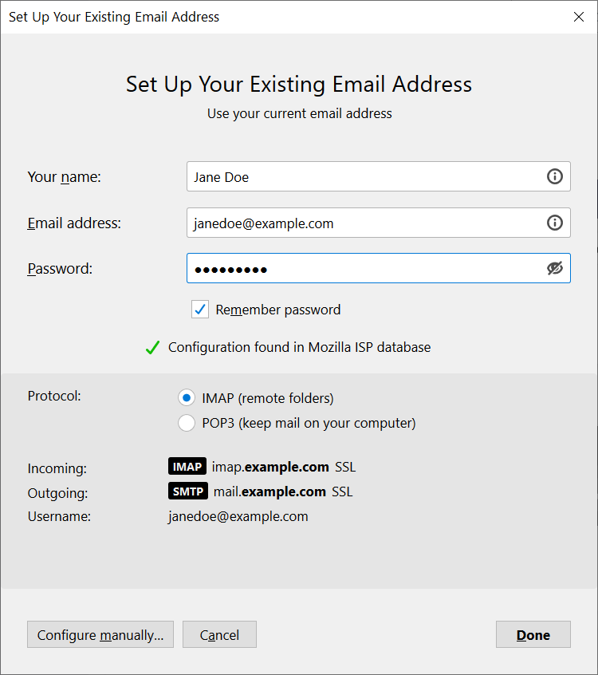

    您以后可以随时微调您的帐户设置。为方便起见，帐户设置现在显示在选项卡中，任何更改都会立即应用。

- 新地址区

写入窗口的寻址区域已从头开始重新设计，以提供更方便高效的用户体验。而在以前的 Thunderbird 版本中，您可以将不同类型的收件人全部混合在一起，每个收件人一行，而单个地址行现在可以包含多个收件人。因此收件人将自动按类型分组，例如：收件人、抄送（副本）和密件抄送（密件抄送）。这使您更容易一目了然地查看哪些收件人属于哪个组。此外，每个收件人现在都是一个项目，这使得选择多个收件人并对其采取行动更加有效。开发人员有时会开玩笑地将收件人物品称为收件人药丸，因为一开始它们的角非常圆。

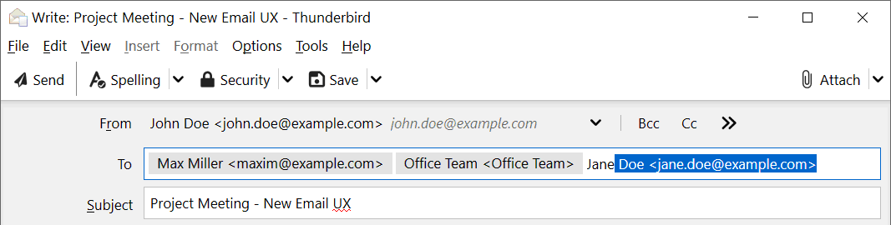

- 添加多个相同类型的收件人就像以前一样简单：开始输入您的收件人，自动完成将从您的地址簿中提出建议，然后按进入或者标签完成您的收件人，这将创建一个收件人项目。然后只需在同一行键入另一个并按进入再次。

- 要编辑或更正收件人项目，请使用鼠标或箭头键选择它←
或者→，然后按进入. 完成编辑后，只需按进入再次。

要添加一个或多个其他类型的收件人，请使用抄送,密送， 或者>>收件人：寻址字段顶部的按钮。您也可以按住转移键并按下标签根据需要经常导航到这些按钮。

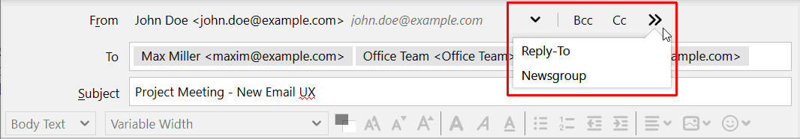

- 您仍然可以通过单击两次来更改一个或多个收件人的类型：右键单击您的选择，然后从上下文菜单中选择Move to Cc、Move to Bcc或Move to To中的任何一个。

- 现在，选择多个或所有收件人的效率比以前提高了99%。例如，您现在可以选择相同类型的所有收件人Ctrl+一个
并在一个步骤中复制、移动、剪切或删除所有这些。您也可以按住转移键选择一组收件人或Ctrl键选择不同的收件人。

- 用于回执的可选工具栏按钮

编写消息时，您可以要求收件人提供所谓的回执。当您的消息已被接收或显示时，您的消息的收件人（或接收电子邮件程序）可能会向您发送简短的手动或自动通知。

Thunderbird 提供了始终在全球范围内或仅针对选定帐户请求回执的选项，以及如何处理来自其他人的回执请求的选项。编写新消息时，您可能需要仔细检查是否需要回执，或者更改当前消息的选项。您现在可以为您的合成工具栏添加一个按钮。

- 右键单击“合成工具栏” > “自定义...”，或从主菜单中选择“视图” > “工具栏” > “自定义...”。
- 然后拖动收据按钮到合成工具栏上。

- 自定义邮件文件夹图标的颜色

Thunderbird 78 具有现代简约的外观，让您可以专注于通信。虽然不再提供传统的颜色图标，但您现在可以自定义文件夹列表中除帐户项目之外的任何文件夹的颜色：

- 右键单击文件夹 >属性>一般信息>图标颜色。
- 单击颜色选择器按钮选择另一种颜色，或单击⟲按钮恢复默认颜色。

- 用鼠标选择变得容易：新的选择消息列

您现在可以使用鼠标轻松选择各种消息，而无需按住任何其他键。有一个新的可选列可以使用选择框而不是经典的选择方法来选择消息。

在消息列表的右上角，单击带有工具提示的小列选择器按钮Select columns to display。
检查选择消息。

- 使用鼠标删除消息变得容易：新的删除列

您现在可以通过单击鼠标轻松地从消息列表中删除消息。有一个用于删除消息的新可选列。

在消息列表的右上角，单击带有工具提示的小列选择器按钮Select columns to display。
检查删除。

您现在可以通过单击列表中消息行上的小垃圾箱图标来删除任何消息。

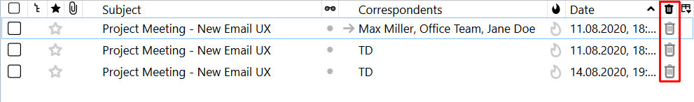

- 在附加组件管理器中预览主题

Thunderbird 带有三种不同的视觉主题：

- 默认值：具有操作系统配色方案的主题。
- 深色：具有深色配色方案的主题。
- Light：带有浅色方案的主题。

选择您最喜欢的主题变得更加容易，因为您现在将在附加组件管理器中看到每个主题的迷你轮廓预览，这让您对主题颜色有第一印象。当你选择使能够对于新主题，它将立即应用。

如果您在屏幕前花费大量时间 - 试试 Thunderbird 的 Dark 主题吧！

≡ >附加组件>主题>管理您的主题

主题现在适用于 Thunderbird UI 的大部分区域，未来还会有更多改进！

- 日历：预览并选择要从 ICS 文件导入的事件

当您导入 ICS 格式的日历文件时，您现在可以预览包含的事件并导入其中的部分或全部。

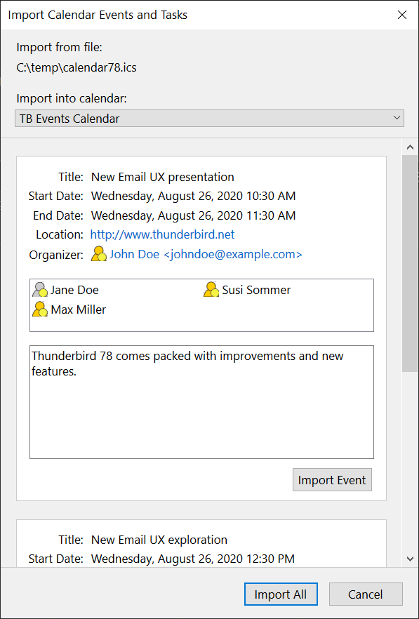

要从 ICS 文件导入日历数据：

≡ >事件和任务>导入…

然后选择一个带有 .ics 文件扩展名的文件进行导入。您还可以从命令行导入 ICS 文件。

- 日历：通过 -file 命令行选项导入 ICS 文件

现在可以使用-file命令行选项从命令行导入带有日历事件的 ICS 文件。这将显示导入日历事件和任务对话框，您可以在其中预览和选择要导入的事件。

- 聊天：支持 OTR 协议

Thunderbird 的聊天组件现在还支持所谓的Off the record消息标准，该协议为即时消息对话提供加密。

### 3.2 阅读、发送和整理电子邮件

#### 3.2.1 阻止发件人

Thunderbird 没有阻止来自特定人员或域的电子邮件的选项。但是，您可以使用邮件过滤器自动处理不需要的邮件。

邮件过滤器在每个帐户的基础上运行，因此当您设置过滤器时，您必须将其配置为对正确的帐户进行操作。最简单的方法是：

选择来自您希望阻止的发件人的邮件：右键单击发件人的地址并选择Create Filter From...。

这将打开过滤器规则窗口，其中电子邮件地址已插入过滤器。

- 命名过滤器。像“阻止列表”这样的东西是合适的。
- 在窗口的下半部分，将要执行的操作更改为Delete Message。

- 点击好的保存过滤器。下次该人向您发送邮件时，该邮件将被自动删除。

您创建的消息过滤器可以通过在工具菜单中选择消息过滤器...条目来打开和编辑。不必为要阻止的每个地址创建单独的过滤器。现在您有了阻止列表过滤器，下次您想要阻止某人时，您可以通过单击将该人的地址添加到过滤器的顶部+按钮，从而创建一个新字段来输入新地址。确保选择“匹配以下任何一项”选项，因为您希望它在任何列出的地址上触发。

#### 3.2.2 收不到消息

更新到Thunderbird 78版后突然出现问题...试试这个！
Thunderbird 78 期望所谓的 TLS 网络加密协议有更高的安全标准。如果您的提供商不支持较新版本的协议，则发送和接收消息可能会失败。您可以暂时降低标准以检查这是否是您的问题的原因。

- 您的帐户配置正确吗？

要查看帐户设置，请在 Thunderbird 菜单栏中选择工具> 帐户设置，或单击应用程序菜单按钮并从子菜单中新的外汇菜单选择选项和帐户设置，然后从列表中选择帐户名称的服务器设置左边。与接收邮件服务器的连接配置在右侧页面的顶部。

您的电子邮件帐户提供商可以为您提供有关其服务器的连接信息（可能在他们的网站上）。确保您的帐户设置与这些设置相匹配。

- 您接收邮件的能力突然停止了吗？以前可以用吗？

    - 检查您的 ISP 的服务状态。（许多 ISP 在其网站上都有状态或警报页面。）他们可能遇到技术问题。
    - 如果您的 ISP 提供基于 Web 的电子邮件界面，请尝试登录并查看您的邮件。如果您可以看到您的消息，则问题可能与您的帐户配置有关。
    - 如果您无法登录 ISP 基于 Web 的电子邮件界面，您的密码可能已更改。如果是这样，也必须在 Thunderbird 中进行更改。要更改您的密码：

        - 在 Thunderbird 窗口的顶部，单击工具菜单并选择选项，或单击菜单按钮并选择选项。 在安全面板，点击密码选项卡，然后单击已保存密码...
        - 点击相关账户，然后点击消除
        - 关闭并重新打开 Thunderbird。系统将提示您输入该帐户的新密码。
    
    - 如果您最近更新了 Thunderbird，您的 Internet 安全套件的防火墙组件可能已阻止新版本的 Thunderbird 访问 Internet。发生这种情况时，IMAP 文件夹也可能会消失。这里有一些关于防病毒产品及其与 Thunderbird 的已知不良交互的基本信息。从防火墙的受信任或可识别程序列表中删除 Thunderbird，然后手动添加（或在出现提示时）。否则，请查阅您的安全套件/防火墙/防病毒产品的文档，了解如何修改该产品的防火墙组件的说明。
    - 如果您最近将 Thunderbird 更新到版本 38，请检查您是否受到与 Logjam 相关的更改的影响。

- 您是否收到一些电子邮件而不是其他电子邮件？
    - 您的 ISP 是否有可能在服务器上保留或删除邮件的垃圾邮件过滤器？
    - 您是否在 Thunderbird 中创建了可能错误归档消息的过滤器？

#### 3.2.3 消息中的远程内容

电子邮件消息可以包含远程内容，例如图像或样式表。为了保护您的隐私，Thunderbird 不会自动加载远程内容，而是显示一个通知栏来指示它阻止了远程内容。

什么是远程内容，为什么会被阻止？
远程内容是消息的一部分（例如图像、样式表或视频），它们不包含在消息本身中，而是在您查看消息时从 Internet 下载的。

远程内容是一个隐私问题，因为它允许消息发送者知道：

- 每次查看消息
- 有关您使用的应用程序和平台的粗略细节
- 您当前的地理位置（按 IP 地址粗略估算）
- 您的电子邮件地址已被实际使用（“活动”）

这与网站在正常上网期间通常收集的关于您的信息几乎相同。虽然浏览具有相同的隐私含义，但消息中的远程内容的不同之处在于它最初是针对您的，因此您可以假设您的访问可以直接链接到您的电子邮件地址。这也是为什么垃圾邮件通常包含远程图像（也称为“网络错误”），如果图像被加载，垃圾邮件发送者可以将您的地址标记为有效。

- Thunderbird 如何保护我的隐私？

默认情况下，Thunderbird 会阻止且不下载远程内容，因此发件人不会获得有关您的任何信息。相反，它会显示一个通知栏，其中包含消息为了保护您的隐私，Thunderbird 已阻止此消息中的远程内容。

- 显示特定消息、发件人或网站的远程内容

如果您信任发件人，则可以允许下载远程内容。打开图像和样式表后，电子邮件看起来会更好。要加载远程内容，请单击选项在通知栏中，然后选择以下选项之一：

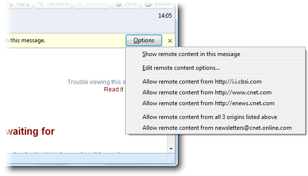

- 在此消息中显示远程内容以仅针对此特定消息显示远程内容；
- 编辑远程内容选项……默认显示远程内容（见下一​​节）；
- 允许来自 <website>的远程内容显示存储在该站点上的远程内容（要从消息所指的所有站点加载远程内容，请单击允许来自上面列出的所有来源的远程内容）；
- 允许来自 <电子邮件地址>的远程内容显示来自该发件人的所有邮件的远程内容。

    允许来自...的远程内容将发件人电子邮件地址或站点（当前在邮件中阻止）添加到远程内容例外列表。

但是请注意，与提供远程内容的网站相比，电子邮件地址很容易被欺骗。只要网络没有受到威胁，欺骗内容比电子邮件地址要困难得多。

- 默认显示远程内容

如果您愿意接受为所有消息显示远程内容的隐私影响，Thunderbird 允许您默认显示远程内容。要这样设置：

1. 在 Thunderbird 窗口的顶部，单击工具菜单并选择选项，或单击菜单按钮并选择选项。 
2. 选择隐私面板。
3. 选中允许消息中的远程内容复选框以默认加载所有远程内容。

    您可以从规则中排除特定网站。点击例外…按钮，输入网站或电子邮件地址，然后单击堵塞或者允许.

#### 3.2.4 全局搜索

Thunderbird 包含一个名为“Gloda”的消息索引和搜索系统，它是“全球数据库”的缩写。它提高了搜索性能，提供了复杂的全文搜索功能并显示了多面（分类）搜索结果。

全局搜索会查询您的所有消息，无论消息关联的帐户或存储消息的文件夹如何。另一方面，快速过滤器用于在当前消息列表中搜索消息。

默认情况下启用全局搜索。（可以在 Thunderbird选项的高级面板中禁用它。）全局搜索文本框位于工具栏右侧的快速过滤器栏上方。

在所有邮件的所有字段中执行搜索：主题、邮件正文、发件人地址、收件人地址等。搜索不区分大小写 - 搜索“thunderbird”将返回同时包含“thunderbird”和“Thunderbird”的邮件.

您可以在搜索项的末尾使用通配符“*”。然后，“thunder*”不仅会查找带有“Thunderbird”的消息，还会查找有关“thunderbolts”的消息。

搜索结果显示在新选项卡中。您将能够按各种标准过滤搜索。

- 搜索单个关键词

在搜索框中输入一个词。在您键入时，下拉列表将显示您的术语可能的匹配项（例如与您输入的字符匹配的电子邮件地址）。

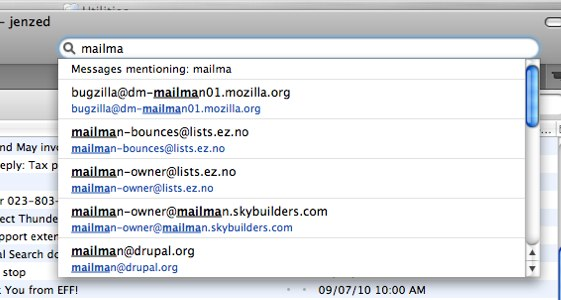

- 搜索多个关键词

在搜索框中输入多个词。Thunderbird 将搜索包含每个指定术语至少出现一次的消息。如果您将多个词用引号括起来，Thunderbird 会将这些词作为短语进行搜索。也就是说，搜索结果将只包含所有单词都按照在搜索字段中指定的顺序的消息。这两种类型的搜索可以组合起来。例如，如果您输入：

转换“imap pop”

...Thunderbird 会找到包含关键词“converting”和短语“imap pop”的电子邮件。

例子：搜索关键词“new”、“Thunderbird”和“pages”（不带任何引号）。结果应包括包含每个关键词至少出现一次的消息

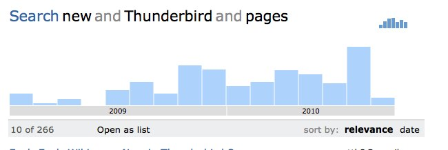

搜索短语“新的 Thunderbird 页面”。结果应包括包含整个短语的消息：

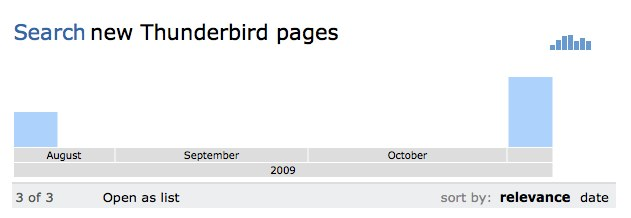

您可以组合这两种类型的搜索。例如，搜索“New Thunderbird”和“pages”会返回包含短语“new Thunderbird”和单词“pages”的消息：

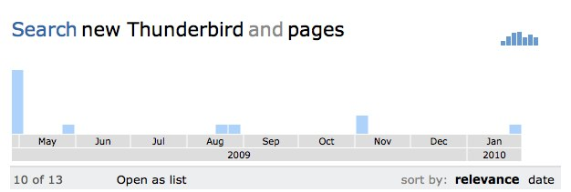

- 搜索结果

搜索结果显示在新选项卡中。左侧有一个面板，用于对结果进行分类，例如显示在与特定人员的对话中或存储在特定邮件文件夹中的消息中包含术语的消息数量等。

- 过滤搜索结果

使用左侧面板中的过滤器字段过滤原始搜索返回的消息。如果您单击“文件夹”、“人员”或“帐户”下的项目，您将可以选择指定消息是否必须（或不得）包含该项目。

例如，假设您正在搜索“Thunderbird”和“页面”。您可以通过选择您是收件人的邮件（通过单击To Me复选框）来优化搜索结果。然后，您可以通过选择与消息关联的特定人员和邮件文件夹（通过单击左侧面板中的文本）来进一步优化结果。（要从过滤条件中删除选定的人员或邮件文件夹，请再次单击该文本。）

- 按日期分析和过滤搜索结果

时间线显示在搜索结果中包含的消息上方。时间线显示符合搜索条件的消息数量，按时间顺序排列。

单击其中一个条或月、日或年标签以更改显示的时间段。

如果您将鼠标悬停在左侧面板中的某个过滤条件上（没有实际激活过滤器），时间线栏中较暗的区域会显示与该条件相关的消息何时发送/接收。

单击右上角的条形图图标可切换时间线显示。

- 留言列表

单击搜索结果中的消息以查看它。它将在新选项卡中打开，以及具有相同主题的其他邮件。您的原始搜索将在搜索选项卡中保持不变，因此您可以返回并继续搜索。

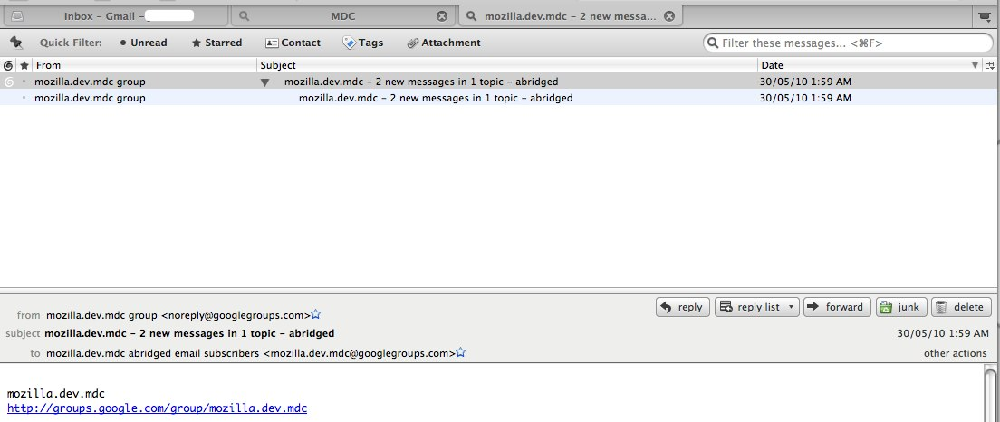

当显示消息列表时，您可以使用快速过滤字段在列表中进行搜索。

#### 3.2.5 大型附件的文件链接

借助 Thunderbird 的 FileLink 功能，您可以将大型附件上传到云端并发送链接，而不是将它们直接附加到您的电子邮件中。此功能由Filelink 提供程序附加组件提供。

T- hunderbird 的文件链接功能
许多电子邮件服务器不接受带有大文件附件的邮件。文件大小限制因邮件服务器配置而异。虽然您可以发送带有大附件的邮件，但接收邮件服务器可能会拒绝接受带有大附件的邮件。这一切都超出了雷鸟的控制范围。

Thunderbird 的 Filelink 功能通过提供对在线存储服务的支持消除了这个问题。它允许您将附件上传到在线存储服务，然后将邮件中的附件替换为指向该在线存储的链接。邮件收件人单击链接以下载附件。作为额外的好处，发送和接收大文件的速度要快得多，您和收件人都将节省磁盘空间。

请注意，除了常规附件之外，您还可以使用 Thunderbird Filelink 。例如，您可以将小文件直接附加到邮件中，并将 Filelink 用于同一邮件中的大附件。

- 添加文件链接

要使用此功能，您需要先安装一个Filelink 提供程序附加组件，如下所述。对于某些在线存储服务提供商，您可能需要先创建一个新帐户或使用他们配置现有帐户。

- 点击≡>首选项>作文>附件>查找更多提供者...
- 选择一个 FileLink Provider 插件，然后单击＋ 添加到雷鸟
- 从弹出面板确认附加权限添加
- 在首选项的附件部分（见上文），单击按钮添加 [您的 FileLink 提供商]
- 根据插件的要求添加信息。
- Thunderbird 会建议对大于 5 MB 的附件使FileLink（您可以在同一部分更改阈值），或者您可以右键单击常规附件进行转换。

    - 如果您想在邮件附件超过一定大小时提示您使用 Filelink，请勾选以下选项：[✓] 为大于 [5] MB 的文件提供共享

    - 您还可以根据需要更改阈值文件大小。

- 使用文件链接

当您将文件附加到邮件中，并且文件大小超过您在上面指定的大小时，Thunderbird 将自动提供使用 Filelink：

- 点击关联按钮将文件上传到在线存储服务提供商。
- 如果您希望将文件作为常规附件附加，请选择忽视
- 选择后关联，您的文件将在后台上传，显示的消息将更新为：

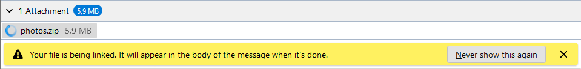

    无论文件大小和 Filelink 通知如何，您始终可以使用 Filelink 强制附加文件：
    - 选择下箭头    附上 | v    合成工具栏上的按钮以访问Filelink子菜单。
    - 右键单击常规附件，然后从上下文菜单中选择Convert to... > [Your FileLink provider]。您可以从启用的提供商列表中进行选择。

链接完成后（即您的附件已上传到服务提供商），Thunderbird 将自动在消息中添加一个部分，其中包含指向您文件在线副本的链接，如下所示：

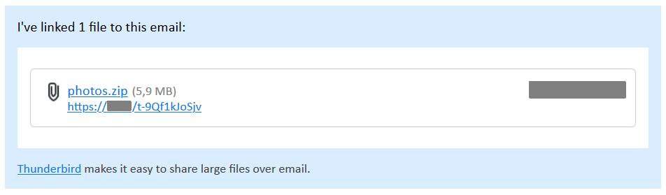

    注意：如果在帐户设置中关闭了 以 HTML 格式撰写邮件，则链接部分将以纯文本显示 。

当您的收件人收到邮件时，他们将看到相同的信息，单击邮件中的链接会将他们带到可以下载附件的页面。

#### 3.2.5 签名

“签名”是自动附加到您发送的每条消息（包括新消息和对传入消息的回复）的文本块。它们通常用于提供与每封电子邮件相关的其他联系信息、法律条款或其他一些样板信息。

- 关于签名

创建签名有两种基本方法。可以直接在“帐户设置”中为所选邮件帐户创建简单的文本签名，如下面的“纯文本签名”和“HTML 签名”部分所述。

如果您希望更好地控制文本的位置并且可能需要包含图像，则可以使用所有可用的格式化工具在 Thunderbirds 的“写入”撰写窗口中创建简单或更复杂的签名。请参阅下面的“存储在文件中的签名”部分。

一个简单的文本电子邮件签名可能会这样写：
    张三
    项目主管

    RISC-V openEuler团队

在 Thunderbird 的帐户设置界面中创建简单的文本签名。单击菜单按钮Fx57 菜单（或在“菜单栏”上使用工具）> 帐户设置，然后在左侧面板中选择要为其创建签名的帐户。

如果您有多个电子邮件帐户，则必须为每个帐户分别配置签名。

- 纯文本签名

要配置纯文本签名，请在签名文本字段中输入要附加到每封传出消息的文本。纯文本签名适用于 HTML 格式和文本格式的消息。

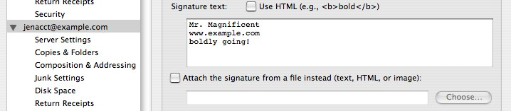

...结果是...

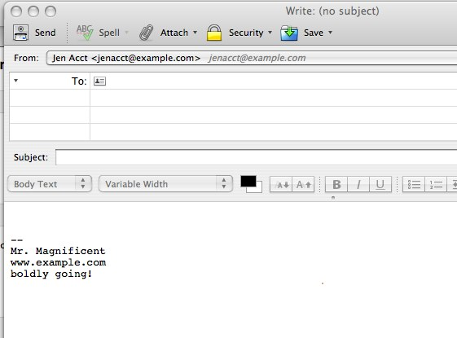

- HTML 签名

要在您的签名中使用 HTML 格式，请选中使用 HTML并使用所需的 HTML 标记格式化签名文本。如果您以文本（而不是 HTML）格式发送消息，文本字符将替换 HTML 标记。

...结果是...

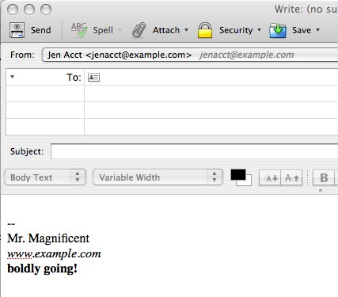

- 存储在文件中的签名

或者，在帐户设置中，您可以上传包含您签名的文件。选中从文件中附加签名，然后单击选择...选择文件。该文件可以包含纯文本或 HTML 格式的文本。如果您有 HTML 格式的签名，则邮件收件人必须能够在其电子邮件程序中查看 HTML 格式的邮件。如果他们禁用了此功能，则签名将以文本格式呈现，并且不会显示图像。

您可以使用 Thunderbird 作曲家创建签名文件。例如，在 Thunderbird 中打开一个新的 HTML 格式的消息窗口（文件 > 新建 > 消息）或单击位于“邮件工具栏”上的写入。确保显示格式工具栏。

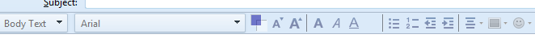

（如果未显示，则您正在编写文本格式的消息，而不是 HTML。要更改为 HTML，请选择选项 > 传送格式 > 仅富文本 (HTML)。）

1. 根据需要编写和格式化您的签名。请注意，“插入”和“格式”菜单中提供了许多格式化功能。

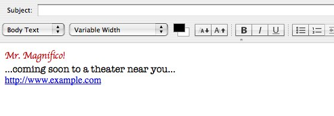

2. 单击文件 > 另存为 > 文件。选择保存 HTML 文件的位置。确保选择另存为类型：“HTML 文件”，然后指定文件名并单击节省

3 .关闭消息窗口并丢弃消息而不保存。

4. 打开帐户设置并在左侧面板中选择电子邮件帐户。

5. 选中从文件中附加签名，单击选择并导航到您创建的文件。

- 在签名中包含图像文件

要将本地计算机中的图像文件包含在签名中，请按照上述步骤创建 HTML 签名。但是，当您编写签名内容时，请使用“插入”>“图像”菜单选项来指定所需的图像。

除了选择图像文件，使用此对话框配置图像的其他方面，例如大小、URL 链接、其相对于文本的位置等。

您还可以将位于 Web 服务器上的图像指定为附件的一部分。只需在要指定文件名的字段中指定图像 URL。如果您选中“将此图像附加到邮件中”，则该图像将作为附件包含在内。如果您不附加图像，则消息收件人必须具有 Internet 连接才能查看图像。此外，请记住，出于安全原因，许多人将他们的电子邮件程序配置为阻止远程内容，这将阻止图像显示，除非它附加到消息中。

- 使用电子名片

vCard是电子名片的文件格式标准。vCard 可以包含姓名和地址信息、电话号码、电子邮件地址、URL、徽标、照片等。如果收到的消息有 vCard 作为附件，Thunderbird 会将 vCard 内容显示为签名。Thunderbird 可以配置为将您的 vCard 附加到传出消息（自动或基于每条消息）。有关说明，请参阅如何使用虚拟卡 (vCard)。

- 签名位置

当您回复消息时，默认情况下，您的签名将显示在消息末尾的引用文本下方。要更改此行为，请选择工具> 帐户设置 > <帐户名称> > 撰写和寻址。将回复样式更改为“在报价上方开始我的回复”。接下来，将“并放置我的签名”的设置更改为“在我的回复下方（引用上方）”。

可以为每个帐户和每个身份配置此设置。

#### 3.2.6 快速筛选工具栏

快速筛选工具栏可帮助您限制消息列表中显示的消息数量。例如，它可用于仅显示来自特定发件人的消息、包含特定单词的消息或带有附件的消息。

快速过滤器工具栏显示在消息列表上方。您可以通过单击显示或隐藏它过滤器图标

快速过滤器工具栏中的按钮或使用键盘快捷键Esc键隐藏它和Ctrl+转移+ķ把它带回来。

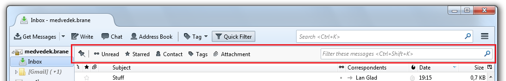

在搜索框中输入过滤条件后，您可以选择将过滤器应用于列表中邮件的发件人、收件人、主题和/或正文。（单击相关按钮以应用过滤器。）

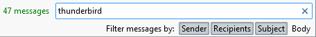

这些按钮具有以下功能：

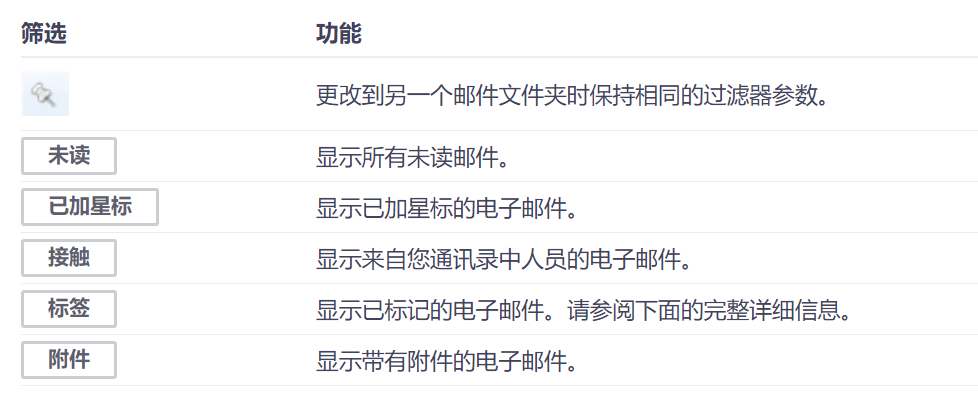

- 搜索多个标签
如果您使用 Thunderbird标记了一些电子邮件并单击标签，您将看到左侧下拉菜单右侧显示的所有标签。使用此下拉菜单，您将能够通过以下三种方式搜索多个标签：

- 通过单击任何一个，然后单击一个或多个标签以突出显示所需的标签，搜索所有带有任何突出显示标签的电子邮件
- 通过单击全部然后单击一个或多个标签以突出显示所需的标签，搜索所有带有所有突出显示标签的电子邮件
- 通过右键单击标签从搜索结果中排除具有某些标签的消息（您会在标签的按钮上看到删除线效果；意思是“不能有这个标签”）

#### 3.2.7 归档消息

Thunderbird 提供了归档消息的能力——也就是说，将它们从默认文件夹移动到归档文件夹而不完全删除消息。这样可以轻松组织档案或将它们移动到备份设备，并保持收件箱清洁。消息只能手动存档，不能自动存档。存档的消息由 Thunderbird 的搜索索引。

- 如何归档我的消息？

要归档一条或多条消息，请选择所需的消息，然后单击档案按钮，或直接按下一个在你的键盘上。建议您一次选择的消息不要超过 2,000 条。

- 如何配置归档？

可以为每个电子邮件帐户单独配置存档消息的位置。在工具> 帐户设置中，在左侧面板中选择所需的电子邮件帐户，然后选择副本和文件夹设置。在“邮件存档”部分中，使用将邮件存档保存在中的设置来设置所需的位置。

- 配置存档文件夹结构

您可以通过单击定义存档文件夹的结构存档选项...按钮。然后您可以选择是否要为所有档案使用单个文件夹，或者定义一些子文件夹，如下面的动画所示：

- 每个帐户多个身份

如果您为电子邮件帐户设置了其他身份，则可以为每个身份单独配置归档位置和文件夹结构。

#### 3.2.7 无法发送消息

如果您无法发送消息，此页面提供了一系列步骤，您可以按照这些步骤检查常见问题。如果您在接收消息时遇到问题，请参阅无法接收消息。

- 验证您的 SMTP 外发电子邮件设置

在 Thunderbird 菜单栏中，单击Tools菜单并选择Account Settings，或单击 Application 菜单按钮并从子菜单中新的外汇菜单选择Options和Account Settings ，然后从左侧面板的列表底部选择Outgoing Server (SMTP) . 检查设置是否与您的邮件提供商（Gmail、Yahoo、Comcast、Hotmail、Sympatico）的文章中记录的相同或

在邮件提供商的站点上查找 SMTP 邮件设置文章。这通常在他们网站的支持部分；搜索“邮件设置”或“SMTP”通常会找到它。检查您的 Thunderbird 设置是否与记录的设置匹配。

-验证正在使用正确的 SMTP 服务器

在 Thunderbird 菜单栏中，单击工具菜单并选择帐户设置，或单击应用程序菜单按钮并从子菜单中新的外汇菜单选择选项和帐户设置，然后选择帐户名称。验证您为电子邮件地址使用了正确的 SMTP 服务器。大多数情况下，您无法使用另一个帐户提供商的服务从一个帐户提供商发送消息。例如，您不能通过 Yahoo 的 SMTP 服务器从“joe@gmail.com”发送邮件。

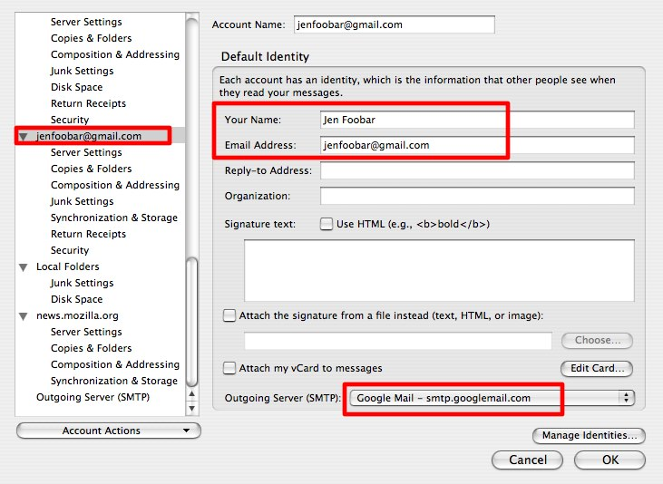

- 验证您的外发电子邮件没有被阻止

确认您的外发电子邮件没有被您的防火墙、防病毒软件或您的 Internet 服务提供商阻止：

尝试暂时关闭防病毒和防火墙软件，发送一封测试电子邮件，然后打开它们并发送另一封测试电子邮件。

- 验证您的邮件服务器是否支持最低版本的 TLS

Thunderbird 78 期望所谓的 TLS 网络加密协议有更高的安全标准。如果您的提供商不支持较新版本的协议，则发送和接收消息可能会失败。您可以暂时降低标准以检查这是否是您的问题的原因（这显然会降低安全性，因此不建议这样做）。更多细节和说明在这里：

Thunderbird 78 常见问题 - 升级到 Thunderbird 78 后，我无法接收或发送电子邮件

- 删除 SMTP 密码

尝试删除您的 SMTP 密码。但是，不要将此作为第一步，尤其是当您在更新 Thunderbird 后无法发送消息时，而以前可以。在这种情况下，通常在 Thunderbird 中存储的 SMTP 密码没有问题（见上文）。

- 重置 SMTP 密码

尝试更改您的 SMTP 密码。这通常通过 ISP 支持网站上的“重置电子邮件密码”表格来完成。

#### 3.2.8 如何在 Thunderbird 上创建和使用邮件列表

邮件列表是地址簿的子列表。一个地址簿可以有多个邮件列表。
通讯簿中具有有效电子邮件地址的任何联系人都可以放入邮件列表中。
邮件列表用于向一组联系人发送一封电子邮件。

- 创建邮件列表
1. 打开通讯簿。
2. 选择文件>新建>邮件列表。
3. 为邮件列表输入一个合适的名称。
4. 此时，您有两个选择：

- 选项1：
1. 手动输入联系人的电子邮件地址。
2. 每行键入一个电子邮件地址。您无法在此窗口的此列表中对电子邮件地址进行排序。它们将按添加的顺序出现。
3. 点击好的等结束。

- 选项 2：
1. 不要通过此窗口输入任何电子邮件地址。
2. 通过单击关闭窗口好的
3. 选择包含您希望放入邮寄列表的联系人的地址簿。
4. 选择以突出显示联系人。
    选择各种联系人：按住Ctrl键并左键单击联系人。
    选择一个块：选择第一个联系人，按住转移键并选择最后一个联系人。
5. 左键单击并按住选定的突出显示的联系人以抓取。
6. 将联系人拖到左侧并将鼠标悬停在邮件列表上。
7. 释放鼠标按钮将联系人放入邮件列表。

如果联系人尚未在关联的通讯录中，他们也将被输入到关联的通讯录中。
下图显示了一个名为“测试”的新邮件列表示例。它是个人通讯簿中的邮件列表。

- 使用邮件列表创建电子邮件

有两种方法产生不同的结果。

通过通讯录，在邮件工具栏上，找到“通讯录”。

1. 单击通讯簿将其打开。
2. 选择邮寄名单。
3. 单击写入按钮。

这将打开一个新的“写消息”窗口，邮件列表中的每个联系人都将出现在单独的“收件人”字段中。如果需要，这允许您删除名称。
您可能还需要手动选择密送，对于每个电子邮件地址，因为您的联系人可能不希望您分发他们的电子邮件地址。
输入主题；撰写电子邮件并单击发送

通过新的写消息，在邮件工具栏上，找到“写入”按钮。

1. 单击写入按钮。
    将打开一个新的写入消息窗口，左侧应该有“联系人边栏”。
    如果您看不到联系人边栏，则需要启用它。
        单击查看>联系人侧边栏或使用F9键切换视图。
2. 选择包含邮件列表的地址簿。
3. 选择邮寄名单。
4. 点击添加到密件抄送按钮或其他选项。

这会将邮件列表添加为邮件列表名称。您无法查看个人联系人。这使您无需更改，例如。到密件抄送，但您不能使用此方法编辑该电子邮件中的任何名称。
输入主题；撰写电子邮件并单击发送

- 如何添加两个使用相同电子邮件地址的联系人

例如：
在您的通讯录中，您有两个人使用相同的电子邮件地址。
a) Bob Smith 有电子邮件地址：thesmiths @ domain。
b) Jan Smith 有电子邮件地址：thesmiths @ domain。
这两个人在通讯录中完全没问题，但是使用传统方法将他们放入邮件列表是行不通的。因此，请执行以下操作以使它们进入邮件列表。

在通讯簿中，选择其中一个人并编辑他们的电子邮件地址。在示例中，我在前面放了一个字母 A。
Jan Smith 的电子邮件地址是 Athesmiths @ domain。

现在将两个人都移到邮件列表中。由于电子邮件地址不同，它们都将移至邮件列表。进入邮件列表后，选择邮件列表并双击 Jan Smith 通过删除“A”来编辑电子邮件地址。点击好的等结束。

现在您应该有两个人在邮件列表中共享相同的电子邮件地址，如果您返回并检查通讯簿条目，您会发现它们是正确的。

#### 3.2.8 消息标签 - 在 Thunderbird 中分类您的电子邮件

邮件标签可让您按类别组织电子邮件。您可以用一种颜色标记您的工作信息，用另一种颜色标记个人信息，因此它们很容易区分。更好的是，您可以使用快速过滤栏从列表中挑选出带有特定标签的邮件。

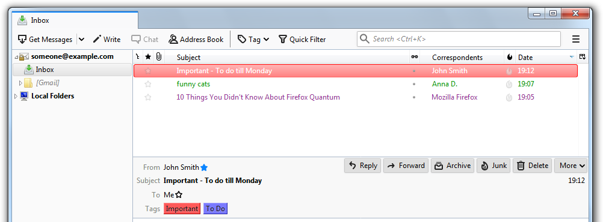

- 标记消息
1. 选择消息。
2. 点击TB60 标签按钮标签工具栏上的按钮。
3. 单击要添加的标签。

要删除标签，请执行相同的步骤。

    键盘快捷键：看到标签菜单中的数字了吗？要快速标记消息，请按相应的数字键。该消息将使用该标签进行标记。

- 管理标签

如果您想添加自己的标签、重命名现有标签或只是更改颜色，您可以使用“选项设置”窗口：

1. 点击TB60 标签按钮标签按钮，然后在菜单中选择管理标签。
2. 使用右侧的按钮来管理您的标签。

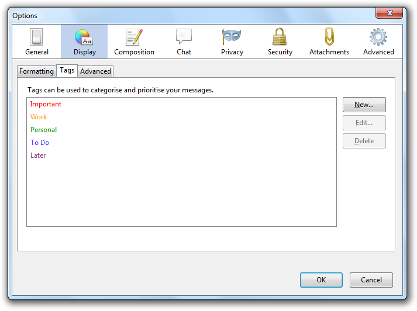

1. 添加新标签：单击新的按钮。在对话框中，输入新标签的名称并选择消息突出显示的颜色。
2. 更改标签的名称或颜色：选择标签，然后单击编辑按钮。在对话框中，为您的标签键入一个新名称或选择您想要的颜色。
3. 从列表中删除标签：选择标签，然后单击删除按钮。

- 按标签过滤消息

使用快速过滤器工具栏，您可以将显示限制为带有特定标签的消息。

1. 如果快速筛选栏隐藏，请单击TB60 过滤器图标快速过滤器工具栏中的按钮以显示它。
2. 在快速过滤器栏中，单击TB60 标签按钮标签按钮。消息列表将缩小到包含至少一个标签的所有消息。
3. 要将列表限制为具有特定标签的消息，请单击工具栏中的该标签名称。

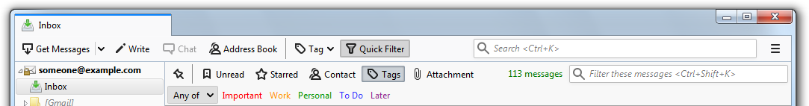

## 4. 联系人

### 4.1 阻止发件人

Thunderbird 没有阻止来自特定人员或域的电子邮件的选项。但是，您可以使用邮件过滤器自动处理不需要的邮件。

邮件过滤器在每个帐户的基础上运行，因此当您设置过滤器时，您必须将其配置为对正确的帐户进行操作。最简单的方法是：

选择来自您希望阻止的发件人的邮件：右键单击发件人的地址并选择Create Filter From...。

- 这将打开过滤器规则窗口，其中电子邮件地址已插入过滤器。

1. 命名过滤器。像“阻止列表”这样的东西是合适的。
2. 在窗口的下半部分，将要执行的操作更改为Delete Message。

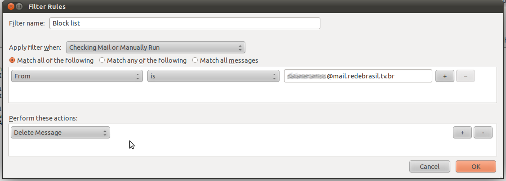

- 点击好的保存过滤器。下次该人向您发送邮件时，该邮件将被自动删除。

您创建的消息过滤器可以通过在工具菜单中选择消息过滤器...条目来打开和编辑。不必为要阻止的每个地址创建单独的过滤器。现在您有了阻止列表过滤器，下次您想要阻止某人时，您可以通过单击将该人的地址添加到过滤器的顶部+按钮，从而创建一个新字段来输入新地址。确保选择“匹配以下任何一项”选项，因为您希望它在任何列出的地址上触发。

### 4.2 如何使用虚拟卡 (vCard)

vCard 是电子名片的文件格式标准。vCard 可以包含姓名和地址信息、电话号码、电子邮件地址、URL、徽标、照片等。 vCard 通常附加到消息中，因为：

- 它们使您的收件人能够快速可靠地将您的联系信息添加到他们的个人通讯录中。

- 它们可以帮助您最大限度地减少签名，因为您的联系信息在 vCard 中可用（因此不需要包含在每封电子邮件的底部）。

- 如何将 vCard 附加到消息中
自动将您的 vCard 附加到所有外发邮件：

1. 转到工具 > 帐户设置菜单。
2. 点击编辑卡片...按钮来配置您的虚拟卡信息。
3. 如果您想默认将您的 vCard 附加到所有外发消息，请选中将我的 vCard 附加到消息，如下所示。

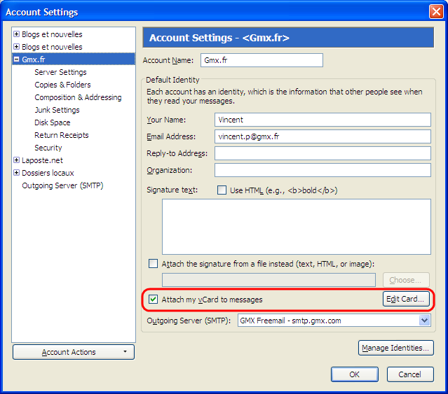

您可以将其附加到单个消息中，而不是自动附加您的 vCard。撰写邮件时，单击旁边的箭头
附按钮并选中或取消选中个人卡 (vCard)菜单项。

- 如何处理收到的电子名片

将 vCard 附加到消息后，该消息将包含一个扩展名为 *.vcf 的附件。Thunderbird 会在邮件正文中自动识别和预览这个附件，如下图：

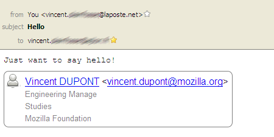

单击该图标以打开 vCard 并将其添加到您的地址簿。

    只有当消息是“原始 HTML”格式时，Thunderbird 才能识别作为附件的 vCard。您可以在View > Message body as菜单中检查您选择的消息格式 。还要确保 选中 View -> Display Attachments Inline 。

## 5. 安装、迁移和更新

### 5.1 配置文件 - Thunderbird 存储您的消息和其他用户数据的位置

Thunderbird 将消息、密码和用户偏好等个人信息保存在一组称为“配置文件”的文件中，这些文件存储在与 Thunderbird 程序文件不同的位置。虽然可以有多个配置文件，但大多数用户只使用一个默认值

- 什么是个人资料？

在 Thunderbird 中，配置文件存储了两组主要的项目。首先，它存储您的本地邮件，以及可能驻留在邮件服务器上的邮件副本（取决于您的帐户配置）。其次，它存储您在使用 Thunderbird 时所做的任何更改（例如，对帐户设置的更改和对工具栏的更改）。

当您安装 Thunderbird 时，它会创建一个名为“默认”的配置文件。此配置文件将自动使用，除非您调用配置文件管理器并创建新配置文件。

- 我的个人资料存储在哪里？

配置文件与 Thunderbird 程序文件分开存储。程序文件是静态的，不会更改（升级 Thunderbird 应用程序版本时除外）。因为我们分别存储配置文件和程序文件，您可以卸载 Thunderbird 而不会丢失您的消息和设置，并且如果 Thunderbird 更新出现问题，您的信息仍然可用。这也意味着您无需重新安装 Thunderbird 即可删除您的信息或解决问题。

每个配置文件都存储在硬盘驱动器的配置文件文件夹中。该文件夹使用以下约定命名：

    <random_string>.<profile_name>

- 如何找到您的个人资料

1. 单击菜单按钮或菜单栏。
2. 从帮助菜单中，单击故障排除信息。
3. 在 Application Basics 部分的Profile Folder中，单击打开文件夹
4. 资源管理器 窗口将显示配置文件的名称及其路径。

- 备份配置文件

要备份您的配置文件，首先关闭 Thunderbird（如果它已打开），然后将配置文件文件夹复制到另一个位置。

1. 如上所述，找到您的个人资料文件夹。
2. 关闭雷鸟。
3. 转到您的个人资料文件夹的上一层，即xxx/Thunderbird/Profiles/
4. 右键单击您的配置文件文件夹（例如xxxxxxxx.default），然后选择Copy。
5. 右键单击备份位置（例如 U 盘或空白 CD-RW 光盘），然后选择粘贴。

- 恢复配置文件备份

1. 关闭雷鸟。
2. 如果您现有的配置文件文件夹和配置文件备份文件夹具有相同的名称，只需将现有配置文件文件夹替换为配置文件备份，然后启动 Thunderbird。
    重要提示：配置文件文件夹名称必须完全匹配才能正常工作，包括 8 个字符的随机字符串。如果名称不匹配，或者您要将备份恢复到其他位置，请按照以下步骤操作。

### 5.2 将 Thunderbird 数据移动到新计算机

Thunderbird 将您的数据存储在一个单独的位置，远离程序文件，称为您的配置文件文件夹。要移动数据，您可以将配置文件文件夹复制到目标计算机上的等效位置。

- 在您的源计算机上
1. 连接用于数据传输的设备，可以是本地设备，例如 USB 闪存驱动器，也可以是远程存储驱动器。
2. 单击菜单按钮 ，然后单击帮助并选择故障排除信息。
3. 找到“配置文件文件夹”条目，然后单击打开文件夹
4. 您的 Thunderbird 配置文件文件夹将在文件管理器中打开。
5. 关闭雷鸟。
6. 从文件管理器中的 Thunderbird 配置文件文件夹，上三级。
7. 右键单击Thunderbird文件夹并选择Copy。
8. 右键单击您用来传输数据的设备，然后选择粘贴。
9. 如果您使用的是本地传输设备，请将其从源计算机中安全移除。

    注意：此步骤也可用于创建 Thunderbird 配置文件文件夹的备份。

- 在您的目标计算机上
1. 连接您之前使用的同一传输设备，从源计算机复制您的 Thunderbird 配置文件文件夹。
2. 右键单击您在传输设备上创建的 Thunderbird 配置文件文件夹的副本，然后选择Copy。
3. 打开 Thunderbird（如果出现，请关闭帐户设置窗口。）
4. 单击菜单按钮 ，然后单击帮助并选择故障排除信息。
5. 找到“配置文件文件夹”条目，然后单击打开文件夹您的 Thunderbird 配置文件文件夹将在文件管理器中打开。
6. 关闭雷鸟。
7. 从文件管理器中的 Thunderbird 配置文件文件夹，上三级。
8. 在文件夹内右键单击，然后选择粘贴。
9. 出现提示时，选择替换当前数据。

## 6. 隐私和安全设置

### 6.1 密码管理器 - 在 Thunderbird 中记住、删除和更改密码

Thunderbird 会记住您每个帐户和传出服务器的用户名和密码，并将它们存储在密码管理器中。如果您尝试访问没有保存用户名或密码的服务器，Thunderbird 会提示您输入，并提示您记住您输入的内容。

- 如何查看已保存的密码

在 Thunderbird 窗口的顶部，单击工具菜单并选择选项，或单击菜单按钮并选择选项。

2. 转到安全面板，选择密码选项卡，然后单击保存的密码

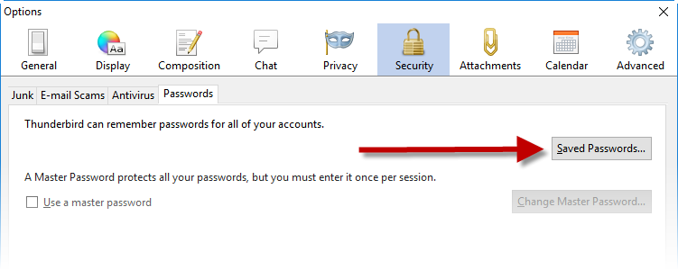

- 要查看您保存的密码，请单击显示密码。当您关闭窗口时，您的密码将自动隐藏。
- 使用搜索框查找特定帐户或用户名。单击搜索栏中的X以清除您的搜索并再次查看完整列表。

- 如何删除或编辑密码

打开密码管理器（见上文）。

    - 要编辑服务器的用户名和密码，请右键单击列表中的服务器条目，然后单击编辑用户名或编辑密码。

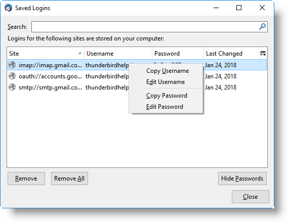

- 要删除服务器的用户名和密码，请从列表中选择服务器条目并单击消除
- 要删除所有存储的用户名和密码，请单击移除所有。确认此选择后，您存储的所有用户名和密码都将被删除。

### 6.2 配置证书

证书是身份证的数字等价物。它们用于加密和解密站点之间传输的信息。证书配置在
先进的证书选项卡下的面板。在 Thunderbird 窗口的顶部，单击工具菜单并选择选项，或单击菜单按钮并选择选项。可以使用以下选项： 

- 当服务器请求我的个人证书时：一些服务器要求您使用个人证书来表明自己的身份。为此，他们要求 Thunderbird 为您生成一个。当您以后连接到服务器时，Thunderbird 会询问您使用哪个证书。如果您希望 Thunderbird 自动选择证书，请选择自动选择一个 选项。

    注意：个人证书可以包含个人身份信息，例如您的姓名或地址。因此，如果您选择 自动选择一个 选项 ，可能会损害您的隐私，因为当网站请求您的个人证书时，您不会收到警报。因此，您可能无法控制谁可以访问您的个人信息。

- 查询 OCSP 响应服务器以确认证书的当前有效性：Thunderbird 可能会要求 OCSP（在线证书状态协议）服务器确认证书仍然有效。默认情况下，如果证书提供 OCSP 服务器，Thunderbird 会验证证书。如果您的 Internet 环境需要，您很可能只需要更改它。

- 查看证书：单击此按钮可加载证书管理器，您可以在其中查看存储的证书、导入新证书以及备份或删除旧证书。

- 安全设备：安全设备可用于加密和解密连接以及存储证书和密码。如果您需要使用安全设备，请单击安全设备按钮。

### 6.3 数字签名和加密消息

每个人使用的电子邮件基础设施在设计上并不安全。虽然大多数人使用安全（“SSL”）连接连接到他们的电子邮件服务器，但有些服务器允许不安全的访问。此外，当消息通过其从发送者到接收者的传输路径移动时，每个服务器之间的连接不一定是安全的。第三方有可能在传输电子邮件消息时截取、阅读和更改它们。

当您对消息进行数字签名时，您会在消息中嵌入验证您身份的信息。当您加密消息时，它似乎是“加扰的”，并且只能由拥有解密消息密钥的人阅读。对消息进行数字签名可确保消息来自指定的发件人。加密确保消息在传输过程中未被读取或更改。

要加密消息，您可以使用公钥加密系统。在这个系统中，每个参与者都有两个单独的密钥：一个公共加密密钥和一个私有解密密钥。当有人想向您发送加密消息时，他或她使用您的公钥生成加密算法。当您收到消息时，您必须使用您的私钥对其进行解密。

用于加密电子邮件的协议称为PGP（Pretty Good Privacy）。要在 Thunderbird 中使用 PGP，您必须首先安装：

- GnuPG : (GNU Privacy Guard): PGP 的免费软件实现
- Enigmail：Thunderbird 插件

这两个应用程序还提供了对消息进行数字签名的能力。

- 安装 GPG 和 Enigmail

要安装 GnuPG，请从GnuPG 二进制文件页面下载适当的包。按照为您的特定软件包提供的安装说明进行操作。有关在特定操作系统上安装 PGP 的更多信息

安装 Enigmail：

1. 在 Thunderbird 中，选择工具 > 附加组件。
2. 使用右上角的搜索栏搜索 Enigmail。
3. 从搜索结果中选择 Enigmail，然后按照说明安装插件。

- 创建 PGP 密钥

如下创建您的公钥/私钥：

1. 在 Thunderbird 菜单栏上，单击OpenPGP并选择Setup Wizard。
2. 选择是，我希望向导帮助我开始，如下图所示。点击下一个继续。

3. 向导会询问您是要签署所有外发邮件，还是要为不同的收件人配置不同的规则。签署所有电子邮件通常是一个好主意，以便人们可以确认电子邮件确实来自您。消息接收者不需要使用数字签名或 PGP 来阅读经过数字签名的消息。选择是，我要签署我的所有电子邮件，然后单击下一个继续。
4. 接下来，向导会询问您是否要加密所有电子邮件。除非您拥有希望向其发送消息的所有人的公钥，否则不应选择此选项。选择否，我将为向我发送公钥的人创建每个收件人的规则，然后单击下一个继续。
5. 该向导询问它是否可以更改您的某些邮件格式设置以更好地使用 PGP。在这里回答“是”是一个不错的选择。点击下一个继续。
6. 选择您要为其创建密钥的电子邮件帐户。您需要在“密码”文本框中输入密码，用于保护您的私钥。此密码用于解密消息，所以不要忘记它。密码长度应至少为 8 个字符，并且不得使用任何字典单词。（有关创建强密码的信息，请参阅此 Wikipedia 文章。）输入此密码两次，然后单击下一个继续。
7. 下一个屏幕显示您配置的首选项。如果您满意，请点击下一个继续。
8. 创建密钥的过程完成后，单击下一个继续。
9. 该向导将询问您是否要创建一个“撤销证书”，如果您的密钥对的安全性受到损害并且您需要通知其他人它不再有效，您将使用该证书。如果要创建文件，请单击生成证书并按照后续屏幕上的步骤进行操作。否则，请单击跳过
10. 向导最终通知您它已完成该过程。点击结束退出向导。

- 发送和接收公钥

通过电子邮件发送您的公钥

要接收来自其他人的加密消息，您必须首先向他们发送您的公钥：

1. 撰写邮件。
2. 从 Thunderbird 菜单栏中选择OpenPGP并选择Attach My Public Key。

3. 像往常一样发送电子邮件。

- 通过电子邮件接收公钥

要将加密消息发送给其他人，您必须接收并存储他们的公钥：

1. 打开包含公钥的消息。
2. 在窗口底部，双击以“.asc”结尾的附件。（此文件包含公钥。）
3. Thunderbird 会自动识别这是一个 PGP 密钥。将出现一个对话框，提示您“导入”或“查看”密钥。点击进口导入密钥

4. 您将看到密钥已成功导入的确认信息。点击好的完成该过程。

- 发送数字签名和/或加密的电子邮件

1. 像往常一样撰写邮件。
2. 要对消息进行数字签名，请从 Thunderbird 菜单中选择OpenPGP并启用Sign Message选项。要加密消息，请启用加密消息选项。系统可能会要求您在加密消息之前输入您的密码。

3. 如果您的电子邮件地址与 PGP 密钥相关联，则消息将使用该密钥加密。如果电子邮件地址未与 PGP 密钥关联，系统将提示您从列表中选择一个密钥。
4. 像往常一样发送消息。

    注意：邮件的主题行不会被加密。

- 阅读数字签名和/或加密的电子邮件

当您收到加密消息时，Thunderbird 会要求您输入您的密码来解密该消息。要确定传入消息是否已签名或数字加密，您需要查看消息正文上方的信息栏。

如果 Thunderbird 识别出签名，则消息上方会出现一个绿色条（如下所示）。

如果消息已加密和签名，绿色栏还会显示文本“解密消息”。

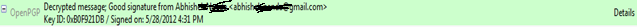

如果消息已加密但未签名，则该栏将如下所示。

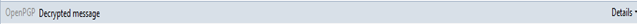

    注意：未签名的消息可能来自试图冒充他人的人。

- 撤销您的密钥

如果您认为您的私钥已被“泄露”（也就是说，其他人已经访问了包含您的私钥的文件），您应该尽快撤销您当前的一组密钥并创建一个新的密钥对。要撤销您当前的密钥集：

在 Thunderbird 菜单上，单击OpenPGP并选择Key Management。

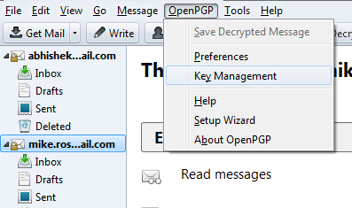

2. 将出现一个对话框，如下所示。选中默认显示所有键以显示所有键。
3. 右键单击要撤消的密钥，然后选择撤消密钥。
4. 将出现一个对话框，询问您是否真的要撤销该密钥。点击撤销密钥继续。
5. 将出现另一个对话框，要求您输入密码。输入密码并单击好的撤销密钥。

将吊销证书发送给与您通信的人，以便他们知道您当前的密钥不再有效。这样可以确保如果有人试图使用您当前的密钥来冒充您，收件人将知道该密钥对无效。

## 7. 自定义控件、选项和附加组件

### 7.1 在 Thunderbird 中安装插件

附加组件是向 Thunderbird 添加新功能（扩展）或更改其外观（主题）的小应用程序。本文向您展示如何在 Thunderbird 中安装插件。

在理想情况下，您想要的所有附加组件都经过官方审查和批准，并且可以在官方网站addons.thunderbird.net上找到。

对于属于此类别的附加组件，您只需单击菜单按钮，然后单击附加组件，然后单击左侧的扩展面板以在顶部显示搜索框，即可转到 Thunderbird 中的附加组件管理器选项卡-右上角。输入插件的名称或足够的名称以将返回的搜索结果限制为可管理的数字，然后进入或单击放大镜图标。

完成第一次搜索后，左侧面板中会出现一个新的搜索类别。您可以不断完善您的搜索，直到找到您想要的。

以下是提及“联系人”的附加组件的搜索：

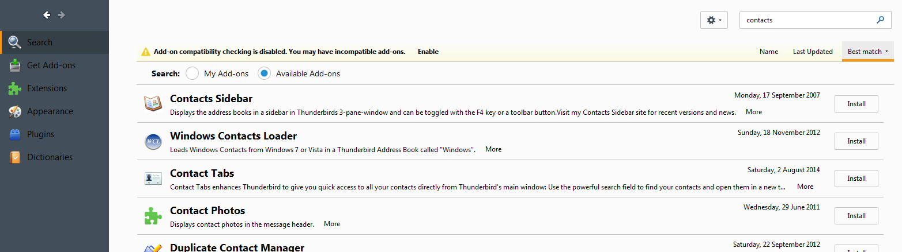

    找到喜欢的插件后，点击安装，等待下载，然后在出现提示时单击立即重新启动。

- 稍微不太理想的情况（从下载的 XPI 文件安装）

您可能已经获得了附加组件的 URL，或者您想要的附加组件不在“官方”页面上。搜索它，如上所示，找不到附加组件。

在浏览器中访问网页，用鼠标右键单击下载链接，选择将链接另存为...，然后将 XPI 文件保存到计算机上易于记忆的位置。由于下载是临时的，建议您使用“下载”文件夹或桌面。

    如果您使用的是旧版本的 Firefox，左键单击下载链接将导致浏览器尝试将插件安装到 Firefox 本身。这总是会导致兼容性错误，因为该插件是为 Thunderbird 设计的。如果您使用其他浏览器，左键单击可能会导致您的浏览器尝试下载并“打开”XPI 文件。这基本上是一个小程序，所以它不是要打开的。它必须保存到磁盘。

要将下载的 XPI 文件安装到 Thunderbird 中，您有两种选择。

- 下载

如前所述，右键单击链接并选择另存为...或将链接另存为...。

您将被邀请下载并保存文件。大多数浏览器都有默认下载位置。记下它的下载位置以及它的名称。一些附加文件的名称可能很愚蠢，例如“latest-234.xpi”，当您稍后尝试查找它时，这并不是很有帮助。

在 Thunderbird 中打开附加组件管理器选项卡。搜索框左侧有一个按钮。单击此按钮并从后续菜单中选择从文件安装插件...。

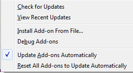

您需要使用文件选择器导航到保存 XPI 文件的位置并选择它以完成安装。

- 拖放

    - 打开附加组件管理器（单击菜单按钮，然后单击附加组件）。
    - 将下载的 XPI 文件拖到 Add-ons Manager 选项卡并放下它。

如果您使用的是 Windows，您甚至可以跳过桌面位。并排打开浏览器和 Thunderbird，并显示 Thunderbird 的附加组件管理器选项卡。将链接直接从浏览器拖到 Thunderbird 的附加组件管理器选项卡上。这种方法的主要优点是您不需要在安装之前将附加组件的副本实际保存到硬盘上。

### 7.2 如何禁用或更改 Thunderbird 起始页

每次启动 Thunderbird 时，消息区域都会加载您的邮件起始页。您可以将邮件起始页更改为任何网页，或将其设置为空白页。

- 更改起始页
1. 在 Thunderbird 窗口的顶部，单击工具菜单并选择选项，或单击菜单按钮并选择选项。 
2. 在“选项设置”窗口中，确保选择了“常规”面板。
3. 在位置字段中，输入所需起始页的地址。

4. 点击好的关闭选项窗口。

- 将其设置为空白页

1. 在 Thunderbird 窗口的顶部，单击工具菜单并选择选项，或单击菜单按钮并选择选项。

2. 在“选项设置”窗口中，确保选择了“常规”面板。

3. 禁用Thunderbird 启动时，在消息区域显示起始页。

4. 点击好的，关闭选项窗口。

- 恢复默认起始页

默认起始页面将欢迎您使用 Thunderbird，提供有关 Thunderbird 的信息，并提供有关如何参与、在哪里捐赠以及在哪里获得帮助的链接。

1. 在 Thunderbird 窗口的顶部，单击工具菜单并选择选项，或单击菜单按钮并选择选项。 
2. 在“选项设置”窗口中，确保选择了“常规”面板。
3. 确保当 Thunderbird 启动时，在消息区域显示起始页已启用。
4. 点击恢复默认按钮。
5. 点击好的，关闭选项窗口。

- 随时转到起始页

单击菜单按钮，打开Go菜单并选择Mail Start Page。

### 7.4 高级面板 - Thunderbird 中的系统、网络、更新和其他高级设置

#### 常规选项卡

#### 退邮件收据

回执会在您的邮件中添加一个请求，以便在收件人打开邮件时通知您。

#### 回执对话框

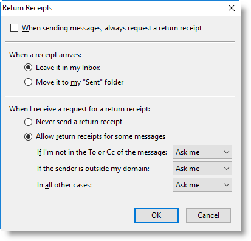

- 发送消息时，请始终要求回执：选中此设置以使 Thunderbird 自动为您发送的每条消息请求回执。收据到达时：

- 将其留在我的收件箱中：回执通过电子邮件到达。选择此选项可将回执留在您的收件箱电子邮件文件夹中。

- 将其移至我的“已发送”文件夹：选择此选项可让 Thunderbird 自动将回执移至您的“已发送”电子邮件文件夹。

当我收到回执请求时：

- 从不发送回执：如果有人向您发送包含回执请求的消息，请选择此选项以使 Thunderbird 始终忽略该请求。

- 允许某些消息回执：对于这些情况，您可以将 Thunderbird 设置为始终发送回执、忽略请求或选择询问我，这将使 Thunderbird 在您打开消息时显示提示。

#### 滚动

- 使用自动滚动：自动滚动是一项有用的功能，它允许您通过单击鼠标中键（通常是滚轮）并向上或向下移动鼠标来滚动。有些人觉得这很烦人，因此可以使用此选项禁用自动滚动。

- 使用平滑滚动：如果您阅读大量长消息，平滑滚动会非常有用。通常，当您按下向下翻页，视图直接向下跳转一页。通过平滑滚动，它平滑地向下滑动，因此您可以看到它滚动了多少。这样可以更轻松地从以前的位置继续阅读。

#### 系统集成

- 始终检查 Thunderbird 是否是启动时的默认邮件客户端：如果您希望 Thunderbird 在启动时检查它是否是默认邮件客户端，请选择此设置。将 Thunderbird 设置为您的默认邮件客户端将确保在应用程序可以选择发送邮件时使用 Thunderbird。有关更多信息，请参阅使 Thunderbird 成为默认邮件客户端。

- 允许 Windows 搜索搜索消息：选择此选项以允许 Windows 的内置搜索为您的 Thunderbird 消息编制索引。索引后，当您使用 Windows 搜索功能时，您的 Thunderbird 消息将包含在搜索结果中。

#### 高级配置

- 启用全局搜索和索引器：这将启用 Thunderbird 的内置搜索功能，允许您在 Thunderbird 中的所有消息中进行搜索。有关详细信息，请参阅全局搜索。

- 新帐户的邮件存储类型：默认情况下，Thunderbird 将邮件文件夹存储在本地的单个文件中（例如，有一个名为Inbox的文件）。您可以让新帐户将每条消息存储在其自己的文件中。有关详细信息，请参阅Thunderbird 中的 Maildir。
- 可用时使用硬件加速：Thunderbird 可以使用您计算机的图形处理器来显示一些带有视频和动画的消息。这使 Thunderbird 更快，因为您计算机的图形处理器在显示这些类型的内容方面比计算机的主处理器好得多。默认情况下选中此框，但该功能不适用于所有图形处理器。Thunderbird 将尽可能启用它。

    如果您更改此设置，您必须重新启动 Thunderbird。

- 配置编辑器：配置编辑器列出了 Thunderbird 已加载的所有选项。其中许多是高级选项，在“选项”窗口或“帐户设置”窗口中不可用。在配置编辑器中，您可以查看、编辑和重置这些选项。有关详细信息，请参阅配置编辑器。

#### 数据选择选项卡

- 远程诊断

启用此设置将向Mozilla 发送有关 Thunderbird 真实性能的匿名数据（了解更多）。此信息将用于使 Thunderbird 变得更好。

- 崩溃报告

启用崩溃报告器：如果 Thunderbird 崩溃，Mozilla 崩溃报告器将出现，询问您是否要将崩溃报告给 Mozilla。选中此复选框后，崩溃报告器中的“告诉 Mozilla 此次崩溃以便他们修复它”复选框将默认为选中状态。

#### 网络和磁盘空间选项卡

- 联系

您的组织或 Internet 服务提供商可能会提供或要求您使用代理。代理充当您的计算机和 Internet 之间的中介。它拦截所有对 Internet 的请求，以查看它是否可以使用其缓存来满足请求。代理用于提高性能、过滤请求以及将您的计算机从 Internet 中隐藏以提高安全性。代理通常是公司防火墙的一部分。

- 连接设置对话框

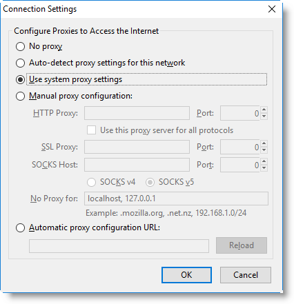

- 无代理：如果您不想使用代理，请选择此项。
- 自动检测此网络的代理设置：如果您希望 Thunderbird 自动检测您的网络的代理设置，请选择此项。
- 使用系统代理设置：如果您想使用为您的操作系统配置的代理设置，请选择此项。（默认设置）
- 手动代理配置：如果您有一个或多个代理服务器的列表，请选择此选项。向您的系统管理员咨询配置信息。每个代理都需要一个主机名和一个端口号。
    - 如果所有协议使用相同的代理名称和端口号，请选中​​将此代理服务器用于所有协议。
    - No Proxy For : 不会被代理的主机名或 IP 地址列表。
- 自动代理配置 URL：如果您有代理配置(.pac) 文件，请选择此项。输入网址并点击好的，保存更改并加载代理配置。

    -重新加载：重新加载按钮将加载当前可用的代理配置。

- 离线

这些设置控制当您的计算机未连接到 Internet 时 Thunderbird 的行为方式。例如，Thunderbird 不会检查新消息，或者在您选择消息时尝试下载消息。撰写邮件时，发送按钮将变为“稍后发送”，Thunderbird 会将您的外发邮件放入发件箱，而不是尝试发送。

- 离线设置对话框

- 自动跟踪检测到的在线状态：Thunderbird 将检查您的计算机是否未连接到互联网。如果未连接，Thunderbird 将切换到离线模式。当检测到连接时，Thunderbird 将切换到在线模式。

- 启动时手动状态：如果未启用自动跟踪检测到的在线状态，这将决定 Thunderbird 在您启动时如何决定它是否应该处于离线模式。将此设置为离线将使 Thunderbird 始终以离线模式启动。将此设置为在线将使 Thunderbird 始终以在线模式启动。问我在线状态会让 Thunderbird 一直提示你选择哪种模式。请记住，之前的在线状态将使 Thunderbird 以您上次关闭时设置的模式打开。

- 在线时发送未发送的消息：如果您的发件箱中有任何消息，将其设置为是将使 Thunderbird 在您切换到在线模式时自动发送这些消息。当设置为No时，您的发件箱中的邮件将不会被发送。将此设置为询问我将使 Thunderbird 在您切换到在线模式时提示您在发件箱中发送消息。

- 离线时下载消息以供离线使用：如果您将任何离线文件夹设置为保留计算机上每条消息的副本，则将此设置为“是”将使 Thunderbird 自动下载您在本地未存储的文件夹中的所有消息切换到离线模式。当设置为No时，将不会同步消息的本地副本。将此设置为“询问我”将使 Thunderbird 在您切换到离线模式时提示您从在线文件夹下载新消息。

#### 磁盘空间

您查看的邮件未保存在您的计算机上，通常存储在一个特殊的缓存文件夹中，以便您下次查看邮件时更快地查看。您可以在此处指定缓存可以使用的磁盘空间量。您还可以立即清除缓存中的内容。

- 立即清除：立即清除缓存的当前内容，释放缓存使用的磁盘空间。
- 最多使用 ___MB 的缓存空间：此框允许您指定计算机上缓存的最大大小（以兆字节为单位）。
- 压缩所有文件夹，当它总共保存超过 ___MB 时：当一条消息被删除时，Thunderbird 会保留它，并将它标记为已删除，这样你就不会看到它。压缩文件夹会从存储中删除任何已标记为已删除的邮件。这将使消息列表加载更快，并占用更少的磁盘空间。选中此框允许您指定文件夹的最大大小（以兆字节为单位），然后 Thunderbird 会自动压缩它。

#### 更新选项卡

- 自动安装更新（推荐：提高安全性）：Thunderbird 自动下载并安装找到的更新。
    - 如果这将禁用我的任何加载项，请警告我：如果您希望收到提示，下载是否会禁用任何已安装的加载项，请选择该设置。

- 检查更新，但让我选择是否安装它们： Thunderbird 让您选择是否要下载和安装更新。如果您不
选择这样做，您可以稍后下载它们。

- 从不检查更新（不推荐：安全风险）： Thunderbird 不会检查更新。
    警告：如果您选择此设置，除非您经常手动检查更新，否则您将不会收到可能使您在线安全的重要安全更新。

- 要查看已下载和安装的更新的历史记录，请单击显示更新历史

- 使用后台服务安装更新： Thunderbird 将在安装更新时使用Mozilla 维护服务。这将无需授权 Thunderbird 通过用户帐户控制对话框对您的计算机进行更改。
    注意：您必须以管理员或最初安装 Thunderbird 的用户身份运行 Thunderbird 才能安装 Thunderbird 更新。

#### 证书选项卡

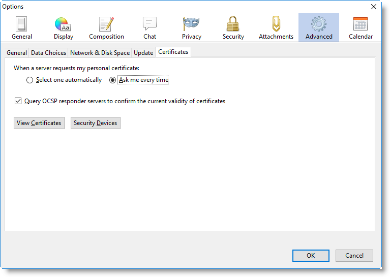

证书有助于对网站连接进行加密和解密。

- 当服务器请求我的个人证书时：一些服务器要求您使用个人证书来表明自己的身份。为此，他们要求 Thunderbird 为您生成一个。当您将来访问服务器时，Thunderbird 会询问您使用哪个证书。如果您希望 Thunderbird 自动为您选择证书，请选择自动选择一个 选项。
    注意：个人证书可以包含个人身份信息，例如您的姓名或地址。因此，如果您选择 自动选择一个 选项 ，可能会损害您的隐私。如果这样做，当网站请求您的个人证书时，您将不会收到警报，并且您可能无法控制谁可以访问您的个人信息。

- 查询 OCSP 响应服务器以确认证书的当前有效性：Thunderbird 可能会要求 OCSP（在线证书状态协议）服务器确认证书仍然有效。默认情况下，如果证书提供 OCSP 服务器，Thunderbird 会验证证书。如果您的 Internet 环境需要，您很可能只需要更改它。

- 管理证书：单击此按钮可查看存储的证书、导入新证书以及备份或删除 Thunderbird 中的旧证书。
- 安全设备：安全设备可以加密和解密连接并存储证书和密码。如果您需要使用 Thunderbird 以外的安全设备，请单击安全设备按钮。

### 7.3 安全面板 - Thunderbird 中的垃圾邮件、诈骗、防病毒和密码设置

#### 垃圾标签

Thunderbird 包括识别和过滤垃圾信息的能力。这些设置可帮助您自定义垃圾邮件过滤的行为方式。有关详细信息，请参阅Thunderbird 和垃圾邮件/垃圾邮件。

- 当我将邮件标记为垃圾邮件时：垃圾邮件过滤可用于过滤收件箱中的任何垃圾邮件。在某些情况下，您可能希望将邮件标记为垃圾邮件。使用此设置，您可以确定将邮件标记为垃圾邮件时的去向。

- 将确定为垃圾的邮件标记为已读：启用此设置后，Thunderbird 将在邮件被标记为垃圾时将其标记为已读。

- 启用自适应垃圾邮件过滤器日志记录：此设置允许您启用和禁用垃圾邮件过滤器的日志记录，以及查看日志本身。通常，不需要启用日志记录。

#### 电子邮件诈骗选项卡

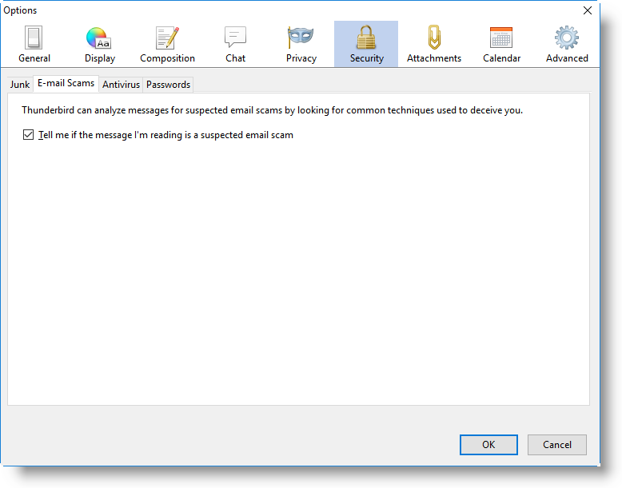

如果我正在阅读的邮件是可疑的电子邮件诈骗，请告诉我：诈骗邮件包含旨在诱骗您披露个人信息的材料。启用此设置后，如果 Thunderbird 检测到您正在阅读的邮件是骗局，它将显示警告。有关详细信息，请参阅Thunderbird 的诈骗检测。

#### 防病毒选项卡

- 允许防病毒客户端隔离单个传入邮件：默认情况下，Thunderbird 将每个邮件文件夹存储为本地单个文件。例如，有一个名为 Inbox 的文件。如果您的防病毒软件在新收到的邮件中检测到病毒，它将隔离整个收件箱文件，因为新邮件已保存到该文件中。

但是启用此设置后，Thunderbird 首先将每条传入的消息存储在您计算机上系统临时文件夹中的临时文件中，从而允许您的防病毒软件仅隔离单个消息。如果文件被防病毒软件删除，您会收到有关文件丢失的错误消息。如果新邮件文件在被杀毒软件扫描后仍然存在，则将其移动到您的 Thunderbird 收件箱文件夹文件中。

#### 密码选项卡

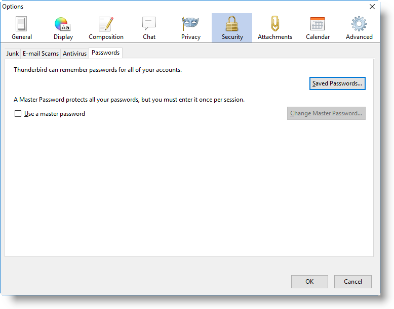

Thunderbird 密码管理器安全地存储您用于访问服务器的用户名和密码，因此您在检查新邮件时不必重新输入它们。点击
保存的密码
查看、编辑或删除 Thunderbird 为您保存的用户名和密码。有关详细信息，请参阅密码管理器 - 在 Thunderbird 中记住、删除和更改密码。

- 使用主密码：如果您共享一台计算机，并且不希望其他人看到您存储的密码，启用此设置以使 Thunderbird 要求您输入主密码，以便查看或使用您告诉 Thunderbird 的密码记住。要编辑或删除您的主密码，请单击更改主密码

### 7.4 隐私面板 - Thunderbird 中的远程内容和 cookie 设置

#### 邮件内容

- 允许消息中的远程内容：有时消息会远程加载内容，例如图像。不幸的是，垃圾邮件发送者通常使用这种方法来验证您的地址是否有效。默认情况下，Thunderbird 不加载远程内容，并为每条消息提供一个按钮来覆盖它。如果您希望 Thunderbird 自动在每条消息上显示远程内容，请选择此设置。点击例外控制哪些站点可以自动加载远程内容。有关详细信息，请参阅消息中的远程内容。

#### 网页内容

- 记住我访问过的网站和链接：如果选中，Thunderbird 将更改您已经访问过的链接的颜色。
- 接受来自网站的 cookie：如果选择，Thunderbird 将接受来自您查看的消息中的网络内容的 cookie。点击例外控制某些网站是否不允许设置cookies。

接受第三方 cookie：
    - 始终：当您查看包含来自 http://site1.com 内容的消息时，Thunderbird将始终接受来自http://site2.com的 cookie 。
    - From Visited：如果您之前查看过来自 http://site2.com 的消息，当您查看来自http://site1.com的消息时，Thunderbird 将接受来自该站点的 cookie ，否则 Thunderbird 将不接受他们。
    - 从不：当您查看包含 http://site1.com 内容的消息时，Thunderbird绝不会接受来自http://site2.com的 cookie 。

保持到：

    - 它们过期：如果选中，Thunderbird 将允许您查看包含内容的消息的站点指定 Thunderbird 应保留其 cookie 的时间。
    - 我关闭 Thunderbird：如果选择，当您关闭 Thunderbird 时，您的 cookie 将被删除。
    - 每次都问我：如果选中，Thunderbird 会在每次站点尝试设置 cookie 时询问您保留 cookie 的时间。点击显示 Cookie显示 Cookie 窗口

- 告诉网站我不想被跟踪：大多数主要网站都会跟踪访问者的行为，然后将这些信息出售或提供给其他公司。此信息可用于展示专门针对您的广告、产品或服务。如果选中，Thunderbird 将告诉每个网站查看一条消息，其中包含来自其广告商和内容提供商的内容，您不希望跟踪您的浏览行为。

## 8. 日历

### 8.1 创建新日历

使用 Thunderbird，可以拥有多个日历。在电子邮件帐户设置期间，可以自动检测您现有的在线日历。或者您可以在日历模式或任务模式下设置新日历。

#### 在电子邮件帐户设置期间连接到您的在线日历

通过方便的自动配置设置您现有的电子邮件地址后，Thunderbird 现在将根据您提供的用户信息自动检测您的远程通讯簿和日历。

将 Google 邮件帐户添加到 Thunderbird 时，您可以轻松添加现有的 Google 日历和地址簿

    注意：如果您的某个 Google 日历未找到或无法访问，则它可能未设置为同步。您可以选择 Google 将在您的 Google 日历同步设置中公开哪些日历。不幸的是，Google 不支持通过 CalDAV 执行任务。

#### 创建新日历

从日历选项卡（不是侧边栏）：

- 右键单击屏幕左侧的日历列表。
- 从上下文菜单中选择新日历...。
- 或者，您可以使用≡>新建>日历…，或文件>新建>日历…。
现在您需要选择是要“在您的计算机上”还是“在网络上”创建日历。

##### 在您的计算机上 - 本地日历

选择“在我的电脑上”时，您只能使用您正在使用的电脑上的日历。所有数据都存储在内部数据库中（Thunderbird 配置文件中的 local.sqlite 文件）。

- 选择在我的电脑上，然后单击下一个
- 输入日历的名称并选择一种颜色，然后点按创建日历

##### 在网络上 - 连接到您的在线日历

选择“在网络上”时，您的日历文件可能位于通用Web服务器（仅读取），WebDav或Caldav服务器，本地文件系统或网络共享上，或者您可以使用Google日历。

- 选择在网络上，然后单击下一个

1. 输入您的用户名，例如您在 Gmail 上的电子邮件地址。
2. 在位置字段中输入日历 URL。Thunderbird 可以识别各种日历 URL。
3. 如果适用，请选中此位置不需要凭据。
4. 默认情况下会选中离线支持，以便您在离线时也可以使用日历。
5. 点击查找日历

在下一步中，Thunderbird 将向您展示一系列可用的日历。

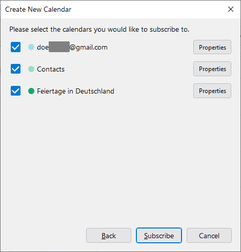

您可以更改每个日历的属性，例如其名称和颜色，使用特性按钮。

- 检查您想要的日历，然后单击订阅

##### 找到指向您的 Google 日历的链接

在浏览器上转到您的 Google 日历，单击您要订阅的日历名称旁边的选项菜单（3 点），然后单击设置和共享。

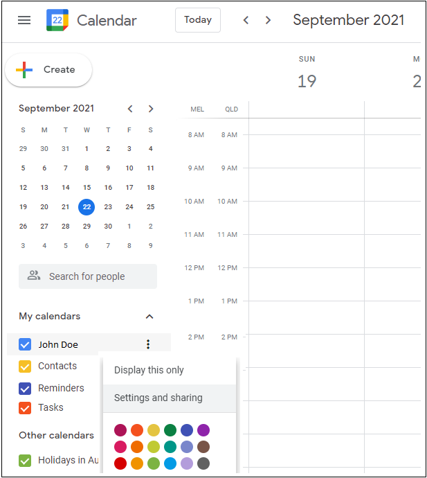

1. 查找并复制指向您日历的链接。

- 在事件的访问权限部分中，单击获取可共享链接并复制该链接。
- 或者，您可以使用 ICS 格式：在集成日历部分，选择并复制iCal 格式的公共地址或iCal 格式的秘密地址下的链接。

2. 将此链接粘贴到“创建新日历”对话框的“位置”字段中。

##### 日历 (ICS)

您可以订阅第三方提供的日历，主要是 ics 格式。这些几乎总是只读的；您将无法更改日历的任何内容。这类日历的一个例子是Thunderbird 提供的假日日历。

### 8.2 创建新事件或任务

- 事件：一个日历条目，代表无论您是否采取行动都会发生的事情。例如，会议和生日都是事件。

- 任务：代表您的某些操作的日历条目。例如，撰写报告和拜访客户都是任务。

#### 创建新事件
创建事件很容易。只需执行以下操作之一：

- 单击Thunderbird 窗口顶部的文件菜单，或单击菜单按钮。fx57菜单
- 选择新建子菜单并选择事件。
- 按快捷键Ctrl+
- 点击新事件“今日”窗格中的按钮。
- 在“今天”窗格的事件概览中双击“今天”、“明天”或“不久” 。

在日历模式和事件模式中，您可以使用上述方法，但您也可以使用专用的新事件“日历工具栏”中的按钮：

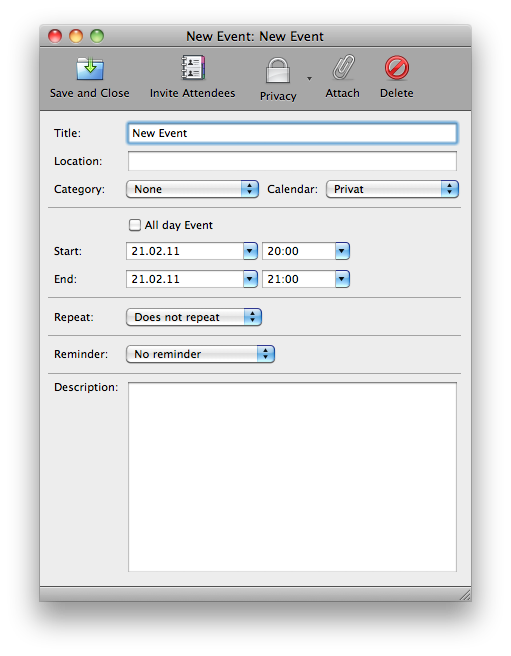

在此窗口中，您可以设置事件的详细信息。以下是所有可能值的描述：

- 标题：事件的名称。这是您第一眼看日历时会看到的内容
- 地点：活动举办地点
- 类别：它是什么类型的事件？
- 日历：您想在哪个日历中存储事件（请参阅创建新日历）
- 开始和结束：选择事件开始的时间和结束的时间
- 重复：如果此事件将再次发生，请选中此框（请参阅创建重复事件）
- 提醒：会在事件发生前的指定时间弹出警报。
- 描述：事件的简短摘要/列表

默认情况下，假定事件具有开始和结束日期和时间。

您可以通过键盘在相应字段中输入或单击同一字段中的下拉箭头来设置这些日期和时间。然后，您将看到以下选择选项：

    更改开始日期时，结束日期将自动设置为相同日期。

您首先选择小时，然后选择分钟来选择时间。选择分钟后窗口将自动关闭。

如果您想使用未显示的时间，您可以通过单击>>右下角的按钮。

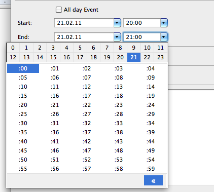

如果事件没有开始或结束时间，您可以选择全天的活动勾选框，之后开始和结束时间将显示为灰色。

创建新任务
要创建任务，请执行以下步骤之一：

单击Thunderbird 窗口顶部的文件菜单，或单击菜单按钮。fx57菜单

- 选择新建子菜单并选择任务。
- 按快捷键Ctrl+D
- 点击新任务“今日”窗格中的按钮。

### 8.3 更改事件的日期或时间

- 在适当的日历中找到您要编辑的事件并右键单击它。
- 选择打开选项。
- 在From和To字段中，进行所需的更改。如果需要，也可以更改其他字段。
- 完成所有更改后，单击保存并关闭按钮。

### 8.4 导出和共享日历

1. 通过单击Thunderbird 窗口右上角的日历图标打开 Lightning 。日历图标 tb60
2. 单击事件和任务。
3. 单击发布。
4. 单击要发布的日历，然后单击好的
5. 输入您的 WebDAV 网址。
6. 输入用户名、密码和其他所需数据。

#### 在 Thunderbird 和 Lightning 下导出日历

1. 打开 Thunderbird 实例。
2. 单击事件和任务。
3. 使用导出命令打开选择对话框。
4. 选择要导出的日历并单击好的
5. 指定导出日历的文件名，导出的日历将存储在其中。使用名称字段右侧的小箭头选择适当的文件位置。
6. 指定要创建的文件类型：HTML、iCalendar 格式或 CSV 文件。
7. 点击节省按钮。

#### 使用共享文件夹

当日历文件存储在共享文件夹中时，您可能还会有多个 Thunderbird 实例打开同一个日历文件，前提是安装了正确的扩展名。

由于使用了标准的 iCalendar 协议，即使是其他日历支持产品，例如 Microsoft Outlook，也可以共享相同的日历。

    但是，使用这种方法时，只有第一个打开日历的实例才有修改权限。