# VLC使用说明

注：文章末尾附带了可用的测试视频与音频链接，如有需要可自行取用。

**安装VLC**

- 执行下列指令

```bash
dnf install vlc
```

- 安装过程中，有些包可能会已经以依赖的形式被安装了,请忽略此类信息。

**启动vlc**

- Xfce桌面下打开终端，输入`vlc` 启动 VLC。

```shell
vlc
```

- 点击vlc图标启动VLC，见Application->Multimedia，或Application->Multimedia->vlc

目前vlc视频解码依然有问题，视频播放会出现黑屏，需要在 tools-performance-video 处将 output 改为 X11 video output ，之后便可观看到正常影像，由于QEMU为软解码，流畅度与清晰度在有显卡的硬件环境下会更好。

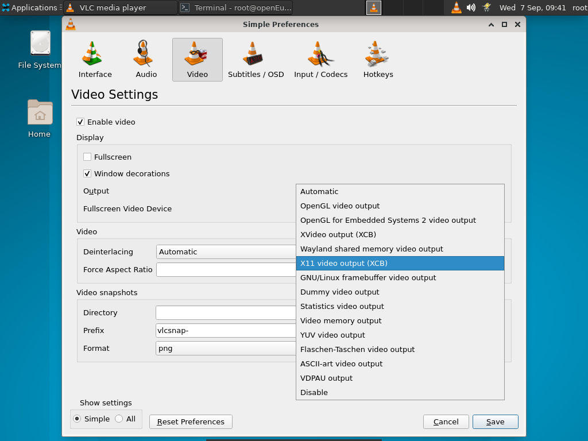


## 1. 桌面浏览

VLC 媒体播放器有用于 Windows 和 GNU/Linux 的Qt跨平台接口，VLC 的操作在所有操作系统中基本相同。主界面有以下几个区域：

- 菜单栏：它控制有关您当前正在播放的媒体的所有内容。
- 轨道滑块：轨道滑块位于菜单栏下方。它显示媒体文件的播放进度。您可以向左拖动曲目滑块来倒回或向右拖动正在播放的曲目。播放视频文件时，视频显示在菜单栏和轨道滑块之间。
- 控制按钮：轨道滑块下方的按钮涵盖了所有基本播放功能。

### 1.1 菜单栏

菜单栏使您能够控制当前正在播放的媒体的所有内容。本文档将帮助您了解 Windows 操作系统上 VLC 媒体播放器菜单栏的所有不同功能。媒体菜单，在此菜单中，您可以：


- 打开一个新文件以从任何位置播放。
- 将文件流式传输到 Web、本地网络或文件。
- 将播放列表转换并保存到文件。
- 退出 VLC。

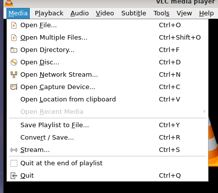

**播放菜单**

在此菜单中，您可以：

1. 选择您要播放的标题、章节或节目。

2. 停止播放。

3. 移至下一章或上一章。

4. 控制您正在播放的媒体的速度。

5. 跳转到媒体中的特定章节或时间。

6. 创建自定义书签。


**音频菜单**

在此菜单中，您可以：

1. 选择您想要的音轨
2. 更改媒体的立体声模式。
3. 更改设备以播放音频。
4. 启用内置的可视化。
5. 增加和减少音量。
6. 静音播放。


**视频菜单**

在此菜单中，您可以： 1. 选择您想要的视频轨道。2.将视频设置为全屏播放并适合windows。3.设置为墙纸。4. 更改缩放、纵横比和裁剪。5.调整去隔行和后期处理选项（高级用户）。6. 对当前帧进行截图。

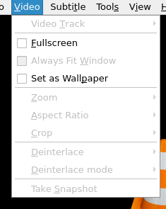

**字幕菜单**

在此菜单中，您可以：

1. 添加字幕文件。
2. 选择一个子轨道。


**工具菜单**

在此菜单中，您可以：

1. 更改音频和视频效果和过滤器。

2. 更改音频和字幕同步。

3. 查看当前媒体信息。

4. 管理插件和扩展。

5. 自定义程序设置和界面。

6. 修改您的偏好。


**视图菜单**

在此菜单中，您可以：

1. 查看当前和停靠的播放列表。
2. 更改播放列表视图模式。
3. 更改 VLC 正在使用的接口。
4. 添加接口。
5. 为 VLC 添加 VLsub 插件。

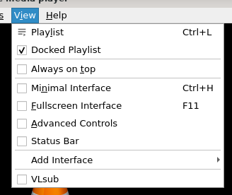

**帮助菜单**

在此菜单中，您可以：

1. 使用该程序获得更多帮助。
2. 检查 VLC 的更新。
3. 查看 VLC 的开发者，开发和许可证。


### 1.2 播放控制

在这里，您可以使用许多功能来控制媒体文件的播放。


### 1.3 音量控制

这允许您增加或减少正在播放的媒体文件的音量。


## 2. 基本用法

### 2.1 媒体

#### 2.1.1 播放文件

要播放文件，请打开媒体菜单，如下图所示：


然后选择打开文件菜单项。


将出现一个打开文件对话框。选择要打开的文件，然后选择Open。

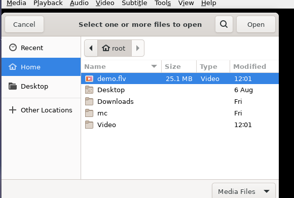

单击打开后，VLC 将开始播放指定的文件。

上述步骤的替代方法是简单地将文件拖放到 VLC 主界面。


#### 2.1.2 播放 CD/DVD/VCD/蓝光

要播放 CD、VCD 或 DVD，请打开Media ‣ Open Disc菜单项。

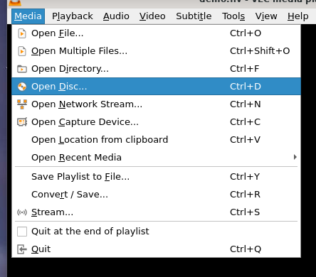

在如下图所示的“打开磁盘”对话框中，选择您喜欢的媒体类型（DVD、蓝光、音频 CD 或 SVCD/VCD）。

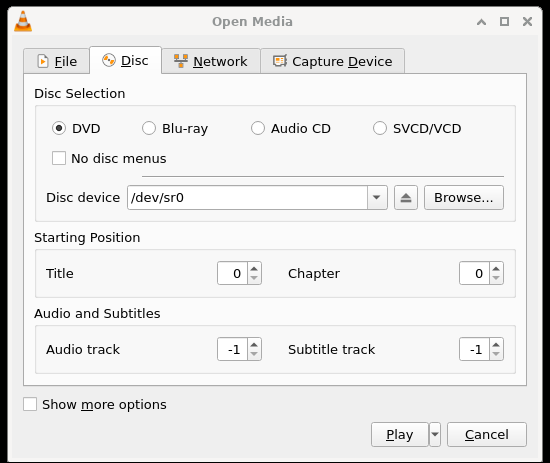

您可以通过从“光盘设备”下拉列表中选择驱动器号来选择媒体所在的驱动器，也可以单击“浏览”按钮，这将打开一个对话框，您可以使用该对话框来浏览您的媒体。读取 DVD 时，还有一个无 DVD 菜单选项。

如果您想从给定的标题和章节而不是从头开始播放 DVD 或 VCD，您可以使用标题和章节选择器进行设置。您还可以使用选择器设置音频和字幕轨道。


#### 2.1.3 播放网络流

流媒体是一种通过网络传送音频或视频内容的方法，无需在播放之前下载媒体文件。您可以在内容到达时查看或收听内容。它的优点是您无需在播放大型媒体文件之前等待它们完成下载。

VideoLan 设计用于在高带宽网络上流式传输 MPEG 视频。VLC 可用作服务器，以单播或多播的形式在网络上流式传输 MPEG-1、MPEG-2 和 MPEG-4 文件、DVD 和实时视频。VLC 也用作客户端来接收、解码和显示 MPEG 流。从网络或外部设备接收的 MPEG-1、MPEG-2 和 MPEG-4 流可以发送到一台机器或一组机器。

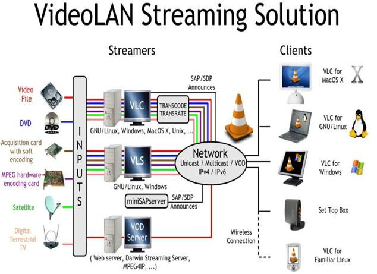

要播放网络流，请单击菜单栏上的媒体并选择打开网络流。打开媒体对话框加载时选择了网络选项卡。在选项卡中，在文本框中输入网络 URL，然后单击Play。

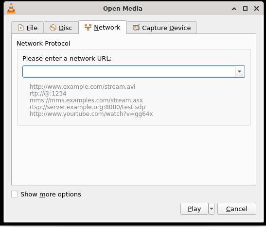

当 VLC 播放流时，轨道滑块显示流文件的进度。

#### 2.1.4 从采集卡播放媒体

要从采集卡播放，请单击媒体菜单 ‣ 打开捕获设备菜单，如下面的屏幕截图所示。

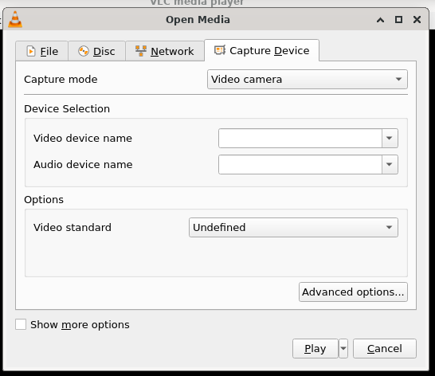

单击Open Capture Device后，屏幕上将显示一个对话框，其中包含可供选择的不同选项和功能。在那里，您可以从下拉菜单中选择首选的捕获模式。

除了上述 VLC 捕获设备的功能外，请参阅下面的更多功能；

- 您可以更改视频设备名称和音频设备名称。

- 用户还可以通过单击配置来调整这些设备的配置。
  
- 用户可以通过单击高级选项来设置将由 Direct Show 插件播放的视频的大小以及设备属性和调谐器属性等选项。

#### 2.1.5 Video4Linux

对于 Video4Linux 设备，您可以使用视频设备名称和音频设备名称文本输入来设置视频和音频设备的名称。高级选项按钮允许您选择一些在极少数情况下有用的进一步设置，例如输入的色度（颜色编码方式）和输入缓冲区的大小。


#### 2.1.6 Hauppauge PVR 卡

要使用 Hauppauge PVR 卡，请在打开对话框中选择PVR选项卡。使用设备文本输入来设置您要使用的卡的设备。您可以使用Norm Drop Down 设置调谐器的 Norm（PAL、SECAM 或 NTSC）。频率选择器允许您设置调谐器的频率（以 kHz 为单位），比特率选择器用于设置生成的编码流的比特率（以比特/秒为单位）。高级选项按钮允许设置更多设置，例如编码视频的大小（以像素为单位）、其帧速率（以每秒帧为单位）、2 个关键帧之间的间隔等。

要从采集卡开始播放，请单击播放。

### 2.2 回放

VLC 媒体播放器可帮助您创建媒体文件。创建媒体文件后，必须测试质量。您可以使用回放测试质量和其他几个参数。在播放中，您可以指定时间、书签和标题等参数。

#### 2.2.1 书签

您可以使用 VLC 的书签功能标记和定位音频或视频文件中的特定位置。如果您想观看电影中的特定场景或反复聆听歌曲中的某些曲调，您可以创建书签。

要为视频中的场景添加书签，请按照以下步骤操作：

1. 在菜单栏上，点击Menu ‣ Playback。

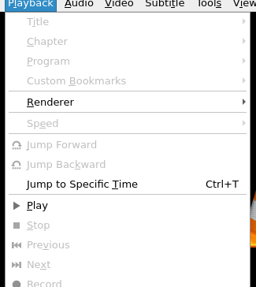

2. 选择自定义书签。当您单击自定义书签时，将显示一个下拉菜单。请从下拉菜单中单击管理以打开编辑书签对话框。


3. 要创建书签，请单击创建以显示当前曲目。单击Create后，创建的书签会出现在Edit Bookmarks对话框中。


#### 2.2 标题

在 DVD 格式中，每部电影都由其标题或名称来引用。任何媒体播放器播放电影时都会显示一个标题。您可以按顺序查看文件夹中的所有标题。

1. 要打开文件夹，请从菜单中选择Menu ‣ Open Folder。找到视频文件所在的文件夹，然后单击确定。

2. 要选择标题，请单击Playback ‣ Title菜单。然后播放选定的标题。

#### 2.3 章节

视频也可以分为章节。在正在播放的视频中，可以随机访问不同的章节。使用此选项，您可以直接查看您喜欢的章节，而无需查看完整的视频。

播放章节：

1. 选择菜单 ‣ 打开文件夹菜单。

2. 找到视频文件所在的文件夹。

3. 选择一个视频文件并单击确定，该文件将在 VLC 媒体播放器中播放。

4. 在菜单中选择Playback ‣ Chapter以查看章节列表。选择您选择的章节。然后播放选定的章节。


#### 2.4 程序

此选项仅在播放格式为 DVB（数字视频广播）和 TS 的流时启用。通过提供其服务 ID 来选择要选择的程序。仅当您想读取多节目流（例如 DVB 流）时才使用此选项。FIXME：描述需要改进

#### 2.5 指定时间

此选项用于转到媒体文件中的特定帧并再次收听或查看。

1. 要指定时间，请选择Playback ‣ Jump to Specific Time菜单。将显示转到时间对话框。

2. 在 hh:mm:ss 中输入时间。

3. 单击“开始”按钮。控件将跟踪器移动到特定帧，媒体文件从该指定帧继续。

4. 单击取消退出对话框。


### 3. 声音

VLC 媒体播放器可以播放多种音频式：.asf、.avi、.divx、.dv、.mxf、.ogg、.gm、.ps、.ts、.vob 和 .wmv。它还可以转换音轨并使用多种可视化。音频菜单中的命令仅在播放音频文件时启用。

#### 3.1 播放音轨

要播放曲目，请按照以下步骤操作：

1. 选择媒体 ‣ 打开文件菜单。

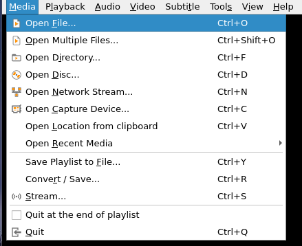

2. 选择一个音频文件，然后单击“打开”按钮。紧接着，所选曲目将在我的 VLC 上播放。


#### 3.2 启用和禁用音轨

在 VLC 上，您可以选择禁用和启用轨道。

- 禁用：选择Audio ‣ Audio Track菜单，然后单击下拉菜单中的Disable选项以停止所选轨道。

#### 3.3 立体声模式

此选项可帮助您以立体声和单声道两种模式收听音频文件。

要以立体声或单声道模式收听音轨：

1. 从屏幕上显示的对话框中单击Media ‣ Open File 或 Open Disc 。

2. 选择一个音频文件，然后单击播放按钮。

3. 如果您想在 Mono 模式下收听音轨，请选择Audio ‣ Audio Device ‣ Mono 。

4. 如果您想在立体声模式下收听音轨，请选择Audio ‣ Audio Device ‣ Stereo 。

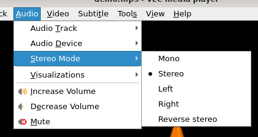

#### 3.4 可视化音频

可视化显示颜色和几何形状的飞溅，并根据一段音乐生成动画图像。从“音频”菜单中选择可视化类型选项以查看效果。可用的不同视觉效果有：

- 光谱仪
- 范围
- 光谱
- 音量表
- 咕咕咕
- 项目M
- 3D 光谱

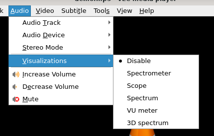
要禁用可视化，请单击Visualizations ‣ Disable下拉菜单。

#### 3.5 最大音量

要更改音频文件的最大音量，请转到Tools ‣ Preferences，选择左下角的All ，然后选择Interface ‣ Main interface ‣ Qt ‣ Maximum volume shown。然后保存并重新启动 VLC。

### 4. 视频

您可以使用 VLC 媒体播放器播放视频文件、视频剪辑和其他视频媒体。您可以调整大小、更改纵横比、裁剪视频、加载字幕、去隔行扫描、保存快照以及将视频转换为 DirectX 壁纸。

支持 .asf、.avi、.divx、.dv、.mxf、.ogg、.gm、.ps、.ts、.vob 和 .wmv 格式的视频轨道。

#### 4.1 播放视频轨道

打开和播放视频轨道有两种主要方式：

1. 选择媒体 ‣ 打开文件。

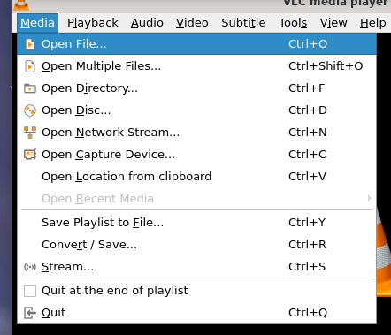

2. 选择一个视频轨道并双击它或单击打开按钮来播放文件。


#### 4.2 全屏

如果您想以全屏模式观看视频，此选项很有用。

1. 选择视频 ‣ 全屏。然后视频将占据整个屏幕。


2. 要返回原始模式，请按Esc键盘或右键单击鼠标并选择离开全屏选项。然后视频将返回其原始模式。

当您切换到全屏时，控件可能会出现一小段时间。要在控件消失后恢复控件，请移动鼠标或按键盘上的任意键。

#### 4.3 快照

如果您想将视频的一部分捕获为图像，此选项很有用。要从视频中捕获图像，请单击Video ‣ Take Snapshot。

图像以 .png 图片格式捕获，默认保存在文件夹中 ( )。

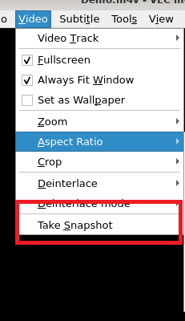

#### 4.4 放大

您可以放大不同尺寸的视频。如果您想更改正在播放的视频轨道的大小，此选项很有用。支持的尺寸为 1:4 Quarter、1:2 Half、1:1 Original（默认）和 2:1 Double。要查看特定维度的视频，请在Video ‣ Zoom中选择一个维度。

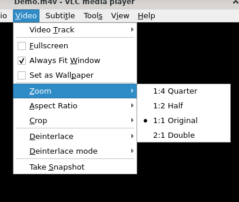

然后根据选定的缩放比例调整轨道的大小。

#### 4.5 纵横比

纵横比是指图片的宽度与其高度的关系。例如，比例 4:3 表示四个单位宽对三个单位高。VLC 提供了一个纵横比值列表，它们是默认值、1:1、4:3、16:9、16:10、2.21:1、2.35:1、2.39:1 和 5:4。

要选择纵横比，请从Video ‣ Aspect Ratio菜单中选择一个值。然后根据所选比例调整视频。


#### 4.6 截图

如果您想将一小部分视频捕获为图像，此选项很有帮助。这也有助于裁剪视频顶部和底部的黑条。

支持的裁剪值为 Default、16:10、16:9、1.85:1、2.21:1、2.35:1、2.39:1、5:3、4:3、5:4 和 1:1。

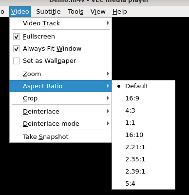

要裁剪播放的视频，请从Video ‣ Crop菜单中选择一个值。然后根据所选值裁剪视频。

#### 4.7 去隔行

去隔行是指将隔行视频信号转换为非隔行信号的过程。VLC 提供了 Discard、Blend、Mean、Bob、Linear、X、Yadif 和 Yadif (2x) 去隔行模式。


您可以按照以下步骤实现去隔行：

1. 选择Video ‣ Deinterlace菜单并选择适当的设置。

2. 要更改去隔行模式，请选择Video ‣ Deinterlace mode

3. 选择一种模式并观察正在播放的视频的变化。

### 5. 字幕

字幕是电影对话的文本版本。如果您正在观看包含外语的电影，字幕会很有帮助。在 VLC 中，支持 .cdg、.idx、.srt、.sub、.utf、.ass、.ssa、.aqt、.jss、.psb、.rt 和 smi 格式的字幕。

#### 5.1 包含字幕的媒体

许多类型的媒体都可以嵌入字幕。VLC 可以读取以下媒体格式的字幕：

- DVD
- SVCD
- OGM 文件
- Matroska (MKV) 文件

VLC 媒体播放器默认启用字幕。要禁用它们，请单击字幕菜单以查找文件的可用字幕轨道，然后选择禁用以关闭字幕。根据媒体的不同，轨道可能会提供描述（例如语言）。

要默认禁用字幕，请转到Tools ‣ Preferences ‣ Subtitles/OSD，然后取消选中Enable subtitles复选框并单击Save。


DVD和SVCD字幕只是图像，因此您无法为它们更改任何内容。OGM和Matroska字幕是渲染文本，因此您可以更改多个选项。

#### 5.2 字体修改

可以在Tools ‣ Preferences选项卡中更改文本渲染选项。要更改字体类型和大小，请单击Videos ‣ Subtitles/OSD，然后从Font and Font size下拉菜单中选择您的偏好。


您需要重新启动流以使字体修改生效。

#### 5.3 字幕文件

虽然像Matroska或OGM这样的现代文件格式可以直接处理字幕，但像 AVI 这样的旧格式却不能。因此，已经创建了许多字幕文件格式。您需要两个文件：视频文件和仅包含字幕文本和时间戳的字幕文件。

VLC 可以处理这些类型的字幕文件：

- MicroDVD
- SubRIP
- SubViewer
- SSA
- sami
- Vobsub（这个很特别：它不是由文本而是由图像制成的，这意味着您不能更改字体）

要打开和使用字幕文件，请在单击打开多个文件时出现的对话框中单击下图所示的使用字幕文件复选框……然后单击浏览按钮选择文件。还有一个选项可以设置字符编码、对齐方式和大小。

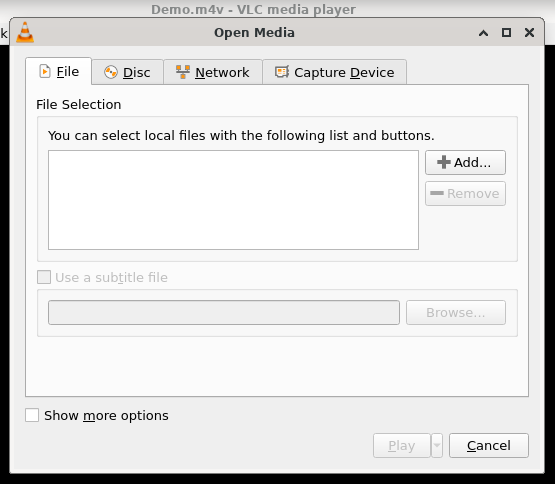

另一种方法是从Video ‣ Subtitle Track菜单加载字幕。

对于 Vobsub 字幕，您需要选择.idx文件，而不是.sub文件。编码、对齐和大小不会对 Vobsub 字幕产生任何影响。

### 6. 热键

VLC 热键是即使 VLC 没有焦点也可以使用的键盘快捷键。在这里，我们向您展示了最常用的热键以及 VLC 中允许的全局热键的完整列表。

#### 6.1 最常被使用

在下面找到 VLC 中最常用的全局热键列表：

| 行动      | 热键        |
| --------- | ----------- |
| 全屏      | F           |
| 退出全屏  | Esc键       |
| 播放/暂停 | 空间        |
| 停止      | s           |
| 快点      | +           |
| 慢点      | -           |
| 正常率    | =           |
| 下一个    | n           |
| 以前的    | p           |
| 提高音量  | ctrl + 向上 |
| 音量减小  | ctrl + 向下 |
| 向后跳    | Shift + 左  |
| 向前跳跃  | Shift + 右  |

#### 6.1 完整列表

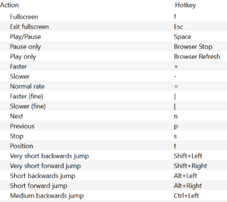

### 7. 录像

- 录制您正在播放的内容
- 录制按钮
  - 使录制按钮可见
  - 选择您的录音文件夹
- 如何录制音频
  - 录制音频内容
  - 录制你的麦克风
- 如何录制视频
  - 录制视频内容
  - 录制您的桌面
  - 录制您的网络摄像头

#### 7.1 录制您正在播放的内容

您可以使用录制按钮录制您正在使用 VLC 播放的任何内容的音频或视频。
录制按钮

要使用录制按钮：

- 在播放菜单中，单击录制 记录按钮开始录制，
- 再次单击“录制” 记录按钮以停止录制，
- 您也可以通过单击停止按钮来停止录制。


录音存储在计算机上用于视频或音乐的默认存储文件夹中，名称如下vlc-record-Date-Time-Channel-Track.extension。

示例：vlc-record-2011-09-22-10h19m48s-Radio CAFF-Silencio - Arrabal Salvaje.mp3

您可以通过Streamripper中继流，即通过将StreamRipper定向到ShoutCast流并将 VLC 定向到 StreamRipper 的中继端口（默认http://localhost:8000）来自动将流切割成轨道。
使录制按钮可见

默认情况下，录制按钮不容易访问，但您可以使其永久可见。为此，请使用以下方法之一：

- 高级控制

单击View ‣ Advanced Controls以在Playback Controls正上方显示高级工具栏。此高级工具栏包含“录制”按钮。录制按钮可见后，单击它开始录制。

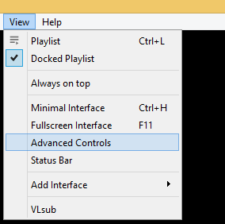

- 自定义界面

选择Tools ‣ Customize interface menu 并将录制按钮拖动到第 2 行中您选择的任何位置。录制按钮可见后，单击它开始录制。第 2行是 VLC 上显示的默认行。

#### 7.2 选择您的录音文件夹

您可以修改用于存储录音的文件夹。要做到这一点：

- 选择工具 ‣ 首选项或按。Ctrl+P

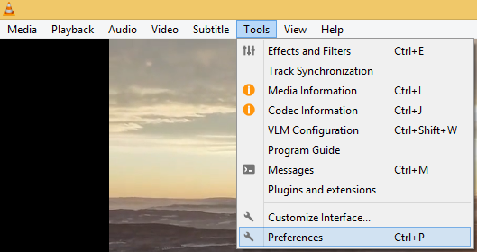

2. 单击Input/Codecs，在Files下单击Browse...为您的录音选择一个位置。


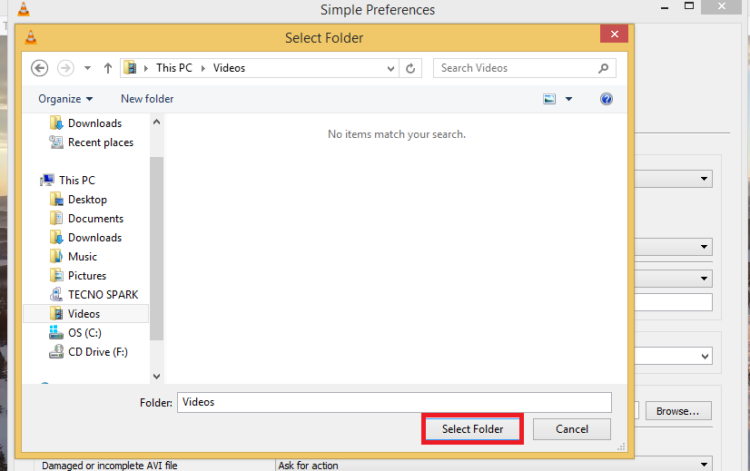

3. 点击保存。

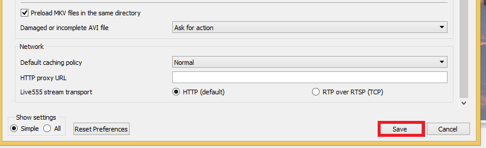

### 8. 如何录制音频

VLC 提供了多种用于录制音频的选项，可以来自您正在收听的内容，也可以来自麦克风等音频输入设备。

#### 8.1 录制音频内容

VLC 可以使用录制按钮录制它可以播放的任何音频内容，如录制按钮中所述。
录制你的麦克风

1. 选择捕获设备：

- 选择Media ‣ Open capture Device或按,Ctrl+C
- 然后在捕获模式下单击下拉菜单并选择DirectShow。


如果要更改录音设备，请单击音频设备名称下的下拉菜单，然后选择所需的设备。


2. 单击播放按钮上的箭头，然后选择转换或按。Alt+O


3. 在配置文件下单击下拉菜单以选择所需的音频输出格式。

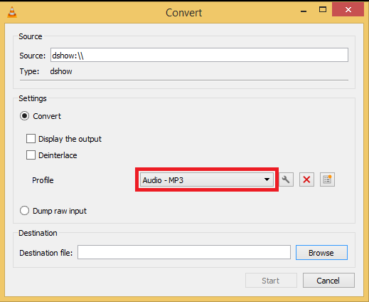

4. 单击浏览以选择保存位置。

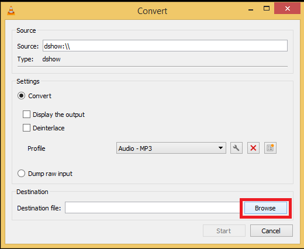

5. 单击开始开始录制。


6. 单击停止按钮停止停止录制。您的音频将存储在您选择的目的地。

### 9. 如何录制视频

VLC 提供了多种录制视频的选项。您可以对正在观看的电影/视频进行视频录制，录制桌面，甚至使用网络摄像头或类似的输入设备录制自己。这些录音也可以以多种格式保存。

#### 9.1 录制视频内容

VLC 可以使用录制按钮录制它可以播放的任何视频内容，如录制按钮中所述。

#### 9.2 录制您的桌面

1. 选择Media ‣ Open capture Device或按，然后在捕获模式下单击下拉菜单并选择Desktop。Ctrl+C


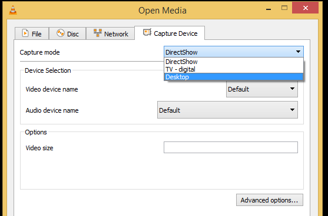

2. 在选项下设置您想要的帧速率。


3. 单击播放按钮上的箭头，然后选择转换或按。Alt+O


4. 在配置文件下单击下拉列表以选择所需的输出格式。


5. 单击浏览以选择保存位置。

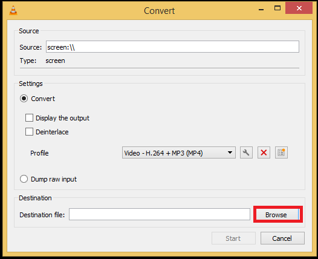

6. 单击开始开始录制。

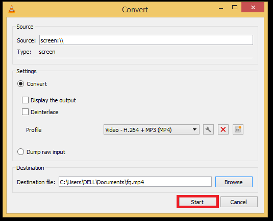

7. 单击停止按钮停止停止录制。您的视频将存储在您选择的目的地。

#### 9.3 录制您的网络摄像头

1. 选择网络摄像头设备：

- 选择Media ‣ Open capture Device ,
- 在下拉菜单中选择输入设备，
- 然后单击视频复选框。

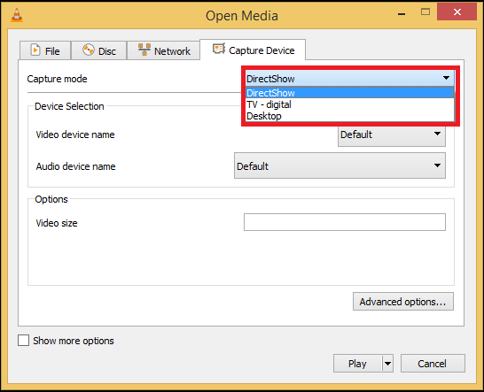

2. 单击播放按钮上的箭头，然后选择转换或按。Alt+O

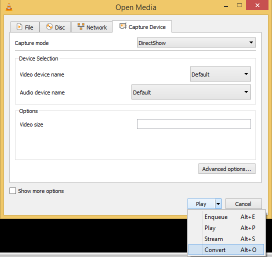

3. 在配置文件下单击下拉列表以选择所需的输出格式。


4. 单击浏览以选择保存位置。

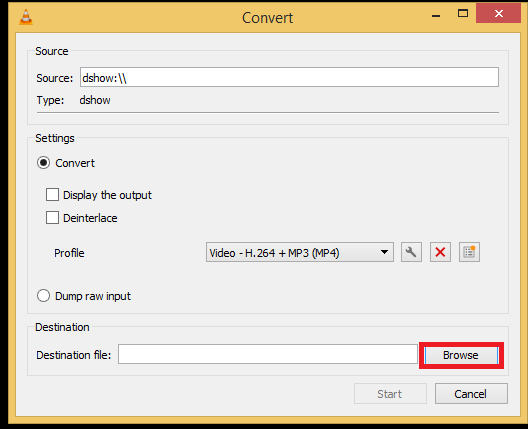

5. 单击开始开始录制。


6. 单击停止按钮停止停止录制。您的视频将存储在您选择的目的地。

### 10. 设置

通过其各种设置可以轻松自定义 VLC 以满足您的需求。

- 喜好
    - 在哪里可以找到 VLC 首选项
    - 如何重置 VLC 首选项
    - 偏好部分
- 调整与效果
    - 音频效果
        - 均衡器
        - 附加音频效果
    - 视频效果
    - 同步
        - 音视频同步
        - 音频/字幕同步

### 附录
可用测试用例
- 视频
https://stream7.iqilu.com/10339/upload_transcode/202002/18/20200218114723HDu3hhxqIT.mp4
https://stream7.iqilu.com/10339/upload_transcode/202002/18/20200218025702PSiVKDB5ap.mp4
http://stream4.iqilu.com/ksd/video/2020/02/17/c5e02420426d58521a8783e754e9f4e6.mp4
- 音频
http://downsc.chinaz.net/Files/DownLoad/sound1/201906/11582.mp3
http://downsc.chinaz.net/files/download/sound1/201206/1638.mp3

```bash
wget https://stream7.iqilu.com/10339/upload_transcode/202002/18/20200218114723HDu3hhxqIT.mp4
wget https://stream7.iqilu.com/10339/upload_transcode/202002/18/20200218025702PSiVKDB5ap.mp4
wget http://stream4.iqilu.com/ksd/video/2020/02/17/c5e02420426d58521a8783e754e9f4e6.mp4
wget http://downsc.chinaz.net/Files/DownLoad/sound1/201906/11582.mp3
wget http://downsc.chinaz.net/files/download/sound1/201206/1638.mp3
```
