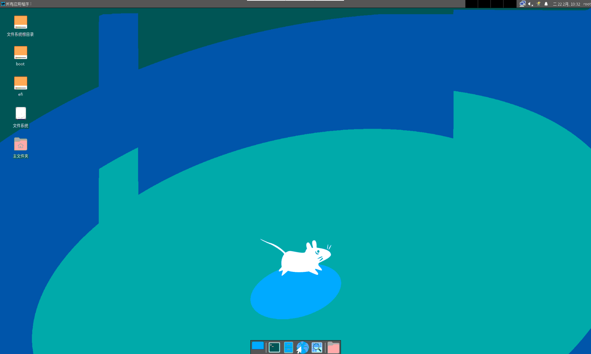
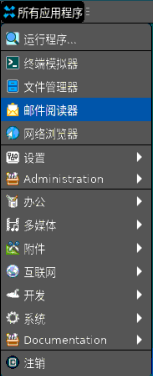
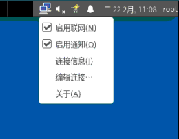
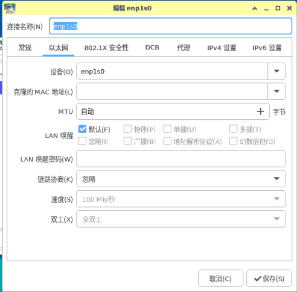
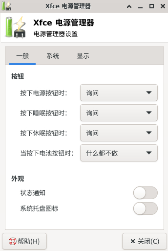
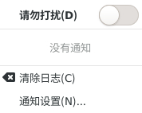
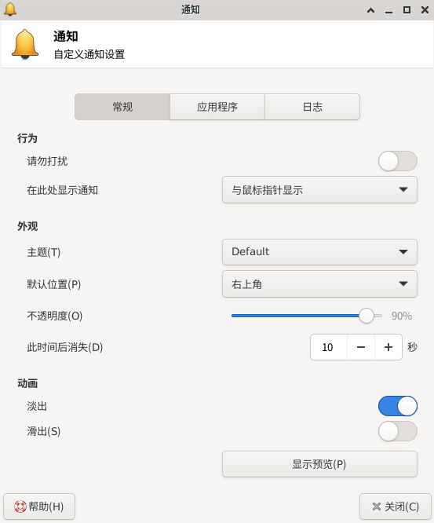
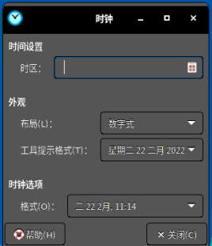
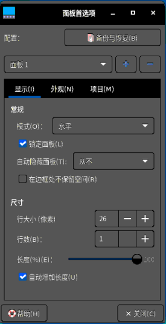
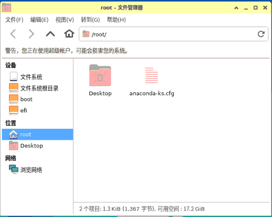

# Xfce使用说明

## 1. 概述

Xfce是运行在类Unix操作系统中的一款轻量级桌面环境。Xfce提供了多个功能部件，包括 所有应用程序 等，本文主要描述 Xfce 的使用。

界面如下图所示。

 

## 2. 桌面

### 2.1 桌面图标

系统默认放置了文件系统、主文件夹、挂载目录等图标，鼠标左键双击即可打开页面。 

### 2.2 右键菜单

在桌面空白处单击鼠标右键，出现的菜单如下图所示，为用户提供了一些快捷功能。

部分选项说明如表。

| 选项               | 说明                                        |
| :----------------- | :------------------------------------------ |
| 在新窗口中打开     | 打开对应登录用户的Desktop目录               |
| 创建启动器         | 启动器的自行创建                            |
| 创建URL链接        | URL链接的自行创建                           |
| 创建文件夹         | 新建文件夹                                  |
| 创建文档           | 新建文本文档                                |
| Open Terminal Here | 新建终端                                    |
| 排列桌面图标       | 自动排列桌面图标                            |
| 桌面设置           | 提供关于背景、菜单、图标的设置              |
| 属性               | 提供关于Desktop的一般、徽标、权限等属性设置 |
| 应用程序           | 所有应用程序                                |

 

## 3. 任务栏

### 3.1 基本功能

任务栏位于顶部，包括所有应用程序菜单、窗口显示区、多视图切换、托盘菜单。

| 组件         | 说明                                                         |
| :----------- | :----------------------------------------------------------- |
| 所有应用程序 | 用于弹出所有程序以及设置，可查找应用和设置。                 |
| 窗口显示区   | 横条中间空白部分；显示正在运行的程序或打开的文档，可进行最小化、最大化、关闭窗口、窗口置顶等操作。 |
| 多视图切换   | 可在多个工作区互不干扰进行操作。                             |
| 托盘         | 包含了对网络连接、声音、电源、通知中心、日历、登录用户动作的设置。 |

#### 3.1.1 所有应用程序

#### 3.1.2 窗口显示区

#### 3.1.3 多视图切换

点击任务栏“”中的每个区域图标，即可进入对应的工作区域。

例如，通过鼠标在多个工作区内切换选择当下需要工作的操作区。

#### 3.1.4 托盘

##### 3.1.4.1 网络

用户通过鼠标左键点击任务栏上的网络“”图标，可根据需要选择网络连接方式。

网络设置窗口

用户通过鼠标右键点击任务栏上的网络“”图标，弹出网络设置菜单。

点击 编辑连接，即刻进入网络设置窗口。

双击 指定的网络连接 ，例如enp1s0，进入该连接的设置界面。

##### 3.1.4.2 音量

用户通过鼠标左键点击任务栏上的音量“”图标，打开声音界面。

##### 3.1.4.3 电源

用户通过点击鼠标左键任务栏中电源“”图标。

用户通过点击 电源管理器设置 进行 显示、节点 等配置。

##### 3.1.4.4 通知中心

用户通过点击鼠标左键任务栏中通知“”图标。

用户可通过选择“请勿打扰”关闭通知。

通知中心将会显示重要的近期最新的重要信息列表，选择“清除日志”可将信息列表清空。

用户可通过选择“通知设置”跳转进入控制面板的通知设置界面，能设置显示信息的应用，以及信息的数量。

##### 3.1.4.5 日历

用户通过鼠标左键点击任务栏上的时间日期弹出日历窗口，查看日历、月历、年历窗口。

用户可通过筛选年 > 月 > 日查看一日信息。

用户通过鼠标右键点击任务栏上的时间日期,点击 属性 进行时间设置。

#### 3.1.4.6 高级设置

右键单击任务栏，出现的菜单中点击 面板。

用户可对任务栏的布局进行设定，可进行项目的添加、删除等相关设置。

##### 3.1.4.7 登录用户动作

用户通过鼠标左键点击任务栏上的登录用户，查看相关动作。

###### 3.1.4.7.1 锁屏

当用户暂时不需要使用计算机时，可以选择锁屏（不会影响系统当前的运行状态），防止误操作；用户返回后，输入密码即可重新进入系统。

在默认设置下，系统在一段空闲时间后，将自动锁定屏幕。

###### 3.1.4.7.2 切换用户

选择其他用户登录使用计算机时，可选择“切换用户”。

此时，系统会关闭所有正在运行的应用；所以，在执行此操作前，请先保存当前工作。

###### 3.1.4.7.3 挂起

处于环保节能考虑，可选择“挂起”。

此时，相关数据读入内存，注意不能切换电源。

###### 3.1.4.7.3 关机

用户选择关闭计算机时，可以选择“关机”。

在执行此操作前，建议先保存当前工作。

###### 3.1.4.7.3 注销

选择退出本次图形界面登录时，可选择“注销”。

此时，系统会关闭所有正在运行的应用；所以，在执行此操作前，请先保存当前工作。

 

## 4. 快捷操作栏

### 4.1 基本功能

快捷操作栏位于底部，包括所有显示桌面、终端、文件管理器、网络浏览器、应用程序查找、用户家目录。

| 组件         | 说明                                               |
| :----------- | :------------------------------------------------- |
| 显示桌面     | 最小化桌面的所有窗口，返回桌面；再次单击将恢复窗口 |
| 终端         | 快速打开一个终端                                   |
| 文件管理器   | 快速打开一个文件管理器                             |
| 网络浏览器   | 快速打开一个网络浏览器                             |
| 应用程序查找 | 快速打开应用程序查找窗口                           |
| 用户家目录   | 快速打开登录用户的家目录                           |

#### 4.1.1 显示桌面

用户通过鼠标左键点击快捷操作栏上的“”图标，执行 显示桌面 相关操作。

#### 4.1.2 终端

用户通过鼠标左键点击快捷操作栏上的“”图标，打开一个终端。

#### 4.1.3 文件管理器

用户通过鼠标左键点击快捷操作栏上的“”图标，打开一个文件管理器。

#### 4.1.4 网络浏览器

用户通过鼠标左键点击快捷操作栏上的“”图标，打开一个网络浏览器。

#### 4.1.5 应用程序查找

用户通过鼠标左键点击快捷操作栏上的“”图标，打开一个应用程序查找界面。

#### 4.1.6 用户家目录

用户通过鼠标左键点击快捷操作栏上的“”图标，点击 打开文件，打开一个用户家目录界面。

用户通过鼠标左键点击快捷操作栏上的“”图标，点击 在终端中打开，打开一个终端，当前目录为用户家目录。

