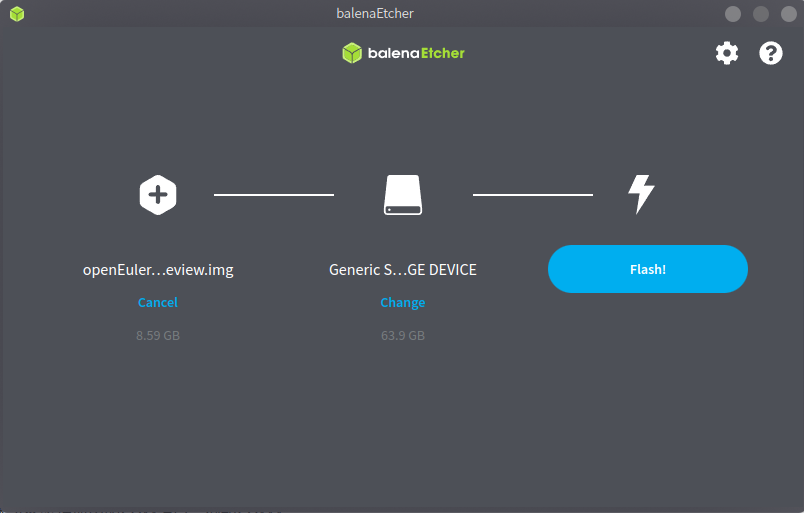
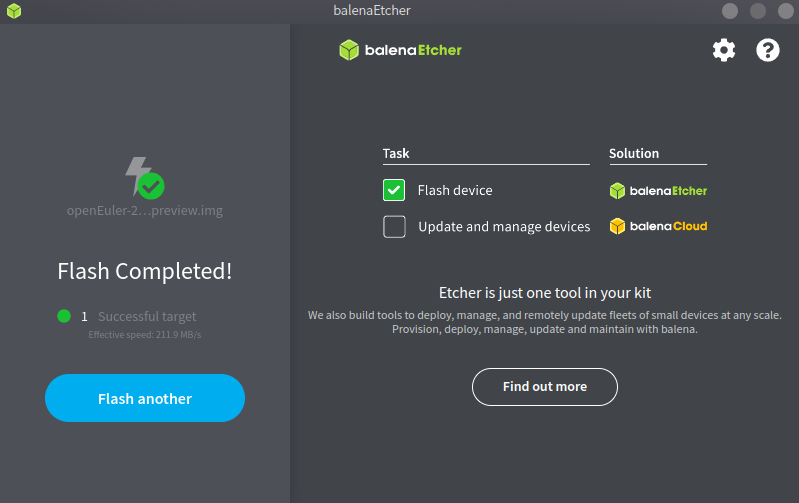
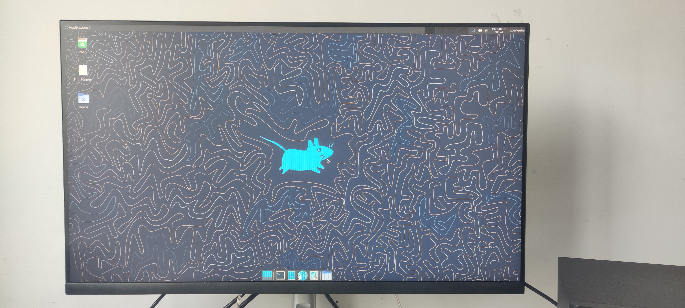

## 使用Visionfive2开发板安装安装openEuler RISC-V 23.03

注：

1. root用户密码`openEuler12#$`
2. openeuler用户密码`openEuler12#$`,默认用户

### 1. 准备硬件

1）Visionfive2开发板：由starfive获取得到开发板。

2）64G micro-sd卡及读卡器：SanDisk TF/MicroSD卡，容量64GB，速度U1，带读卡器。

3）Usb转uart串口通信模块：丢石头 PL2303，3.3/5V电平输出，type A接口，10PIN散头杜邦线。

4）电源适配器及type-c线。

### 2. 准备系统镜像

Visionfive2的系统镜像下载连接地址如下： https://mirror.iscas.ac.cn/openeuler-sig-riscv/openEuler-RISC-V/preview/openEuler-23.03-V1-riscv64/Visionfive2/

考虑到要安装验证Firefox浏览器，我们可以下载openEuler-23.03-V1-xfce-visionfive2-preview.img.zst，连接如下：https://mirror.iscas.ac.cn/openeuler-sig-riscv/openEuler-RISC-V/preview/openEuler-23.03-V1-riscv64/Visionfive2/openEuler-23.03-V1-xfce-visionfive2-preview.img.zst

其他文件均无需下载。

```bash
wget  https://mirror.iscas.ac.cn/openeuler-sig-riscv/openEuler-RISC-V/preview/openEuler-23.03-V1-riscv64/Visionfive2/openEuler-23.03-V1-xfce-visionfive2-preview.img.zst
```

### 3. 刷写镜像

#### Ubuntu

1. 解压镜像文件

```bash
#安装zstd
sudo apt-get update -y
sudo apt-get install -y zstd
#用zstd解压刚才下载的镜像
zstd -d  openEuler-23.03-V1-xfce-visionfive2-preview.img.zst
```

2. 下载烧录软件

这里使用BalenaEtcher这款软件

- [Etcher for Linux 64 bit (AppImage)](https://github.com/balena-io/etcher/releases/download/v1.7.9/balena-etcher-electron-1.7.9-linux-x64.zip?d_id=de8361fd-7321-4913-bcac-21c0663d095fR)
- [Etcher for Linux 32 bit (AppImage)](https://github.com/balena-io/etcher/releases/download/v1.7.9/balena-etcher-electron-1.7.9-linux-ia32.zip?d_id=de8361fd-7321-4913-bcac-21c0663d095fR)

```bash
#安装BalenaEtcher所需依赖
sudo apt update
sudo apt install libfuse2
```

直接运行刚才下载的软件

#### Archlinux

1. 解压镜像文件

```bash
#安装zstd
sudo  pacman -S zstd
#用zstd解压刚才下载的镜像
zstd -d  openEuler-23.03-V1-xfce-visionfive2-preview.img.zst
```

2. 下载烧录软件

这里使用BalenaEtcher这款软件

```bash
#安装BalenaEtcher
paru balena-etcher 
```

#### 开始烧录

根据提示选择镜像和设备开始刷入





### 3. 启动Visionfive

将64G micro-sd卡装入Visionfive sd卡槽，连接tpye-c电源启动，用户名：`root`，密码：`openEuler12#$`， 用户名：`openeuler`，密码：`openEuler12#$`



建议您安装镜像后进行软件升级，请打开一个终端，输入如下命令

```bash
sudo dnf upgrade
```
