# Chromium使用说明

## 1. 软件概述

Chromium是由Google主导开发的网页浏览器。以BSD许可证等多重自由版权发行并开放源代码，Chromium的开发可能早自2006年即开始。Chromium是Google的Google Chromium浏览器背后的引擎，其目的是为了创建一个安全、稳定和快速的通用浏览器。

## 2. Chromium基本使用

### 2.1 在 Chromium 中创建或管理您的 Google 帐号

可以选择在 Chromium 或任何其他浏览器中创建 Google 帐号。

可以前往 myaccount.google.com 管理自己的 Google 帐号。如果已使用 Google 帐号登录 Chromium，则还可在 Chromium 内管理 Google 帐号。创建或管理 Google 帐号时，可执行以下操作：

- 修改个人信息，例如名称、电子邮件地址、电话号码、实际地址或个人资料照片。
- 查看有助于让 Google 服务更符合您的需求的数据、活动记录和偏好设置。
- 管理您已保存的 Google 帐号联系人。
- 确保您的 Google 帐号安全。

### 2.2 在 Chromium 中登录和同步

如果要将信息保存到 Google 帐号中，请开启同步功能。

开启同步功能后

- 可以在自己的所有设备上找到和更新已同步的信息，例如书签、历史记录、密码和其他设置。
- 可以自动登录到 Gmail、YouTube、Google 搜索和其他 Google 服务。如果在开启同步功能之前已登录帐号，则会保持登录状态。
- 即使更换了设备（例如，由于丢失了手机或购置了新的笔记本电脑），也能找回已同步的信息。

#### 登录帐号并开启同步功能

如要开启同步功能，您必须拥有一个 Google 帐号。

1、在计算机上打开 Chromium。

2、点击右上角的个人资料图标。

3、登录Google 帐号。

4、如果想在自己的所有设备上同步信息，请依次点击开启同步功能>开启。

#### 自行选择要同步哪些数据

当开启同步功能后，系统会将所有个人资料信息（如书签、历史记录和密码）自动保存到 Google 帐号中。可以在自己的所有设备上找到自己的 Chromium 信息。

如果不想同步所有内容，可以更改要保存哪些内容。

1、在计算机上打开 Chromium。

2、在右上角，依次点击“更多”图标>设置。

3、依次点击您与 Google>同步功能和 Google 服务。

4、在“同步”下，点击管理您的同步数据。

5、关闭同步所有内容。

6、关闭所有您不希望同步到帐号中的数据。

### 2.3 将 Chromium设置为默认浏览器

右键桌面后依次点击`Applications`>`settings`>`default applications`，在弹出的对话框中选择internet一栏，随后在`Web Browser`选项栏中改为Chromium。

## 3. 个人资料与个性化设置

### 3.1 书签和设置

#### 3.1.1 导入

将书签添加到 Chromium
要从大多数浏览器（如 Firefox、Internet Explorer）导入书签，请按以下步骤操作：

1、在计算机上打开 Chromium。

2、在右上角，点击“更多”图标。

3、依次选择书签>导入书签和设置。

4、选择包含待导入书签的程序。

5、点击导入。

6、点击完成。

- 导入的书签将显示在何处
如果尚未在 Chromium 中创建任何书签，那么导入的书签将显示在书签栏中。

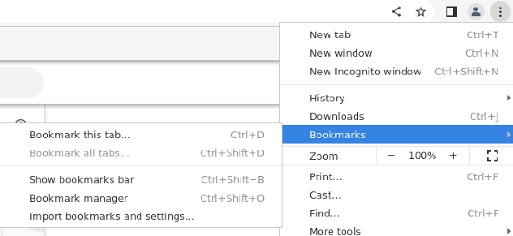

#### 3.1.2 导出

如果您决定使用其他浏览器，则可以导出自己的所有 Chromium 书签。

1、在计算机上打开 Chromium。

2、在右上角，点击“更多”图标。

3、依次选择书签 接着点按 书签管理器。

4、在顶部，依次点击“更多”图标 展开 接着点按 导出书签。

Chromium 会将您的书签导出为 HTML 文件。您可以使用此文件将书签导入另一个浏览器。

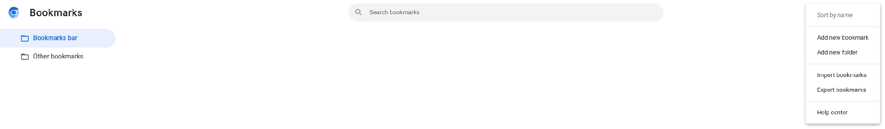

### 3.2 “新标签页”页面个性化设置

- 自定义“新标签页”页面

当打开新标签页后，在搜索框下方，可看到自己经常访问的网站或指向所选网站的快捷方式。

- 若要在快捷方式或最常访问的网站之间切换，请按照以下步骤操作：

1、打开 Chromium。

2、在“新标签页”页面的右下角，依次点击“自定义 Chromium”图标>快捷方式。

3、选择我的快捷方式或最常访问的网站。

4、若要隐藏快捷方式，请开启隐藏快捷方式。

5、点击完成。

- 若要移除或修改某个网站，请按照以下步骤操作：

1、将鼠标指针指向相应图标。

2、点击该图标右上角的“更多”图标。

3、选择修改快捷方式或移除。

- 添加自定义背景图片

可上传照片以用作 Chromium 的背景。

1、在“新标签页”页面的右下角，依次点击“自定义 Chromium”图标>背景。

2、若要上传照片，请点击从设备上传。

提示：若要每日更改一次背景，请点击相应集合并开启每日刷新。

- 更改浏览器的颜色

1、在“新标签页”页面的右下角，依次点击“自定义 Chromium”图标>颜色和主题。

2、选择颜色。

3、点击完成。

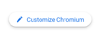

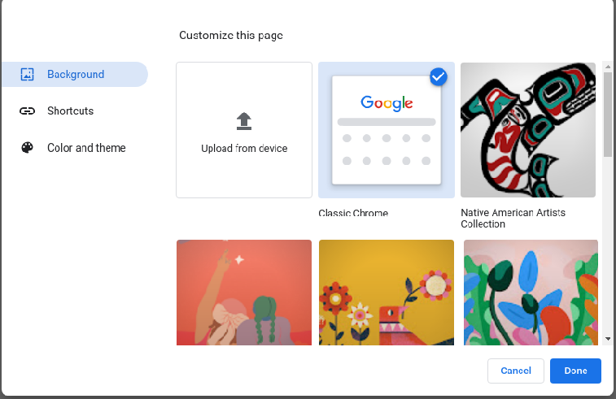

### 3.3 设置主页和启动页

可对 Chromium 进行自定义，使其在打开主页或启动页时显示任意页面。这两个页面并不相同，除非将它们设置为相同的页面。

- 启动页是您在设备上首次启动 Chromium 后看到的页面。
- 主页是您点击“主页”图标后进入的页面。

#### 3.3.1 设置启动页

- 打开新标签页

可以设置 Chromium，使其将您想打开的每一个新窗口都显示为“新标签页”页面。

1、在计算机上打开 Chromium。

2、在右上角，依次点击“更多”图标>设置。

3、在左侧，点击启动时。

4、点击打开新标签页。

- 继续浏览上次打开的网页

可以指示 Chromium 重新打开您退出 Chromium 时正在浏览的网页。

- 在计算机上：

1、在计算机上打开 Chromium。

2、在右上角，依次点击“更多”图标>设置。

3、点击启动时。

4、选择继续浏览上次打开的网页。

系统会保存您的 Cookie 和数据，因此您当时登录的任何网站（例如 Gmail）都会再次打开。如果您不想自动登录到这些网页，请按以下步骤操作：

1、在计算机上打开 Chromium。

2、在右上角，依次点击“更多”图标>设置。

3、依次点击隐私设置和安全性>Cookie 及其他网站数据。

4、关闭退出 Chromium 时清除 Cookie 及网站数据。

- 打开一组特定网页

可以指示 Chromium 打开任意网页。

1、在计算机上打开 Chromium。

2、在右上角，依次点击“更多”图标>设置。

3、在“启动时”下，选择打开特定网页或一组网页。

- 点击添加新网页。输入网址，然后点击添加。
- 点击使用当前网页。

若要更新网页，请依次点击网址右侧的“更多”图标>编辑或删除。

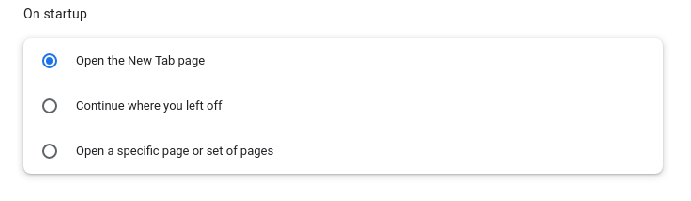

#### 3.3.2 选择主页

可以控制在您点击“主页”图标 首页 后显示哪个页面。

1、在计算机上打开 Chromium。

2、在右上角，依次点击“更多”图标>设置。

3、在“外观”下，开启显示“主页”按钮。

4、在“显示‘主页’按钮”下方，选择使用新标签页或自定义网页。

此时，“主页”按钮便会显示在地址栏的左侧。

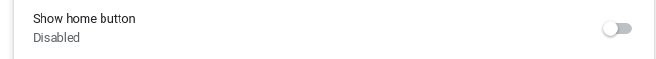

### 3.4 创建、查看和修改书签

#### 3.4.1 添加书签

1、在计算机上打开 Chromium。

2、转到今后想要再次访问的网站。

3、在地址栏右侧，点击星形图标。

#### 3.4.2 查找书签

- 重要提示

最便捷的书签打开方式是在书签栏中点击相应书签。若要开启或关闭书签栏，请依次点击“更多”图标>书签>显示书签栏。

如果您未开启书签栏，则可通过下面这 2 种方法查找书签：

- 从菜单中：

1、在计算机上打开 Chromium。

2、在右上角，依次点击“更多”图标>书签。

3、点击所需的书签。

- 从导航面板中：

1、在浏览器右上角，点击“侧边栏”图标 。

2、点击书签。

#### 3.4.3 修改书签

1、在计算机上打开 Chromium。

2、在右上角，依次点击“更多”图标>书签>书签管理器。

3、在相应书签的右侧，依次点击向下箭头 向下箭头>修改。

#### 3.4.4 删除书签

- 重要提示 ：书签一经删除便无法恢复

1、在计算机上打开 Chromium。

2、在右上角，依次点击“更多”图标>书签>书签管理器。

3、在相应书签的右侧，依次点击向下箭头>删除。

#### 3.4.5 将书签移至文件夹

1、在计算机上打开 Chromium。

2、在右上角，依次点击“更多”图标>书签>书签管理器。

3、可向上或向下拖动书签，或者将书签拖到左侧的文件夹中。也可复制并粘贴书签，使其按照预期的顺序排列。

- 如果您使用了书签栏，则可拖动书签以使其按照您预期的顺序排列。

#### 3.4.6 将书签放入文件夹中

1、在计算机上打开 Chromium。

2、在右上角，依次点击“更多”图标>书签>书签管理器。

3、在右上角，依次点击“更多”图标>添加新文件夹。

- 如果您使用书签栏，则可通过右键点击书签栏来添加文件夹。点击添加文件夹。

#### 3.4.7 按字母顺序排列书签

1、在计算机上打开 Chromium。

2、在右上角，依次点击“更多”图标>书签>书签管理器。

3、在右上角，依次点击“更多”图标>按名称排序。

### 3.5 在所有设备上同步书签、密码等信息

开启同步功能后，在所有设备上的以下信息都相同：

- 书签
- 历史记录和打开的标签页
- 密码
- 付款信息
- 地址、手机号码，等等
- 设置和偏好

如果已使用 Google 帐号登录 Chromium，但未开启同步功能，那么您也可获取以下信息：

- 您保存到 Google Pay 中的付款信息。
- 您保存到 Google 帐号中的密码。

#### 3.5.1 选择要同步的信息

当开启同步功能后，系统会将所有个人资料信息保存到 Google 帐号中。如果只想同步部分信息，可以更改要保存的信息。

1、在可信的计算机上打开 Chromium。

3、在右上角，依次点击“更多”图标>设置。

3、依次点击您与 Google>同步功能和 Google 服务。

- 如需查看已同步的内容，请选择查看您已同步的数据。

4、在“同步”下，点击管理同步数据。

5、选择同步选项：

- 选择同步所有数据类型以同步所有数据。
- 选择自定义同步以选择要同步的数据。

#### 3.5.2 查看和管理书签

1、在计算机上打开 Chromium。

2、在右上角，点击“更多”图标。

3、依次点击书签>书签管理器。

4、系统会在左侧显示包含所有书签的文件夹。

### 3.6 跨设备使用密码

#### 3.6.1 管理“提示保存密码”功能

可让 Chromium 记住用来登录网站的密码，并使用 Google 帐号中保存的密码自动登录。

“提示保存密码”功能默认处于开启状态，而且可关闭或重新开启此功能。

1、在计算机上打开 Chromium。

2、在右上角，依次点击“个人资料”图标>“密码”图标。

- 如果找不到“密码”图标，请改为在屏幕右上角依次点击“更多”图标>设置>自动填充>密码管理工具。

3、开启或关闭提示保存密码。

#### 3.6.2 管理自动登录功能

可以使用自己已保存的信息来自动登录网站和应用。如果想让系统在登录前显示确认信息，也可以关闭自动登录功能。

1、在计算机上打开 Chromium。

2、在右上角，依次点击“个人资料”图标 个人资料 接着点按“密码”图标 密码。

- 如果系统没显示您的 Google 帐号，请了解如何在 Chromium 中开启同步功能。
- 如果找不到“密码”图标，请改为在屏幕右上角依次点击“更多”图标 整理 然后 设置 然后 自动填充 然后 密码管理工具。

3、开启或关闭自动登录。

### 3.7 以访客身份浏览 Chromium

在访客模式下，无法看到或更改任何其他 Chromium 个人资料的信息。当退出访客模式时，系统会从计算机中删除浏览活动记录。

#### 3.7.1 开启访客模式

1、在计算机上打开 Chromium。

2、点击右上角的“个人资料”图标。

3、点击访客。

## 4.浏览网页

### 4.1 在 Chromium 中使用标签页

不仅可在 Chromium 中打开任意多个标签页，还可查看所有标签页并在它们之间切换。当打开一个新的标签页时，系统会显示基于浏览记录的个性化“新标签页”页面。

#### 4.1.1 打开新的标签页

在 chromium 窗口顶部，点击右侧最后一个标签页旁的“打开新的标签页”图标，或使用键盘快捷键：`Ctrl + t`

- 在新窗口中打开标签页
  点击标签页并将其拖到 Google Chromium 窗口外面。
  要打开新窗口，请使用键盘快捷键：`Ctrl + n`

- 在新的标签页中打开文件
  从计算机的桌面上或文件夹中，将相应文件拖到 Google Chromium 标签页中。如果此操作成功，光标将显示“添加”图标。
  在计算机中浏览并选择想要打开的文件。打开新的标签页，然后使用键盘快捷键：`Ctrl + o`

- 在新标签页中打开链接
  按住 Ctrl 的同时点击链接

#### 4.1.2 排列标签页

要更改标签页的排列顺序，请沿浏览器窗口顶部拖动标签页。

- 若要将某个标签页固定到左侧，请右键点击该标签页，然后选择固定。固定标签页的尺寸较小，并且只显示网站的图标。
- 若要取消固定某个标签页，请右键点击该标签页，然后选择取消固定。
- 若要将某个标签页移至另一个窗口，请右键点击该标签页，并选择将标签页移至另一个窗口。然后，选择要移至的窗口。请确保您在这两个窗口中都使用同一份个人资料登录了 Chromium。

#### 4.1.3 为标签页分组

可以使用群组整理标签页。

1、在计算机上打开 Chromium。

2、点击“打开新的标签页”图标 打开新的标签页。

3、右键点击某个标签页，然后选择添加到新组。

若要修改标签页群组，请右键点击左侧的彩色圆圈或名称。

- 为该群组命名。
- 向该群组添加更多标签页。
- 移除该群组。

- 若要将某个标签页添加到现有群组，请将此标签页拖入该群组。
- 若要从群组中移除某个标签页，请右键点击此标签页，然后选择从群组中移除。

#### 4.1.4 收起和展开标签页群组

可以收起标签页群组，这样的话，只有群组名称或彩色圆圈会显示在标签栏中。

1、创建标签页群组。

2、若要展开或收起群组，请选择其名称或彩色圆圈。

#### 4.1.5 在 Chromium 中搜索打开的标签页

在 Chromium 中打开多个标签页后，可以查找所需的特定标签页。

1、打开 Chromium。

2、在上次打开的标签页右侧，点击“标签页搜索”图标 向下箭头。

3、输入您要查找的网站的关键字。

4、在由打开的标签页组成的列表中：

- 如需打开某个标签页，请找到并点击它。
- 如需关闭某个标签页，请找到它并点击它右侧的“关闭”图标。

#### 4.1.6 关闭标签页

点击相应标签页右上角的“关闭”图标，或使用以下键盘快捷键：Ctrl + w

#### 4.1.7 恢复标签页或窗口

如果无意中关闭了某个标签页或窗口，则可以使用键盘快捷键将其重新打开：Ctrl + Shift + t

### 4.2 在 Chromium 上搜索网络信息

1、在计算机上打开 Chromium。

2、在顶部的地址栏中，输入想搜索的内容。

3、选择一条结果，或者按 Enter 键。

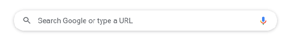

#### 4.2.1 在网页中搜索

可以在计算机上的网页中查找特定字词或短语。

1、在计算机上，从 Chromium 中打开一个网页。

2、在右上角，依次点击“更多”图标>查找。系统会打开一个搜索窗口。

3、输入搜索字词。

4、按 Enter 键以在网页中进行搜索。

- 系统会以黄色突出显示匹配内容。在右侧的滚动条中，会以黄色标记显示匹配内容在网页中的位置。

**提示**：您还可以使用键盘快捷键 Ctrl + f来快速查找字词或短语。

### 4.3 设置默认搜索引擎

1、在计算机上打开 Chromium 。

2、在右上角，依次点击“更多”图标>设置。

3、点击搜索引擎。

4、点击“地址栏中使用的搜索引擎”旁边的向下箭头。

5、选择新的默认搜索引擎。

#### 4.3.1 添加、修改或移除网站搜索快捷字词

1、在计算机上打开 Chromium 。

2、在右上角，依次点击“更多”图标>设置。

3、依次点击左侧的搜索引擎>管理搜索引擎和网站搜索。

4、如要更改网站搜索快捷字词，请执行以下操作：

- 添加：在“网站搜索”的右侧，点击添加。填写文本字段后点击添加。
- 修改：在网站搜索快捷字词的右侧，点击“修改”图标 修改。
- 设为默认：在网站搜索快捷字词的右侧，依次点击“更多”图标>设为默认。
- 停用：在网站搜索快捷字词的右侧，依次点击“更多”图标>停用。
- 删除：在网站搜索快捷字词的右侧，依次点击“更多”图标>删除。

**提示**：

- 可以设置用于搜索特定网站的快捷字词。
- 如果停用一个网站搜索快捷字词，该快捷字词会移至“无效的快捷字词”部分。
- 还可以在“无效的快捷字词”部分中找到其他推荐的网站。如要将快捷字词添加到网站搜索快捷字词中，请点击激活。
- 对于某些搜索网站，只有在搜索该网站后，它才会显示在“无效的快捷字词”部分中。

### 4.4 下载文件

要将文件/图片保存到计算机或设备上，您可以进行下载。下载的文件将保存到您的默认下载位置。

1、在计算机上打开 Chromium 。

2、转到您想从中下载文件的网页。

3、保存相应文件：

- 大多数文件：点击相应的下载链接。或者，右键点击相应文件并选择另存为。
- 图片：右键点击相应图片并选择图片另存为。
- 视频：将光标指向相应视频。点击“下载”图标。如果您无法执行此操作，则表明该视频的所有者或托管网站已禁止下载。
- PDF 文件：右键点击相应文件，然后选择链接另存为。
- 网页：依次点击右上角的“更多”图标>更多工具>网页另存为。

4、如果系统提示，请选择要将该文件保存到的位置，然后点击保存。

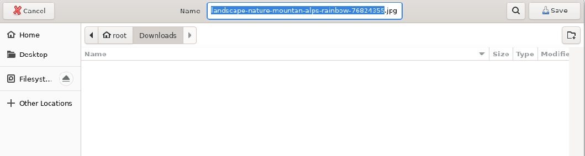

- 可执行文件（.exe、.dll、.bat）：如果信任相应文件，请点击保存以示确认。如果对下载文件的内容心存疑虑，请点击舍弃。

5、下载完毕后，您会在 Chromium 窗口的底部看到该文件。点击文件名即可打开这个文件。

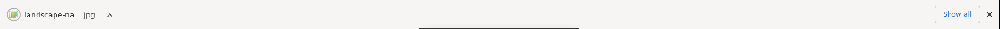

如需在计算机上查找所下载的文件，请依次点击文件名旁边的向下箭头>在文件夹中显示。

#### 4.4.1 更改默认的下载权限

可以选择允许访问的网站一并下载相关文件。

1、打开 Chromium。

2、在右上角，依次点击“更多”图标>设置。

3、依次点击隐私设置和安全性>网站设置。

4、点击其他权限>自动下载。

5、选择要设为默认设置的选项。

#### 4.4.2 暂停或取消下载

1、在屏幕底部，找到要暂停下载或要取消下载的文件。

2、在屏幕底部相应文件名旁边点击向下箭头或“更多”图标。

3、点击暂停、继续或取消。

#### 4.4.3 查看您已下载的文件的列表

1、在计算机上打开 Chromium。

2、在右上角，依次点击“更多”图标>下载内容。

- 要打开文件，请点击相应的文件名。系统会根据文件类型使用计算机默认的应用打开该文件。
- 如需从历史记录中移除某项下载内容，请点击相应文件右侧的“移除”图标。系统便会从 Chromium 的“下载内容”页面中移除该文件，但不会从计算机上移除它。

#### 4.4.4 更改默认的PDF下载权限

可以选择在访问某个网站时，是下载 PDF 文档还是在 Chromium 中打开 PDF 文档。

1、打开 Chromium。

2、在右上角，依次点击“更多”图标>设置。

3、依次点击隐私设置和安全性>网站设置。

4、依次点击更多内容设置> PDF 文档。

5、选择要设为默认设置的选项。

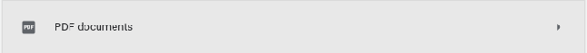

#### 4.4.5 更改下载内容的保存位置

可以在计算机上选择用于默认保存下载内容的位置，也可以在每次下载时选择特定的目标位置。

1、在计算机上打开 Chromium。

2、在右上角，依次点击“更多”图标>设置。

3、在底部，依次点击高级>下载内容。

4、调整您的下载设置：

- 如需更改默认下载位置，请点击更改，然后选择您想用来保存文件的位置。
- 如果您要在每次下载时选择具体的位置，请选中“下载前询问每个文件的保存位置”复选框。

**默认下载位置**：
如果未更改默认下载位置，那么 Chromium 会将文件下载到以下位置 `/home/<用户名>/Downloads`

### 4.5 离线阅读网页

可将网页保存下来以供日后阅读，即使是在离线状态下也可照读不误，例如在飞机上或在其他没有网络连接的地方。要想在日后离线阅读网页，请提前在 Chromium 中予以下载。

#### 4.5.1 日后阅读某个网页

如果想在日后阅读某个网页，先将其添加到阅读清单中。

1、在计算机上打开 Chromium。

2、转到您想在日后阅读的网页。

3、在浏览器右上角，点击“侧边栏”图标 。

4、点击添加当前标签页。

**提示**：您还可以通过以下方式向阅读清单中添加标签页：右键点击相应标签页>添加到阅读清单。

#### 4.5.2 查找阅读清单

1、在浏览器右上角，点击“侧边栏”图标 。
2、点击阅读清单。

#### 4.5.3 下载 Chromium 中的网页以供离线阅读

需要联网才能保存网页。

1、在计算机上打开 Chromium 。

2、转到您要保存的网页。

3、在右上角，依次点击“更多”图标>更多工具>网页另存为。

4、选择您要将该网页保存到的位置。

5、点击保存。

要查看已保存的网页，请在您的计算机上打开相应文件。该文件会在您的默认浏览器中打开。

要删除已保存的网页，请从计算机中删除相应文件。

### 4.6 与他人分享网页

使用 Chromium 浏览网页时，可以通过其他应用与他人分享网页。

1、打开 Chromium。

2、转到您要分享的网页。

3、在地址栏的右侧：点击“分享”图标。

4、选择您要将该网页分享到的位置。

### 4.7 在 Chromium 中分享或链接到引文和文本

1、在计算机上打开 Chromium 。

2、转到包含想分享的文本的页面。

3、如需突出显示想分享的文本，请点击并按住，然后拖动鼠标。

4、如需打开上下文菜单，请右键点击突出显示的文本。

5、选择复制指向突出显示的内容的链接。

如果无法选择此选项，则意味着该功能可能不适用于所选内容。

6、将链接粘贴到任意位置，例如电子邮件或会话集内。

### 4.8 使用二维码分享网页

1、打开 Chromium 。

2、转到要分享的网页。

3、找到地址栏：在地址栏右侧，依次点击“分享”图标>“二维码”图标。

4、您可选择执行以下操作：

- 复制二维码链接。
- 点击下载以下载二维码。
- 使用另一部设备的摄像头扫描二维码。

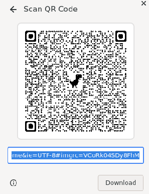

### 4.9 控制您的音乐、视频等媒体内容

控制音乐、视频或其他任何可在 Chromium 标签页中播放声音的内容。

#### 4.9.1 跨多个 Chromium 标签页播放音乐或声音

1、在计算机上打开 Chromium。

2、在标签页中播放音乐、视频或其他任何有声内容。可以停留在该标签页上，也可以转到别处。

3、要控制声音，请在右上角点击“媒体控件”图标。

4、您可暂停播放、转到下一首歌曲/下一个视频，或者点击以返回到播放歌曲/视频的标签页。

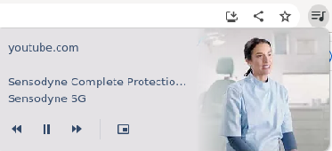

#### 4.9.2 跨多个 Chromium 标签页观看视频

您可从一个标签页中播放视频，然后在所浏览的其他标签页之上以小窗口显示正在播放的视频。

1、在计算机上打开 Chromium 。

2、在一个标签页中播放您想观看的视频。

3、要在浏览其他标签页时观看该视频，请依次点击右上角的“媒体控件”图标>“进入‘画中画’模式”图标。

## 5. 历史记录和活动记录

### 5.1 清除浏览数据

您可以控制自己的历史记录和其他浏览数据（如已保存的表单条目）。

删除您的所有数据，或者只删除特定时间段内的数据。

1、在计算机上打开 Chromium。

2、在右上角，点击“更多”图标。

3、点击更多工具>清除浏览数据。

4、选择时间范围，例如过去一小时或时间不限。

5、选择要移除的信息的类型。

6、点击清除数据。

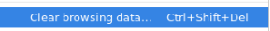

### 5.2 查看和删除您的 Chromium 浏览记录

您可以查看您在 Chromium 中的浏览记录。在台式机或笔记本电脑上，您可以使用历史记录中的“历程”视图继续浏览已开始的活动，并查找相关搜索。

如果您不想保留您在 Chromium 中的网页访问记录，可以删除所有或部分浏览记录。如果您删除浏览记录，此操作会在所有已登录 Chromium 并开启了同步功能的设备上生效。如果您愿意，也可以停用历史记录中的“历程”视图。

#### 5.2.1 查看历史记录

1、在计算机上打开 Chromium。

2、点击右上角的“更多”图标。

3、依次点击历史记录>历史记录。

#### 5.2.2 清除历史记录

1、在计算机上打开 Chromium。

2、点击右上角的“更多”图标。

3、依次点击历史记录>历史记录。

4、点击左侧的清除浏览数据。此时，系统会显示一个方框。

5、从下拉菜单中选择您要删除的历史记录范围。要清除所有内容，请选择时间不限。

6、选中您希望 Chromium 清除的信息所对应的方框，包括“浏览记录”。详细了解可删除的浏览数据的类型

7、点击清除数据。

#### 5.2.3 从历史记录中删除某项内容

您可以删除历史记录的特定部分。要搜索特定内容，请使用顶部的搜索栏。

1、在计算机上打开 Chromium。

2、点击右上角的“更多”图标。

3、依次点击历史记录>历史记录。

4、选中要从历史记录中移除的每项内容旁边的复选框。

5、点击右上角的删除。

6、点击移除进行确认。

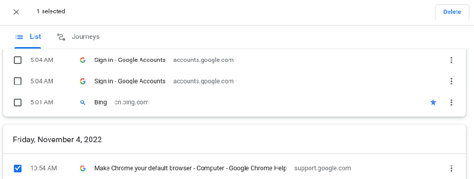

### 5.3 管理密码

您可让 Chromium 保存用于登录不同网站的密码。

如果您在网站上输入了新密码，Chromium 会询问您是否保存此密码。如需保存，请点击保存。

- 若要查看即将保存的密码，请点击“预览”图标。
- 如果网页上有多个密码，请点击向下箭头 向下箭头，然后选择您要保存的密码。
- 如果您的用户名显示为空白或不正确，请点击“用户名”旁边的文本框，然后输入您要保存的用户名。
- 如果您想保存其他密码，请点击“密码”旁边的文本框，然后输入您要保存的密码。

#### 5.3.1 手动添加新密码

1、在计算机上打开 Chromium。

2、在右上角，依次点击“更多”图标>设置>自动填充。

3、依次点击密码管理工具>添加。

4、输入网站、用户名和密码。

5、点击保存。

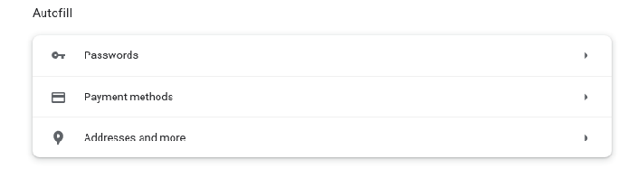

#### 5.3.2 使用已保存的密码登录

如果您曾在访问某个网站时将密码保存到 Chromium 中，Chromium 可帮助您登录。

1、在计算机上，转到您曾访问过的某个网站。

2、转到该网站的登录表单。

- 如果您为该网站保存了一组用户名和密码：Chromium 会自动填写登录表单。
- 如果您保存了多组用户名和密码：请选择用户名字段，然后选择您要使用的登录信息。

#### 5.3.3 显示、修改、删除或导出已保存的密码

1、在计算机上打开 Chromium。

2、在右上角，依次点击“个人资料”图标>“密码”图标。

- 如果找不到“密码”图标，请改为在屏幕右上角依次点击“更多”图标>设置>自动填充>密码管理工具。

3、显示、修改、删除或导出密码：

- 显示：在相应网站网址的右侧，点击“显示密码”图标。如果您为计算机设置了锁定密码，系统将会提示您输入计算机密码。
- 修改：在相应网站网址的右侧，依次点击“更多”图标>修改密码。
- 删除：在相应网站网址的右侧，依次点击“更多”图标>移除。
- 导出：在“已保存的密码”的右侧，依次点击“更多”图标>导出密码。

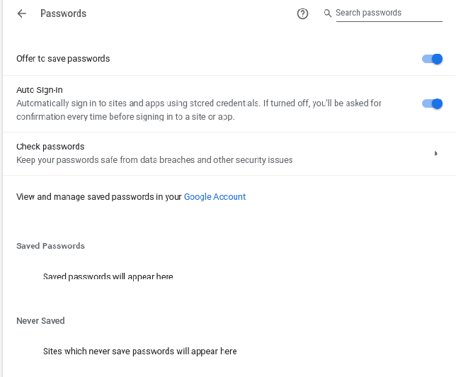

#### 5.3.4 检查您已保存的密码

您可以一次性检查自己的所有已存密码，确认它们是否遭遇了数据泄露，或者是否有安全系数低且容易被人猜到的风险。

若要检查您已保存的密码，请按以下步骤操作：

1、在计算机上打开 Chromium。

2、在右上角，依次点击“个人资料”图标>“密码”图标。

- 如果找不到“密码”图标，请改为在屏幕右上角依次点击“更多”图标>设置>自动填充>密码管理工具。

3、点击检查密码。

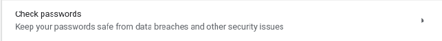

### 5.4 在 Chromium 中清除、启用和管理 Cookie

您可以选择删除现有 Cookie、允许/阻止所有 Cookie，以及针对某些网站设定偏好设置。

#### 5.4.1 清除所有 Cookie

重要提示：如果您删除 Cookie，您即会退出相应网站，而且您已保存的偏好设置可能也会随之删除。

1、在计算机上打开 Chromium。

2、在右上角，依次点击“更多”图标>“设置”图标。

3、依次点击隐私设置和安全性>Cookie 及其他网站数据。

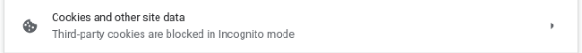

4、依次点击查看所有网站数据和权限>清除所有数据。

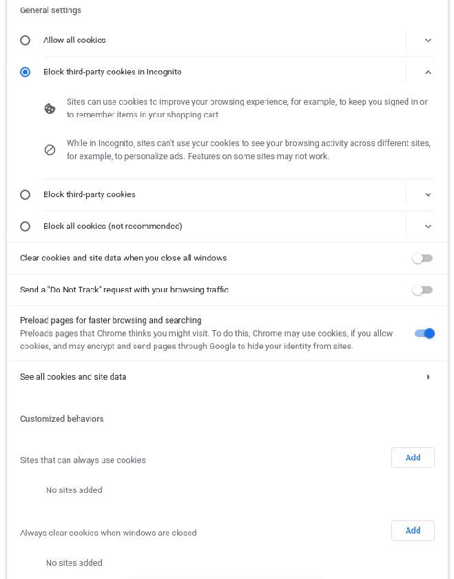

5、点击清除进行确认。

#### 5.4.2 删除特定 Cookie

1、在计算机上打开 Chromium 。

2、在右上角，依次点击“更多”图标>“设置”图标。

3、依次点击隐私设置和安全性>Cookie 及其他网站数据。

4、点击查看所有网站数据和权限。

5、在右上角，搜索相应网站的名称。

6、在该网站的网址右侧，点击“移除”图标。

7、点击清除进行确认。

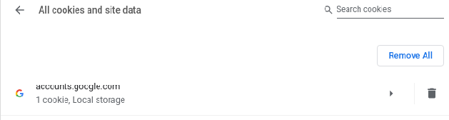

#### 5.4.3 删除来自某个时间段内的 Cookie

1、在计算机上打开 Chromium 。

2、在右上角，依次点击“更多”图标>更多工具>清除浏览数据。

3、在顶部，点击“时间范围”旁边的下拉菜单。

4、选择一个时间段，例如过去一小时或过去一天。

5、选中 Cookie 及其他网站数据。

6、取消选中所有其他项。

7、点击清除数据。

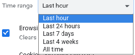

### 5.5 将 Chromium 设置重置为默认设置

您可以随时在 Chromium 中恢复浏览器设置。如果所安装的应用或扩展程序在您不知情的情况下更改了设置，那么您可能需要这样做。不过，您保存的书签和密码不会被清除或更改。

1、在计算机上打开 Chromium。

2、在右上角，依次点击“更多”图标>设置>高级。

3、依次点击重置设置>将设置还原为原始默认设置>重置设置。

## 6.安全设置

### 6.1 检查网站连接是否安全

如需了解某个网站可否安全访问，您可以查看有关该网站的安全信息。如果您无法安全地或私密地访问该网站，Chromium 将会向您发出提醒。

1、在 Chromium 中，打开某个网页。

2、若要检查网站的安全性，请查看网址左侧显示的安全状态标志：

- 安全
- 信息或不安全
- 不安全或危险

3、若要查找该网站的隐私权详细信息和权限的摘要，请选择安全标志。

### 6.2 阻止或允许在 Chromium 中显示弹出式窗口

默认情况下，Google Chromium 会阻止弹出式窗口自动显示在屏幕上。如果 Chromium 拦截了某个弹出式窗口，则会在地址栏中显示“已拦截弹出式窗口”。您也可以允许显示弹出式窗口。

#### 6.2.1 更改默认的弹出式窗口和重定向设置

1、在计算机上打开 Chromium 。

2、在右上角，依次点击“更多”图标>设置。

3、依次点击隐私设置和安全性>网站设置。

4、点击弹出式窗口和重定向。

5、选择要设为默认设置的选项。

#### 6.2.2 屏蔽通知

如果您在停用弹出式窗口后仍会收到来自某个网站的通讯类信息，则可能意味着您订阅了通知。若要关闭来自某个网站的通知，请执行以下操作：

1、在计算机上打开 Chromium。

2、转到会向您显示通知的网站。

3、选择“查看网站信息”图标。

4、从“通知”旁边的下拉菜单中选择屏蔽。

### 6.3 移除垃圾广告、弹出式窗口和恶意软件

#### 6.3.1 更改默认的广告权限

若要通过更改设置来阻止网站向您显示侵扰性或误导性广告，请执行以下操作。

1、打开 Chromium 。

2、在右上角，依次点击“更多”图标>设置。

3、依次点击隐私设置和安全性>网站设置。

4、依次点击更多内容设置>广告。

5、选择要设为默认设置的选项。

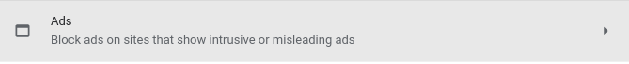

### 6.4 分享您的位置信息

默认情况下，Chromium 会在网站尝试获取您的位置信息时询问您。要允许相应网站知道您所在的位置，请选择允许。在分享您的位置信息之前，请先查看相应网站的隐私权政策。

#### 6.4.1 更改默认的位置信息设置

1、在计算机上打开 Chromium 。

2、在右上角，依次点击“更多”图标>设置。

3、依次点击隐私设置和安全性>网站设置。

4、点击位置。

5、选择要设为默认设置的选项。

### 6.5 在计算机上运行安全检查功能

您可通过安全检查功能管理 Chromium 的安全性。安全检查功能会搜寻：

- 已泄露的密码
- 安全浏览状态
- 可用的 Chromium 更新

在计算机上，安全检查功能还会搜寻：

- 有害的扩展程序

1、在计算机上打开 Chromium 。

2、在顶部，依次点击“更多”图标>设置。

3、点击隐私设置和安全性。

4、在“安全检查”下，选择立即检查。

5、如果 Chromium 发现了任何问题，请按照以下步骤操作：

- 选择有问题的项目。
- 按照屏幕上的说明操作。

#### 6.5.1 开启 HTTPS-First 模式

连接到使用 HTTPS 的网站比连接到不使用 HTTPS 的网站更安全。当您启用 HTTPS-First 模式后，Chromium 会尝试通过 HTTPS 加载所有网站，并在您访问不支持 HTTPS 的网站前显示警告。

1、在计算机上打开 Chromium 。

2、在右上角，依次点击“更多”图标>设置。

3、点击左侧的隐私设置和安全性。

4、点击安全。

5、开启一律使用安全连接。

#### 6.5.2 使用安全连接查找网站的 IP 地址

如需开启或关闭安全 DNS 功能，请执行以下操作：

1、在计算机上打开 Chromium 。

2、在右上角，依次选择“更多”图标>设置。

3、依次点击隐私设置和安全性>安全。

4、开启或关闭使用安全 DNS。

5、选择您当前的服务提供商，或从下拉菜单中选择自定义服务提供商。

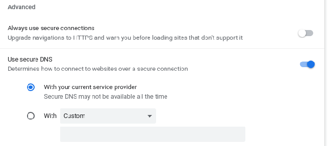

## 7.更改 Chromium 设置

### 7.1 更改文字、图片和视频的大小（缩放）

您可以更改单个网页或所有网页的文字、图片和视频的大小。

#### 7.1.1 在当前网页上缩放

使用缩放选项可放大或缩小网页上的所有内容。

1、在计算机上打开 Chromium。

2、点击右上角的“更多”图标 展开。

3、在“缩放”旁边，选择您想使用的缩放选项：

- 放大所有内容：点击“放大”图标。键盘快捷键为：`Ctrl 和 +`
- 缩小所有内容：点击“缩小”图标。键盘快捷键为：`Ctrl 和 -`
- 使用全屏模式：点击“全屏”图标。键盘快捷键为：`F11`

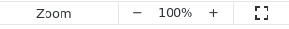

#### 7.1.2 管理特定网站的缩放级别

更改您访问过的网站的缩放级别后，要从一个位置重置这些网站，请执行以下操作：

1、打开 Chromium 。

2、在右上角，依次点击“更多”图标>设置。

3、依次点击隐私设置和安全性>网站设置。

4、点击更多内容设置>缩放级别。

5、如需为特定网站移除调整大小设置，请点击 X。

#### 7.1.3 设置所有网页的页面内容大小或字号

您可以更改所访问网页中所有内容（包括文字、图片和视频）的大小，也可以仅更改字号。

注意：某些网站不允许浏览器仅更改文字大小。对于这些网站，Chromium 无法调整字号。

1、在计算机上打开 Chromium。

2、在右上角，依次点击“更多”图标>设置。

3、点击外观。

4、根据需要进行更改。

- 更改所有内容：点击“网页缩放”旁边的向下箭头 向下箭头，然后选择所需的缩放选项。
- 更改字号：点击“字号”旁边的向下箭头 向下箭头，然后选择所需的字体大小。您还可以通过点击自定义字体更改更多字体选项。

### 7.2 使用通知接收提醒

您可对 Chromium 进行设置，以便接收来自网站、应用和扩展程序的通知（例如会议提醒）。

#### 7.2.1 更改默认的通知设置

1、在计算机上打开 Chromium 。

2、在右上角，依次点击“更多”图标>设置。

3、依次点击隐私设置和安全性>网站设置>通知。

4、选择要设为默认设置的选项。

- 禁止某个网站发送通知：
在“不允许发送通知”旁边，点击添加。
输入相应网站的网址。
点击添加。

- 允许某个网站发送通知：
在“允许发送通知”旁边，点击添加。
输入相应网站的网址。
点击添加。

- 允许改用干扰性更低的通知方式（禁止网站发送通知，以免干扰）：
允许网站询问能否向您发送通知。
点击改用干扰性更低的提示方式（禁止网站发送通知，以免干扰）。如果您忽略了来自某个网站的多条通知，或者其他用户通常不允许某个网站发送通知，您就不会（再）收到来自该网站的通知。

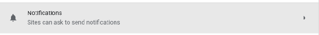

### 7.3 更改 Chromium 采用的语言和翻译网页

您可更改自己在 Chromium 中的首选语言。Chromium 还可为您翻译网页。

#### 7.3.1 在 Chromium 中翻译网页

当您浏览的网页使用的是您看不懂的语言时，您可以使用 Chromium 翻译该网页。

1、在计算机上打开 Chromium。

2、转到一个不是以您要翻译成的目标语言显示的网页。

3、在地址栏右侧点击“翻译”图标 。

4、Chromium 即会翻译当前网页。

如无法正常翻译请尝试刷新该网页。如果仍然无法正常翻译，请右键点击该页面中的任意位置，然后点击翻成相应语言。

#### 7.3.2 请求翻译或者关闭翻译功能

您可以控制 Chromium 是否询问翻译网页。

1、在计算机上打开 Chromium。

2、在右上角，依次点击“更多”图标>设置。

3、在底部，点击高级。

4、点击“语言”下方的语言。

5、勾选或取消勾选“询问是否翻译非您所用语言的网页”。

#### 7.3.3 针对特定语言开启或关闭翻译功能

您可以控制 Chromium 是否询问翻译特定语言的网页。

1、在计算机上打开 Chromium。

2、在右上角，依次点击“更多”图标>设置。

3、点击底部的高级。

4、依次点击语言>语言。

5、在您要使用的语言旁边，点击“更多”图标。

如果没有列出要使用的语言，请点击添加语言来添加该语言。

6、开启或关闭询问是否翻译此语言的网页。

### 7.4 在 Chromium 中更改视频字幕样式

您可更改视频字幕的字号、颜色和字体。

1、在计算机上打开 Chromium。

2、在右上角，依次点击“更多”图标>设置。

3、在底部，依次点击高级>无障碍。

4、选择字幕以打开“设备设置”部分，然后从中更改视频字幕样式。

### 7.5 拼写检查功能

“拼写检查”功能可帮助您检查和更正设备上的拼写。在计算机网页上的输入字段中输入文字时，您可检查是否有拼写错误。开启“拼写检查”功能后，您可在“基本”和“增强”拼写检查之间进行选择。

#### 7.5.1 开启和关闭 Chromium 拼写检查功能

1、打开设置。

2、依次点击高级>语言。

3、在“拼写检查”右侧，开启或关闭此功能。

## 8.无痕浏览

如果不希望 Google Chromium 记住您的活动，您可在无痕模式下私密地浏览网页。

### 8.1 开启无痕模式

1、在计算机上打开 Chromium。

2、在右上角，依次点击“更多”图标>打开新的无痕窗口。

3、系统即会打开一个新窗口。检查顶部一角是否显示了“无痕模式”图标。

您也可以使用键盘快捷键来打开无痕式窗口：`Ctrl + Shift + n`。

## 9.非正常关闭

当计算机在未关闭Chromium时关机或重启，在下次打开Chromium时会提醒是否要恢复之前所打开的网页。

