# GIMP使用说明

## 1. GIMP简介

GIMP是一个多平台工具，用于创建和编辑各种图像。GIMP是GNU Image Manipulation Program 的首字母缩写。GIMP有很多功能。它可以用作简单的绘画程序、专家级的照片修饰程序、创建数字艺术的工具、在线批处理系统、批量生产的图像渲染器、图像格式转换器等。GIMP是可扩展和可扩展的。它旨在通过插件和扩展来增强以执行任何操作。先进的脚本界面允许从最简单的任务到最复杂的图像处理程序的所有内容都可以轻松编写脚本。

GIMP的优势之一是它可以从许多来源免费获得许多操作系统。大多数GNU / Linux发行版都包含GIMP作为标准应用程序。GIMP也可用于其他操作系统，例如Microsoft Windows ™ 或 Apple 的macOS ™ ( Darwin )。GIMP是通用公共许可证第 3 版 GPL 涵盖的自由软件应用程序。GPL为用户提供了访问和更改构成计算机程序的源代码的自由。

### 1.1 软件作者

GIMP的第一个版本由 Peter Mattis 和 Spencer Kimball 编写。多年来，许多其他人通过帮助开发、测试、提供支持、翻译和编写文档做出了贡献。GIMP版本目前由 Mitch Natterer 和 Jehan Pagès 以及GIMP团队的其他成员精心策划。

### 1.2 GIMP 帮助系统

GIMP文档团队提供了试图帮助您了解如何使用GIMP的信息。用户手册是此帮助的重要组成部分。最新版本始终以 HTML 格式在文档团队 GIMP-DOCS 的网站上提供。HTML 版本也可用作上下文相关帮助（需要单独安装），同时通过按F1键使用GIMP 。当鼠标指针聚焦在菜单项上时，可以通过按F1键来访问特定菜单项的帮助。继续阅读以开始您的GIMP之旅。

### 1.3 软件特点和功能

以下列表简要概述了GIMP为您提供的一些特性和功能：

- 全套绘画工具，包括画笔、铅笔、喷枪、克隆等。

- 基于切片的内存管理，因此图像大小仅受可用磁盘空间的限制。

- 所有绘画工具的亚像素采样，以实现高质量的抗锯齿。

- 完全 Alpha 通道支持处理透明度。

- 层和通道。

- 用于从外部程序（例如 Script-Fu）调用内部GIMP函数的程序数据库。

- 高级脚本功能。

- 多次撤消/重做（仅受磁盘空间限制）。

- 转换工具包括旋转、缩放、剪切和翻转。

- 支持多种文件格式，包括 JPEG、PNG、GIF、PSD、DDS、XPM、TIFF、TGA、MPEG、PS、PDF、PCX、BMP 等。

- 选择工具，包括矩形、椭圆、自由、模糊、贝塞尔和智能剪刀。

- 允许轻松添加新文件格式和新效果过滤器的插件。

### 1.4 GIMP 2.10 有什么新功能？

以下是 GIMP-2.10 发布亮点：

- 工具现在默认分组在工具箱中

- 滑块现在使用具有改进的用户交互的紧凑样式：新滑块。

- 大幅改进了转换预览的用户体验：合成预览。

- 现在可在拖动可停靠对话框时突出显示可停靠区域。

- 用于旋转和平移项目的新 3D 变换工具：第 4.9 节，“3D 变换”。

- 画布上更平滑的画笔轮廓预览动作。

- 对称绘画增强

- 更快地加载 ABR 画笔：GIMP 现在花在加载 Photoshop 画笔 (ABR) 上的时间要少得多。因此，如果您使用其中的很多，启动时间会变得非常小，数量级。技术上的解释是 GIMP 以前是逐字节读取 ABR 数据流，现在改用扫描线读取。

- PSD 支持改进：PSD 支持改进 PSD 文件现在加载速度更快，主要是通过消除原始文件和 GIMP 中的项目表示之间的过多副本。对于大型 PSD 文件，加载速度现在快了 ~1.5 到 ~2 倍。此外，GIMP 现在能够加载 CMYK(A) PSD 文件（目前每个通道只有 8 位）。它通过使用 sRGB 作为配置文件将像素转换为 RGB(A) 浮点数来实现这一点，我们知道，这对于严肃的工作来说还不够好。但是，该插件已经使用 BABL 格式来指定 CMYK 像素格式编码并与 GIMP 进行通信。这是朝着更好的 CMYK 支持迈出的良好的第一步。它既可以单独改进，也可以与正在进行的工作集成，从而在开发分支中支持对 BABL 格式的一般色彩空间支持。

- 用于合并和锚定图层的统一用户界面：合并图层锚定图层

- 更新检查以通知用户可用的新版本

## 2. 运行 GIMP

通常，您可以通过单击图标（如果您的系统设置为提供图标）或在命令行上键入gimp来启动GIMP 。如果您安装了多个版本的GIMP，您可能需要输入gimp-2.10以获取最新版本。如果需要，您可以在程序名称后的命令行中提供图像文件名列表，以便GIMP在启动后自动打开这些文件。但是，也可以在GIMP运行后从其内部打开文件。

大多数操作系统都支持文件关联，它将一类文件（由其文件扩展名确定，例如 .jpg）与相应的应用程序（例如GIMP）相关联。当图像文件正确“关联”到GIMP时，您可以双击图像在GIMP中打开它。

### 2.1 支持操作系统

GIMP是当今可用的最广泛支持的图像处理程序。已知可以使用GIMP的平台包括：

GNU /Linux ™、 Apple macOS ™、 Microsoft Windows ™、 OpenBSD ™、 NetBSD ™、 FreeBSD ™、 Solaris ™、 SunOS ™、 AIX ™、 HP-UX ™、 Tru64 ™、 Digital UNIX ™、 OSF/1 ™、 IRIX ™ 、 OS/2 ™ 和BeOS ™。

由于源代码的可用性， GIMP很容易移植到其他操作系统。如需更多信息，请访问GIMP开发者主页。

### 2.2 语言

GIMP自动检测并使用系统语言。万一语言检测失败，或者如果您想使用不同的语言，使用GIMP -2.8 和更高版本，您可以通过以下方式进行：编辑→首选项→界面。

在控制台模式下，根据您想要的语言LANGUAGE=en gimp或LANG=en gimp背景：使用LANGUAGE=en为执行的程序设置环境变量gimp。

### 2.3 命令行参数

虽然启动GIMP时不需要参数，但最常见的参数如下所示。在 Unix 系统上，您可以使用man gimp完整的列表。

命令行参数必须在用于启动GIMP的命令行中，如gimp-2.10 [OPTION...] [FILE|URI...]。

- -?, --help 显示所有选项列表。
- --help-all 显示所有帮助内容。
- --help-gtk 显示 GTK+ 选项
- -v, --version 打印 GIMP 版本并退出。
- --license 显示许可证信息并退出。
- --verbose 显示详细启动信息。
- -n, --new-instance 启动一个新的 GIMP 实例。
- -a, --as-new 将图像打开为新图像。
- -i,--no-interface 在没有用户界面的情况下运行。
- -d,--no-data 不要加载图案、渐变、调色板或画笔。通常在需要最小化启动时间的非交互式情况下很有用。
- -f, --no-fonts 不要加载任何字体。这对于更快地为不使用字体的脚本加载 GIMP 或查找与挂起 GIMP 的格式错误的字体相关的问题很有用。
- -s, --no-splash 启动时不要显示启动画面。
- --no-shm 不要在 GIMP 和插件之间使用共享内存。
- --no-cpu-accel 不要使用特殊的 CPU 加速功能。对于查找或禁用有缺陷的加速硬件或功能很有用。
- --session=name 为此 GIMP 会话使用不同的 sessionrc。给定的会话名称附加到默认的 sessionrc 文件名。
- --gimprc=文件名 使用替代的 gimprc 而不是默认的。 gimprc 文件包含您的偏好记录。在插件路径或机器规格可能不同的情况下很有用。
- --system-gimprc=文件名 使用备用系统 gimprc 文件。
- -b, --batch=命令 以非交互方式执行命令集。这组命令通常采用脚本的形式，可由 GIMP 脚本扩展之一执行。当命令为 - 时，从标准输入中读取命令。
- --batch-interpreter=proc 指定用于处理批处理命令的过程。默认程序是 Script-Fu。
- --console-messages 将错误或警告信息输出到终端上，而不是弹出窗口。
- --pdb-compat-mode=模式 PDB 兼容模式（off|on|warn）。
- --stack-trace-mode=模式 在崩溃的情况下进行调试（never|query|always）。
- --debug-handlers 启用非致命调试信号处理程序。对 GIMP 调试很有用。
- --g-fatal-warnings 使所有警告致命。对调试很有用。
- --dump-gimprc 使用默认设置输出 gimprc 文件。 如果您弄乱了 gimprc 文件，这很有用。
- --display=显示 使用指定的 X 显示器（不适用于所有平台）。

## 3. 首次启动 GIMP

### 3.1  配置文件

首次运行时，GIMP 会执行一系列步骤来配置选项和目录。配置过程创建一个名为 GIMP 的用户可写配置目录，其中包含每个版本的子目录，即 GIMP/2.10。所有的配置信息都存储在这个目录中。如果您删除或重命名该目录，GIMP 会重复初始配置过程，创建一个新的 GIMP/2.10 目录。使用此功能可以在不删除现有安装的情况下探索不同的配置选项，或者在配置文件损坏时进行恢复。

配置文件夹将存储在：

- UNIX 平台上：$XDG_CONFIG_HOME（默认为 $HOME/.config），macOS 除外
- Windows 上；%APPDATA%
- macOS 上：NSApplicationSupportDirectory（通常是 ~/Library/Application Support）

### 3.2 开始之前的建议

- GIMP 提供了提示，您可以使用菜单命令帮助 -> 每日提示随时阅读。这些技巧提供的信息被认为是有用的，但不容易通过实验来学习；所以它们值得一读。有空时请阅读提示。
- 其次，如果在某个时候您正在尝试做某事，而 GIMP 似乎突然停止运行，“Getting Unstuck”部分可能会帮助您。

## 4. 首次使用 GIMP

### 4.1 基本概念

本节简要介绍了 GIMP 中使用的基本概念和术语。这里介绍的概念在别处有更深入的解释。除了少数例外，我们避免使用大量链接和交叉引用使本节混乱：这里提到的所有内容都非常高级，您可以轻松地在索引中找到它。

#### 4.1.1 图片

图像是 GIMP 使用的基本实体。粗略地说，“图像”对应于单个文件，例如 TIFF 或 JPEG 文件。您还可以将图像视为对应于单个显示窗口（尽管实际上可能有多个窗口都显示相同的图像）。但是，不可能有一个窗口显示多个图像，或者一个图像没有显示它的窗口。

GIMP 图像可能是一件相当复杂的事情。与其把它想象成一张上面有图片的纸，不如把它想象成一叠纸，称为“层”。除了一堆层，一个 GIMP 图像可能包含一个选择蒙版、一组通道和一组路径。事实上，GIMP 提供了一种将任意数据片段（称为“寄生虫”）附加到图像的机制。

在 GIMP 中，可以同时打开许多图像。尽管大图像可能会使用数兆字节的内存，但 GIMP 使用复杂的基于切片的内存管理系统，允许 GIMP 优雅地处理非常大的图像。但是，存在限制，并且拥有更多可用内存可能会提高系统性能。

#### 4.1.2 图层

如果可以将一张简单的图像比作一张纸，那么一张有层次的图像就好比是一叠透明纸叠在一起。您可以在每张纸上绘图，但仍然可以通过透明区域看到其他纸张的内容。您还可以相对于其他纸移动一张纸。老练的 GIMP 用户经常处理包含许多层的图像，甚至是几十层。图层不必是不透明的，也不必覆盖图像的整个范围，因此当您查看图像的显示时，您可能会看到的不仅仅是顶层：您可能会看到许多图层的元素。

#### 4.1.3 分辨率

数字图像由正方形像素网格组成。每个图像都有一个二维尺寸，例如 900 像素宽 x 600 像素高。但是像素在物理空间中没有固定的大小。为了设置要打印的图像，我们使用一个称为分辨率的值，定义为图像在纸上打印时的像素大小与其物理大小（通常以英寸为单位）之间的比率。大多数文件格式（但不是全部）都可以保存这个值，它表示为 ppi——每英寸像素数。

打印文件时，分辨率决定了图像在纸上的大小，从而决定了像素的物理大小。相同的 900x600 像素图像可以打印为 3x2 英寸的小卡片，像素几乎看不到 - 或者打印为带有大而厚实像素的大海报。

相机和移动设备导入的图像往往具有附加到文件的分辨率。分辨率通常为 72 或 96ppi。重要的是要认识到这个决议是任意的，并且是出于历史原因选择的。您始终可以使用 GIMP 更改分辨率——这对实际图像像素没有影响。此外，对于在线显示图像、移动设备、电视或视频游戏等用途——简而言之，任何非打印用途——分辨率值是没有意义的并且被忽略。相反，通常显示图像，以便每个图像像素符合一个屏幕像素。

#### 4.1.4 通道

通道是像素颜色的单个组件。对于 GIMP 中的彩色像素，这些组件通常是红色、绿色、蓝色，有时是透明度 (Alpha)。对于灰度图像，它们是灰色和 Alpha，对于索引彩色图像，它们是索引和 Alpha。

图像中所有像素的任何一种颜色分量的整个矩形阵列也称为通道。您可以使用“通道”对话框查看这些颜色通道。

显示图像时，GIMP 将这些组件组合在一起，形成屏幕、打印机或其他输出设备的像素颜色。某些输出设备可能使用红色、绿色和蓝色的不同通道。如果是这样，GIMP 的通道将在显示图像时转换为适合设备的通道。

当您处理需要以一种特定颜色调整的图像时，通道会很有用。例如，如果您想从照片中移除“红眼”，您可以使用红色通道。

您可以将通道视为允许或限制通道表示的颜色输出的掩码。通过对通道信息使用过滤器，您可以在图像上创建许多不同且微妙的效果。在颜色通道上使用过滤器的一个简单示例是通道混合器过滤器。

除了这些通道之外，GIMP 还允许您创建其他通道（或者更准确地说，通道蒙版），它们显示在“通道”对话框的下部。您可以创建新通道或将选择保存到通道（蒙版）。有关通道掩码的更多信息，请参阅掩码上的词汇表条目。

#### 4.1.5 选区

通常在修改图像时，您只希望图像的一部分受到影响。 “选择”机制使这成为可能。每个图像都有自己的选择，您通常将其视为将选定部分与未选定部分（所谓的“行进蚂蚁”）分开的移动虚线。实际上这有点误导：GIMP 中的选择是分级的，而不是全有或全无的
实际上选择是由一个成熟的灰度通道表示的。您通常看到的虚线只是 50% 选定级别的等高线。但是，您可以随时通过切换 QuickMask 按钮来查看选择通道的所有精彩细节。

学习如何有效使用 GIMP 的一个重要组成部分是掌握做出好的选择的艺术——选择只包含您需要的内容，仅此而已。由于选择处理非常重要，因此 GIMP 提供了许多工具来执行此操作：各种选择制作工具、选择操作菜单以及切换到快速蒙版模式的能力，在该模式中，您可以将选择通道视为虽然它是一个颜色通道，因此“绘制选择”。

#### 4.1.6 撤消

当您犯错时，您可以撤消它们。 您可以对图像执行的几乎所有操作都是不可撤销的。 事实上，如果您认为它们被误导了，您通常可以撤消您最近所做的大量事情。 GIMP 通过保留您的操作历史来实现这一点。 但是，这段历史会消耗内存，因此可撤销性不是无限的。 有些动作使用很少的撤消内存，因此您可以在最早的那些从历史记录中删除之前执行几十个； 其他类型的操作需要大量的撤消内存。 您可以配置 GIMP 允许每个图像的撤消历史记录的内存量，但在任何情况下，您应该始终能够撤消至少 2-3 个最近的操作。 （最重要的不可撤消的操作是关闭图像。因此，如果您对图像进行了任何更改，GIMP 会要求您确认是否确实要关闭图像。）

#### 4.1.7 插件

您在 GIMP 中对图像执行的许多（可能是大多数）操作都是由 GIMP 应用程序本身完成的。然而，GIMP 也广泛使用“插件”，它们是与 GIMP 非常密切交互的外部程序，能够以非常复杂的方式操作图像和其他 GIMP 对象。许多重要的插件都与 GIMP 捆绑在一起，但也有许多可以通过其他方式获得。事实上，编写插件（和脚本）是非 GIMP 开发团队成员向 GIMP 添加新功能的最简单方法。

Filters 菜单中的所有命令以及其他菜单中的大量命令实际上都是作为插件实现的。

#### 4.1.8 脚本

除了插件（用 C 语言编写的程序）之外，GIMP 还可以使用脚本。现有最多的脚本是用一种称为 Script-Fu 的语言编写的，这是 GIMP 独有的（对于那些关心的人，它是一种名为 Scheme 的类 Lisp 语言的方言）。也可以用 Python 或 Perl 编写 GIMP 脚本。这些语言比 Script-Fu 更灵活、更强大；它们的缺点是它们依赖于不会自动与 GIMP 一起打包的软件，因此不能保证它们在每个 GIMP 安装中都能正常工作。

### 4.2 主窗口

GIMP 用户界面现在有多窗口模式、单窗口模式两种模式。

首次打开 GIMP 时，默认以单窗口模式打开。 您可以通过取消选中图像菜单栏中的 Windows -> 单窗口模式选项来启用多窗口模式。退出 GIMP 后，下次 GIMP 将以您选择的模式启动。

#### 4.2.1 多窗口模式

上面的屏幕截图显示了可以有效使用的 GIMP 最基本的多窗口排列。

您将看到两个面板，左侧和右侧，中间有一个图像窗口。第二个图像被部分屏蔽。左侧面板包含工具箱以及工具选项、设备状态、撤消历史记录和图像对话框。右侧面板在多选项卡停靠中包含画笔、图案、字体和文档历史对话框，在另一个多选项卡停靠中包含图层、通道和路径对话框。

- 主工具箱：包含一组用于选择工具的图标按钮。默认情况下，它还包含前景色和背景色。您可以添加画笔、图案、渐变和活动图像图标。使用 Edit -> Preferences -> Toolbox 启用或禁用额外项目。
- 具选项：停靠在主工具箱下方的是工具选项对话框，显示当前选定工具的选项（在本例中为移动工具）。
- 图像窗口：在 GIMP 中打开的每个图像都显示在一个单独的窗口中。多张图片可以同时打开，仅受系统资源限制。在您可以在 GIMP 中做任何有用的事情之前，您需要至少打开一个图像窗口。图像窗口包含 GIMP 主要命令的菜单（文件、编辑、选择...），您也可以通过右键单击窗口来获得该菜单。
- 图像可以大于图像窗口。在这种情况下，GIMP 会以缩小的缩放级别显示图像，从而可以在图像窗口中看到完整的图像。如果您转到 100% 缩放级别，则会出现滚动条，让您可以平移图像。
- 画笔、图案、字体、文档历史停靠 - 请注意，停靠中的对话框是选项卡。 “画笔”选项卡已打开：它显示绘画工具使用的画笔类型。
- 图层、通道、路径：画笔对话框下方的停靠对话框显示了用于管理图层、通道和路径的对话框（选项卡）。图层选项卡已打开：它显示当前活动图像的图层结构，并允许以多种方式对其进行操作。可以不使用图层对话框来做一些非常基本的事情，但即使是中等复杂的 GIMP 用户也发现始终使用图层对话框是必不可少的。

#### 4.2.3 单窗口模式

您会发现相同的元素，但管理方式不同：

- 左右面板固定；你不能移动它们。但是您可以通过拖动鼠标指针越过左窗格的右边框时出现的移动指针来减小或增加它们的宽度。如果您想保持左侧窗格较窄，请使用工具选项底部的滚动条来平移选项显示。

  如果您减小多标签停靠栏的宽度，则可能没有足够的空间容纳所有标签；然后出现箭头，允许您滚动选项卡。

  与多窗口模式一样，您可以使用 Tab 键屏蔽这些面板。
  

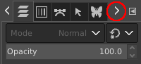

- 像窗口占据了两个面板之间的所有空间。
- 打开多个图像时，图像窗口上方会出现一个新栏，每个图像都有一个选项卡。您可以通过单击选项卡或使用 <kdb>Ctrl</kdb>+<kdb>Page Up</kdb> 或 <kdb>Page Down</kdb> 或 <kdb>Alt+<kdb>Number</kdb> 在图像之间导航。 “编号”为标签编号；您必须使用键盘上一行的数字键，而不是小键盘的数字键（某些国家键盘需要 <kdb>Alt</kdb>+<kdb>Shift</kdb>）。

这是一个最小的设置。GIMP 有十多种其他类型的对话框用于各种目的，但用户通常在需要时打开它们，并在完成时关闭它们。知识渊博的用户通常会始终打开工具箱（带有工具选项）和图层对话框。工具箱对于许多 GIMP 操作都是必不可少的。工具选项部分实际上是一个单独的对话框，在屏幕截图中显示停靠在主工具箱上。知识渊博的用户几乎总是以这种方式进行设置：如果不了解他们的选项是如何设置的，就很难有效地使用工具。当您使用具有多个图层的图像时，“图层”对话框会发挥作用：在您超越 GIMP 专业知识的最基本阶段之后，这意味着几乎总是如此。当然，它有助于在屏幕上显示您正在编辑的图像；如果您在保存工作之前关闭图像窗口，GIMP 会询问您是否要关闭文件。

#### 4.2.3 找回丢失的窗口

如果您的 GIMP 布局丢失，您可以使用 Windows → Recently Closed Docks 轻松恢复您的布局； Windows 菜单命令仅在图像打开时可用。 要从停靠栏添加、关闭或分离选项卡，请单击对话框右上角的 。 这将打开选项卡菜单。选择添加选项卡、关闭选项卡或分离选项卡。

#### 4.2.4 工具箱

工具箱是GIMP的核心。这是您将在那里找到的内容的快速浏览。

在工具箱中，与GIMP的大多数部分一样，将鼠标移到某物上并让它停留片刻，通常会显示一个描述该物的“工具提示” 。快捷键也经常显示在工具提示中。在许多情况下，您可以将鼠标悬停在某个项目上并按F1键以获取有关鼠标下方事物的帮助。

默认情况下，只有 Foreground-background 图标可见。您可以通过Edit → Preferences → Toolbox : Tools configuration添加 Brush-Pattern-Gradient 图标和 Active Image 图标。

工具图标：这些图标是激活工具用于多种用途的按钮：选择图像的一部分、绘制图像、转换图像等。第 1 节“工具箱”概述了如何使用工具，以及每个工具都在“工具”一章中系统地描述。

前景色/背景色：这里的颜色区域显示了GIMP当前的前景色和背景色，它们在许多操作中都会发挥作用。单击其中一个会弹出一个颜色选择器对话框，允许您更改为不同的颜色。单击双头箭头交换两种颜色，单击左下角的小符号将它们重置为黑色和白色。

画笔/图案/渐变：这里的符号向您展示了GIMP当前的选择： 画笔，被所有允许您在图像上绘画的工具使用（顺便说一下， “绘画”包括擦除和涂抹等操作）；对于图案，用于填充图像的选定区域；对于渐变，每当操作需要平滑变化的颜色范围时，它就会发挥作用。单击这些符号中的任何一个都会弹出一个对话框窗口，允许您对其进行更改。

活动图像：在GIMP中，您可以一次处理多个图像，但在任何给定时刻，只有一个图像是“活动图像”。在这里，您可以找到活动图像的小图标表示。单击该图标可显示包含当前打开图像列表的对话框，单击对话框中的图像使其处于活动状态。通常，您单击多窗口模式下的图像窗口或单窗口模式下的图像选项卡，使其成为活动图像。

您可以“拖放到 XDS 文件管理器以保存图像”。XDS是“ X Direct Save Protocol ”的首字母缩写：X Window System 图形用户界面的附加功能，适用于类 Unix 操作系统。

次启动时，GIMP都会选择您在退出上一个会话时使用的画笔、颜色和图案，因为默认情况下会选中Preferences/Input Devices中退出时保存输入设备设置。如果取消选中它，GIMP 将默认使用颜色、画笔和图案，始终相同。

工具箱窗口在对话框顶部显示“ Wilber 的眼睛” 。您可以将图像从文件浏览器单击拖放到此区域以将其打开。您可以通过取消选中“首选项”的“工具箱”页面中的“显示 GIMP 徽标”选项来消除此徽标。

### 4.3 图像窗口

GIMP 用户界面有两种模式：单窗口模式（默认）和多窗口模式，您可以取消选中Windows →单窗口模式选项。

当您在没有打开任何图像的情况下启动GIMP时，图像窗口在单窗口模式下似乎不存在，而在多窗口模式下，即使没有图像打开，图像窗口也存在。

我们将从对默认情况下出现在普通图像窗口中的组件的简要描述开始。可以使用查看菜单中的命令删除某些组件。

多窗口模式下的图像窗口

单窗口模式下的图像区域

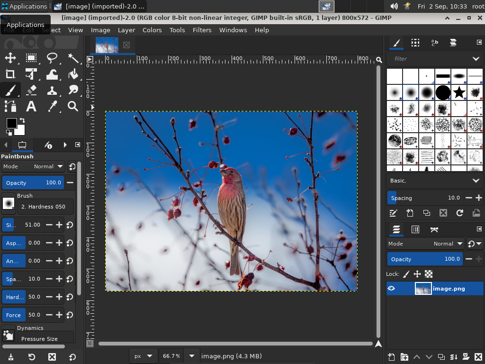

1. 标题栏：没有图像的图像窗口中的标题栏显示“ GNU Image Manipulating Program ”。带有图像的图像窗口根据Preference Dialog中的设置在标题栏中显示图像名称及其规格。标题栏由操作系统提供，而不是由GIMP提供，因此它的外观可能会随操作系统、窗口管理器和/或主题而变化。

如果您打开了一个非 xcf 图像，它是“ （导入） ”作为 .xcf 文件，其原始名称显示在图像窗口底部的状态栏中。

修改图像时，其标题前会出现一个星号。

2. 图像菜单：直接在标题栏下方出现菜单栏（除非它被抑制）。图像菜单提供了对您可以对图像执行的几乎所有操作的访问。您还可以右键单击图像以显示弹出图像菜单[1]，或左键单击左上角的小“箭头”符号，称为“菜单按钮”，如下所述。许多菜单命令也与菜单中所示的键盘快捷键相关联。如果在“首选项”对话框中启用“使用动态键盘快捷键” ，您可以为菜单操作定义自己的自定义快捷键

3. 菜单按钮：单击菜单按钮可在一列中显示图像菜单（在全屏模式下必不可少）。如果您喜欢使用键盘快捷键，请使用Shift + F10打开菜单。

4. 标尺：在默认布局中，标尺显示在图像的上方和左侧。使用标尺确定图像内的坐标。标尺的默认单位是像素；使用下述设置以使用像素以外的单位。

标尺最重要的用途之一是创建指南。单击并将标尺拖动到图像中以创建指南。参考线是一条线，可帮助您准确定位事物 - 或验证另一条线是否真正水平或垂直。使用移动工具，您可以单击并拖动参考线。将参考线拖出图像以将其删除；您可以随时将另一个指南拖到图像中。您甚至可以同时使用多个指南。

在标尺区域，鼠标指针位置用两个垂直和水平指向的小箭头标记。

5. QuickMask Toggle：图像左下角的小按钮可打开和关闭快速蒙版。启用“快速蒙版”后，该按钮以红色轮廓显示。有关这个非常有用的工具的更多详细信息，请参阅QuickMask。

6. 指针坐标：当指针（鼠标光标，如果您使用鼠标）在图像边界内时，窗口左下角的矩形区域显示当前指针坐标。单位与标尺相同。

7. 单位菜单：使用单位菜单更改用于标尺和其他几个目的的单位。默认单位是像素，但您可以使用此菜单快速更改为英寸、厘米或其他几种可能性。请注意，“视图”菜单中的“点对点”设置会影响显示的缩放方式：有关详细信息，请参阅点对点。

8. 缩放按钮：有多种方法可以放大或缩小图像，但缩放按钮可能是最简单的。您可以直接在文本框中输入缩放级别以进行精确控制。

9. 状态区：状态区位于图像窗口的底部。默认情况下，状态区显示 image.xcf 文件的原始名称，以及图像使用的系统内存量。请使用编辑→首选项→图像窗口→标题和状态自定义状态区域中显示的信息。在耗时操作期间，状态区会暂时显示正在运行的操作以及操作的完成情况。

请注意，图像使用的内存与图像文件大小有很大不同。例如，一个 70 kB 的 .PNG 图像在显示时可能会占用 246 kB 的 RAM。内存使用量的差异有两个主要原因。首先，.PNG 文件是压缩格式，图像在 RAM 中以未压缩的形式重构。其次，GIMP使用额外的内存和图像副本，以供 Undo 命令使用。

10. 取消按钮：在复杂耗时的操作过程中，通常是插件，窗口右下角会临时出现一个取消按钮。使用取消按钮停止操作。

一些插件对被取消的反应很糟糕，有时会留下损坏的图像。

11. 导航控件：这是图像显示右下角的一个小十字形按钮。在导航控件上单击并按住（不要松开鼠标按钮）以显示导航预览。导航预览具有图像的微型视图，显示区域的轮廓。使用导航预览快速平移到图像的不同部分——按住按钮移动鼠标。导航窗口通常是在只显示一小部分的大图像中快速导航的最便捷方式。（有关访问导航窗口的其他方式，请参见导航对话框）。（如果您的鼠标有一个中键，请单击并拖动它以平移图像）。

12. 非活动填充区域：当图像尺寸小于图像窗口时，此填充区域将活动图像显示与用户界面的其余部分分开，因此您可以区分它们。通常，您不能将任何过滤器或操作应用于非活动区域。

13. 图像显示：图像窗口最重要的部分当然是图像显示或画布。它占据了窗口的中心区域，周围是一条黄色虚线，表示图像边界，背景是中性灰色。您可以通过多种方式更改图像显示的缩放级别，包括下述缩放设置。

14. Image Window Resize Toggle：在不启用此功能的情况下，如果您通过单击并拖动边框限制来更改图像窗口的大小，则图像大小和缩放不会改变。例如，如果您将窗口放大，那么您将看到更多的图像。但是，如果按下此按钮，则在调整窗口大小时图像会调整大小，以便（大部分）在调整窗口大小之前和之后显示图像的相同部分。

将图像从文件浏览器拖放到工具箱窗口中，以在其自己的图像窗口或选项卡中打开图像。

将图像文件拖到“图层”对话框中会将其作为新图层添加到图像中。

图像大小和图像窗口大小可以不同。您可以使用两个键盘快捷键使图像适合窗口，反之亦然：

- Ctrl + J：此命令保持缩放级别；它使窗口大小适应图像大小。Shrink Wrap 命令的作用相同。

- Ctrl + Shift + J：此命令修改缩放级别以使图像显示适应窗口。

## 4.4 对话框和对接

### 4.4.1 对话框

GIMP在您的屏幕上安排对话框方面具有很大的灵活性。“对话框”是一个包含工具选项或专用于特殊任务的移动窗口。“ dock ”是一个容器，可以保存一组持久性对话框，例如“工具选项”对话框、“画笔”对话框、“调色板”对话框等。但是，Docks 不能保存非持久性对话框，例如“首选项”对话框或“图像”窗口.

GIMP具有三个默认停靠点：

- 左侧面板中工具箱下的工具选项、设备状态、撤消历史记录和图像停靠，

- 画笔、图案、字体和文档历史停靠在右侧面板的上部，

- 图层、通道和路径停靠在右侧面板的下部。

在这些扩展坞中，每个对话框都位于其自己的选项卡中。

在多窗口模式下，工具箱是实用程序窗口而非停靠栏。在单窗口模式下，它属于单窗口。

使用Windows → Dockable Dialogs查看可停靠对话框的列表。从列表中选择一个可停靠对话框以查看该对话框。如果该对话框在停靠栏中可用，则使其可见。如果对话框不在停靠栏中，则在多窗口和单窗口模式下的行为是不同的：

- 在多窗口模式下，屏幕上会出现一个包含对话框的新窗口。

- 在单窗口模式下，对话框作为选项卡自动停靠到画笔-文档历史停靠。

您可以单击并拖动选项卡并将其放在所需的位置：

- 在停靠栏的选项卡栏中，将其集成到对话框组中，

- 或在鼠标指针越过停靠边界时显示为蓝线的停靠栏上，以将对话框锚定到停靠。

在多窗口模式下，您也可以单击对话框标题并将其拖动到想要的位置。

在对话组中集成新对话

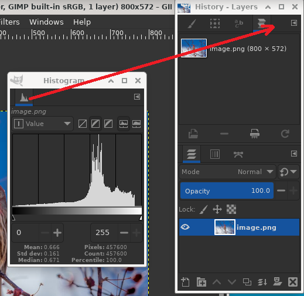

在这里，在多窗口模式下，直方图对话框被拖到图层-撤消停靠栏的标签栏。

将对话框锚定到停靠边框

将直方图对话框拖到右侧面板的左侧垂直停靠栏，结果：对话框锚定到右侧面板的左边框。此对话框现在属于右侧面板。

因此，您可以在多列显示中排列对话框，如果您使用两个屏幕，一个用于对话框，另一个用于图像，这会很有趣。

在图像窗口中按Tab键可切换停靠栏的可见性。如果停靠栏隐藏了图像窗口的一部分，这很有用。您可以快速隐藏所有停靠栏，完成您的工作，然后再次显示所有停靠栏。按 Dock 内的Tab键可在 Dock 中导航。

### 4.4.2 选项卡菜单

停靠栏中的对话框，突出显示了“选项卡”菜单按钮。

在每个对话框中，您可以通过按“选项卡菜单”按钮访问与选项卡相关的操作的特殊菜单，如上图所示。菜单中确切显示的命令取决于活动对话框，但它们始终包括用于创建新选项卡、关闭或分离选项卡的操作。

图层对话框的选项卡菜单

选项卡菜单使您可以访问以下命令：

- 上下文菜单

在每个选项卡菜单的顶部，一个条目会打开对话框的上下文菜单，其中包含特定于该特定类型对话框的操作。例如，“图层”选项卡的上下文菜单是“图层菜单”，其中包含一组用于操作图层的操作。

- 添加标签

添加选项卡打开到一个子菜单，允许您将大量可停靠对话框添加为新选项卡。

“添加标签”子菜单

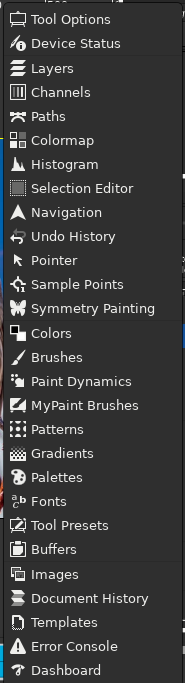

- 关闭标签
  关闭对话框。关闭 Dock 中的最后一个对话框会导致 Dock 本身关闭。

- 分离标签
  从 Dock 中分离对话框，创建一个新的 Dock，将分离的对话框作为其唯一成员。它与将选项卡拖出扩展坞并将其释放到无法停靠的位置具有相同的效果。

这是一种在单窗口模式下创建矛盾的新窗口的方法！

如果选项卡被锁定，则此菜单项不敏感并显示为灰色。

- 锁定选项卡以停靠
  防止对话框被移动或分离。激活后，分离选项卡不敏感并呈灰色显示。

- 预览尺寸

选项卡菜单的预览大小子菜单

许多（但不是全部）对话框具有包含“预览大小”选项的选项卡菜单，该选项打开到一个子菜单，提供对话框中项目的大小列表（参见上图）。例如，“画笔”对话框显示所有可用画笔的图片：“预览大小”决定了图片的大小。默认值为中。

- 选项卡样式

选项卡菜单的选项卡样式子菜单

选项卡样式打开一个子菜单，允许您选择顶部选项卡的外观（见上图）。有五个选项，并非所有选项都适用于每个对话框：

- 图标
  使用图标来表示对话类型。

- 当前状态
  仅适用于允许您选择某些内容的对话框，例如画笔、图案、渐变等。当前状态在选项卡顶部显示当前所选项目的表示。

- 文本
  使用文本显示对话框类型。

- 图标和文本
  同时使用图标和文本会产生更宽的选项卡。

- 状态和文本
  使用对话框类型显示当前选定的项目和文本。

- 自动
  默认选项：根据组中的可用房间调整样式（文本样式占用大量空间且并非总是可行）。

以列表形式查看；以网格形式查看
这些条目显示在对话框中，允许您从一组中选择一个项目：画笔、图案、字体等。您可以选择将项目作为垂直列表查看，每个项目的名称旁边都有名称，或者作为网格，有项目的表示，但没有名称。每个都有其优点：以列表形式查看可为您提供更多信息，但以网格形式查看可让您一次看到更多可能性。默认值因对话框而异：对于画笔和图案，默认值是网格；对于大多数其他事情，默认是一个列表。

当树视图是View as List时，您可以使用标签。

您还可以使用列表搜索字段：

列表搜索字段

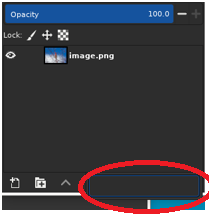

使用Ctrl + F打开列表搜索字段。必须选择一个项目才能使此命令生效。

如果您什么都不做，列表搜索字段会在五秒钟后自动关闭。

搜索字段快捷方式也可用于您在几个工具的“画笔”、“字体”或“图案”选项中获得的树形视图

- 显示按钮栏

一些对话框在对话框底部显示一个按钮栏；例如，图案、画笔、渐变和图像对话框。这是一个切换。如果选中，则显示按钮栏。

“画笔”对话框上的按钮栏

- 显示图像选择

此选项仅在多窗口模式下可用。这是一个切换。如果选中它，则图像菜单会显示在 Dock 的顶部：

突出显示图像菜单的停靠栏

它不适用于停靠在工具箱下方的对话框。仅当屏幕上有多个打开的图像时，此选项才有意义。

- 自动跟随活动图像

此选项仅在多窗口模式下可用。仅当您在屏幕上打开多个图像时，此选项也很有趣。然后，停靠栏中显示的信息始终是图像选择下拉列表中所选图像的信息。如果禁用自动跟随活动图像，则只能在图像选择中选择图像。如果启用，您还可以通过直接激活图像（单击其标题栏）来选择它。

## 5. 撤消

几乎可以撤消您在GIMP中对图像所做的任何操作。您可以通过从图像菜单中选择Edit → Undo来撤消最近的操作，但这样做非常频繁，您真的应该记住键盘快捷键Ctrl + Z。

撤消本身可以撤消。撤消操作后，您可以通过从图像菜单中选择编辑→重做来重做，或使用键盘快捷键Ctrl + Y。通过反复撤消和重做动作来判断动作的效果通常很有帮助。这通常非常快，并且不会消耗任何额外资源或更改撤消历史记录，因此不会有任何危害。

如果您撤消一个或多个操作，然后以除使用 Undo 或 Redo 之外的任何方式对图像进行操作，则将无法再重做这些操作：它们将永远丢失。如果它给您带来问题，解决方案是复制图像，然后在副本上进行测试。（不要测试原件，因为复制图像时不会复制撤消/重做历史。）

如果您经常发现自己一次撤消和重做许多步骤，使用“撤消历史”对话框可能会更方便，这是一个可停靠的对话框，可向您显示撤消历史中每个点的小草图，允许您返回或通过单击前进到该点。

撤消是在特定于图像的基础上执行的：“撤消历史记录”是图像的组成部分之一。为此， GIMP会为每个图像分配一定数量的内存。您可以使用“首选项”对话框的“系统资源”页面自定义首选项以增加或减少数量。有两个重要的变量：最小撤消级别数，GIMP将保持不管它们消耗多少内存，以及最大撤消内存，GIMP将开始从撤消历史记录中删除最旧的项目。

即使 Undo History 是图像的一个组件，当您使用GIMP的本机 XCF 格式保存图像时，它也不会被保存，该格式保留所有其他图像属性。当图像重新打开时，它将有一个空的撤消历史记录。

GIMP的 Undo 实现相当复杂。许多操作需要很少的撤消内存（例如，更改图层的可见性），因此您可以在它们退出撤消历史记录之前执行它们的长序列。某些操作（例如更改图层可见性）会被压缩，因此连续多次执行这些操作只会在撤消历史记录中产生一个点。但是，还有其他操作可能会消耗大量撤消内存。大多数过滤器都是通过插件实现的，所以GIMPcore 没有有效的方法知道发生了什么变化。因此，除了在操作之前和之后记住受影响层的全部内容外，没有其他方法可以实现 Undo。在它们退出撤消历史记录之前，您可能只能执行一些此类操作。

### 5.1 不可撤销情况

大多数更改图像的操作都可以撤消。不改变图像的操作通常无法撤消。示例包括将图像保存到文件、复制图像、将图像的一部分复制到剪贴板等。它还包括在不更改底层图像数据的情况下影响图像显示的大多数操作。最重要的例子是缩放。但是，也有例外情况：打开或关闭 QuickMask 可以撤消，即使它不会改变图像数据。

有一些重要的操作确实会改变图像但无法撤消：

- 关闭图像

Undo History 是图像的一个组件，因此当图像关闭并释放其所有资源时，Undo History 就消失了。因此，除非图像自上次保存以来没有被修改过，否则GIMP总是会要求您确认您确实要关闭图像。

- 还原图像

“还原”是指从文件中重新加载图像。GIMP实际上通过关闭图像并创建新图像来实现这一点，因此撤消历史记录会丢失。因此，如果图像不干净，GIMP会要求您确认您确实要还原图像。

- 动作“片断”

有些工具要求您在它们生效之前执行一系列复杂的操作，但只允许您撤消整个事情而不是单个元素。例如，智能剪刀要求您通过单击图像中的多个点来创建闭合路径，然后在路径内单击以创建选择。您无法撤消单个单击：完成后撤消将带您回到起点。再例如，当您使用文本工具时，您无法撤消单个字母、字体更改等：完成后撤消会删除新创建的文本层。

过滤器以及插件或脚本执行的其他操作可以像GIMP核心实现的操作一样撤消，但这需要它们正确使用GIMP的撤消功能。如果代码不正确，插件可能会破坏撤消历史记录，因此不仅插件而且以前的操作都无法正确撤消。与GIMP一起分发的插件和脚本都被认为是正确设置的，但显然不能保证您从其他来源获得的插件。此外，即使代码是正确的，在运行时取消插件可能会破坏撤消历史记录，因此最好避免这种情况，除非您不小心做了一些后果非常有害的事情。

## 6. 常见任务

### 6.1 目的

GIMP是一个功能强大的图像编辑程序，具有许多选项和工具。但是，它也非常适合较小的任务。以下教程适用于那些想要完成这些常见任务而无需学习所有复杂的GIMP和一般计算机图形学的人。

希望这些教程不仅可以帮助您完成当前的任务，还可以让您准备好以后有时间和灵感时学习更复杂的工具和方法。

要开始本教程，您只需要知道如何查找和打开您的图像。（文件→从图像窗口打开）。

### 6.2 更改屏幕图像的大小

您有一张巨大的图像，可能来自数码相机，并且您想调整它的大小，以便它可以很好地显示在网页、在线留言板或电子邮件消息中。

缩放的示例图像

打开图像后您可能会注意到的第一件事是GIMP以逻辑大小打开图像以供查看。如果您的图像非常大，例如示例图像，GIMP会设置缩放以使其在屏幕上很好地显示。缩放级别显示在图像窗口底部的状态区域中。这不会改变实际图像。

在标题栏中要查看的另一件事是模式。如果模式在标题栏中显示为 RGB，则很好。如果模式显示Indexed或Grayscale。

用于图像缩放的 GIMP

使用Image → Scale Image打开“ Scale Image ”对话框。您可以右键单击图像打开菜单，或使用图像窗口顶部的菜单。请注意，“缩放图像”菜单项包含三个点，表示将打开一个对话框。

以像素为单位的图像缩放对话框

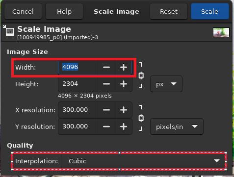

用于在屏幕上显示图像的大小单位是像素。您可以看到对话框有两个部分：一个用于宽度和高度，另一个用于分辨率。分辨率仅适用于打印，当图像显示在监视器或移动设备上时，它不会影响图像的大小。原因是不同的设备具有不同的像素大小，因此，在具有特定物理尺寸的一个设备（例如智能手机）上显示的图像可能会以另一种尺寸显示在其他设备（例如 LCD 投影仪）上。为了在屏幕上显示图像，您可以忽略分辨率参数。出于同样的原因，请勿在高度/宽度字段中使用像素以外的任何尺寸单位。

如果您知道所需的宽度，请在顶部显示Width的对话框中输入它。如上图所示。如果您没有考虑到这样的数字，请为所需用途选择合适的宽度。常见的屏幕尺寸范围在 320 像素（用于更简单的手机）、1024 像素用于上网本、1440 用于宽屏 PC 显示器和 1920 像素用于高清屏幕。为了在线显示图像，600 到 800 像素的宽度提供了一个很好的折衷方案。

当您更改图像的一个尺寸时，GIMP会按比例更改另一个尺寸。要更改其他维度，请参阅“裁剪图像”。请记住，当您任意更改两个尺寸时，图像可能会被拉伸或压扁。

### 6.3 更改打印图像的大小

如前所述，像素在现实世界中没有固定大小。当您开始在纸上打印图像时，GIMP需要知道每个像素有多大。我们使用一个称为分辨率的参数来设置像素与现实世界单位（例如英寸）之间的比率。

默认情况下，大多数图像以分辨率设置为 72 打开。选择此数字是出于历史原因，因为它是过去屏幕的分辨率，这意味着打印时，每个像素都是 1/72 英寸宽。在打印使用现代数码相机拍摄的图像时，这会产生非常大但具有可见像素的厚实图像。我们要做的是告诉GIMP以我们想要的尺寸打印它，但不要更改像素数据以免损失质量。

要更改打印尺寸，请使用图像→打印尺寸打开“打印尺寸”对话框。选择您喜欢的尺寸单位，例如“英寸”。设置一维，让GIMP按比例改变另一个。现在检查分辨率的变化。如果分辨率为每英寸 300 像素或更高，则打印图像的质量将非常高，像素将不明显。分辨率在 200 到 150 ppi 之间，像素会有些明显，但只要不仔细检查，图像就会很好。低于 100 的值明显粗糙，只能用于从远处看到的材料，例如标志或大海报。

设置打印尺寸对话框

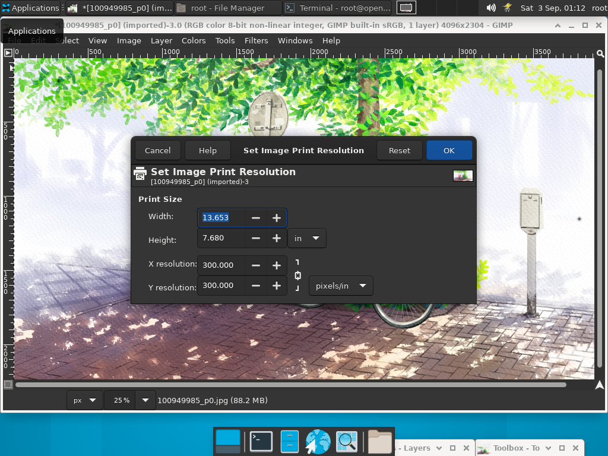

### 6.4 压缩图像

JPEG 保存的示例图像

如果您的图像在磁盘上占用很大空间，即使不更改图像尺寸，您也可以减少该空间。最好的图像压缩是通过使用JPG格式实现的，但是即使图像已经是这种格式，您通常仍然可以使其占用更少的空间，因为 JPG 格式具有自适应压缩方案，可以保存不同级别的压缩。权衡是图像占用的空间越少，您丢失的原始图像的细节就越多。您还应该知道，以 JPG 格式重复保存会导致越来越多的图像质量下降。

从 GIMP-2.8 开始，图像被加载并保存为 .XCF 文件。您的 JPG 图像已加载为 XCF。GIMP为您提供覆盖 image-name.jpg或文件→导出为以打开“导出图像”对话框。

“导出图像”对话框

对话框打开，文件名已在名称框中键入，默认扩展名为 .png。删除现有的扩展名并键入 JPG，GIMP将根据文件扩展名确定文件类型。使用上图中红色标记的文件扩展名列表，查看GIMP支持的类型。支持的扩展取决于您安装的库。如果GIMP出现问题，或者“扩展”菜单中的“ JPEG ”显示为灰色，请取消所有操作并逐步执行第 4.7 节“更改模式”。完成此操作后，单击保存。这将打开“将图像导出为 JPEG ”包含质量控制的对话框。

“ Export Image as JPEG ”对话框使用默认值来减少内存大小，同时保持良好的视觉质量；这是最安全、最快捷的做法。

具有默认质量的“将图像导出为 JPEG ”对话框

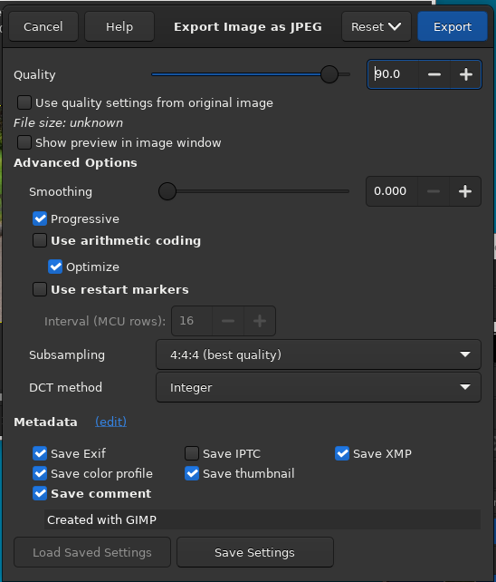

降低图像质量以使图像更小。降低质量会降低图像质量，因此请务必选中“在图像窗口中显示预览”以直观地衡量质量下降。质量设置为 10 会产生质量非常差的图像，占用的磁盘空间非常少。下图显示了一个更合理的图像。75 的质量使用更少的磁盘空间生成合理的图像，这反过来会在网页上加载得更快。虽然图像有些退化，但对于预期目的来说是可以接受的。

“将图像导出为 JPEG ”对话框，质量为 75

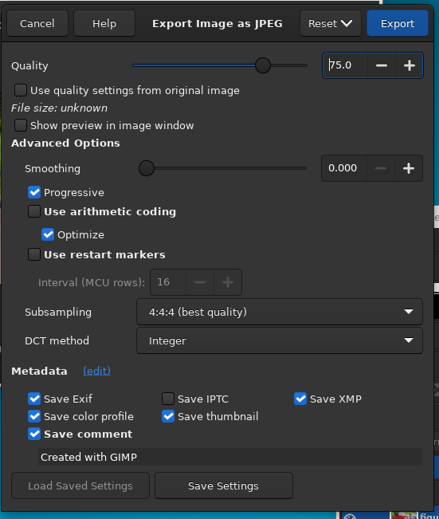

最后，这里是同一张图片不同程度压缩的对比：

中等 JPEG 压缩示例

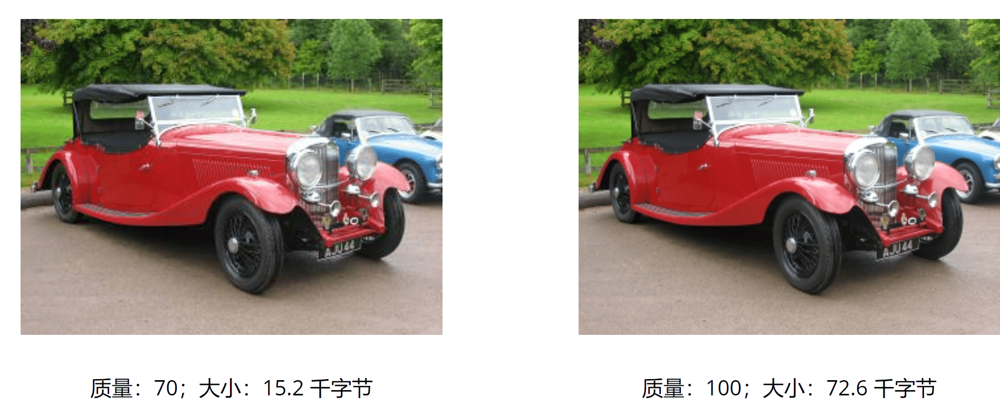

### 6.5 裁剪图像

裁剪的示例图像

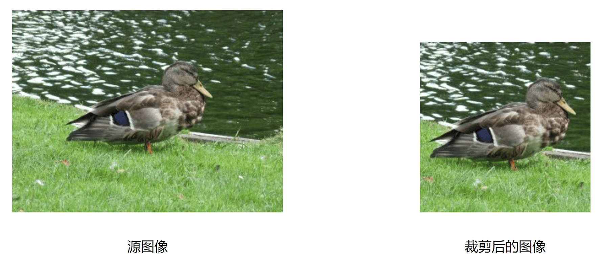

裁剪图像的原因有很多；例如，拟合图像以填充框架，去除部分背景以强调主体等。激活裁剪工具有两种方法。单击工具箱中的按钮，或使用图像窗口中的工具→变换工具→裁剪。这会更改光标并允许您单击并拖动矩形形状。工具箱中的按钮是访问任何工具的最简单方法。

选择要裁剪的区域

单击所需裁剪区域的一角并拖动鼠标以创建裁剪矩形。您不必精确，因为您可以稍后更改矩形的确切形状。

裁剪对话框

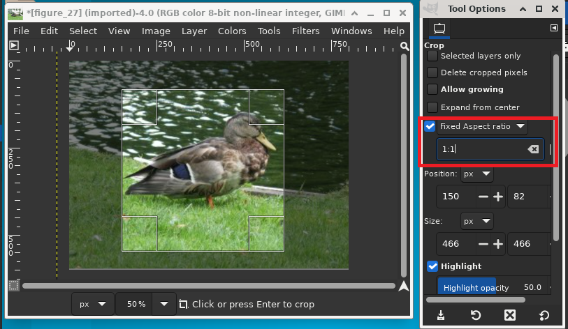

完成单击和拖动动作后，画布上会显示一个带有特殊区域的矩形。随着光标在所选裁剪区域的不同区域上移动，光标会发生变化。然后，您可以拖动矩形的角或边缘来更改所选区域的尺寸。如上图所示，随着裁剪区域的大小调整，尺寸和比例会显示在状态栏中。在矩形内双击或按Enter 键完成裁剪。有关在GIMP中进行裁剪的更多信息，请参见“裁剪”。

如果您想以特定的纵横比裁剪图像，例如正方形，请确保工具选项可见（Windows → Dockable Dialogs → Tool Options）。在可停靠的 Tool Options 中，选中Fixed旁边的标记，并确保它旁边的下拉框设置为Aspect Ratio。您现在可以在下面的文本框中键入所需的纵横比，例如“ 1:1 ”。

您还可以控制从横向更改为纵向。设置纵横比后，拖动裁剪矩形的一个角以对其进行更新。矩形更改为所选比例，并且当您拖动它时应保持该比例。

### 6.6 查找有关您的图像的信息

查找信息

当您需要查找有关图像的信息时，使用图像→图像属性打开“图像属性”对话框，其中包含有关图像大小、分辨率、模式等的信息。

“图像属性”对话框

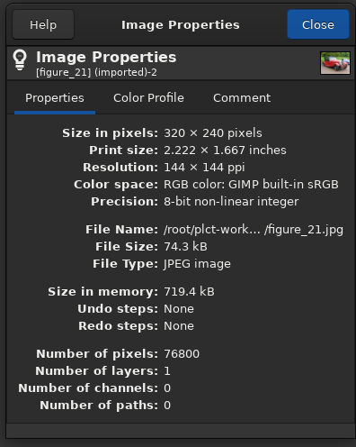

### 6.7 改变模式

与其他任何事物一样，图像有不同的种类并服务于不同的目的。有时，小尺寸很重要（对于网站），而在其他时候，保持高颜色深度是您想要的。GIMP可以处理所有这些以及更多，主要是通过在三种基本模式之间进行转换，如本菜单所示。为了将您的图像切换到这些模式之一，您打开它并按照该菜单并单击您想要的模式。

用于更改模式的对话框

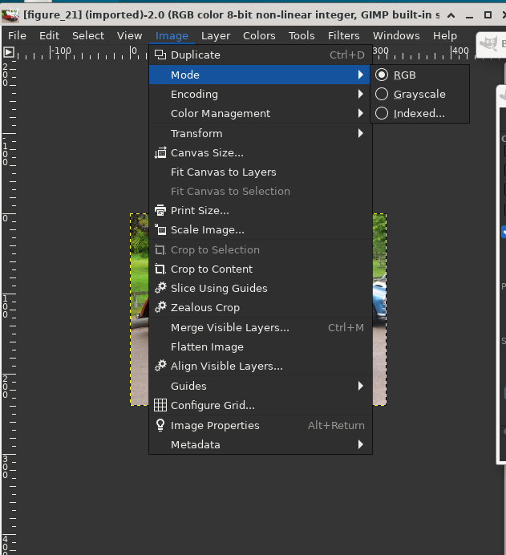

RGB - 这是默认模式，用于高质量图像，并且能够显示数百万种颜色。这也是大多数图像工作的模式，包括缩放、裁剪甚至翻转。在 RGB 模式下，每个像素由三个不同的分量组成：R->Red、G->Green、B->Blue。这些中的每一个又可以具有0-255的强度值。您在每个像素上看到的是这三个组件的相加组合。

索引- 这是关注文件大小或处理颜色较少的图像时通常使用的模式。它涉及为整个图像使用固定数量的颜色（256 或更少）来表示颜色。默认情况下，当您将图像更改为调色板图像时， GIMP会生成一个“最佳调色板”以最好地代表您的图像。

对话框“将图像转换为索引颜色”

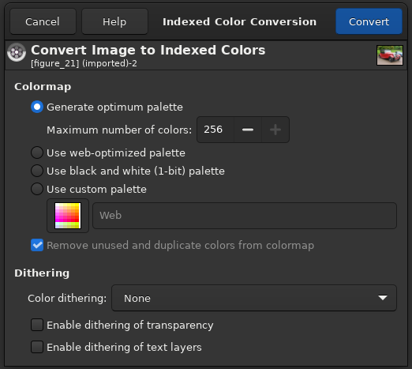

如您所料，由于表示每个像素的颜色所需的信息较少，因此文件大小较小。但是，有时，各种菜单中的某些选项无缘无故地灰显。这通常意味着当您的图像处于当前模式时，无法应用过滤器或选项。如上所述，将模式更改为 RGB 应该可以解决此问题。如果 RGB 模式也不起作用，那么您尝试的选项可能要求您的图层具有透明的能力。这可以通过Layer → Transparency → Add Alpha Channel轻松完成。

添加 Alpha 通道

灰度- 灰度图像只有灰度阴影。此模式有一些特定用途，并且在某些格式中占用的硬盘空间较小，但不建议一般使用，因为许多应用程序不支持读取它。

在将图像保存为您喜欢的格式之前，无需将其转换为特定模式，因为GIMP足够智能，可以正确导出图像。

### 6.8 Flip An Image

当您需要照片中的人朝另一个方向看时，或者您需要图像的顶部为底部时，请使用此选项。使用Tools → Transform Tools → Flip，或使用工具箱上的按钮。从工具箱中选择翻转工具后，在画布内单击。可停靠工具选项中的控件可让您在水平和垂直模式之间切换。 

“翻转图像”菜单

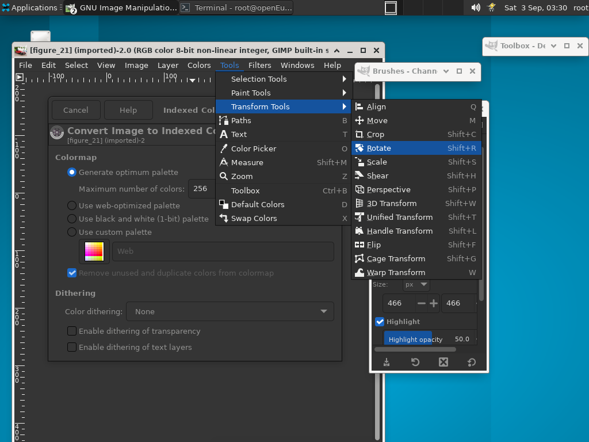

从工具箱中选择翻转工具后，在画布内单击。该工具水平翻转图像。使用选项对话框在水平和垂直之间切换。如果它尚未显示在工具箱下的 Dock 中，请双击工具箱按钮。您还可以使用Ctrl键在水平和垂直之间切换。

在下图中，演示了所有可能的翻转：

### 6.9 旋转图像

“旋转图像”菜单

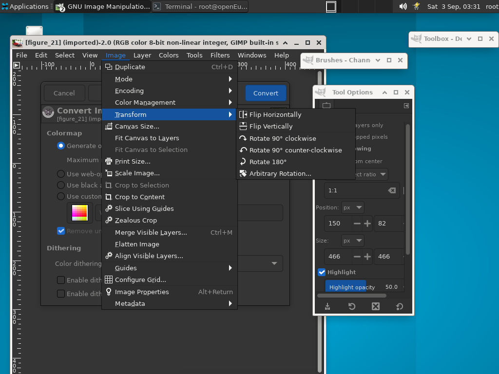

使用数码相机拍摄的图像有时需要旋转。为此，请使用图像→变换→顺时针（或逆时针）旋转 90° 。下图展示了 90 度逆时针旋转。

“旋转图像”示例

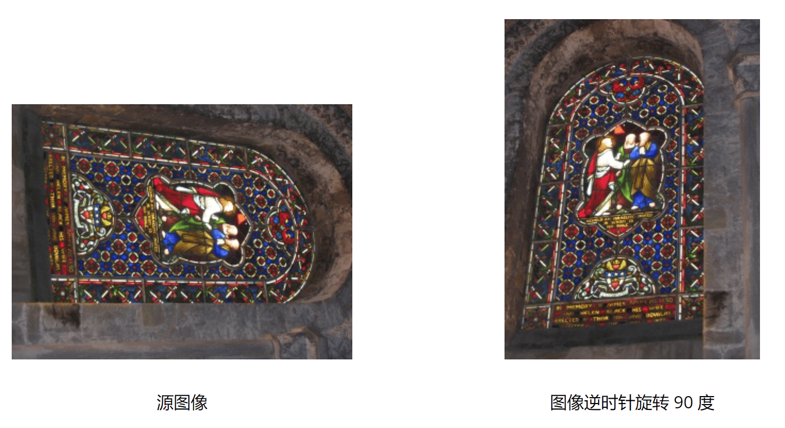

### 6.10 将对象与其背景分离

带背景的对象

有时您需要将图像的主题与其背景分开。您可能希望将主题设置为纯色，或保持背景透明，以便可以在现有背景或您想到的任何其他东西上使用它。为此，您必须首先使用GIMP的选择工具围绕您的主题绘制一个选择。这不是一件容易的事，选择正确的工具至关重要。你有几个工具来完成这个：

“自由选择工具”允许您使用手绘或直线绘制边框。当主体的形状相对简单时使用此选项。在此处阅读有关此工具的更多信息：“自由选择（套索）”

选择工具

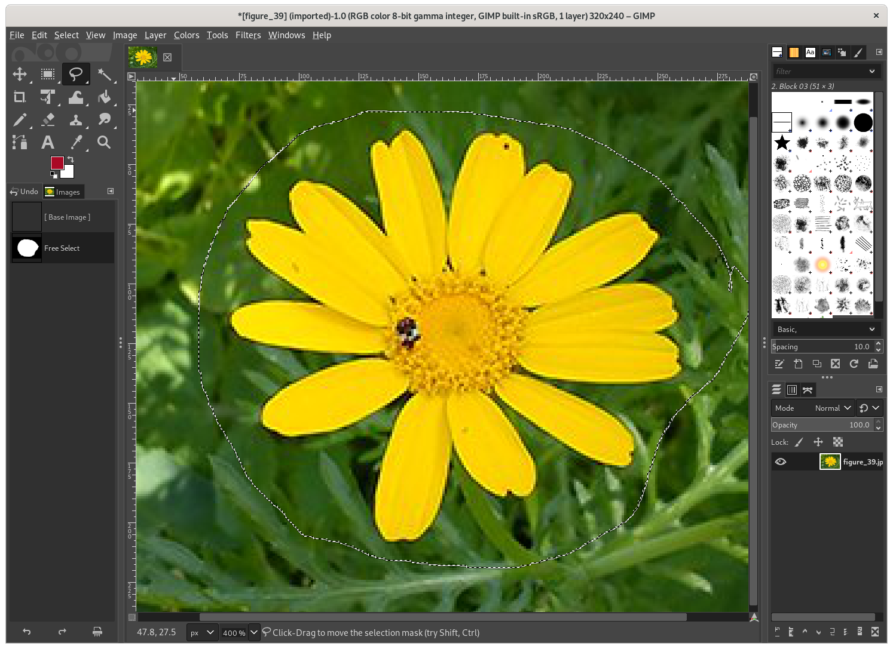

“智能剪刀选择工具”可让您选择手绘边框并使用边缘识别算法更好地适应对象周围的边框。当主题复杂但与当前背景足够不同时，请使用此选项。在此处阅读有关此工具的更多信息：“智能剪刀”

智能剪刀选择工具

“前景选择工具”可让您将区域标记为“前景”或“背景”并自动优化选择。在此处阅读有关此工具的更多信息：“前景选择”

前景选择工具

成功选择主题后，使用Select → Invert。现在，选择了背景而不是主题。你现在做什么取决于你打算对背景做什么：

用单一颜色填充背景：

单击工具箱中的前景色样本（两个重叠的彩色矩形的左上角）并选择所需的颜色。接下来，使用第“桶填充”将背景替换为您选择的颜色。

添加纯色背景

要在保持主体颜色的同时制作黑白背景：

使用颜色→去饱和。在打开的对话框中，在模式之间循环并选择最好看的一个，然后单击“确定”。

背景去饱和的结果

### 6.11 如何画直线

#### 6.11.1 准备工作

引入Shift键

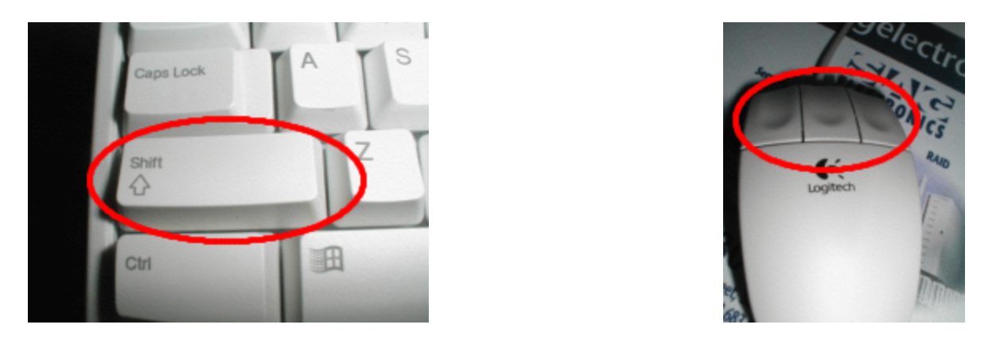

被称为打字机的发明引入了Shift键。您的键盘上通常有 2 个。它们看起来像上图。按键位于键盘的左侧和右侧。鼠标是 Douglas C. Engelbart 于 1970 年发明的。这些鼠标有不同的品种，但总是至少有一个按钮。

#### 6.11.2 创建一个空白 Drawable

新图片

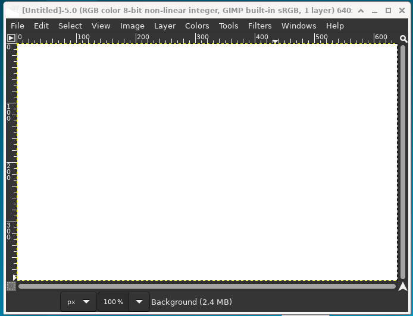

首先，创建一个新图像。任何尺寸都可以。使用File → New创建新图像。

#### 6.11.3 选择一个工具

工具箱中的绘画工具

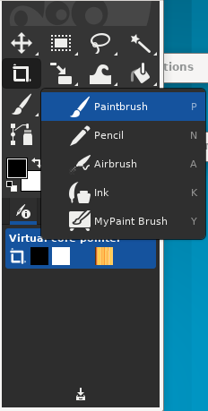

上面工具箱上的任何红色突出显示的工具都可以做线条。

#### 6.11.4 创建起点

初始点

单击工具箱中的画笔。在图像中单击您希望线条开始或结束的位置。屏幕上将出现一个点。这个点的大小代表当前画笔大小，您可以在画笔对话框中更改它（参见“画笔对话框”）。现在，让我们开始画一条线。按住Shift键，并按住它。

#### 6.11.5 画线

画线

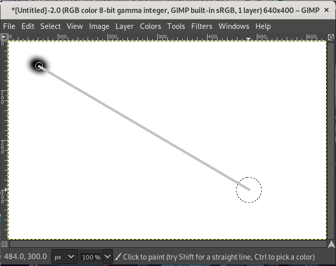

松开。在鼠标按键的整个“点击”过程中，您需要按住 Shift键。

#### 6.11.6 最后

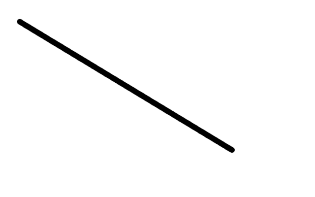

这是一个强大的功能。您可以使用任何绘图工具绘制直线。你甚至可以在这条线的末尾画更多的线。我们的最后一步是松开Shift键，我们就完成了。GIMP快乐！
